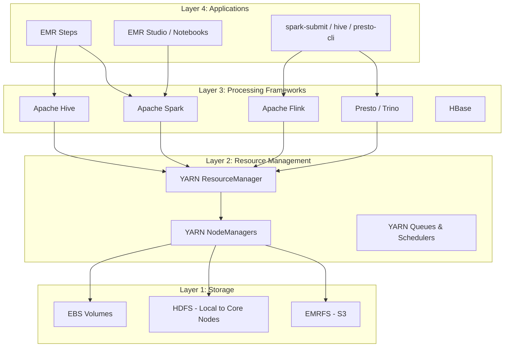
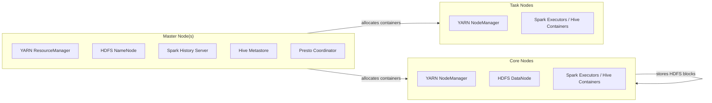
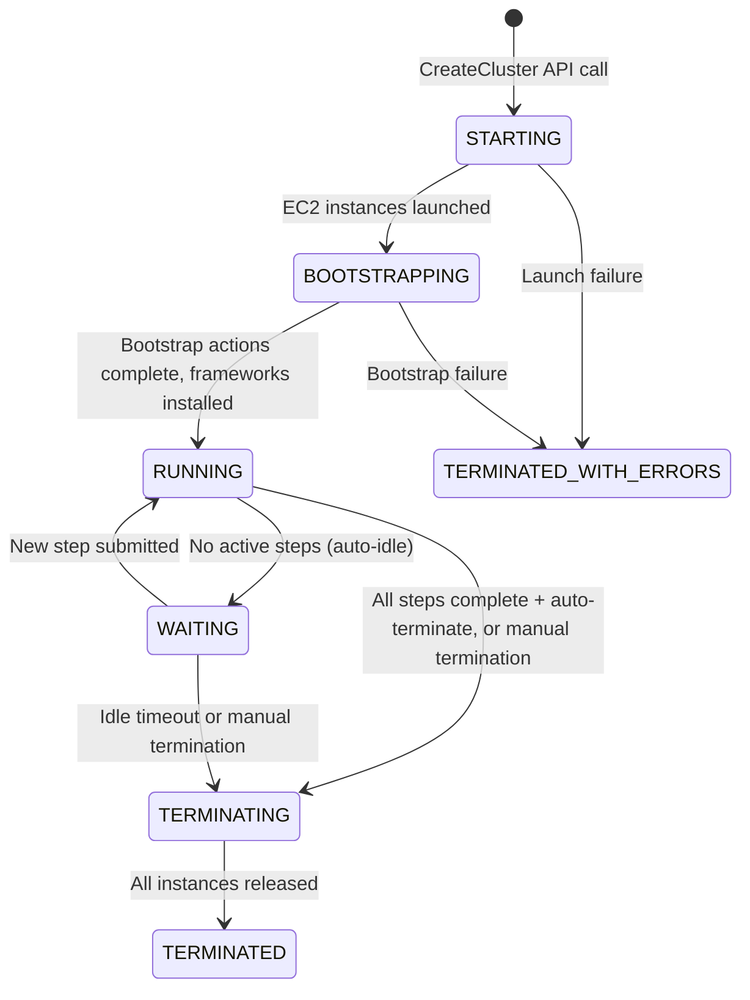
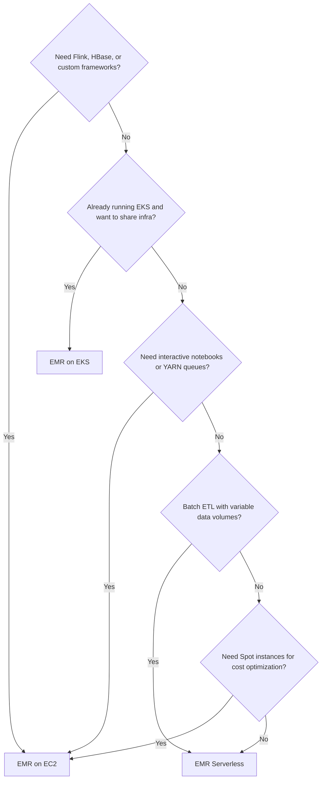
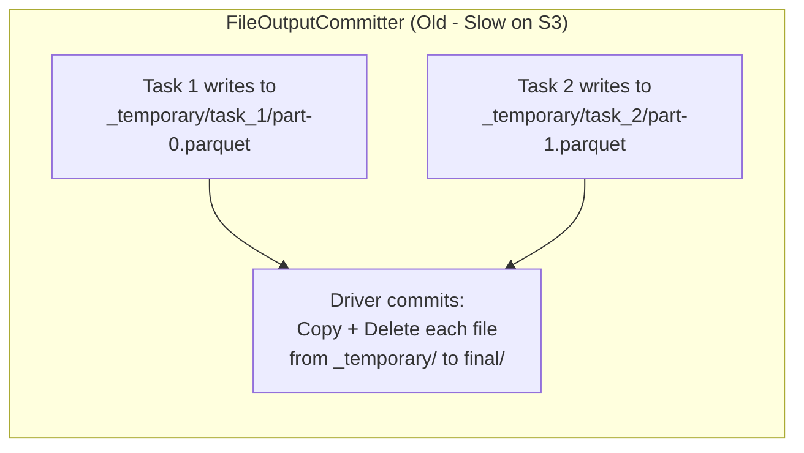
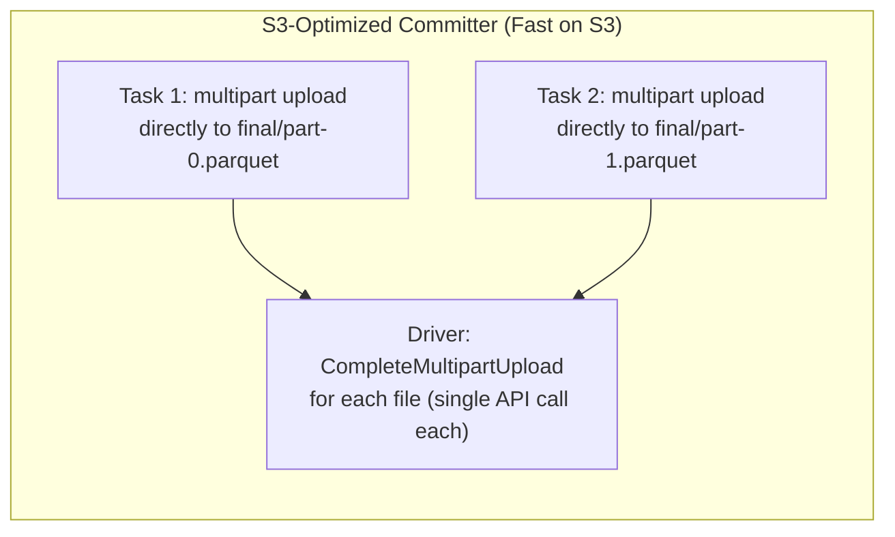
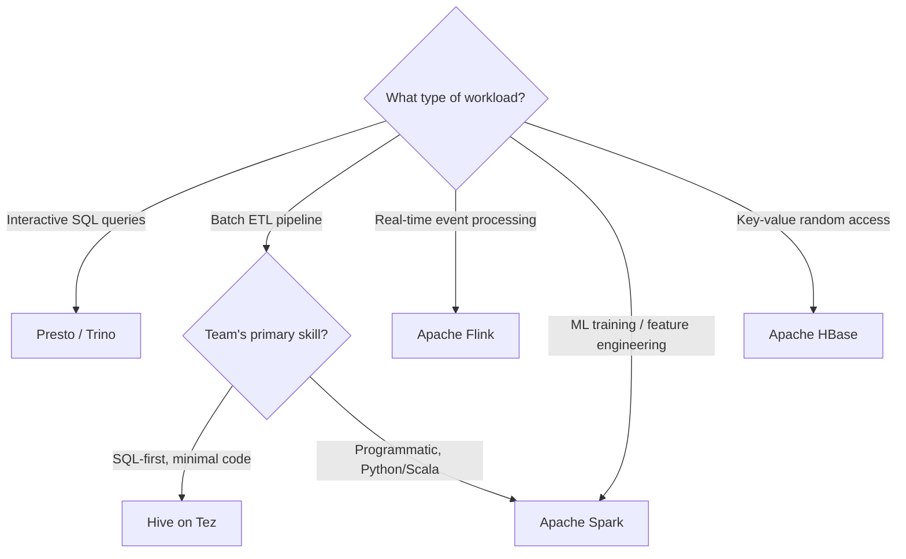
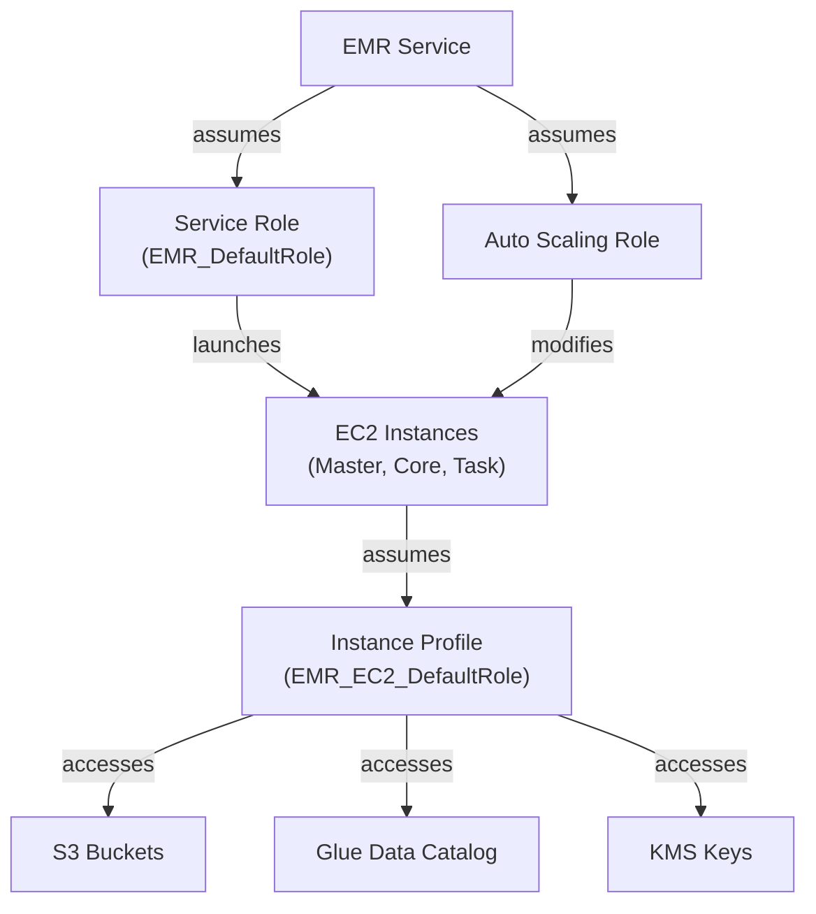
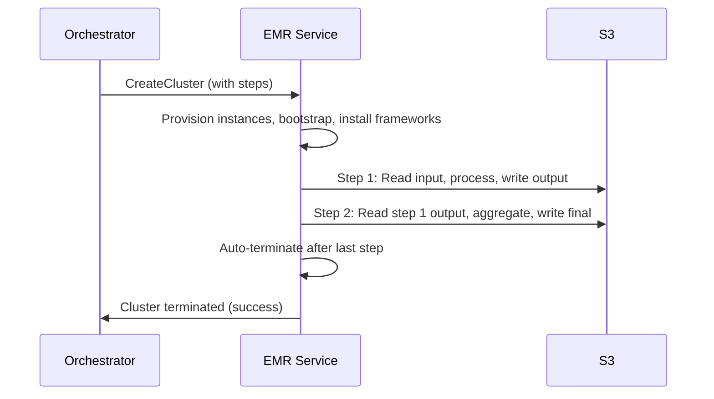

# Amazon EMR: A Deep-Dive Guide for the Senior Data Engineer

> **Audience:** Senior Data Engineer with deep Redshift experience who wants to understand Amazon EMR internals, not just run jobs on it.
>
> **Companion guides:** This guide assumes you have the [Spark guide](Spark.md) available for engine internals. It focuses on EMR as the platform layer -- what it adds, what it changes, and what it demands of the engineer. The [Databricks guide](Databricks.md) is referenced for lakehouse and Delta Lake concepts where relevant.
>
> **Baseline:** EMR 7.x on current releases. Version-sensitive behaviors (especially EMR 5.x vs 6.x vs 7.x differences) are called out explicitly.

---

## Table of Contents

- [Chapter 0: How to Read This Guide](#chapter-0-how-to-read-this-guide)
- [Chapter 1: Core Mental Model -- Why EMR Exists](#chapter-1-core-mental-model----why-emr-exists)
- [Chapter 2: Architecture Internals -- Clusters, Nodes, and the Control Plane](#chapter-2-architecture-internals----clusters-nodes-and-the-control-plane)
- [Chapter 3: Deployment Modes -- EC2 vs EKS vs Serverless](#chapter-3-deployment-modes----ec2-vs-eks-vs-serverless)
- [Chapter 4: Compute Model -- Instance Selection, Scaling, and Resource Allocation](#chapter-4-compute-model----instance-selection-scaling-and-resource-allocation)
- [Chapter 5: Storage Internals -- EMRFS, S3, HDFS, and the Output Committer Problem](#chapter-5-storage-internals----emrfs-s3-hdfs-and-the-output-committer-problem)
- [Chapter 6: EMR Runtime Optimizations -- What EMR Adds on Top of Open-Source Spark](#chapter-6-emr-runtime-optimizations----what-emr-adds-on-top-of-open-source-spark)
- [Chapter 7: Performance Mechanics and Optimization Levers](#chapter-7-performance-mechanics-and-optimization-levers)
- [Chapter 8: Data Processing Patterns -- Spark, Hive, Presto, and Flink on EMR](#chapter-8-data-processing-patterns----spark-hive-presto-and-flink-on-emr)
- [Chapter 9: Security and Governance Model](#chapter-9-security-and-governance-model)
- [Chapter 10: Ingestion Design -- Getting Data Into and Through EMR](#chapter-10-ingestion-design----getting-data-into-and-through-emr)
- [Chapter 11: Streaming and Incremental Processing on EMR](#chapter-11-streaming-and-incremental-processing-on-emr)
- [Chapter 12: Pipeline Orchestration and Step Execution](#chapter-12-pipeline-orchestration-and-step-execution)
- [Chapter 13: Infrastructure as Code and Deployment Workflow](#chapter-13-infrastructure-as-code-and-deployment-workflow)
- [Chapter 14: Mental Model Shifts -- Redshift to EMR](#chapter-14-mental-model-shifts----redshift-to-emr)
- [Chapter 15: Operational Playbooks and Decision Matrices](#chapter-15-operational-playbooks-and-decision-matrices)
- [Chapter 16: Migration Checklist, Glossary, and First 30 Days](#chapter-16-migration-checklist-glossary-and-first-30-days)
- [Chapter 17: Curated Official References](#chapter-17-curated-official-references)

---

## Chapter 0: How to Read This Guide

EMR can feel overwhelming because it exposes more infrastructure surface area than any managed warehouse you have used. Redshift hides its cluster topology, storage engine, and resource scheduler behind SQL. EMR hands you all three and says "configure them." This guide is designed to make that configuration feel predictable rather than arbitrary.

### What this guide is

This is a platform-internals guide. It teaches one consistent mental model:

1. EMR is a decomposed system: storage, resource management, processing frameworks, and applications are independent layers.
2. Each layer has configuration knobs that interact with the others.
3. Understanding those interactions -- not memorizing settings -- is what separates a productive EMR engineer from one who copy-pastes Stack Overflow snippets.

The goal is to give you the causal reasoning chain: *why* a particular instance type matters for shuffle performance, *why* the output committer choice can silently corrupt your data, *why* YARN node labels changed between EMR versions and what breaks when you ignore that.

### What this guide is not

- Not a Spark tutorial. The companion [Spark guide](Spark.md) covers Catalyst, shuffle mechanics, AQE internals, memory management, and Structured Streaming. This guide covers what EMR changes about those behaviors.
- Not an AWS console walkthrough. You can click buttons without understanding internals. This guide gives you the internals.
- Not a feature changelog. EMR releases frequently. This guide teaches the architectural constants that survive version upgrades.

### Suggested reading path

1. **Chapters 1-4** in order for the mental model: why EMR exists, what a cluster looks like inside, the three deployment modes, and how to size compute.
2. **Chapters 5-8** for the data path: how storage works, what EMR's runtime optimizations do, where performance levers live, and which processing framework to pick.
3. **Chapters 9-13** for operational maturity: security, ingestion, streaming, orchestration, and infrastructure-as-code.
4. **Chapters 14-17** for migration and production readiness: mental model shifts from Redshift, diagnostic playbooks, migration checklist, and the first 30 days.

If a section feels abstract, jump to its pitfalls and self-check questions, then return to internals. The goal is to understand causal chains -- architecture leads to configuration, configuration leads to runtime behavior, runtime behavior leads to cost and reliability.

### Conventions used throughout

- **"What it is"**: precise concept definition.
- **"Why it matters"**: engineering impact in production.
- **"How it works internally"**: the mechanics underneath the abstraction.
- **"Redshift mapping"**: where applicable, the closest Redshift concept for intuition transfer.
- **"How to validate"**: CLI commands, UI checks, or log patterns that confirm behavior.
- **"Common pitfalls"**: mistakes that cause production incidents.
- **"Self-check questions"**: test your understanding before moving on.

---

## Chapter 1: Core Mental Model -- Why EMR Exists

Every platform has a reason for existing that shapes every design decision inside it. For Redshift, that reason is "run analytical SQL on structured data with minimal operational overhead." For EMR, the reason is different, and understanding that difference is the single most important thing you can learn before touching a cluster.

### What it is

Amazon EMR (Elastic MapReduce) is AWS's managed platform for running open-source distributed processing frameworks -- Spark, Hive, Presto, Flink, HBase, and others -- on AWS infrastructure. It manages the infrastructure lifecycle (provisioning, configuration, scaling, termination) while giving you full control over framework configuration and execution.

### Why it matters

EMR occupies a specific position in the AWS data ecosystem: more control than Glue or Athena, less abstraction than Databricks. That positioning is deliberate. EMR is for engineers who need to choose their processing framework, tune their cluster topology, control their instance types, and optimize their cost structure -- while AWS handles the undifferentiated heavy lifting of bootstrapping Hadoop, installing Spark, and managing YARN.

If Redshift is a luxury sedan with a fixed engine and automatic transmission, EMR is a race car with swappable engines and a manual gearbox. Faster when configured correctly. Slower -- and more expensive -- when configured carelessly.

### How it works internally: the four-layer model

EMR's architecture decomposes into four layers. Every decision you make on EMR maps to one of these layers:



**Layer 1 -- Storage.** Data lives primarily in S3 (via EMRFS), with HDFS available on Core nodes for ephemeral intermediate storage. EBS volumes provide local disk for shuffle spill and HDFS overflow.

**Layer 2 -- Resource Management.** YARN (Yet Another Resource Negotiator) allocates CPU and memory across nodes. Every Spark executor, Hive container, and Presto worker runs inside a YARN container. YARN is the traffic controller that prevents frameworks from overcommitting the cluster.

**Layer 3 -- Processing Frameworks.** Spark, Hive, Presto, Flink, and HBase are installed as applications on the cluster. Multiple frameworks can run simultaneously, sharing resources through YARN. Each framework has its own execution model, query optimizer, and configuration surface.

**Layer 4 -- Applications.** Steps, notebooks, and CLI tools are how you submit work. A step is a unit of work (a Spark job, a Hive script) submitted to the cluster for execution. EMR Studio provides a Jupyter-based interactive environment.

> **Redshift mapping:** In Redshift, all four layers are collapsed into one managed system. Storage is Redshift Managed Storage. Resource management is WLM. The processing framework is the Redshift query engine. The application layer is your SQL client. You never configure these independently. On EMR, you configure each layer separately, and they interact.

### The AWS data services landscape

EMR does not exist in isolation. Understanding where it fits relative to other AWS data services prevents choosing the wrong tool:

| Dimension | Redshift | Athena | Glue ETL | EMR | Databricks on AWS |
|---|---|---|---|---|---|
| **Core paradigm** | Managed data warehouse | Serverless SQL | Serverless ETL | Managed framework platform | Managed lakehouse platform |
| **Compute model** | Always-on cluster or Serverless | Per-query, no cluster | Per-job, no cluster | You manage clusters (or Serverless) | Managed clusters with autoscaling |
| **Framework support** | Redshift SQL only | Trino (SQL only) | Spark (limited config) | Spark, Hive, Presto, Flink, HBase | Spark (enhanced runtime) |
| **Configuration control** | Low (parameter groups) | Minimal | Low (job parameters) | High (full framework config) | Medium (cluster policies + Spark config) |
| **Typical use case** | BI + SQL analytics | Ad-hoc S3 queries | Simple ETL pipelines | Complex ETL, multi-framework, ML | Lakehouse ETL, ML, SQL analytics |
| **Cost model** | Per-node-hour or per-RPU | Per-TB scanned | Per-DPU-hour | Per-instance-hour (Spot available) | Per-DBU |
| **Operational burden** | Low | Very low | Low | Medium to high | Low to medium |

The key insight: EMR gives you the most control at the cost of the most operational responsibility. Choose EMR when you need that control. Choose something else when you don't.

### Three deployment modes

EMR offers three distinct deployment modes that represent an evolution from full-control infrastructure to increasingly managed options:

1. **EMR on EC2** -- the original model. You define a cluster with specific node types, EMR provisions EC2 instances, installs frameworks, and gives you a running cluster. Full control over everything. This is what most people mean when they say "EMR."

2. **EMR on EKS** -- run Spark and Hive jobs on your existing Kubernetes infrastructure. No new EC2 clusters; EMR submits work to EKS pods. Useful when your organization has standardized on Kubernetes.

3. **EMR Serverless** -- no cluster at all. You submit a Spark, Hive, or Presto application and EMR provisions workers on demand, scales them automatically, and releases them when the job finishes. The closest EMR gets to the "just run my code" experience of Glue or Athena.

Each mode has different capabilities, cost models, and operational characteristics. Chapter 3 covers them in depth. For now, know that this guide uses EMR on EC2 as the default context (because it exposes the most architecture), and calls out EKS and Serverless differences where they matter.

### Common pitfalls

- Choosing EMR when Athena or Glue would suffice. If your workload is simple SQL over S3 or straightforward ETL, EMR's operational overhead is not worth the control it provides.
- Choosing Glue when EMR is needed. If you need fine-grained Spark configuration, multiple frameworks, Spot instances for cost optimization, or long-running interactive clusters, Glue's limited configurability becomes a constraint.
- Treating EMR like Redshift -- expecting a single always-on system that "just works" without infrastructure design.

### Self-check questions

1. What are the four layers of the EMR architecture, and which Redshift component maps to each?
2. When would you choose EMR over Athena? Over Glue? Over Databricks?
3. What does "more control, more responsibility" mean concretely for a data engineer moving from Redshift?

---

## Chapter 2: Architecture Internals -- Clusters, Nodes, and the Control Plane

With the mental model in place, we now look inside a running EMR cluster. Understanding node types, YARN resource allocation, and the cluster lifecycle is essential because every performance problem, scaling decision, and cost optimization traces back to this architecture.

### What it is

An EMR on EC2 cluster is a set of EC2 instances organized into three roles -- Master, Core, and Task -- managed by the EMR control plane and coordinated internally by YARN. The control plane handles provisioning and health monitoring. YARN handles resource allocation for all processing frameworks running on the cluster.

### Why it matters

Most production EMR problems map directly to the cluster architecture:

- A slow job might be caused by YARN under-allocating memory because you chose the wrong instance type for Core nodes.
- A data loss incident might trace to a Spot interruption on a Core node that was storing HDFS blocks.
- A "cluster stuck in STARTING" event is a control plane lifecycle issue.
- A "permission denied" error reading S3 is an IAM role attached to the EC2 instance profile.

Knowing the architecture lets you reason backward from symptoms to causes.

### How it works internally

#### The three node types

Every EMR on EC2 cluster has one or more nodes in three distinct roles:



**Master node.** Runs the cluster's coordination services: YARN ResourceManager, HDFS NameNode, Hive Metastore (or the Glue Catalog proxy), Spark History Server, and framework coordinators like the Presto Coordinator. In a single-master cluster, this node is a single point of failure -- if it dies, the entire cluster is lost. For production, EMR supports multi-master mode with three master nodes coordinated by ZooKeeper for automatic failover.

**Core nodes.** Run both YARN NodeManagers (which execute processing tasks) and HDFS DataNodes (which store HDFS data). This dual role is the critical architectural fact about Core nodes: they hold data. Removing a Core node or losing one to a Spot interruption risks HDFS data loss or under-replication. Core nodes are the workhorses of the cluster -- they process data and store intermediate results.

**Task nodes.** Run YARN NodeManagers only -- pure compute, no HDFS storage. Because they hold no persistent data, Task nodes can be added and removed freely. This makes them ideal for Spot instances: if AWS reclaims a Spot Task node, no data is lost -- only in-flight tasks, which Spark can retry.

| Property | Master | Core | Task |
|---|---|---|---|
| YARN role | ResourceManager | NodeManager | NodeManager |
| HDFS role | NameNode | DataNode | None |
| Runs processing tasks | No (coordination only) | Yes | Yes |
| Holds persistent data | Yes (NameNode metadata) | Yes (HDFS blocks) | No |
| Safe for Spot instances | No | Risky (HDFS data loss) | Yes |
| Can be scaled dynamically | No | Yes (but carefully) | Yes (freely) |
| Minimum count | 1 (or 3 for HA) | 1 | 0 |

> **Redshift mapping:**
> | EMR Concept | Redshift Equivalent |
> |---|---|
> | Master node | Leader node (coordinates query planning and result aggregation) |
> | Core nodes | Compute nodes (store data slices and execute queries) |
> | Task nodes | Concurrency Scaling fleet (temporary compute capacity, no persistent data) |
> | YARN ResourceManager | WLM (Workload Management -- allocates slots and memory to queries) |

#### YARN as the resource layer

YARN sits between the processing frameworks and the cluster hardware. When Spark requests executors, it asks YARN for containers with specific memory and CPU allocations. YARN's ResourceManager decides which NodeManagers (on Core and Task nodes) have capacity, and allocates containers accordingly.

Key YARN parameters that directly affect job performance:

- `yarn.nodemanager.resource.memory-mb` -- total memory YARN can allocate on each node. EMR sets this automatically based on instance type, reserving memory for the OS and YARN daemon.
- `yarn.nodemanager.resource.cpu-vcores` -- total vCPUs YARN can allocate per node.
- `yarn.scheduler.maximum-allocation-mb` -- maximum memory a single container can request. If a Spark executor needs more than this, the request fails.

The relationship between YARN and Spark configuration is: Spark's `spark.executor.memory` + `spark.executor.memoryOverhead` must fit within a single YARN container. If it doesn't, YARN kills the container.

#### YARN node labels -- a version-critical difference

This is one of the most common sources of confusion when migrating between EMR versions:

| EMR Version | YARN Node Labels | Meaning |
|---|---|---|
| EMR 5.x | `CORE`, `TASK` | Labels reflect node type. You can constrain Spark executors to run only on CORE or only on TASK nodes. |
| EMR 6.x+ | `ON_DEMAND`, `SPOT` | Labels reflect purchase type. The CORE/TASK distinction is gone from labels. To constrain by node type, you need different configuration approaches. |

**Why this matters:** If you have scheduling constraints from EMR 5.x that use `CORE`/`TASK` labels, they silently stop working on EMR 6.x because those labels no longer exist. Your jobs will still run, but the placement constraints won't apply -- executors may land on nodes you didn't intend.

**How to validate:**

```bash
# SSH to master node, then:
yarn node -list -showDetails | grep "Node-Labels"
# EMR 5.x output: Node-Labels : CORE
# EMR 6.x output: Node-Labels : ON_DEMAND
```

#### Cluster lifecycle

An EMR cluster passes through a defined state machine:



**STARTING:** EMR requests EC2 instances. This is where capacity errors and instance type availability issues surface. If your requested instance type isn't available in the specified Availability Zone, the cluster stays in STARTING until it times out.

**BOOTSTRAPPING:** EC2 instances are running. EMR executes bootstrap actions (custom scripts you define) on every node, then installs and configures the selected frameworks. A failing bootstrap action terminates the cluster.

**RUNNING:** Frameworks are ready. Steps execute. The cluster is usable.

**WAITING:** All submitted steps have completed. The cluster is idle, consuming resources but not processing data. This is where cost waste happens on long-running clusters with intermittent workloads.

**TERMINATING / TERMINATED:** Instances are released. HDFS data is lost. Only data written to S3 survives.

#### Multi-master high availability

For production clusters that must survive a master node failure, EMR supports a three-master configuration:

- Three master nodes run simultaneously, coordinated by ZooKeeper.
- YARN ResourceManager runs in active/standby mode across two of the three masters.
- HDFS NameNode runs in active/standby mode with automatic failover.
- If the active master fails, ZooKeeper triggers failover to a standby within seconds.

The tradeoff: three master nodes cost 3x the master instance cost, and multi-master clusters have some restrictions (e.g., no instance groups resizing, some bootstrap actions behave differently).

### Common pitfalls

- **Using Spot instances for Core nodes without understanding HDFS.** If a Spot Core node is reclaimed, its HDFS blocks are lost. If the replication factor is 1 (which it often is on small clusters), that data is gone. Use Spot only for Task nodes unless you have high HDFS replication and can tolerate temporary under-replication.
- **Ignoring the YARN node label version change.** Scheduling constraints from EMR 5.x configs break silently on 6.x. Always check which labels your cluster version uses.
- **Leaving clusters in WAITING state.** A cluster in WAITING is still running and billing. Use auto-termination policies or transient cluster patterns (Chapter 12) to avoid this.
- **Single-master clusters in production.** If your master node fails, the entire cluster is lost -- including any HDFS data and in-flight jobs. Use multi-master for workloads that can't tolerate cluster loss.

### Self-check questions

1. Why is it risky to use Spot instances for Core nodes but safe for Task nodes?
2. What changes about YARN node labels between EMR 5.x and 6.x, and what breaks if you ignore it?
3. What happens to HDFS data when an EMR cluster terminates?
4. In the cluster lifecycle, what is the practical difference between RUNNING and WAITING states from a cost perspective?

---

## Chapter 3: Deployment Modes -- EC2 vs EKS vs Serverless

Now that you understand what a cluster looks like inside, the next question is: do you always need one? EMR offers three deployment modes that trade control for convenience. This chapter is where you decide which mode fits your workload -- one of the most consequential infrastructure decisions you'll make.

### What it is

EMR's three deployment modes represent an evolution from full infrastructure control to fully managed execution:

- **EMR on EC2**: you define and manage clusters of EC2 instances.
- **EMR on EKS**: you run EMR workloads on existing Kubernetes clusters.
- **EMR Serverless**: you submit jobs with no cluster to manage.

### Why it matters

Choosing the wrong deployment mode leads to either unnecessary operational burden (choosing EC2 when Serverless would suffice) or insufficient control (choosing Serverless when you need fine-grained YARN configuration). The choice also fundamentally shapes your cost model, scaling behavior, and framework options.

### How it works internally

#### EMR on EC2

This is the classic EMR model covered in Chapter 2. You create a cluster by specifying:

- Node types and counts (Master, Core, Task)
- Instance types and purchase options (On-Demand, Spot, Reserved)
- Applications to install (Spark, Hive, Presto, etc.)
- Configuration classifications (framework settings)
- Bootstrap actions (custom setup scripts)
- Security configuration (encryption, Kerberos, etc.)

The cluster is yours to manage. You can SSH into nodes, view YARN ResourceManager UI, access Spark History Server directly, and configure every knob available in the open-source frameworks.

**Long-running clusters** stay alive between jobs. Steps are submitted to the running cluster. This model works for interactive workloads (EMR Studio notebooks), multi-framework clusters, and teams that need persistent Spark History Server access.

**Transient clusters** are created for a specific job and terminated when it completes. An orchestrator (Airflow, Step Functions) creates the cluster, submits steps, waits for completion, and terminates. This model minimizes idle cost but introduces cluster startup latency (typically 5-10 minutes).

##### Instance Groups vs Instance Fleets

EMR on EC2 offers two ways to define your cluster's compute:

| Property | Instance Groups | Instance Fleets |
|---|---|---|
| Instance types per role | One per group | Up to 30 per fleet |
| Spot strategy | Basic (single type, single AZ) | Advanced (5 allocation strategies, multi-AZ) |
| Capacity model | Instance count | Capacity units (weighted by instance type) |
| On-Demand fallback | No automatic fallback | On-Demand Capacity Reservations support |
| Multi-AZ support | No (single AZ) | Yes |
| Best for | Simple, predictable workloads | Cost-optimized, Spot-heavy workloads |

**Instance Fleets** are the modern choice for most workloads. They let you specify multiple instance types per fleet (e.g., "use r5.2xlarge, r5.4xlarge, r6g.2xlarge, or r6g.4xlarge for Core nodes") and EMR selects the best available option based on your allocation strategy.

##### The five Spot allocation strategies

When using Instance Fleets with Spot instances, you choose an allocation strategy:

| Strategy | How it works | Best for |
|---|---|---|
| `capacity-optimized` | Picks instance pools with highest available capacity, minimizing interruption risk | General recommendation for most workloads |
| `price-capacity-optimized` | Balances price and capacity availability | Default since EMR 6.x; good balance of cost and stability |
| `lowest-price` | Picks the cheapest available Spot pool | Short jobs where interruption cost is low |
| `diversified` | Spreads across all specified instance pools | Large clusters that need capacity breadth |
| `capacity-optimized-prioritized` | Like capacity-optimized but respects your instance type priority order | When you have preferred types but want capacity fallback |

**Recommendation:** Start with `price-capacity-optimized`. It gives the best blend of cost savings and interruption avoidance for typical EMR workloads.

#### EMR on EKS

EMR on EKS runs Spark and Hive jobs on your existing Amazon EKS (Kubernetes) cluster. There are no separate EMR EC2 instances -- the processing happens in Kubernetes pods.

**How it works:**

1. You create a "virtual cluster" -- a logical EMR endpoint registered against an EKS namespace.
2. When you submit a job to the virtual cluster, EMR creates Kubernetes pods for the Spark driver and executors.
3. Pods are scheduled by Kubernetes (not YARN) onto your EKS nodes.
4. When the job completes, pods are terminated.

**What this means architecturally:**

- No YARN. Kubernetes is the resource manager. Spark's `KubernetesClusterManager` replaces `YarnClusterManager`.
- No HDFS. All storage is S3 via EMRFS (or any S3-compatible library).
- Node selection uses Kubernetes constructs: node selectors, tolerations, pod templates, and resource requests/limits.
- Only Spark and Hive are supported. No Presto, no Flink, no HBase.

**When to use EMR on EKS:**

- Your organization has standardized on Kubernetes and wants to run Spark without separate infrastructure.
- You want to share node pools between Spark workloads and other Kubernetes services.
- You need fine-grained pod-level resource isolation (CPU/memory limits, quality-of-service classes).
- You're already managing EKS and don't want a second cluster management surface.

**When not to use EMR on EKS:**

- You need frameworks beyond Spark and Hive.
- You want YARN-level resource management features (queues, node labels, preemption).
- Your team doesn't have Kubernetes expertise.

#### EMR Serverless

EMR Serverless is the most abstracted deployment mode. You create an "application" (a logical endpoint for a specific framework version), then submit "job runs" to it. EMR provisions workers automatically, scales them during execution, and releases them when the job finishes.

**How it works:**

1. You create an application specifying the framework (Spark, Hive, or Presto) and EMR release version.
2. You submit a job run with your code, configuration, and IAM execution role.
3. EMR provisions workers from a shared pool. Workers scale up as your job needs more parallelism and scale down as stages complete.
4. When the job finishes, all workers are released. You pay only for the vCPU and memory seconds consumed.

**Key features:**

- **Pre-initialized capacity:** You can optionally keep a pool of warm workers to eliminate cold-start latency. Without this, the first job run on an application experiences worker provisioning delay.
- **Storage-free shuffle (2025):** Shuffle data is stored in remote disaggregated storage rather than on local worker disks. This means workers can be released earlier and shuffle data survives worker recycling.
- **Automatic scaling:** Workers scale based on job demand. No Managed Scaling configuration needed.

**When to use EMR Serverless:**

- Batch ETL jobs that run on a schedule with variable data volumes.
- Teams that want to submit Spark/Hive/Presto jobs without managing infrastructure.
- Spiky workloads where maintaining an always-on cluster is wasteful.
- FinOps teams that want per-job cost attribution (each job run has distinct billing).

**When not to use EMR Serverless:**

- Interactive workloads requiring sub-second query latency.
- Jobs that need HDFS, HBase, or frameworks not supported (Flink).
- Workloads requiring custom OS packages or system-level configuration.
- When you need direct access to Spark UI during execution (limited in Serverless).

### Decision matrix: choosing a deployment mode

This is the first major infrastructure decision on EMR. The matrix below captures the tradeoffs:

| Dimension | EMR on EC2 | EMR on EKS | EMR Serverless |
|---|---|---|---|
| **Control level** | Full (SSH, YARN config, custom AMI, bootstrap) | Medium (pod templates, node selectors) | Low (job config only) |
| **Framework support** | Spark, Hive, Presto, Flink, HBase, custom | Spark, Hive only | Spark, Hive, Presto |
| **Startup latency** | 5-10 min (cluster creation) | Seconds (if EKS nodes available) | Seconds (with pre-init) to minutes (cold) |
| **Scaling model** | Managed Scaling or manual | Kubernetes autoscaler | Automatic |
| **Spot integration** | Yes (Instance Fleets) | Yes (EKS Spot node groups) | No (managed by AWS) |
| **Cost model** | EC2 instance-hours + EBS + EMR premium | EKS node costs (shared) + EMR premium | vCPU-seconds + memory-GB-seconds |
| **HDFS available** | Yes (Core nodes) | No | No |
| **YARN available** | Yes | No (Kubernetes instead) | No (managed internally) |
| **Interactive notebooks** | Yes (EMR Studio) | Limited | Limited |
| **Operational burden** | High | Medium (requires K8s expertise) | Low |
| **Best for** | Complex multi-framework workloads, long-running interactive, full control | K8s-native orgs, shared infrastructure | Batch ETL, variable workloads, minimal ops |

**Decision flowchart:**



> **Redshift mapping:**
> | EMR Mode | Closest Redshift Analogy |
> |---|---|
> | EMR on EC2 (long-running) | Provisioned Redshift cluster (always-on, fixed node count) |
> | EMR on EC2 (transient) | No direct equivalent -- Redshift clusters are not disposable |
> | EMR on EKS | No equivalent |
> | EMR Serverless | Redshift Serverless (auto-scaling, pay-per-use) |

### Common pitfalls

- **Defaulting to EMR on EC2 for simple batch ETL.** If your workload is a daily Spark job that reads from S3, transforms data, and writes back to S3 -- EMR Serverless eliminates all cluster management for this pattern.
- **Choosing EMR on EKS without Kubernetes expertise.** EMR on EKS simplifies EMR but requires Kubernetes proficiency. If your team doesn't manage EKS already, this mode adds complexity rather than removing it.
- **Ignoring pre-initialized capacity on EMR Serverless.** Without it, cold-start latency can be minutes. If your jobs run on a tight schedule, configure pre-initialized workers.
- **Using Instance Groups when Instance Fleets would give better Spot availability.** Instance Groups lock you to one instance type per group. In constrained capacity environments, Fleets with multiple instance types avoid provisioning failures.

### Self-check questions

1. Which deployment mode would you choose for a daily batch Spark ETL job processing 500 GB from S3? Why?
2. Why does EMR on EKS use Kubernetes instead of YARN for resource management? What do you lose?
3. What is pre-initialized capacity in EMR Serverless, and when would you configure it?
4. When would you choose Instance Groups over Instance Fleets?

---

## Chapter 4: Compute Model -- Instance Selection, Scaling, and Resource Allocation

With deployment mode chosen, the next decision is what machines to run and how to manage their lifecycle. This chapter covers instance selection, scaling behavior, Spot strategy, and the YARN resource configuration that translates hardware into usable capacity for your frameworks.

### What it is

The compute model is the set of decisions that determine how much CPU, memory, and disk your cluster has, how that capacity grows and shrinks, and how much you pay for it. On Redshift, the compute model is a single choice: pick a node type and count. On EMR, it's a multi-variable optimization problem.

### Why it matters

An under-sized cluster makes jobs slow. An over-sized cluster wastes money. A poorly configured scaling policy oscillates between the two. Instance type selection directly affects shuffle performance, memory-related failures, and Spot interruption rates. Getting compute right is the highest-leverage cost optimization on EMR.

### How it works internally

#### Instance family selection

EMR supports most EC2 instance families. The right choice depends on your workload's resource profile:

| Family | Examples | vCPU:Memory Ratio | Best Workload Type | Notes |
|---|---|---|---|---|
| **Memory-optimized** | r5, r6g, r6i, r7g | 1:8 | Spark with large shuffles, memory-heavy joins, caching | Most common choice for Core nodes |
| **Compute-optimized** | c5, c6g, c6i, c7g | 1:2 | CPU-bound transformations, Presto queries, serialization-heavy | Good for Task nodes on compute-bound jobs |
| **General-purpose** | m5, m6g, m6i, m7g | 1:4 | Balanced workloads, development clusters, mixed frameworks | Safe default when unsure |
| **Storage-optimized** | i3, i3en, d2 | Varies | HDFS-heavy workloads, HBase | Large instance store (NVMe) for shuffle |
| **GPU** | p3, g4dn, g5 | N/A | Spark RAPIDS, ML training/inference | Requires CGroup v1 (not available on AL2023/EMR 7.x by default) |
| **Graviton (ARM)** | r6g, r7g, m6g, c6g | Same as x86 equivalents | Same workloads as x86 counterparts | Up to 30% better price-performance vs x86 |

**Graviton instances** deserve special attention. AWS Graviton processors (ARM-based) offer materially better price-performance than equivalent x86 instances. Spark, Hive, and Presto all run on Graviton without code changes. The only consideration is custom native libraries (JNI) that must be compiled for ARM.

**GPU instances** are used for Spark RAPIDS, which offloads Spark operations to GPU for acceleration. The catch: Spark RAPIDS requires CGroup v1, which is the default on Amazon Linux 2 (EMR 6.x) but not on Amazon Linux 2023 (EMR 7.x). If you're on EMR 7.x and need GPU, you need to configure CGroup v1 explicitly.

#### Managed Scaling

Managed Scaling is EMR's built-in autoscaling system for EMR on EC2. It replaces the older custom auto-scaling policies (which required CloudWatch alarms) with a single configuration that EMR manages end-to-end.

**How it works:**

1. You define boundaries: minimum and maximum units for the cluster (units can be instances, vCPUs, or a custom capacity metric depending on whether you use Instance Groups or Fleets).
2. EMR continuously monitors YARN metrics: pending containers, allocated containers, available capacity.
3. When demand exceeds current capacity, EMR adds nodes (up to the maximum).
4. When demand drops, EMR removes nodes (down to the minimum).

**Key parameters:**

| Parameter | Description | Recommendation |
|---|---|---|
| `MinimumCapacityUnits` | Minimum cluster size. Cluster won't scale below this. | Set to your baseline workload needs. For transient clusters, this is the full job size. |
| `MaximumCapacityUnits` | Maximum cluster size. Cluster won't scale above this. | Set to your cost ceiling. |
| `MaximumOnDemandCapacityUnits` | Maximum On-Demand capacity within the total. | Set to the minimum needed for HDFS replication. |
| `MaximumCoreCapacityUnits` | Maximum Core node capacity. | Controls HDFS growth. Set based on how much HDFS storage you need. |

**Shuffle-aware decommissioning:** When Managed Scaling removes a node, it doesn't kill it immediately. It tells YARN to decommission the node gracefully, which means:

1. YARN stops scheduling new containers on the node.
2. Existing containers run to completion.
3. If the node has shuffle data that other nodes need, YARN waits until that data is consumed or replicated before removing the node.

This prevents the classic autoscaling failure where removing a node mid-shuffle causes task failures and stage retries. The decommissioning timeout is configurable via `yarn.resourcemanager.decommissioning.timeout` (default: 3600 seconds).

**How to validate scaling behavior:**

```bash
# Check current scaling policy
aws emr describe-cluster --cluster-id j-XXXXX --query 'Cluster.ManagedScalingPolicy'

# Watch scaling events in CloudWatch
# Metric namespace: AWS/ElasticMapReduce
# Key metrics: CoreNodesRunning, TaskNodesRunning, AppsRunning, AppsPending
```

#### Spot instances strategy

Spot instances can save 60-90% compared to On-Demand pricing, but they come with the risk of interruption (AWS reclaims the instance with 2 minutes notice). The strategy differs by node type:

| Node Type | Spot Safety | Rationale | Recommendation |
|---|---|---|---|
| **Master** | Never use Spot | Master failure kills the cluster | Always On-Demand |
| **Core** | Risky | Core nodes store HDFS data. Spot interruption causes data loss. | On-Demand unless: (a) HDFS replication factor >= 2, AND (b) you can tolerate temporary under-replication, AND (c) your workload primarily uses S3 not HDFS. |
| **Task** | Safe | Task nodes have no persistent data. Lost tasks are retried by Spark. | Always prefer Spot for Task nodes. Use Instance Fleets with multiple instance types to maximize availability. |

**Spot interruption handling on EMR:** When AWS issues a Spot interruption notice:

1. YARN gets 120 seconds notice.
2. YARN marks the node for decommissioning.
3. Running containers on the node are allowed to complete if possible within the 120-second window.
4. Containers that don't complete are failed and retried on other nodes.
5. The node is removed from the cluster.

Spark handles task retry natively through its speculative execution and stage retry mechanisms. A Spot interruption that kills a task is no different from any other task failure -- Spark retries it on a different executor.

#### YARN resource configuration

When EMR creates a cluster, it calculates default YARN and Spark settings based on the chosen instance types. The `maximizeResourceAllocation` configuration classification tells EMR to automatically set:

- `spark.executor.memory` -- based on total available memory per node divided by the number of executors per node.
- `spark.executor.cores` -- typically 5 per executor (a well-established heuristic).
- `spark.executor.instances` -- based on total cluster capacity.

```json
[
  {
    "Classification": "spark",
    "Properties": {
      "maximizeResourceAllocation": "true"
    }
  }
]
```

**When `maximizeResourceAllocation` works well:** Single-application clusters running one Spark job at a time. The entire cluster is dedicated to that job.

**When to override it:** Multi-tenant clusters running multiple concurrent jobs. In this case, you want smaller executors so YARN can allocate resources across multiple applications. Override with explicit `spark-defaults` configuration:

```json
[
  {
    "Classification": "spark-defaults",
    "Properties": {
      "spark.executor.memory": "8g",
      "spark.executor.cores": "4",
      "spark.executor.memoryOverhead": "2g",
      "spark.dynamicAllocation.enabled": "true",
      "spark.dynamicAllocation.minExecutors": "1",
      "spark.dynamicAllocation.maxExecutors": "50"
    }
  }
]
```

**The overhead calculation:** YARN containers need slightly more memory than what Spark requests. The total YARN container size for a Spark executor is:

```
YARN container memory = spark.executor.memory + spark.executor.memoryOverhead
```

`memoryOverhead` defaults to `max(384MB, 0.10 * spark.executor.memory)`. If the YARN container exceeds `yarn.scheduler.maximum-allocation-mb`, the container request fails and the executor cannot start.

#### EBS vs instance store

EMR nodes use local disk for shuffle spill, HDFS (on Core nodes), and temporary data. The disk source depends on instance type:

| Storage Type | Source | Performance | Persistence | When to use |
|---|---|---|---|---|
| **Instance store** (NVMe) | Physically attached to instance | Very high IOPS and throughput | Lost on stop/terminate | Shuffle-heavy Spark jobs, HBase |
| **EBS** (gp2/gp3/io1) | Network-attached block storage | Moderate IOPS, depends on volume type | Can persist (but EMR usually terminates volumes with cluster) | Default for most workloads, auto-attached on overflow |

EMR automatically attaches EBS volumes to nodes when local storage fills up. The auto-attach behavior is managed by EMR -- you don't need to monitor disk usage manually (though you should for production clusters).

For shuffle-heavy workloads, instance store (i3, i3en instances) provides significantly better performance than EBS because shuffle is a high-IOPS, high-throughput sequential write/read pattern that benefits from local NVMe.

> **Redshift mapping:**
> | EMR Concept | Redshift Equivalent |
> |---|---|
> | Instance type selection | Node type selection (dc2.large, ra3.xlplus, etc.) |
> | Managed Scaling | Elastic Resize + Concurrency Scaling |
> | Spot instances | Reserved Instances (different mechanism, same cost optimization goal) |
> | `maximizeResourceAllocation` | N/A -- Redshift auto-allocates memory to queries via WLM |
> | EBS auto-attach | Managed Storage on RA3 nodes (auto-tiered between SSD and S3) |

### Common pitfalls

- **Using `maximizeResourceAllocation` on multi-tenant clusters.** It configures one large executor per node, leaving no room for other applications. Use explicit executor sizing for shared clusters.
- **Choosing instance types based only on price.** A cheap instance with insufficient memory causes excessive spill to disk, which can be slower and more expensive than a larger instance that keeps data in memory.
- **Setting Managed Scaling maximum too high without cost controls.** If your job has a skew-induced spike in parallelism, Managed Scaling will happily add 200 nodes. Set reasonable maximums and monitor.
- **Ignoring Graviton instances.** For most Spark workloads, Graviton (r6g, m6g) gives 20-30% better price-performance than x86 equivalents with no code changes.
- **Using GPU instances on EMR 7.x without CGroup v1 configuration.** Spark RAPIDS fails silently or with cryptic errors if CGroup v1 isn't enabled.

### Self-check questions

1. When would you choose r6g instances over m5 instances for Core nodes?
2. What does shuffle-aware decommissioning do, and why does it matter for Managed Scaling?
3. Why is `maximizeResourceAllocation` problematic for multi-tenant clusters?
4. If your Spark job is spilling heavily to disk, what instance change would you try first?

---

## Chapter 5: Storage Internals -- EMRFS, S3, HDFS, and the Output Committer Problem

With compute configured, the next critical layer is storage. On Redshift, storage is invisible -- data lives inside the warehouse and the engine manages it. On EMR, you interact with two storage systems (S3 and HDFS) through a compatibility layer (EMRFS), and a configuration choice you've probably never heard of -- the output committer -- can silently determine whether your writes succeed or corrupt.

This chapter covers the storage layer that underpins everything EMR does.

### What it is

EMR's storage layer has three components:

1. **EMRFS** -- EMR's implementation of the Hadoop FileSystem API on top of Amazon S3. When your Spark job reads from `s3://my-bucket/data/`, it's using EMRFS.
2. **HDFS** -- the Hadoop Distributed File System, running on Core nodes. Ephemeral on EMR -- data is lost when the cluster terminates.
3. **Output committers** -- the mechanism that determines how distributed write jobs produce consistent, complete output files on S3.

### Why it matters

Storage is where data engineering meets distributed systems theory. The fundamental challenge is: S3 is an object store, not a filesystem. It has no concept of atomic rename, no directory semantics, and no append operations. Every distributed processing framework (Spark, Hive, MapReduce) was designed assuming HDFS, which does have these primitives. EMRFS bridges this gap, but the bridge has cracks -- and the output committer is the most important crack.

### How it works internally

#### EMRFS: S3 as a filesystem

EMRFS translates Hadoop FileSystem API calls into S3 API calls. When Spark calls `FileSystem.listStatus("/data/events/")`, EMRFS translates this into an S3 `ListObjectsV2` request with the prefix `data/events/`. When Spark reads a file, EMRFS issues an S3 `GetObject` request.

**URI schemes on EMR:**

| Scheme | Implementation | Notes |
|---|---|---|
| `s3://` | EMRFS (EMR-native) | Use this. EMR-optimized, supports EMRFS features (encryption, consistent view, output committer). |
| `s3a://` | Hadoop's open-source S3A connector | Works but bypasses EMRFS optimizations. Avoid on EMR unless you have a specific reason. |
| `s3n://` | Legacy Hadoop connector | Deprecated. Do not use. |

**S3 strong consistency:** Since December 2020, S3 provides strong read-after-write consistency for all operations. This made EMRFS's older "Consistent View" feature (which used DynamoDB to track S3 metadata) unnecessary. If you see `fs.s3.consistent` settings in legacy EMR configurations, they're no longer needed -- S3 is natively consistent.

**EMRFS performance tuning:**

| Parameter | Default | What it controls | When to adjust |
|---|---|---|---|
| `fs.s3.maxConnections` | 500 | Maximum concurrent HTTP connections to S3 per node | Increase for large clusters with many concurrent reads |
| `fs.s3.maxRetries` | 10 | Retry count for failed S3 requests | Increase if you see transient `503 SlowDown` errors |
| `fs.s3.multipart.th` | 64 MB | File size threshold for multipart upload | Lower for many small files; raise for large files |
| `fs.s3.buffer.dir` | `/mnt/s3` | Local buffer directory for S3 writes | Point to fast storage (instance store) if available |

#### The output committer problem

This is the single most important EMR-specific concept that engineers from warehouse backgrounds don't know about, and it causes more silent data issues than any other configuration.

**The problem:** When Spark writes data to S3, the write is distributed -- hundreds of tasks on different executors write output files simultaneously. On HDFS, the standard commit protocol works like this:

1. Each task writes to a temporary location.
2. When a task succeeds, its output is "committed" by renaming the temporary file to the final location.
3. When all tasks succeed, the job is committed by renaming the temporary directory to the final directory.

**Rename on HDFS is a metadata operation** -- it's instant and atomic. The NameNode updates a pointer; no data is copied.

**Rename on S3 does not exist.** What looks like a rename is actually: copy the entire object to a new key, then delete the old key. For a 1 GB file, "rename" means copying 1 GB of data. For a job writing 1000 files, it means 1000 copy-and-delete operations. This is slow, expensive, and not atomic -- if the driver crashes mid-rename, you get partial output.

**The old FileOutputCommitter** (v1 and v2) uses this rename pattern and is catastrophically slow on S3:



#### The S3-Optimized Committer

EMR solves this with the **EMRFS S3-Optimized Committer**. Instead of write-then-rename, it uses S3 multipart upload with delayed completion:

1. Each task initiates a multipart upload to the **final** S3 location (not a temporary path).
2. As the task writes data, it uploads parts.
3. When a task succeeds, it reports the multipart upload ID and part ETags to the driver, but **does not complete the upload**.
4. When all tasks succeed, the driver sends a `CompleteMultipartUpload` request for each file. This is a single API call per file -- no copying, no renaming.
5. If a task fails and is retried, the incomplete multipart upload is simply abandoned (and cleaned up by S3 lifecycle rules).



**Critical limitation: the S3-Optimized Committer only works with Parquet files.** It does not support ORC, JSON, CSV, or any other format. For non-Parquet writes, EMR falls back to the Staging Committer.

**How to verify which committer is active:**

```bash
# In Spark driver logs, look for:
# "Using EMRFS S3-optimized committer" -> good
# "Using FileOutputCommitter" -> bad (rename-based)

# Or check configuration:
spark.sql.parquet.output.committer.class=com.amazon.emr.committer.EmrOptimizedSparkSqlParquetOutputCommitter
spark.sql.sources.commitProtocolClass=org.apache.spark.sql.execution.datasources.SQLEmrOptimizedCommitProtocol
```

#### The Staging Committer

For non-Parquet formats (ORC, JSON, CSV, text), EMR uses the Staging Committer:

1. Each task writes its output to **local HDFS** (not S3) as a staging area.
2. When a task succeeds, its local HDFS files are listed.
3. When all tasks succeed, the driver uploads files from local HDFS to S3.
4. Local HDFS staging files are cleaned up.

This is safer than the old FileOutputCommitter because it avoids the S3 rename problem, but it requires HDFS to be available (only on EMR on EC2 with Core nodes) and adds latency for the HDFS-to-S3 upload step.

#### Committer comparison

| Committer | Format Support | S3 Rename? | Requires HDFS? | Atomicity | Performance |
|---|---|---|---|---|---|
| FileOutputCommitter v1 | All | Yes (slow, unsafe) | No | Poor (partial output on failure) | Very slow on S3 |
| FileOutputCommitter v2 | All | Yes (fast, unsafe) | No | Poor (data visible before commit) | Faster but risky |
| **S3-Optimized Committer** | **Parquet only** | **No** | **No** | **Good** | **Fast** |
| Staging Committer | All | No | Yes | Good | Moderate (HDFS staging overhead) |

**Recommendation:** Write Parquet whenever possible. The S3-Optimized Committer makes Parquet writes on S3 fast and safe. If you must write other formats, ensure your cluster has HDFS (Core nodes) for the Staging Committer.

#### HDFS on EMR

HDFS on EMR is ephemeral -- it exists only while the cluster is running. When the cluster terminates, all HDFS data is lost. This is fundamentally different from a standalone Hadoop cluster where HDFS is the persistent storage layer.

**HDFS lives on Core nodes only.** Each Core node runs a DataNode daemon that manages HDFS blocks on local disks. The Master node runs the NameNode that tracks block locations.

**When to use HDFS on EMR:**

- **Shuffle spill storage.** Spark writes shuffle data to local disk, which may include HDFS-backed paths.
- **Staging area for non-Parquet writes** (Staging Committer).
- **HBase storage.** HBase requires HDFS for its region files.
- **Intermediate data between steps.** If step 1 produces data that step 2 reads, HDFS avoids the S3 round-trip. But this only works on long-running clusters -- transient clusters lose HDFS between runs.

**When not to use HDFS:**

- **Persistent data storage.** HDFS dies with the cluster. Always write durable data to S3.
- **Cross-cluster data sharing.** HDFS is cluster-local. Use S3 for data shared across clusters.

**HDFS capacity formula:**

```
Usable HDFS = (Number of Core nodes) × (EBS storage per node + instance store if any) × (1 / replication factor)
```

Default replication factor on EMR is 1 for clusters < 4 Core nodes, 2 for clusters < 10 Core nodes, and 3 for clusters >= 10 Core nodes.

> **Redshift mapping:**
> | EMR Concept | Redshift Equivalent |
> |---|---|
> | EMRFS (S3) | Redshift Managed Storage (RA3 nodes auto-tier between SSD and S3) |
> | HDFS | Local SSD cache on DC2 nodes |
> | Output committer | Internal write-ahead log (completely invisible to user) |
> | S3-Optimized Committer | Internal columnar block writer (no user configuration needed) |
> | HDFS replication factor | Redshift mirror copies (automatic, not configurable per-table) |

### Common pitfalls

- **Not verifying the output committer.** If your Spark job writes Parquet but the S3-Optimized Committer isn't active (due to misconfiguration), writes fall back to the slow, unsafe FileOutputCommitter. Always verify in logs.
- **Writing non-Parquet formats without HDFS.** If you write CSV or ORC on a cluster with no Core nodes (or on EMR Serverless/EKS), the Staging Committer has no HDFS to use. Writes may use FileOutputCommitter v2, which is fast but can produce visible partial output on failure.
- **Treating HDFS as persistent.** HDFS data dies with the cluster. Every byte that matters must be written to S3.
- **Ignoring S3 request rate limits.** S3 supports 5,500 GET/s and 3,500 PUT/s per prefix. If 200 Spark tasks all read from the same S3 prefix simultaneously, you hit throttling. Use partitioned S3 paths to distribute load.
- **Using `s3a://` instead of `s3://` on EMR.** The `s3a://` scheme bypasses EMRFS optimizations, including the S3-Optimized Committer. Use `s3://` on EMR.

### Self-check questions

1. What is the difference between S3 rename behavior and HDFS rename behavior, and why does this matter for output committers?
2. Which committer does EMR use for Parquet writes? For ORC writes? What happens if HDFS is unavailable for ORC writes?
3. Why is HDFS ephemeral on EMR, and what data should you never store in HDFS?
4. What S3 URI scheme should you use on EMR, and why?

---

## Chapter 6: EMR Runtime Optimizations -- What EMR Adds on Top of Open-Source Spark

Storage is the foundation. Now we look at what happens above it: the processing engine. If you're running Spark on EMR, you're not running vanilla open-source Spark. EMR includes a proprietary runtime with optimizations that can improve performance 2-3x over community Spark for certain query patterns. Understanding these optimizations tells you what EMR is doing for you automatically -- and when you might accidentally disable it.

### What it is

EMR ships a modified Spark runtime (sometimes called the "EMR Spark runtime" or "EMR optimized runtime") that includes query optimizer enhancements not present in open-source Apache Spark. These are applied transparently -- your Spark code doesn't change, but the execution plan may differ from what you'd see on vanilla Spark.

### Why it matters

- If you benchmark EMR against open-source Spark and find EMR faster, the runtime optimizations are why. This is part of what you pay the EMR premium for.
- If you accidentally set `spark.sql.emr.optimizations.enabled=false`, performance may degrade significantly with no obvious code change.
- If you migrate from EMR to Databricks (or vice versa), query plans will differ. Understanding the optimizations helps you anticipate performance differences.

### How it works internally

#### Enhanced Adaptive Query Execution (AQE)

Open-source Spark 3.x introduced AQE, which adjusts the query plan at runtime based on actual data statistics (see [Spark guide, Chapter 7](Spark.md#chapter-7-joins-and-adaptive-query-execution)). EMR extends AQE with:

- **More aggressive partition coalescing.** EMR's AQE coalesces small post-shuffle partitions more aggressively than vanilla Spark, reducing the number of tasks and scheduling overhead.
- **Better skew detection heuristics.** EMR adjusts the skew-detection thresholds based on actual partition size distributions, catching skew cases that vanilla Spark's fixed thresholds miss.
- **Adaptive shuffle hash join.** EMR can dynamically switch from sort-merge join to hash join mid-execution if runtime statistics show one side of the join is small enough.

**Configuration:**

```properties
# Master switch for all EMR optimizations (default: true)
spark.sql.emr.optimizations.enabled=true

# AQE is also on by default in Spark 3.2+ / EMR 6.x+
spark.sql.adaptive.enabled=true
```

#### Dynamic Partition Pruning (enhanced)

Dynamic Partition Pruning (DPP) is a technique where Spark pushes filter results from one side of a join to prune partitions on the other side at scan time. Standard Spark implements this for equi-joins. EMR extends it:

- **Wider applicability.** EMR applies DPP in more query patterns, including some non-equi-join cases.
- **Subquery size optimization.** EMR adjusts the broadcast threshold for the pruning subquery based on the expected pruning benefit, making DPP fire more often when it's worthwhile.

**When DPP matters:** Fact-dimension joins where the dimension filter eliminates most of the fact table. Example: joining a 1 TB `orders` table with a `regions` table filtered to one region. DPP lets Spark skip scanning 95% of the orders partitions.

**When DPP doesn't help:** Unpartitioned data, or filters that don't significantly reduce the scan.

#### Bloom Filter Join

EMR can automatically inject bloom filters into join operations. A bloom filter is a probabilistic data structure that can quickly answer "is this key definitely not in the set?"

**How it works:**

1. During the build side of a join, EMR constructs a bloom filter of the join keys.
2. The bloom filter is broadcast to all executors scanning the probe side.
3. Before a probe-side row is processed, it's checked against the bloom filter.
4. Rows that definitely don't match are skipped without accessing the build-side hash table.

**When this helps:** Large fact table joined with a small, selective dimension table. The bloom filter eliminates most fact rows before the actual join.

**Configuration:**

```properties
spark.sql.bloomFilterJoin.enabled=true  # default on EMR
```

#### Scalar Subquery Flattening

EMR can transform correlated scalar subqueries into more efficient join patterns. Consider:

```sql
SELECT order_id, amount,
       (SELECT name FROM customers WHERE customers.id = orders.customer_id)
FROM orders
```

Vanilla Spark may execute this as a correlated subquery (once per row). EMR flattens it into a left join, which is dramatically faster for large datasets.

#### Join Reorder with Enhanced CBO

EMR enhances Spark's cost-based optimizer for multi-way joins. When a query joins 4+ tables, the join order significantly affects performance (joining small tables first reduces intermediate data). EMR's enhanced CBO:

- Considers more reordering candidates than vanilla Spark.
- Uses more accurate cardinality estimates when table/column statistics are available.
- Falls back more gracefully when statistics are missing.

**Critical prerequisite:** CBO needs statistics. Run `ANALYZE TABLE` on your tables:

```sql
ANALYZE TABLE orders COMPUTE STATISTICS FOR ALL COLUMNS;
ANALYZE TABLE customers COMPUTE STATISTICS FOR ALL COLUMNS;
```

Without statistics, join reordering operates on heuristics and may choose suboptimal orders.

#### DISTINCT before INTERSECT

For queries using `INTERSECT`, EMR applies `DISTINCT` to both sides before computing the intersection. This reduces the cardinality of the inputs to the set operation, which reduces shuffle volume.

### Optimization inventory

| Optimization | Default | Config Key | When It Helps | When to Consider Disabling |
|---|---|---|---|---|
| Enhanced AQE | On | `spark.sql.adaptive.enabled` | Most queries benefit | Rarely; disable only for debugging |
| Dynamic Partition Pruning | On | `spark.sql.optimizer.dynamicPartitionPruning.enabled` | Fact-dimension joins with selective filters | If DPP subquery is too expensive relative to pruning benefit |
| Bloom Filter Join | On | `spark.sql.bloomFilterJoin.enabled` | Large probe table, small selective build side | If build-side bloom filter construction is expensive for marginal pruning |
| Scalar Subquery Flattening | On | Part of `spark.sql.emr.optimizations.enabled` | Correlated scalar subqueries | Rarely |
| Enhanced Join Reorder | On | `spark.sql.cbo.enabled` + `spark.sql.cbo.joinReorder.enabled` | Multi-way joins (4+ tables) | If statistics are wrong/stale, CBO may pick worse plans |
| DISTINCT before INTERSECT | On | Part of `spark.sql.emr.optimizations.enabled` | INTERSECT queries on large datasets | Rarely |

### How to validate optimizations are active

```python
# Check the master switch
spark.conf.get("spark.sql.emr.optimizations.enabled")
# Should return "true"

# Compare explain plans with optimizations on and off
df = spark.sql("SELECT ... FROM orders JOIN customers ...")
df.explain("formatted")  # with optimizations

spark.conf.set("spark.sql.emr.optimizations.enabled", "false")
df.explain("formatted")  # without optimizations

# Look for differences: bloom filter operators, different join strategies, coalesced partitions
```

### Common pitfalls

- **Accidentally disabling EMR optimizations.** Copying Spark configurations from non-EMR environments may include settings that disable EMR-specific features.
- **Missing table statistics for CBO.** Join reorder optimization degrades to heuristics without statistics. Always run `ANALYZE TABLE` on frequently joined tables.
- **Expecting identical plans on Databricks or vanilla Spark.** EMR's runtime optimizations are proprietary. A query that's fast on EMR may need manual tuning on another platform.

### Self-check questions

1. What is the master configuration switch for EMR runtime optimizations?
2. Why does the Bloom Filter Join optimization help with fact-dimension joins?
3. What prerequisite must be met for EMR's enhanced join reorder to work effectively?
4. If you migrated a Spark job from EMR to Databricks, what performance changes might you expect and why?

---

## Chapter 7: Performance Mechanics and Optimization Levers

Chapters 4 through 6 covered the individual components: compute hardware, storage mechanics, and runtime optimizations. This chapter connects them into a coherent performance model. When a job is slow, you need to know which layer to investigate. When a job is expensive, you need to know which lever to pull.

### What it is

Performance mechanics on EMR are the interaction between infrastructure (instance types, disk, network), storage (S3 read/write throughput, EMRFS connection pools), and framework configuration (Spark executor sizing, shuffle behavior, parallelism). Tuning any one layer without considering the others leads to whack-a-mole optimization.

### Why it matters

The difference between a well-tuned and poorly-tuned EMR job can be 10x in cost and 5x in duration. Most of that difference comes from a handful of configuration choices, not from rewriting application logic.

### How it works internally

#### Cluster sizing methodology

The most common sizing mistake is starting from instance count rather than from workload requirements. The correct approach:

**Step 1: Estimate data volume.** How much data will the job read, shuffle, and write?

**Step 2: Estimate parallelism.** For Spark, target 2-4 tasks per executor core. If your data has 1000 partitions and you want 200 concurrent tasks, you need `200 / 5 = 40` executors (at 5 cores each).

**Step 3: Estimate memory per executor.** Consider:
- Input partition size (target 128 MB - 512 MB per partition for most workloads).
- Shuffle data that must be buffered.
- Any caching (`persist()` calls).
- Overhead for framework internals.

A common starting point: 5 cores and 16-32 GB memory per executor. Adjust based on actual spill and GC behavior.

**Step 4: Select instance type.** Match the executor memory and core count to an instance type. For 5-core, 20 GB executors, an r5.2xlarge (8 vCPUs, 64 GB) can host one executor with overhead room.

**Step 5: Calculate node count.** `nodes = ceil(executors needed / executors per node)`. Add nodes for the Master (1 or 3) and factor in YARN overhead per node.

#### Shuffle performance

Shuffle is the most expensive operation in distributed data processing. On EMR, shuffle performance is determined by:

1. **Disk throughput.** Shuffle writes go to local disk. Instance store (NVMe) provides 1-10x better throughput than EBS depending on volume type and access pattern.

2. **Network throughput.** Shuffle reads pull data from other nodes over the network. Instance types with higher network bandwidth (e.g., `r5.4xlarge` has 10 Gbps vs `r5.xlarge` has only "up to 10 Gbps" burstable) directly affect shuffle read speed.

3. **Partition count.** Too many shuffle partitions create overhead (many small files, scheduling delay). Too few create skew risk and under-utilize parallelism.

```properties
# Default shuffle partitions in Spark
spark.sql.shuffle.partitions=200

# With AQE enabled (default on EMR 6.x+), Spark coalesces
# small partitions automatically. Start with 200 and let AQE adjust.
# For very large jobs (TBs of shuffle), consider starting higher:
spark.sql.shuffle.partitions=2000
```

**EMR Serverless shuffle:** Since 2025, EMR Serverless supports storage-free shuffle, where shuffle data is stored in disaggregated remote storage instead of local worker disks. This means:
- Workers can be released earlier (no need to keep them alive for their shuffle data).
- Shuffle data survives worker recycling.
- No local disk pressure from large shuffles.

#### S3 read and write performance

S3 is the primary storage layer on EMR, so S3 throughput directly constrains job performance.

**Read performance:**
- S3 supports 5,500 GET requests per second per prefix. A "prefix" is roughly the first few characters of the object key.
- If all your data lives under one prefix (e.g., `s3://bucket/data/2024/01/01/`), 500 concurrent tasks hitting that prefix can approach the limit.
- **Mitigation:** Use partitioned S3 paths that distribute objects across many prefixes. Hive-style partitioning (`year=2024/month=01/day=01/`) naturally spreads reads.

**Write performance:**
- S3 supports 3,500 PUT requests per second per prefix.
- Large Spark jobs writing thousands of small files can hit this limit.
- **Mitigation:** Coalesce output partitions to produce fewer, larger files. Target 256 MB - 1 GB per output file.

```python
# Reduce output file count before writing
df.coalesce(100).write.parquet("s3://bucket/output/")

# Or use repartition for even distribution (causes a shuffle):
df.repartition(100).write.parquet("s3://bucket/output/")
```

**EMRFS connection pool tuning:**

```json
[
  {
    "Classification": "emrfs-site",
    "Properties": {
      "fs.s3.maxConnections": "1000",
      "fs.s3.maxRetries": "20"
    }
  }
]
```

Increase `fs.s3.maxConnections` when you see `ConnectionPoolTimeoutException` in logs or when S3 read throughput is well below network bandwidth.

#### Configuration classifications

EMR uses "configuration classifications" to set framework parameters. These are JSON objects applied at cluster creation or during reconfiguration. Understanding the classification hierarchy is essential for performance tuning.

Key classifications for performance:

| Classification | Scope | Key Parameters |
|---|---|---|
| `spark-defaults` | Spark application defaults | `spark.executor.memory`, `spark.executor.cores`, `spark.sql.shuffle.partitions`, `spark.sql.adaptive.enabled` |
| `spark-env` | Spark environment variables | `PYSPARK_PYTHON`, heap sizes |
| `yarn-site` | YARN configuration | `yarn.nodemanager.resource.memory-mb`, `yarn.scheduler.maximum-allocation-mb` |
| `core-site` | Hadoop core settings | `fs.defaultFS`, `io.file.buffer.size` |
| `emrfs-site` | EMRFS settings | `fs.s3.maxConnections`, `fs.s3.maxRetries` |
| `hive-site` | Hive settings | Metastore connection, Tez configuration |
| `presto-config` | Presto coordinator settings | `query.max-memory`, `query.max-memory-per-node` |

Classifications can be applied at cluster creation:

```bash
aws emr create-cluster \
  --name "performance-tuned-cluster" \
  --release-label emr-7.1.0 \
  --applications Name=Spark \
  --configurations '[
    {
      "Classification": "spark-defaults",
      "Properties": {
        "spark.executor.memory": "20g",
        "spark.executor.cores": "5",
        "spark.sql.shuffle.partitions": "1000",
        "spark.sql.adaptive.enabled": "true"
      }
    },
    {
      "Classification": "emrfs-site",
      "Properties": {
        "fs.s3.maxConnections": "1000"
      }
    }
  ]' \
  --instance-type m5.4xlarge \
  --instance-count 10
```

Or modified on a running cluster (EMR 5.21+):

```bash
aws emr modify-instance-groups \
  --cluster-id j-XXXXX \
  --instance-groups '[{
    "InstanceGroupId": "ig-XXXXX",
    "Configurations": [...]
  }]'
```

> **Redshift mapping:**
> | EMR Performance Lever | Redshift Equivalent |
> |---|---|
> | Executor sizing | WLM slot count and memory allocation |
> | `spark.sql.shuffle.partitions` | Distribution key / style affecting data movement |
> | S3 read parallelism | Spectrum scan parallelism (automatic, not configurable) |
> | Configuration classifications | Parameter groups |
> | EMRFS connection pool | Internal S3 connection management (automatic) |

### Common pitfalls

- **Tuning Spark config without checking S3 throughput.** If your job is slow at read or write, no amount of executor tuning helps. Check CloudWatch S3 metrics first.
- **Using default `spark.sql.shuffle.partitions=200` for TB-scale jobs.** 200 partitions for 1 TB of shuffle data means ~5 GB per partition -- too large. Increase to 2000+ and let AQE coalesce.
- **Ignoring network bandwidth in instance selection.** A `r5.xlarge` has "up to 10 Gbps" burstable network. A `r5.4xlarge` has sustained 10 Gbps. For shuffle-heavy jobs, the smaller instance may bottleneck on network.
- **Over-tuning.** Before touching any config, read the Spark UI. Identify whether the bottleneck is shuffle, S3 I/O, computation, or scheduling. Then tune the right lever.

### Self-check questions

1. What is the recommended approach for sizing an EMR cluster -- start from instance count or from workload requirements?
2. Why does instance store (NVMe) outperform EBS for shuffle workloads?
3. What is the S3 request rate limit per prefix, and how do you design around it?
4. What is the difference between applying configurations at cluster creation vs modifying them on a running cluster?

---

## Chapter 8: Data Processing Patterns -- Spark, Hive, Presto, and Flink on EMR

Up to this point, we've used Spark as the default processing framework. But EMR isn't a Spark platform -- it's a multi-framework platform. Choosing the right framework for each workload is an architectural decision that affects latency, cost, operational complexity, and team productivity. This chapter covers when to use which framework and how each one behaves on EMR specifically.

### What it is

EMR supports five major processing frameworks, each with distinct execution models:

- **Apache Spark** -- distributed batch and streaming computation, general-purpose ETL and ML.
- **Apache Hive** (on Tez) -- SQL-based batch processing, familiar to Hadoop-era teams.
- **Presto / Trino** -- distributed SQL query engine for interactive analytics and federation.
- **Apache Flink** -- true stream processing with event-at-a-time semantics.
- **Apache HBase** -- random read/write NoSQL store on HDFS.

### Why it matters

Using Spark for everything is the most common anti-pattern on EMR. Presto returns interactive query results in seconds where Spark takes minutes. Flink processes individual events with millisecond latency where Spark Structured Streaming operates in micro-batches of seconds. Hive on Tez can be more resource-efficient than Spark for pure SQL ETL. Matching the framework to the workload avoids over-engineering and under-performing.

### Decision matrix: processing framework selection

| Dimension | Spark | Hive on Tez | Presto / Trino | Flink |
|---|---|---|---|---|
| **Primary use case** | ETL, ML, general-purpose | SQL batch ETL | Interactive SQL, federation | Event streaming |
| **Query latency** | Seconds to minutes | Minutes to hours | Sub-second to seconds | Milliseconds (per-event) |
| **Batch throughput** | Very high | High | Moderate (not optimized for large ETL) | Moderate |
| **SQL dialect** | Spark SQL (ANSI-ish) | HiveQL | ANSI SQL | Flink SQL (ANSI-ish) |
| **Streaming support** | Structured Streaming (micro-batch) | No | No | Native (true streaming) |
| **ML support** | MLlib, SparkML, integrations | No | No | FlinkML (limited) |
| **EMR Serverless support** | Yes | Yes | Yes | No |
| **Metastore integration** | Glue Catalog, Hive Metastore | Glue Catalog, Hive Metastore | Glue Catalog, Hive Metastore | Limited |
| **Resource model on YARN** | Executors (long-lived containers) | Containers (short-lived, reused via Tez) | Workers (long-lived) | TaskManagers (long-lived) |
| **Learning curve for Redshift engineers** | Medium (new APIs + SQL) | Low (SQL-first) | Low (familiar ANSI SQL) | High (new paradigm) |



### How it works internally

#### Spark on EMR

Spark is the most commonly used framework on EMR. EMR-specific behaviors (covered in previous chapters):

- EMR runtime optimizations (Chapter 6) are applied automatically.
- EMRFS S3-Optimized Committer for Parquet writes (Chapter 5).
- `maximizeResourceAllocation` auto-sizes executors (Chapter 4).
- Dynamic allocation integrates with Managed Scaling.

**Deploy modes on EMR:**

| Mode | Where Driver Runs | When to Use |
|---|---|---|
| `client` | On the Master node | Interactive use (notebooks, spark-shell), debugging |
| `cluster` | Inside a YARN container on a Core/Task node | Production jobs submitted via steps (keeps Master node lightweight) |

```bash
# Submit in cluster mode (production)
spark-submit --deploy-mode cluster \
  --master yarn \
  --class com.example.MyJob \
  s3://my-bucket/jars/my-job.jar

# Submit in client mode (debugging)
spark-submit --deploy-mode client \
  --master yarn \
  my_script.py
```

**Client mode gotcha:** In client mode, the driver runs on the Master node. If the driver consumes too much memory (e.g., from `collect()` calls), it can OOM the Master node and crash the entire cluster.

#### Hive on EMR

Hive on EMR runs on the Tez execution engine (not MapReduce -- that's legacy). Tez is a DAG-based execution framework that reuses containers across tasks, reducing startup overhead compared to MapReduce.

**Glue Data Catalog as Hive Metastore:** By default, EMR can use the AWS Glue Data Catalog as an external Hive Metastore. This gives you:

- A persistent metastore that survives cluster termination (unlike a local Hive Metastore).
- Shared catalog across EMR, Athena, Glue, Redshift Spectrum, and Lake Formation.
- No DynamoDB or RDS needed for metastore storage.

```json
[
  {
    "Classification": "hive-site",
    "Properties": {
      "hive.metastore.client.factory.class": "com.amazonaws.glue.catalog.metastore.AWSGlueDataCatalogHiveClientFactory"
    }
  }
]
```

| Property | Local Hive Metastore | Glue Data Catalog |
|---|---|---|
| Persistence | Dies with cluster | Persistent (AWS-managed) |
| Shared across clusters | No | Yes |
| Shared with Athena / Spectrum | No | Yes |
| Cost | Free (on-cluster) | Per-API-call (cheap) |
| Latency | Lower (local) | Slightly higher (API call) |
| Table count limits | None | 1M per account (soft limit) |
| Governance integration | None | Lake Formation |

**When Hive beats Spark:** For pure SQL ETL workloads where the team thinks in SQL and doesn't need DataFrames, UDFs, or ML. Hive on Tez has lower per-query overhead for simple ETL patterns.

#### Presto / Trino on EMR

Presto is a distributed SQL query engine designed for interactive analytics. On EMR, the Presto Coordinator runs on the Master node and Presto Workers run on Core and Task nodes.

**Key architectural difference from Spark:** Presto is a query engine, not a compute framework. It doesn't write data (well -- it can via `CREATE TABLE AS SELECT`, but that's not its strength). Its design is optimized for fast reads across heterogeneous data sources.

**Federation:** Presto's killer feature is querying multiple data sources in a single SQL statement:

```sql
-- Query S3 data and RDS data in one query
SELECT s.order_id, s.amount, r.customer_name
FROM hive.default.orders s
JOIN mysql.mydb.customers r ON s.customer_id = r.id
WHERE s.order_date >= DATE '2024-01-01'
```

This federation works across S3 (via the Hive connector), RDS, DynamoDB, Cassandra, Kafka, and other sources.

**Presto vs Trino on EMR:** Presto and Trino are mutually exclusive on an EMR cluster -- you install one or the other. Trino is the community fork of Presto (after the original developers left Facebook). EMR supports both. For new clusters, Trino is generally recommended as it has more active development.

**S3 Select pushdown:** Presto on EMR can push predicate filters down to S3 Select, which processes data server-side in S3. This reduces data transfer for selective queries on CSV or JSON files.

**Graceful decommissioning:** When Managed Scaling removes a node running a Presto Worker, EMR waits for in-flight queries to complete before terminating the worker.

#### Flink on EMR

Flink runs on EMR as a YARN application. For true event-at-a-time streaming with millisecond latency, Flink is the right choice over Spark Structured Streaming.

**EMR-specific Flink configuration:**

- Flink runs in YARN application mode, where the Flink JobManager runs inside a YARN container.
- Checkpoints are stored in S3 for fault tolerance.
- RocksDB state backend stores state on local disk (EBS or instance store).

**When to use Flink on EMR vs Amazon Managed Service for Apache Flink (formerly Kinesis Data Analytics):**

| Dimension | Flink on EMR | Amazon Managed Flink |
|---|---|---|
| Operational control | Full (YARN config, checkpoint tuning) | Limited (managed) |
| Cost model | EC2 instance-hours | KPU-hours |
| Scaling | Manual or Managed Scaling | Automatic |
| Framework version | You choose (via EMR release) | AWS-managed version |
| Integration with EMR ecosystem | Yes (shared cluster with Spark/Hive) | No |
| Best for | Teams managing EMR already, custom tuning needs | Teams wanting zero-ops streaming |

#### Running multiple frameworks on one cluster

EMR allows installing multiple frameworks on a single cluster (e.g., Spark + Hive + Presto). YARN arbitrates resource allocation across frameworks.

**YARN queues for multi-framework isolation:**

```json
[
  {
    "Classification": "capacity-scheduler",
    "Properties": {
      "yarn.scheduler.capacity.root.queues": "spark,hive,presto",
      "yarn.scheduler.capacity.root.spark.capacity": "50",
      "yarn.scheduler.capacity.root.hive.capacity": "30",
      "yarn.scheduler.capacity.root.presto.capacity": "20"
    }
  }
]
```

This gives Spark 50%, Hive 30%, and Presto 20% of cluster resources. Queues can borrow from each other when underutilized.

**When to use a single multi-framework cluster:**
- Small team that needs interactive SQL (Presto) and batch ETL (Spark) on the same data.
- Cost-constrained environments where separate clusters are wasteful.

**When to use separate clusters:**
- Production isolation: a runaway Spark job shouldn't affect Presto query latency.
- Different scaling patterns: Spark needs burst capacity; Presto needs steady low-latency.
- Different security requirements per framework.

> **Redshift mapping:**
> | EMR Framework | Closest Redshift Feature |
> |---|---|
> | Spark SQL | Redshift SQL engine |
> | Hive SQL | Redshift SQL engine |
> | Presto federation | Redshift Spectrum + Federated Query (RDS/Aurora) |
> | Flink streaming | Streaming Ingestion (Kinesis/Kafka, limited) |
> | HBase | No equivalent (not a warehouse feature) |

### Common pitfalls

- **Using Spark for interactive queries.** Spark's overhead per query (scheduling, JIT compilation) means even trivial queries take seconds. Use Presto for interactive analytics.
- **Using Presto for large ETL.** Presto is optimized for fast reads, not for writing terabytes of data. Its memory model doesn't handle large shuffles well. Use Spark for ETL.
- **Running Presto on a Spark-heavy cluster without YARN queues.** Spark's dynamic allocation will grab all available resources, starving Presto workers.
- **Ignoring Glue Data Catalog.** If you use a local Hive Metastore, your table definitions die with the cluster and aren't visible to Athena or Spectrum.

### Self-check questions

1. When would you choose Presto over Spark for querying data on S3?
2. What is the advantage of using Glue Data Catalog as Hive Metastore over a local metastore?
3. How does YARN queue configuration help when running multiple frameworks on one cluster?
4. Why is Flink on EMR more appropriate than Spark Structured Streaming for sub-second latency requirements?

---

## Chapter 9: Security and Governance Model

With the processing stack understood, the next layer is: who can access what, and how is data protected? On Redshift, security is database-centric -- users, groups, schemas, GRANT statements. On EMR, security is infrastructure-centric -- IAM roles, network boundaries, encryption configurations, and (optionally) Kerberos. The surface area is larger, but the model is consistent once you understand its layers.

### What it is

EMR's security model operates at four levels:

1. **Identity and access** -- who can launch clusters, submit jobs, and access data. (IAM roles, Lake Formation)
2. **Network** -- which traffic is allowed between cluster nodes, the internet, and other AWS services. (Security groups, VPC)
3. **Encryption** -- data protection at rest and in transit. (KMS, TLS, LUKS)
4. **Authentication** -- proving user identity for multi-user clusters. (Kerberos, LDAP)

### Why it matters

Most "permission denied" errors on EMR trace to IAM misconfiguration. Most data exposure risks trace to over-permissive instance profiles or missing encryption. Understanding the security model is not optional for production EMR -- it's the difference between a secured data platform and an open door.

### How it works internally

#### IAM roles architecture

EMR uses three distinct IAM roles, each with a different scope:

**1. EMR Service Role** (`EMR_DefaultRole`)

This role is assumed by the EMR service itself (not your cluster instances). It allows EMR to:
- Launch EC2 instances for your cluster.
- Manage security groups.
- Access S3 for logs and bootstrap scripts.
- Call other AWS services on your behalf during cluster management.

**2. EC2 Instance Profile** (`EMR_EC2_DefaultRole`)

This role is attached to every EC2 instance in your cluster. It determines what your Spark/Hive/Presto code can access:
- S3 buckets for reading and writing data.
- Glue Data Catalog for metastore operations.
- KMS keys for encryption/decryption.
- CloudWatch for publishing metrics.

**This is the role that controls data access.** If your Spark job can't read from `s3://sensitive-data/`, the fix is in the EC2 Instance Profile policy.

**3. Auto Scaling Role**

Allows EMR Managed Scaling to add/remove EC2 instances. This is a narrow role that rarely needs modification.



**EMR on EKS uses a different model:** Instead of an EC2 Instance Profile, you define an IAM Execution Role that is mapped to a Kubernetes service account. Spark pods assume this role via IAM Roles for Service Accounts (IRSA).

**EMR Serverless uses an Execution Role:** When you submit a job run, you specify an IAM role that the job assumes. This role controls all data access.

#### Network security

EMR clusters require three security groups:

| Security Group | Applied To | Purpose |
|---|---|---|
| Master security group | Master node(s) | Controls inbound access to Master (SSH, YARN UI, Spark UI) |
| Core/Task security group | Core and Task nodes | Controls traffic between nodes and to external services |
| Service access security group | All nodes (private subnets only) | Required when the cluster is in a private subnet; allows EMR service to communicate with nodes |

**Critical rule:** Master and Core/Task security groups must allow unrestricted traffic between each other on all ports. If inter-node communication is blocked, YARN can't allocate containers, HDFS replication fails, and shuffle reads time out.

**VPC design patterns:**

| Pattern | Pros | Cons |
|---|---|---|
| **Public subnet** | Simple; no NAT gateway needed | Nodes have public IPs; wider attack surface |
| **Private subnet + NAT gateway** | No public IPs; nodes access internet via NAT for package installs | NAT gateway cost; must configure VPC endpoints for S3 |
| **Private subnet + VPC endpoints** | Most secure; no internet access; S3 and other services via endpoints | Most complex; must create endpoints for every AWS service the cluster uses |

**Recommended:** Private subnet with VPC gateway endpoints for S3 and DynamoDB (free), plus interface endpoints for other services as needed (CloudWatch Logs, KMS, etc.).

#### Encryption

EMR security configurations define encryption settings applied consistently across the cluster:

**At rest -- S3 data:**

| Mode | How It Works | Key Management | When to Use |
|---|---|---|---|
| SSE-S3 | S3 manages keys and encryption | Fully managed by S3 | Default; simplest; sufficient for most compliance requirements |
| SSE-KMS | S3 encrypts with a KMS key you control | You manage the KMS key (rotation, access policy) | When you need key access auditing or cross-account key sharing |
| CSE-KMS | Client-side encryption before data reaches S3 | You manage the KMS key | When data must be encrypted before leaving the cluster (stringent compliance) |
| CSE-Custom | Client-side encryption with your own key provider | You manage everything | Rare; for custom HSM integration |

**At rest -- local disks (EBS and instance store):**

EMR uses LUKS (Linux Unified Key Setup) encryption for local disks. This encrypts shuffle data, HDFS blocks, and any temporary files on EBS volumes or instance store.

**In transit:**

TLS encryption for data moving between nodes (shuffle data, HDFS replication, framework communication). EMR can auto-generate certificates or use certificates from AWS Certificate Manager or a custom provider.

**Creating a security configuration:**

```bash
aws emr create-security-configuration \
  --name "production-security-config" \
  --security-configuration '{
    "EncryptionConfiguration": {
      "AtRestEncryptionConfiguration": {
        "S3EncryptionConfiguration": {
          "EncryptionMode": "SSE-KMS",
          "AwsKmsKey": "arn:aws:kms:us-east-1:123456789:key/abc-123"
        },
        "LocalDiskEncryptionConfiguration": {
          "EncryptionKeyProviderType": "AwsKms",
          "AwsKmsKey": "arn:aws:kms:us-east-1:123456789:key/def-456"
        }
      },
      "EnableInTransitEncryption": true,
      "InTransitEncryptionConfiguration": {
        "TLSCertificateConfiguration": {
          "CertificateProviderType": "PEM",
          "S3Object": "s3://my-bucket/certs/my-certs.zip"
        }
      },
      "EnableAtRestEncryption": true
    }
  }'
```

Then attach it to a cluster at creation time via `--security-configuration production-security-config`.

#### Kerberos authentication

For multi-user clusters where you need to authenticate individual users (not just roles), EMR supports Kerberos.

**Three KDC options:**

| Option | How It Works | When to Use |
|---|---|---|
| Cluster-dedicated KDC | KDC runs on the Master node. Users are created per-cluster. | Simple; no external dependency. Good for single-cluster setups. |
| External KDC | Cluster authenticates against a KDC you manage outside EMR. | Multiple clusters sharing one KDC; existing Kerberos infrastructure. |
| Cross-realm trust to Active Directory | Cluster KDC trusts your AD domain. Users authenticate with AD credentials. | Enterprise environments with AD; unified identity management. |

**When Kerberos is needed:** Multi-user clusters where different users should have different data access permissions, and you're using Lake Formation or HDFS-level ACLs for enforcement.

**When Kerberos is overkill:** Single-application clusters where one Spark job runs at a time and the EC2 Instance Profile controls all data access. Most transient cluster patterns fall here.

#### Lake Formation integration

Lake Formation provides fine-grained access control (column-level, row-level, cell-level) for data in S3, integrated with the Glue Data Catalog.

**How it works with EMR:**

1. You define permissions in Lake Formation: "User X can access columns A, B, C of table T but not column D."
2. When a Spark/Hive/Presto query on EMR accesses table T, EMRFS requests temporary credentials from Lake Formation.
3. Lake Formation checks the user's permissions and returns scoped credentials (credential vending) that only allow access to the permitted columns/rows.
4. EMRFS uses these scoped credentials for S3 requests instead of the cluster-wide Instance Profile.

**Runtime roles:** Since EMR 6.9, you can configure multiple IAM roles per cluster. Different users can assume different roles, each with different Lake Formation permissions. This replaces the old model where the entire cluster shared one Instance Profile.

This is the mechanism that transforms EMR from "every user on the cluster has the same S3 access" to "each user sees only the data they're permitted to see."

> **Redshift mapping:**
> | EMR Security Concept | Redshift Equivalent |
> |---|---|
> | EC2 Instance Profile | Redshift IAM role (for COPY/UNLOAD, Spectrum) |
> | Security groups | VPC security groups (same concept, same VPC) |
> | SSE-KMS for S3 | Redshift cluster encryption (AES-256, KMS) |
> | Kerberos | N/A -- Redshift uses IAM + database users/groups |
> | Lake Formation column/row policies | Column-level GRANT, row-level security policies |
> | Runtime roles | N/A -- all Redshift queries share the cluster's IAM role |

### Common pitfalls

- **Overly permissive EC2 Instance Profile.** A common shortcut: `s3:*` on `*`. This gives every Spark job on the cluster access to every S3 bucket in the account. Use specific bucket ARNs and prefix conditions.
- **Blocking inter-node traffic in security groups.** Core and Task nodes must reach the Master node and each other on all ports for YARN, HDFS, and shuffle. Restrictive security group rules between these groups cause cryptic failures.
- **Forgetting KMS key policies.** If your S3 data is encrypted with SSE-KMS, the EC2 Instance Profile must have `kms:Decrypt` permission on the specific key. The S3 bucket policy alone isn't sufficient.
- **Skipping in-transit encryption.** Without TLS, shuffle data travels in plaintext between nodes. On shared VPCs, this is a data exposure risk.
- **Over-engineering Kerberos for single-application clusters.** If one Spark job runs at a time with one IAM role, Kerberos adds complexity without security benefit. Use IAM roles + Lake Formation instead.

### Self-check questions

1. What are the three IAM roles used by EMR on EC2, and which one controls data access from your Spark code?
2. Why must Master and Core/Task security groups allow unrestricted inter-node traffic?
3. What does Lake Formation credential vending do, and how does it change the EMR access control model?
4. When is Kerberos authentication necessary on EMR, and when is it unnecessary complexity?

---

## Chapter 10: Ingestion Design -- Getting Data Into and Through EMR

Security and governance define who can access data. This chapter covers how data enters the processing layer in the first place. On Redshift, ingestion is `COPY FROM S3` or streaming ingestion from Kinesis. On EMR, the patterns are more varied because you have multiple frameworks, multiple storage targets, and multiple triggering mechanisms.

### What it is

Ingestion on EMR covers three categories:

1. **Batch ingestion** -- periodic loading of data from external sources (S3, databases, files) into the processing pipeline.
2. **Streaming ingestion** -- continuous consumption of data from message queues (Kafka, Kinesis) by long-running processing jobs.
3. **Event-driven ingestion** -- triggering EMR processing in response to new data arrival (S3 events, scheduler triggers).

### Why it matters

The ingestion pattern determines your data freshness latency, cost model, and failure recovery strategy. A batch pattern with transient clusters optimizes cost. A streaming pattern on long-running clusters optimizes latency. Getting this wrong means either paying for idle infrastructure or accepting stale data.

### How it works internally

#### S3 as the landing zone

The dominant pattern on AWS: data lands in S3 first, then EMR processes it. Sources deliver data to S3 through:

- **Kinesis Data Firehose** -- streams from Kinesis Data Streams or direct PUT into S3 as batched files (Parquet, JSON, ORC). Firehose handles buffering, compression, and format conversion.
- **Direct S3 PUT** -- applications write files directly to S3 via the AWS SDK.
- **AWS DMS** -- database change data capture (CDC) writes change events to S3 as Parquet or CSV files.
- **Third-party connectors** -- tools like Airbyte, Fivetran, or Debezium deliver data to S3.

Once data lands in S3, EMR processes it on schedule or on trigger.

#### Batch ingestion patterns

**Full load:** Read entire source, overwrite destination. Simple but expensive for large datasets.

```python
# Full load pattern
source_df = spark.read.parquet("s3://landing/customers/")
source_df.write.mode("overwrite").parquet("s3://curated/customers/")
```

**Incremental by partition:** Only process new partitions (typically date-partitioned). Most common pattern for event data.

```python
# Incremental load -- process only today's partition
from datetime import date
today = date.today().isoformat()

new_data = spark.read.parquet(f"s3://landing/events/date={today}/")
new_data.write.mode("append").parquet(f"s3://curated/events/date={today}/")
```

**Incremental by watermark:** Track a high-water mark (timestamp, sequence number) and process records after it. More flexible than partition-based but requires state management.

```python
# Watermark-based incremental load
last_watermark = get_watermark_from_state_store()  # e.g., DynamoDB, S3 file

new_records = (
    spark.read.parquet("s3://landing/transactions/")
    .filter(F.col("updated_at") > last_watermark)
)

new_records.write.mode("append").parquet("s3://curated/transactions/")
save_watermark(new_records.agg(F.max("updated_at")).collect()[0][0])
```

#### Database ingestion

**Spark JDBC reader** -- direct read from RDS, Aurora, or any JDBC-compatible database:

```python
df = (
    spark.read
    .format("jdbc")
    .option("url", "jdbc:postgresql://my-rds:5432/mydb")
    .option("dbtable", "orders")
    .option("user", "reader")
    .option("password", "...")
    .option("numPartitions", "20")
    .option("partitionColumn", "order_id")
    .option("lowerBound", "1")
    .option("upperBound", "10000000")
    .load()
)
```

**Key tuning:** The `numPartitions`, `partitionColumn`, `lowerBound`, and `upperBound` options control read parallelism. Without them, Spark reads the entire table through a single JDBC connection -- serializing what should be a parallel operation.

**Sqoop** -- the legacy Hadoop tool for database-to-HDFS/S3 ingestion. Still available on EMR but superseded by Spark JDBC for most use cases. Use Sqoop only if you're migrating existing Sqoop workflows and don't yet want to rewrite them.

**AWS DMS for CDC:** For continuous change capture from databases:

1. DMS reads the source database's change log (PostgreSQL WAL, MySQL binlog, etc.).
2. DMS writes change events to S3 as Parquet files, partitioned by time.
3. An EMR job (scheduled or triggered) processes the CDC files, applying inserts/updates/deletes to the target table.
4. Table formats like Iceberg or Delta handle the merge-on-read/copy-on-write for updates and deletes.

This pipeline (DMS -> S3 -> EMR -> Iceberg/Delta) is the standard CDC ingestion pattern on AWS outside of Redshift.

#### Kafka and Kinesis integration

For streaming ingestion, Spark Structured Streaming on EMR reads directly from Kafka or Kinesis:

```python
# Spark Structured Streaming from Kafka
kafka_stream = (
    spark.readStream
    .format("kafka")
    .option("kafka.bootstrap.servers", "broker1:9092,broker2:9092")
    .option("subscribe", "events-topic")
    .option("startingOffsets", "latest")
    .load()
)

# Process and write to S3 as Iceberg table
from pyspark.sql import functions as F

parsed = kafka_stream.select(
    F.from_json(F.col("value").cast("string"), schema).alias("data")
).select("data.*")

query = (
    parsed.writeStream
    .format("iceberg")
    .outputMode("append")
    .option("checkpointLocation", "s3://checkpoints/events/")
    .toTable("glue_catalog.default.events")
)
```

See Chapter 11 for detailed streaming architecture on EMR.

### Decision matrix: ingestion approach

| Approach | Source Type | Latency | Complexity | EMR Framework | Best For |
|---|---|---|---|---|---|
| S3 landing + batch Spark | Files, databases (via DMS) | Minutes to hours | Low | Spark | Most ETL pipelines |
| Spark JDBC direct read | RDS, Aurora, JDBC databases | Minutes | Medium | Spark | One-time or scheduled loads from databases |
| DMS CDC + Spark merge | Databases (ongoing changes) | Minutes (depends on schedule) | Medium-High | Spark + Iceberg/Delta | Continuous database replication |
| Spark Structured Streaming | Kafka, Kinesis | Seconds | Medium | Spark (streaming) | Near-real-time event processing |
| Flink | Kafka, Kinesis | Milliseconds | High | Flink | True real-time, event-at-a-time |
| Firehose -> S3 -> batch Spark | Kinesis streams | Minutes (Firehose buffering) | Low | Spark | Simplest streaming-to-batch bridge |

> **Redshift mapping:**
> | EMR Ingestion | Redshift Equivalent |
> |---|---|
> | S3 landing + Spark read | `COPY FROM S3` |
> | Spark JDBC reader | Federated query to RDS/Aurora |
> | DMS -> S3 -> EMR | DMS -> Redshift direct replication |
> | Spark Structured Streaming from Kinesis | Streaming ingestion (`CREATE EXTERNAL SCHEMA FROM KINESIS`) |
> | Firehose -> S3 -> Spark | Firehose -> S3 -> `COPY` (scheduled) |

### Common pitfalls

- **Reading a database table without partition parameters.** Single-connection JDBC reads serialize the entire table through one task. Always specify `numPartitions`, `partitionColumn`, and bounds.
- **Using Spark Structured Streaming when Firehose -> batch Spark would suffice.** If you don't need sub-minute latency, Firehose landing files in S3 followed by a scheduled Spark batch job is simpler and cheaper.
- **Ignoring DMS for CDC.** Many teams build custom CDC by polling the source database. DMS handles this natively with log-based CDC, which is more reliable and less load on the source.

### Self-check questions

1. What is the typical AWS pattern for getting database changes into an EMR processing pipeline?
2. Why must you specify `numPartitions` and `partitionColumn` when reading from JDBC in Spark?
3. When would you choose Firehose -> S3 -> batch Spark over Spark Structured Streaming from Kinesis?

---

## Chapter 11: Streaming and Incremental Processing on EMR

Batch ingestion covers most data pipelines, but some workloads need continuous or near-continuous processing. This chapter covers how to run streaming and incremental workloads on EMR -- what works, what's tricky, and where EMR's cluster model creates unique challenges for long-running streaming jobs.

### What it is

Streaming on EMR means running a long-lived processing job that continuously consumes data from a source (Kafka, Kinesis, S3), processes it, and writes results. Incremental processing is a hybrid: batch jobs that process only new data since the last run, achieving near-real-time latency without a continuously running job.

### Why it matters

Streaming on EMR is operationally different from streaming on Databricks or Managed Flink. EMR clusters are infrastructure you manage -- they don't auto-heal, auto-upgrade, or auto-optimize. A streaming job on EMR means committing to keeping a cluster alive 24/7 (or using EMR Serverless, which changes the model). Understanding the tradeoffs prevents launching a streaming architecture you can't maintain.

### How it works internally

#### Spark Structured Streaming on EMR

Spark Structured Streaming runs as a continuous micro-batch process. On EMR, it runs inside a YARN application on a long-running cluster. The key EMR-specific considerations:

**Checkpointing to S3:** Structured Streaming requires a checkpoint location for fault tolerance. On EMR, this is always S3:

```python
query = (
    df.writeStream
    .format("parquet")
    .option("checkpointLocation", "s3://my-bucket/checkpoints/my-stream/")
    .option("path", "s3://my-bucket/output/my-stream/")
    .trigger(processingTime="30 seconds")
    .start()
)
```

Checkpoint writes use EMRFS, which means they benefit from S3 strong consistency. However, checkpoint writes are small, frequent S3 PUTs -- monitor for S3 throttling if you run many streaming queries.

**Managed Scaling interaction:** Managed Scaling and streaming jobs have a tension. Streaming executors are long-lived -- they hold open Kafka/Kinesis connections and accumulate state. Managed Scaling sees them as "always busy" and doesn't scale them down. Conversely, if a streaming job hits a traffic spike, Managed Scaling adds nodes -- but the streaming job may not redistribute work to new executors without a restart.

**Recommendation:** For streaming workloads, disable Managed Scaling and manually size the cluster for peak throughput. Or use EMR Serverless, where scaling is handled automatically.

**Cluster failure and recovery:** If the EMR cluster terminates (hardware failure, Spot interruption, manual termination), the streaming job stops. Recovery requires relaunching the cluster and restarting the streaming application. Spark Structured Streaming resumes from the last committed checkpoint -- but there will be a gap in processing while the cluster restarts.

For mission-critical streaming, consider: multi-master HA clusters, health monitoring with automatic cluster replacement, or Flink on Amazon Managed Flink for fully managed streaming.

#### Flink on EMR

Flink's streaming model processes events one at a time (not in micro-batches like Spark). On EMR, Flink runs as a YARN application:

```bash
# Submit Flink job to EMR cluster
flink run -m yarn-cluster \
  -ynm "my-streaming-job" \
  -p 10 \
  my-flink-job.jar
```

**Checkpointing to S3:**

```properties
state.checkpoints.dir: s3://my-bucket/flink-checkpoints/
state.savepoints.dir: s3://my-bucket/flink-savepoints/
state.backend: rocksdb
```

RocksDB state backend stores state on local disk and asynchronously snapshots to S3. This requires sufficient EBS or instance store on the nodes running Flink TaskManagers.

**Flink on EMR vs Amazon Managed Flink:** If your only streaming workload is Flink and you don't need the rest of the EMR ecosystem (Spark, Hive, Presto), Amazon Managed Flink removes all cluster management. Choose Flink on EMR when you already manage EMR clusters and want to share infrastructure.

#### Incremental batch patterns

The middle ground between full batch and streaming: process only what's new, on a schedule.

**Transient cluster pattern:** An orchestrator (Step Functions, Airflow) creates a cluster, runs an incremental job, and terminates the cluster. This eliminates idle cluster cost and works well for hourly or sub-hourly schedules.

**Table format incremental reads:** Iceberg, Delta Lake, and Hudi all support incremental reads:

```python
# Iceberg incremental read -- read only changes since last snapshot
spark.read \
    .format("iceberg") \
    .option("start-snapshot-id", last_processed_snapshot) \
    .option("end-snapshot-id", current_snapshot) \
    .load("glue_catalog.default.events")
```

```python
# Delta Lake incremental read -- changes since version N
spark.read \
    .format("delta") \
    .option("readChangeFeed", "true") \
    .option("startingVersion", last_version) \
    .load("s3://my-bucket/delta/events/")
```

These patterns give you "streaming-like" freshness without a continuously running job. The table format tracks what's changed, so each batch run only processes new data.

#### Table format selection for streaming/incremental

| Feature | Iceberg | Delta Lake | Hudi |
|---|---|---|---|
| EMR native support | Yes (EMR 6.x+) | Yes (EMR 6.x+) | Yes (EMR 5.x+) |
| Streaming writes | Append + merge-on-read | Append + merge-on-write | Append + upsert (native strength) |
| Incremental read API | Snapshot-based | Change Data Feed | Incremental pull |
| Glue Catalog integration | Yes | Partial | Partial |
| Athena compatibility | Best | Good | Limited |
| Compaction needed | Yes (for merge-on-read) | Yes (for optimize) | Yes (mandatory for copy-on-write) |
| Best use case on EMR | General lakehouse, Athena interop | Databricks interop, SQL-first teams | Upsert-heavy workloads |

For most new EMR deployments, **Iceberg** is the recommended table format due to its strong integration with the Glue Catalog, Athena, and Spark on EMR.

> **Redshift mapping:**
> | EMR Streaming/Incremental | Redshift Equivalent |
> |---|---|
> | Spark Structured Streaming | Streaming Ingestion (Kinesis/Kafka) |
> | Flink continuous processing | No equivalent |
> | Incremental batch (transient cluster) | Scheduled `COPY` + `MERGE` |
> | Iceberg incremental read | Materialized view incremental refresh |

### Common pitfalls

- **Running Spark Structured Streaming with Managed Scaling.** Scaling behavior is unpredictable for streaming. Size the cluster manually for peak throughput.
- **Not monitoring checkpoint lag.** If checkpoints take longer than the trigger interval, processing falls behind. Monitor `lastProgress` in Spark Streaming.
- **Using streaming when incremental batch suffices.** If 15-minute data freshness is acceptable, transient cluster incremental batch is simpler and cheaper than 24/7 streaming.
- **Ignoring compaction for table formats.** Streaming writes produce many small files. Without scheduled compaction (Iceberg `rewrite_data_files`, Delta `OPTIMIZE`), read performance degrades over time.

### Self-check questions

1. Why is Managed Scaling problematic for Spark Structured Streaming on EMR?
2. What happens to a streaming job when an EMR cluster terminates? How does it recover?
3. When would you choose the transient cluster incremental batch pattern over continuous streaming?
4. Why is compaction essential when streaming writes to a table format like Iceberg?

---

## Chapter 12: Pipeline Orchestration and Step Execution

With ingestion and processing patterns defined, the next question is: how do you schedule, sequence, and manage the execution of EMR workloads? On Redshift, you schedule SQL queries through an external scheduler. On EMR, the "unit of work" is more complex -- it could be a cluster creation, a step submission, a cluster termination, or all three in sequence.

### What it is

Orchestration on EMR covers two concerns:

1. **Work submission** -- how individual jobs (Spark, Hive, Presto) are submitted to EMR for execution.
2. **Pipeline coordination** -- how multi-step workflows are sequenced, monitored, and managed.

### Why it matters

EMR's most cost-efficient pattern -- transient clusters -- requires orchestration to create clusters, submit work, monitor completion, and terminate clusters. Without orchestration, you're stuck with long-running clusters and manual job submission, which is expensive and operationally fragile.

### How it works internally

#### EMR Steps

A **step** is the fundamental unit of work on an EMR cluster. When you submit a step, EMR runs it as a YARN application on the cluster.

**Step types:**
- Spark (`spark-submit`)
- Hive (HiveQL script)
- Pig (Pig Latin script)
- Custom JAR (any Java/Scala program)
- Streaming (Hadoop Streaming)

**Step submission:**

```bash
aws emr add-steps \
  --cluster-id j-XXXXX \
  --steps '[{
    "Name": "daily-etl",
    "ActionOnFailure": "CONTINUE",
    "HadoopJarStep": {
      "Jar": "command-runner.jar",
      "Args": [
        "spark-submit",
        "--deploy-mode", "cluster",
        "--class", "com.example.DailyETL",
        "s3://my-bucket/jars/etl.jar",
        "--date", "2024-01-15"
      ]
    }
  }]'
```

**Step concurrency:** By default, EMR runs one step at a time. You can configure concurrency to run multiple steps simultaneously:

```bash
aws emr modify-cluster \
  --cluster-id j-XXXXX \
  --step-concurrency-level 5
```

**The 256 step limit:** An EMR cluster can have at most 256 active and pending steps. Completed steps count against this limit until they age out. For long-running clusters with frequent step submissions, this limit can block new submissions.

**Workaround:** Use `spark-submit` directly (via SSH or SSM) instead of EMR steps for high-frequency job submission on long-running clusters. Or use EMR on EKS / EMR Serverless, which don't have this limit.

**Step failure actions:**

| Action | Behavior | When to Use |
|---|---|---|
| `TERMINATE_CLUSTER` | Cluster terminates after step failure | Transient clusters where failure means the pipeline is broken |
| `CANCEL_AND_WAIT` | Remaining steps are cancelled; cluster stays alive | Debug failures interactively on the running cluster |
| `CONTINUE` | Next step runs regardless of failure | Independent steps that shouldn't block each other |

#### Transient vs long-running cluster patterns

**Transient pattern:** The cluster exists only for the duration of the workload.



**Advantages:** No idle cost. Clean environment every run (no state pollution). Clear cost attribution per pipeline run.

**Disadvantages:** 5-10 minute startup latency per run. HDFS not available across runs. No persistent Spark History Server (logs must be pushed to S3).

**Long-running pattern:** The cluster stays alive between job submissions.

**Advantages:** No startup latency. HDFS available for intermediate data. Interactive access (notebooks, SSH). Persistent Spark UI and History Server.

**Disadvantages:** Idle cost during low-usage periods. State accumulation (temp files, logs, memory leaks). The 256 step limit matters here.

**Decision:** Use transient clusters for scheduled batch ETL. Use long-running clusters for interactive development, multi-framework setups, and streaming workloads.

#### External orchestrators

**Apache Airflow (and Amazon MWAA):**

Airflow is the most common orchestrator for EMR. Key operators:

```python
# Airflow DAG for transient EMR cluster
from airflow.providers.amazon.aws.operators.emr import (
    EmrCreateJobFlowOperator,
    EmrAddStepsOperator,
    EmrTerminateJobFlowOperator,
)
from airflow.providers.amazon.aws.sensors.emr import EmrStepSensor

create_cluster = EmrCreateJobFlowOperator(
    task_id="create_cluster",
    job_flow_overrides={
        "Name": "daily-etl-cluster",
        "ReleaseLabel": "emr-7.1.0",
        "Applications": [{"Name": "Spark"}],
        "Instances": {
            "InstanceFleets": [
                {"InstanceFleetType": "MASTER", ...},
                {"InstanceFleetType": "CORE", ...},
                {"InstanceFleetType": "TASK", ...},
            ],
            "KeepJobFlowAliveWhenNoSteps": False,  # auto-terminate
        },
    },
)

add_step = EmrAddStepsOperator(
    task_id="run_etl",
    job_flow_id="{{ task_instance.xcom_pull(task_ids='create_cluster') }}",
    steps=[{...}],
)

wait_for_step = EmrStepSensor(
    task_id="wait_for_etl",
    job_flow_id="{{ task_instance.xcom_pull(task_ids='create_cluster') }}",
    step_id="{{ task_instance.xcom_pull(task_ids='run_etl')[0] }}",
)

create_cluster >> add_step >> wait_for_step
```

**AWS Step Functions:**

Step Functions provide serverless orchestration with native EMR integration:

```json
{
  "StartAt": "CreateCluster",
  "States": {
    "CreateCluster": {
      "Type": "Task",
      "Resource": "arn:aws:states:::elasticmapreduce:createCluster.sync",
      "Parameters": {
        "Name": "daily-etl",
        "ReleaseLabel": "emr-7.1.0",
        "Applications": [{"Name": "Spark"}],
        "Instances": {"InstanceFleets": [...]}
      },
      "ResultPath": "$.ClusterId",
      "Next": "AddStep"
    },
    "AddStep": {
      "Type": "Task",
      "Resource": "arn:aws:states:::elasticmapreduce:addStep.sync",
      "Parameters": {
        "ClusterId.$": "$.ClusterId.ClusterId",
        "Step": {...}
      },
      "Next": "TerminateCluster"
    },
    "TerminateCluster": {
      "Type": "Task",
      "Resource": "arn:aws:states:::elasticmapreduce:terminateCluster.sync",
      "Parameters": {
        "ClusterId.$": "$.ClusterId.ClusterId"
      },
      "End": true
    }
  }
}
```

**Comparison:**

| Dimension | Airflow / MWAA | Step Functions | EventBridge + Lambda |
|---|---|---|---|
| Complexity | Medium-High | Medium | Low |
| Flexibility | Very high (Python DAGs) | Medium (JSON/ASL) | Limited (event -> action) |
| Native EMR support | Good (operators + sensors) | Excellent (direct API integration) | Basic (trigger only) |
| Monitoring | Airflow UI | Step Functions console, visual workflow | CloudWatch |
| Cost | MWAA environment cost | Per-state-transition (cheap) | Per-invocation (cheap) |
| Best for | Complex multi-step pipelines, existing Airflow teams | Simple to medium pipelines, serverless-first teams | Simple event-triggered single-step jobs |

#### EMR Serverless job lifecycle

EMR Serverless has a different orchestration model: no cluster to create or terminate.

```bash
# Create an application (one-time setup)
aws emr-serverless create-application \
  --name "my-spark-app" \
  --release-label emr-7.1.0 \
  --type SPARK

# Submit a job run
aws emr-serverless start-job-run \
  --application-id app-XXXXX \
  --execution-role-arn arn:aws:iam::123456789:role/emr-serverless-role \
  --job-driver '{
    "sparkSubmit": {
      "entryPoint": "s3://my-bucket/scripts/etl.py",
      "sparkSubmitParameters": "--conf spark.sql.shuffle.partitions=200"
    }
  }'
```

No cluster creation, no termination, no step limits. Each job run is an independent execution.

> **Redshift mapping:**
> | EMR Orchestration | Redshift Equivalent |
> |---|---|
> | EMR Steps | SQL queries / stored procedures |
> | Transient cluster pattern | No equivalent (Redshift is always on) |
> | Airflow EmrAddStepsOperator | Airflow RedshiftSQLOperator |
> | Step Functions EMR integration | Step Functions Redshift Data API integration |
> | Step concurrency | WLM concurrency slots |

### Common pitfalls

- **Hitting the 256 step limit on long-running clusters.** Monitor step count. Use direct `spark-submit` or switch to EMR Serverless for high-frequency submissions.
- **Not using `--deploy-mode cluster` for production steps.** Client mode puts the driver on the Master node. If multiple steps run simultaneously in client mode, they compete for Master node memory.
- **Forgetting auto-termination on transient clusters.** If the orchestrator fails between "create cluster" and "terminate cluster," the cluster runs indefinitely. Use `KeepJobFlowAliveWhenNoSteps: false` or set an idle timeout.
- **Using Airflow for simple single-step triggers.** EventBridge + Lambda -> EMR step is simpler and cheaper for basic scheduled jobs.

### Self-check questions

1. What is the 256 step limit, and how does it affect long-running clusters?
2. Why should production EMR steps use `--deploy-mode cluster` instead of `client`?
3. When would you choose Step Functions over Airflow for EMR orchestration?
4. How does EMR Serverless simplify the orchestration model compared to EMR on EC2?

---

## Chapter 13: Infrastructure as Code and Deployment Workflow

Orchestration handles the "when" of EMR workloads. This chapter handles the "how" of EMR infrastructure itself -- how to define, version, and deploy clusters repeatably. On Redshift, IaC is straightforward: one CloudFormation resource for the cluster, one for the parameter group. On EMR, the IaC surface is larger: cluster definitions, configurations, bootstrap actions, security configurations, and potentially custom AMIs.

### What it is

Infrastructure as Code for EMR covers three layers:

1. **Cluster definition** -- instance types, node counts, applications, configurations.
2. **Customization layer** -- bootstrap actions and custom AMIs that modify the base environment.
3. **Configuration management** -- framework settings applied through configuration classifications.

### Why it matters

Without IaC, EMR clusters are created through the console or ad-hoc CLI commands. This leads to configuration drift, unreproducible environments, and "it works on my cluster" debugging. For transient clusters (which are created and destroyed frequently), IaC is not optional -- it's the mechanism of cluster creation.

### How it works internally

#### IaC tools for EMR

| Tool | EMR Resource | Strengths | Weaknesses |
|---|---|---|---|
| **CloudFormation** | `AWS::EMR::Cluster` | Native AWS, no extra tooling | Verbose; slow feedback; limited conditional logic |
| **Terraform** | `aws_emr_cluster` | Mature provider, plan/apply workflow, state management | State file management; HCL learning curve |
| **AWS CDK** | `@aws-cdk/aws-emr` L2 constructs | Type-safe, composable, shared patterns via constructs | Abstraction overhead; deployment requires CDK toolkit |

**Terraform example** (most common in practice):

```hcl
resource "aws_emr_cluster" "etl_cluster" {
  name          = "daily-etl"
  release_label = "emr-7.1.0"
  applications  = ["Spark"]
  service_role  = aws_iam_role.emr_service.arn

  ec2_attributes {
    instance_profile = aws_iam_instance_profile.emr_ec2.arn
    subnet_id        = aws_subnet.private.id
    emr_managed_master_security_group = aws_security_group.master.id
    emr_managed_slave_security_group  = aws_security_group.core_task.id
    service_access_security_group     = aws_security_group.service.id
  }

  master_instance_fleet {
    instance_type_configs {
      instance_type = "m6g.xlarge"
    }
    target_on_demand_capacity = 1
  }

  core_instance_fleet {
    instance_type_configs {
      instance_type     = "r6g.2xlarge"
      weighted_capacity = 1
    }
    instance_type_configs {
      instance_type     = "r5.2xlarge"
      weighted_capacity = 1
    }
    target_on_demand_capacity = 2
    target_spot_capacity      = 8

    launch_specifications {
      spot_specification {
        allocation_strategy      = "price-capacity-optimized"
        timeout_duration_minutes = 10
        timeout_action           = "SWITCH_TO_ON_DEMAND"
      }
    }
  }

  configurations_json = jsonencode([
    {
      Classification = "spark-defaults"
      Properties = {
        "spark.executor.memory"           = "20g"
        "spark.executor.cores"            = "5"
        "spark.sql.adaptive.enabled"      = "true"
        "spark.sql.shuffle.partitions"    = "1000"
      }
    },
    {
      Classification = "emrfs-site"
      Properties = {
        "fs.s3.maxConnections" = "1000"
      }
    }
  ])

  bootstrap_action {
    name = "install-python-libraries"
    path = "s3://my-bucket/bootstrap/install-libs.sh"
  }

  security_configuration = aws_emr_security_configuration.prod.name
  auto_termination_policy {
    idle_timeout = 3600
  }
}
```

**State management for transient clusters:** If you use Terraform for transient clusters (created and destroyed per pipeline run), the Terraform state file must be managed carefully. Each `terraform apply` creates a cluster; each `terraform destroy` removes it. For high-frequency transient patterns, consider using the AWS CLI or SDK directly from your orchestrator rather than Terraform.

#### Bootstrap actions

Bootstrap actions are shell scripts that run on every node before frameworks are installed. They customize the base environment.

**Constraints:**
- Maximum of 16 bootstrap actions per cluster.
- Each action has a timeout (default: long, but configurable).
- A failing bootstrap action terminates the cluster.
- Actions run in order.

**Common uses:**

```bash
#!/bin/bash
# install-libs.sh -- Install Python libraries for Spark

# Run only on Master and Core nodes (not strictly necessary but common pattern)
sudo pip3 install pandas==2.1.0 pyarrow==14.0.1 boto3==1.34.0

# Install a system package
sudo yum install -y htop
```

**Conditional execution:** Bootstrap actions run on all nodes. To run different logic on different node types:

```bash
#!/bin/bash
# Check if this is the master node
IS_MASTER=$(cat /emr/instance-controller/lib/info/instance.json | jq -r '.isMaster')

if [ "$IS_MASTER" = "true" ]; then
    echo "Running master-only setup"
    # Install monitoring dashboard, etc.
else
    echo "Running worker-only setup"
    # Install GPU drivers, etc.
fi
```

**Shutdown actions:** Scripts that run when a node is terminated. Place them in `/mnt/var/lib/instance-controller/public/shutdown-actions/`. Useful for flushing logs or deregistering from external services.

#### Custom AMIs

For deeper environment customization, you can build a custom Amazon Machine Image (AMI) and use it as the base for EMR instances.

**When to use custom AMIs:**
- Pre-baked Python/Java libraries (faster than bootstrap actions for large installs).
- Security hardening (CIS benchmarks, custom OS configurations).
- Compliance requirements (specific kernel versions, audit tools).
- GPU driver pre-installation.

**Constraints:**

| EMR Version | Required Base OS | Notes |
|---|---|---|
| EMR 5.x | Amazon Linux (AL1) | End of support |
| EMR 6.x | Amazon Linux 2 (AL2) | Most current production deployments |
| EMR 7.x | Amazon Linux 2023 (AL2023) | Latest; different package manager (dnf vs yum) |

**Critical requirement:** Custom AMIs must include the SSM Agent. Without it, EMR cannot communicate with the instances for management operations.

**Multi-AMI support:** Since EMR 5.28, you can use different AMIs for different node types (e.g., a GPU-enabled AMI for Task nodes, a standard AMI for Core nodes).

#### Configuration delivery comparison

| Mechanism | Timing | Scope | Complexity | Use Case |
|---|---|---|---|---|
| **Configuration classifications** | Cluster creation or reconfiguration | Framework settings (Spark, YARN, Hive, etc.) | Low | Standard framework tuning |
| **Bootstrap actions** | After instance boot, before framework install | OS, libraries, custom setup | Medium | Install packages, copy files, set environment variables |
| **Custom AMIs** | Instance launch (baked into AMI) | OS, libraries, kernel, drivers | High | Large library sets, security hardening, compliance |

**Decision rule:** Use configuration classifications for framework settings. Use bootstrap actions for small environment changes (a few pip installs, a config file). Use custom AMIs for heavy environment changes (hundreds of packages, OS hardening, GPU drivers).

> **Redshift mapping:**
> | EMR IaC Concept | Redshift Equivalent |
> |---|---|
> | Terraform `aws_emr_cluster` | Terraform `aws_redshift_cluster` |
> | Configuration classifications | Parameter groups |
> | Bootstrap actions | No equivalent (Redshift doesn't run user code at provisioning) |
> | Custom AMIs | No equivalent (Redshift OS is fully managed) |
> | Security configuration | Cluster encryption settings |

### Common pitfalls

- **Putting large library installs in bootstrap actions.** If you need to `pip install` 50 packages, this adds minutes to cluster startup. Bake them into a custom AMI instead.
- **Forgetting the SSM Agent in custom AMIs.** EMR uses SSM for management. Without it, the cluster can't be managed and may fail to bootstrap.
- **Using the wrong base OS for the EMR version.** An AL2-based AMI on EMR 7.x will fail. Match the AMI to the EMR release version's expected OS.
- **Not testing bootstrap actions on all node types.** An action that works on the Master may fail on Core/Task nodes due to different installed packages or roles.

### Self-check questions

1. When would you use a custom AMI instead of bootstrap actions?
2. What happens if a bootstrap action fails during cluster creation?
3. Why must custom AMIs include the SSM Agent?
4. What is the practical difference between configuration classifications and bootstrap actions?

---

## Chapter 14: Mental Model Shifts -- Redshift to EMR

If you've read this far, you've seen the architecture, the configuration knobs, the frameworks, and the operational patterns. This chapter consolidates the conceptual shifts required when moving from Redshift to EMR. These are not feature comparisons -- they are changes in how you think about data infrastructure.

### Why this chapter exists

Engineers who move from Redshift to EMR carry assumptions. Those assumptions are usually correct inside Redshift. On EMR, they become the source of design mistakes, cost waste, and operational incidents. Each shift below identifies an assumption, explains why it breaks, and states the new mental model.

### The eight fundamental shifts

#### Shift 1: Infrastructure model

**Redshift assumption:** "I provision a cluster and it's always running. The vendor manages everything underneath."

**EMR reality:** You design the infrastructure. You choose instance types, node counts, purchase options, network topology, and security posture. You decide whether the cluster is transient or long-running. You decide whether to use EC2, EKS, or Serverless. The vendor provisions what you ask for, but the design is yours.

**New mental model:** EMR is infrastructure you design, not a service you configure.

#### Shift 2: Storage model

**Redshift assumption:** "Data lives inside the warehouse. I load it with `COPY` and the engine manages storage format, compression, sort order, and distribution."

**EMR reality:** Data lives in S3 in open formats that you choose (Parquet, ORC, Iceberg, Delta). You choose the partitioning scheme, the file size targets, the compression codec, and the table format. The engine reads what you give it.

**New mental model:** You own the storage layout. Good layout is a performance lever. Bad layout is a performance ceiling.

#### Shift 3: Compute model

**Redshift assumption:** "The cluster has fixed capacity. I resize when I need more. WLM manages concurrent workload allocation."

**EMR reality:** Compute is elastic and ephemeral. Clusters can scale up and down. Nodes can be Spot instances that disappear. Task nodes come and go. YARN allocates containers dynamically. The compute layer is in constant flux.

**New mental model:** Compute is disposable. Design for elasticity and interruption, not for stability.

#### Shift 4: Query execution model

**Redshift assumption:** "Everything is SQL. One query engine. One optimizer. One explain plan format."

**EMR reality:** Multiple processing frameworks (Spark, Hive, Presto, Flink), each with its own execution model, optimizer, and configuration surface. Spark uses DataFrames and SQL. Hive is SQL on Tez. Presto is SQL with federation. Flink is event-at-a-time. You choose the framework per workload.

**New mental model:** There is no single engine. Matching the framework to the workload is an architectural decision, not a preference.

#### Shift 5: Scaling model

**Redshift assumption:** "Scaling means resizing the cluster. Elastic Resize adds nodes. Concurrency Scaling handles burst reads."

**EMR reality:** Scaling is multi-dimensional. You scale by adding nodes (Managed Scaling), by using Spot instances (cost scaling), by choosing deployment mode (Serverless scales automatically), by right-sizing instance types (vertical scaling), and by tuning framework parallelism (partition count). Scaling happens at infrastructure, framework, and application levels simultaneously.

**New mental model:** Scaling is not a single knob. It's a multi-layer optimization that requires understanding all layers.

#### Shift 6: Cost model

**Redshift assumption:** "Cost is per-node-per-hour (Provisioned) or per-RPU (Serverless). Predictable. One bill dimension."

**EMR reality:** Cost is the sum of EC2 instances (varying types, varying purchase options), EBS volumes, S3 storage, S3 request charges, data transfer, EMR service premium, and operational overhead. Spot instances save 60-90% but add complexity. Transient clusters save idle cost but add startup latency. The cost model is a multi-variable equation.

**New mental model:** Cost optimization on EMR is an engineering discipline, not a procurement decision.

#### Shift 7: Security model

**Redshift assumption:** "Security is `GRANT SELECT ON schema.table TO user`. Database-level users and groups."

**EMR reality:** Security is IAM roles for service identity, security groups for network, KMS for encryption, Kerberos for user authentication, and Lake Formation for fine-grained data access. There are no database users -- identity is infrastructure-level.

**New mental model:** Security is infrastructure-level, not application-level. It's defined before the cluster starts, not after data is loaded.

#### Shift 8: Orchestration model

**Redshift assumption:** "I schedule SQL queries with an external scheduler. The cluster is always there to receive them."

**EMR reality:** Orchestration may include creating and destroying clusters. A "pipeline run" might mean: create cluster -> run step 1 -> run step 2 -> terminate cluster. The orchestrator manages infrastructure lifecycle, not just job submission.

**New mental model:** Orchestration includes infrastructure lifecycle, not just job scheduling.

### Common anti-patterns from Redshift engineers

| Anti-pattern | Why It Happens | What to Do Instead |
|---|---|---|
| Running one big always-on cluster | Redshift is always-on; feels natural | Use transient clusters for batch, Serverless for variable workloads |
| Ignoring file layout | Redshift manages storage internally | Design S3 partitioning, file sizes, and formats intentionally |
| Writing everything as SQL | Redshift is SQL-only | Use DataFrames for complex ETL; SQL for analytics; right-tool-for-job |
| Under-utilizing Spot instances | No Redshift equivalent | Task nodes should always be Spot; Core nodes On-Demand |
| Over-engineering Kerberos | Instinct for user-level security | IAM + Lake Formation covers most use cases without Kerberos |
| Ignoring the output committer | Redshift handles writes internally | Verify S3-Optimized Committer for Parquet; understand Staging Committer |
| Not monitoring YARN | Redshift doesn't expose scheduler internals | YARN ResourceManager UI shows resource allocation, pending containers, node health |
| Assuming fixed cluster capacity | Redshift clusters are fixed between resizes | Managed Scaling, Spot interruptions, and node failures mean capacity fluctuates |

### Self-check questions

1. Why is "I'll just resize the cluster" an insufficient mental model for scaling on EMR?
2. What changes about the engineer's responsibility for storage when moving from Redshift to EMR?
3. Why does orchestration on EMR include infrastructure lifecycle management, unlike on Redshift?

---

## Chapter 15: Operational Playbooks and Decision Matrices

This is the operational core of the guide. When something goes wrong at 2 AM, you don't re-read architecture chapters. You follow a playbook. This chapter provides four diagnostic playbooks for the most common EMR production issues, plus a minimal end-to-end scenario that ties every previous chapter together.

### Diagnostic Playbook 1: Job Is Slow

**Symptom:** A Spark job that normally completes in 30 minutes has been running for 2 hours.

**Step 1: Check YARN application state.**

```bash
yarn application -list -appStates RUNNING
yarn application -list -appStates ACCEPTED
```

If the application is in `ACCEPTED` state, YARN hasn't allocated containers yet. This means resource starvation -- either the cluster is too small, another application is consuming all resources, or Managed Scaling hasn't added nodes yet.

**Step 2: Open Spark UI and identify the slowest stage.**

Navigate to the Spark UI (Master node port 4040 for running apps, or Spark History Server on port 18080 for completed apps). Look at the Stages tab. Find the stage with the longest duration.

**Step 3: Within that stage, check for skew.**

In the stage detail, look at task metrics: if `Max Duration >> Median Duration` (e.g., max 45 minutes, median 2 minutes), you have skew. One partition has disproportionately more data.

**Fix:** Repartition before the problematic operation, use salting for skewed join keys, or enable AQE skew join handling:

```properties
spark.sql.adaptive.skewJoin.enabled=true
spark.sql.adaptive.skewJoin.skewedPartitionThresholdInBytes=256m
```

**Step 4: Check shuffle volume.**

In the stage detail, look at Shuffle Read and Shuffle Write sizes. If shuffle is in the hundreds of GBs, this is likely the bottleneck.

**Fix:** Reduce shuffle by repartitioning before joins, using broadcast joins for small tables, or increasing `spark.sql.shuffle.partitions` to reduce per-partition size.

**Step 5: Check S3 read/write throughput.**

In the task-level metrics, look at "Input Size" and task duration. If tasks are spending most of their time on reads, the bottleneck is S3 I/O.

**Fix:** Increase `fs.s3.maxConnections`. Check for S3 throttling (503 SlowDown in logs). Ensure data is well-partitioned in S3 to distribute reads across prefixes.

**Step 6: Check if EMR runtime optimizations are enabled.**

```bash
spark.conf.get("spark.sql.emr.optimizations.enabled")
```

If this returns `false`, re-enable it. A previous configuration change may have disabled it.

**Step 7: Check the output committer (if the slow stage is a write).**

Look in driver logs for "Using EMRFS S3-optimized committer" vs "Using FileOutputCommitter". If writes use FileOutputCommitter, the rename phase is the bottleneck.

**Step 8: Only then consider scaling compute.**

If none of the above explain the slowness, the job may genuinely need more resources. Add Task nodes via Managed Scaling or manual scaling.

### Diagnostic Playbook 2: Cluster Underutilized

**Symptom:** CloudWatch shows low CPU/memory utilization across the cluster, but you're paying for all those instances.

**Step 1: Check YARN ResourceManager UI.**

Look at allocated vs available memory and vCPUs. If allocated is much less than available, YARN has capacity that isn't being used.

**Step 2: Check if `maximizeResourceAllocation` is appropriate.**

If enabled but the workload doesn't use all resources, executors are oversized. Switch to explicit, smaller executor configuration.

**Step 3: Check Spark dynamic allocation.**

```properties
spark.dynamicAllocation.enabled=true
spark.dynamicAllocation.executorIdleTimeout=60s
spark.dynamicAllocation.minExecutors=1
```

If dynamic allocation isn't enabled, Spark requests its full executor count at job start and holds them even during idle stages.

**Step 4: Check Managed Scaling minimum.**

If `MinimumCapacityUnits` is set too high, the cluster can't scale down during low-demand periods.

**Step 5: Check for driver bottleneck.**

If the Spark UI shows most executors idle while one stage runs slowly with few tasks, the driver may be the bottleneck (e.g., a `collect()` operation serializing data through a single thread).

**Step 6: Right-size the cluster.**

If the workload consistently under-utilizes the cluster, reduce node count or switch to smaller instance types. For variable workloads, use Managed Scaling with lower minimums or switch to EMR Serverless.

### Diagnostic Playbook 3: Permission Denied

**Symptom:** Spark job fails with `Access Denied`, `403 Forbidden`, or `com.amazonaws.services.s3.model.AmazonS3Exception: Access Denied`.

**Step 1: Identify the failing operation.**

Is it S3 access? Glue Catalog? KMS? The error message usually indicates the target service.

**Step 2: Check the EC2 Instance Profile.**

```bash
# On the cluster node:
curl http://169.254.169.254/latest/meta-data/iam/info

# Or via CLI:
aws emr describe-cluster --cluster-id j-XXXXX \
  --query 'Cluster.Ec2InstanceAttributes.IamInstanceProfile'
```

Verify the Instance Profile role has the necessary S3, Glue, and KMS permissions.

**Step 3: Check S3 bucket policy.**

S3 bucket policies can explicitly deny access even when IAM allows it. Look for `"Effect": "Deny"` statements that might match your role or source IP.

**Step 4: If using Lake Formation, check grants.**

```bash
aws lakeformation list-permissions \
  --resource-type TABLE \
  --resource '{"Table": {"DatabaseName": "mydb", "Name": "mytable"}}'
```

Verify the IAM role (or Lake Formation user) has the required permissions (SELECT, DESCRIBE, etc.).

**Step 5: Check VPC endpoint policies.**

If the cluster is in a private subnet with S3 VPC gateway endpoint, the endpoint policy may restrict which buckets are accessible.

**Step 6: Check KMS key policy.**

If S3 data is encrypted with SSE-KMS, verify:
- The Instance Profile role has `kms:Decrypt` on the specific KMS key.
- The KMS key policy allows the Instance Profile role as a key user.

**Step 7: Check security group inter-node rules.**

For network-level permission failures (e.g., executors can't reach the Master, HDFS replication fails), verify that the Master and Core/Task security groups allow all traffic between each other.

### Diagnostic Playbook 4: Cost Spike

**Symptom:** The monthly EMR bill jumped 50% with no corresponding increase in data volume or workload count.

**Step 1: Check CloudWatch EMR metrics.**

Key metrics: `CoreNodesRunning`, `TaskNodesRunning`, `TotalNodesRunning` over time. Is it more clusters, bigger clusters, or longer-running clusters?

**Step 2: Identify the cost driver.**

```bash
# Check running clusters
aws emr list-clusters --active --query 'Clusters[].{Id:Id,Name:Name,State:Status.State}'

# For each cluster, check node hours
aws emr describe-cluster --cluster-id j-XXXXX \
  --query 'Cluster.{Name:Name,Hours:NormalizedInstanceHours,State:Status.State}'
```

**Step 3: Check Spot vs On-Demand ratio.**

If Spot interruptions caused fallback to On-Demand instances, costs spike. Check if your Instance Fleet `timeoutAction` is `SWITCH_TO_ON_DEMAND` and if Spot availability was low.

**Step 4: Check for idle long-running clusters.**

A cluster in WAITING state with no active steps is burning money. Identify these and either terminate them or add auto-termination policies.

**Step 5: Check Managed Scaling maximums.**

If Managed Scaling added more nodes than expected (perhaps due to a data skew spike), verify `MaximumCapacityUnits` is set to a reasonable ceiling.

**Step 6: Check EBS volume accumulation.**

Long-running clusters accumulate EBS volumes over time (EMR auto-attaches when local storage fills). These volumes persist until the cluster terminates and accrue EBS charges.

**Step 7: Check S3 request costs.**

Spark jobs that produce thousands of small files generate proportionally high S3 PUT costs. Check S3 cost explorer for request-based charges.

**Step 8: Remediation checklist.**

| Finding | Remediation |
|---|---|
| Idle long-running clusters | Add auto-termination policy; switch to transient pattern |
| On-Demand instances where Spot would work | Move Task nodes to Spot; use Instance Fleets with diverse types |
| Oversized clusters | Lower Managed Scaling maximums; right-size instance types |
| Small file problem | Coalesce output; run compaction on table formats |
| Missing Graviton instances | Switch from r5/m5 to r6g/m6g for 20-30% savings |
| Running on EC2 for simple batch | Evaluate EMR Serverless for per-job pricing |

### Playbook quick-reference

| Symptom | First Three Checks | Most Likely Root Cause |
|---|---|---|
| Job is slow | YARN state, Spark UI stages, shuffle volume | Data skew or S3 I/O bottleneck |
| Cluster underutilized | YARN allocated vs available, dynamic allocation, Managed Scaling min | Over-provisioned cluster or missing dynamic allocation |
| Permission denied | Instance Profile IAM, S3 bucket policy, KMS key policy | EC2 Instance Profile missing permissions |
| Cost spike | Running cluster list, Spot ratio, idle clusters | Idle long-running clusters or Spot fallback to On-Demand |

### Minimal end-to-end scenario: Raw to Curated to Serving

This scenario ties together every chapter. We build a complete data pipeline that:

1. Lands raw event data in S3 via Kinesis Data Firehose.
2. Processes it through Bronze -> Silver -> Gold layers on EMR.
3. Serves aggregated results to BI tools via Athena.


**Step 1: Bronze processing -- validate and convert**

```python
# bronze_etl.py -- EMR Step 1
from pyspark.sql import SparkSession, functions as F
from pyspark.sql.types import StructType, StructField, StringType, TimestampType, DoubleType

spark = SparkSession.builder \
    .appName("bronze-events") \
    .config("spark.sql.parquet.output.committer.class",
            "com.amazon.emr.committer.EmrOptimizedSparkSqlParquetOutputCommitter") \
    .getOrCreate()

# Define expected schema
schema = StructType([
    StructField("event_id", StringType(), False),
    StructField("user_id", StringType(), False),
    StructField("event_type", StringType(), False),
    StructField("event_time", TimestampType(), False),
    StructField("amount", DoubleType(), True),
    StructField("region", StringType(), True),
])

# Read raw JSON from today's landing partition
import sys
processing_date = sys.argv[1]  # "2024-01-15"

raw = spark.read.json(
    f"s3://data-lake/raw/events/year={processing_date[:4]}/month={processing_date[5:7]}/day={processing_date[8:10]}/",
    schema=schema
)

# Validate: drop nulls in required fields, add processing metadata
bronze = (
    raw
    .filter(F.col("event_id").isNotNull() & F.col("user_id").isNotNull())
    .withColumn("_bronze_loaded_at", F.current_timestamp())
    .withColumn("_bronze_source", F.lit("kinesis-firehose"))
)

# Write as Parquet (S3-Optimized Committer activates automatically)
bronze.write \
    .mode("overwrite") \
    .partitionBy("region") \
    .parquet(f"s3://data-lake/bronze/events/date={processing_date}/")

spark.stop()
```

**Step 2: Silver processing -- deduplicate, enrich, write Iceberg**

```python
# silver_etl.py -- EMR Step 2
from pyspark.sql import SparkSession, functions as F

spark = SparkSession.builder \
    .appName("silver-events") \
    .config("spark.sql.catalog.glue_catalog", "org.apache.iceberg.spark.SparkCatalog") \
    .config("spark.sql.catalog.glue_catalog.catalog-impl",
            "org.apache.iceberg.aws.glue.GlueCatalog") \
    .config("spark.sql.catalog.glue_catalog.warehouse", "s3://data-lake/silver/") \
    .getOrCreate()

import sys
processing_date = sys.argv[1]

# Read bronze Parquet
bronze = spark.read.parquet(f"s3://data-lake/bronze/events/date={processing_date}/")

# Deduplicate by event_id (keep latest)
from pyspark.sql.window import Window
w = Window.partitionBy("event_id").orderBy(F.desc("event_time"))
silver = (
    bronze
    .withColumn("_rank", F.row_number().over(w))
    .filter(F.col("_rank") == 1)
    .drop("_rank")
    .withColumn("_silver_loaded_at", F.current_timestamp())
)

# Write to Iceberg table (create if not exists)
silver.writeTo("glue_catalog.analytics.events") \
    .using("iceberg") \
    .partitionedBy(F.days("event_time")) \
    .createOrReplace()

spark.stop()
```

**Step 3: Gold processing -- aggregate daily metrics**

```python
# gold_etl.py -- EMR Step 3
from pyspark.sql import SparkSession, functions as F

spark = SparkSession.builder \
    .appName("gold-daily-metrics") \
    .config("spark.sql.catalog.glue_catalog", "org.apache.iceberg.spark.SparkCatalog") \
    .config("spark.sql.catalog.glue_catalog.catalog-impl",
            "org.apache.iceberg.aws.glue.GlueCatalog") \
    .config("spark.sql.catalog.glue_catalog.warehouse", "s3://data-lake/gold/") \
    .getOrCreate()

import sys
processing_date = sys.argv[1]

# Read from Silver Iceberg table
events = spark.read.format("iceberg").load("glue_catalog.analytics.events") \
    .filter(F.col("event_time").cast("date") == processing_date)

# Aggregate daily metrics
daily_metrics = (
    events
    .groupBy(
        F.col("event_time").cast("date").alias("metric_date"),
        "region",
        "event_type"
    )
    .agg(
        F.count("*").alias("event_count"),
        F.sum("amount").alias("total_amount"),
        F.countDistinct("user_id").alias("unique_users"),
        F.avg("amount").alias("avg_amount")
    )
)

# Write to Gold Iceberg table
daily_metrics.writeTo("glue_catalog.analytics.daily_metrics") \
    .using("iceberg") \
    .partitionedBy("metric_date") \
    .createOrReplace()

spark.stop()
```

**Orchestration: Step Functions**

```json
{
  "StartAt": "CreateEMRCluster",
  "States": {
    "CreateEMRCluster": {
      "Type": "Task",
      "Resource": "arn:aws:states:::elasticmapreduce:createCluster.sync",
      "Parameters": {
        "Name": "daily-pipeline",
        "ReleaseLabel": "emr-7.1.0",
        "Applications": [{"Name": "Spark"}, {"Name": "Iceberg"}],
        "Instances": {
          "InstanceFleets": [
            {"InstanceFleetType": "MASTER", "TargetOnDemandCapacity": 1,
             "InstanceTypeConfigs": [{"InstanceType": "m6g.xlarge"}]},
            {"InstanceFleetType": "CORE", "TargetOnDemandCapacity": 2,
             "InstanceTypeConfigs": [{"InstanceType": "r6g.2xlarge"}]},
            {"InstanceFleetType": "TASK", "TargetSpotCapacity": 10,
             "InstanceTypeConfigs": [
               {"InstanceType": "r6g.2xlarge"},
               {"InstanceType": "r5.2xlarge"},
               {"InstanceType": "r6i.2xlarge"}
             ],
             "LaunchSpecifications": {
               "SpotSpecification": {
                 "TimeoutDurationMinutes": 10,
                 "AllocationStrategy": "PRICE_CAPACITY_OPTIMIZED",
                 "TimeoutAction": "SWITCH_TO_ON_DEMAND"
               }
             }}
          ],
          "KeepJobFlowAliveWhenNoSteps": true
        },
        "Configurations": [
          {"Classification": "spark-defaults",
           "Properties": {"spark.sql.adaptive.enabled": "true"}}
        ]
      },
      "ResultPath": "$.Cluster",
      "Next": "BronzeStep"
    },
    "BronzeStep": {
      "Type": "Task",
      "Resource": "arn:aws:states:::elasticmapreduce:addStep.sync",
      "Parameters": {
        "ClusterId.$": "$.Cluster.ClusterId",
        "Step": {
          "Name": "Bronze ETL",
          "ActionOnFailure": "TERMINATE_CLUSTER",
          "HadoopJarStep": {
            "Jar": "command-runner.jar",
            "Args": ["spark-submit", "--deploy-mode", "cluster",
                     "s3://my-bucket/scripts/bronze_etl.py", "2024-01-15"]
          }
        }
      },
      "Next": "SilverStep"
    },
    "SilverStep": {
      "Type": "Task",
      "Resource": "arn:aws:states:::elasticmapreduce:addStep.sync",
      "Parameters": {
        "ClusterId.$": "$.Cluster.ClusterId",
        "Step": {
          "Name": "Silver ETL",
          "ActionOnFailure": "TERMINATE_CLUSTER",
          "HadoopJarStep": {
            "Jar": "command-runner.jar",
            "Args": ["spark-submit", "--deploy-mode", "cluster",
                     "s3://my-bucket/scripts/silver_etl.py", "2024-01-15"]
          }
        }
      },
      "Next": "GoldStep"
    },
    "GoldStep": {
      "Type": "Task",
      "Resource": "arn:aws:states:::elasticmapreduce:addStep.sync",
      "Parameters": {
        "ClusterId.$": "$.Cluster.ClusterId",
        "Step": {
          "Name": "Gold ETL",
          "ActionOnFailure": "TERMINATE_CLUSTER",
          "HadoopJarStep": {
            "Jar": "command-runner.jar",
            "Args": ["spark-submit", "--deploy-mode", "cluster",
                     "s3://my-bucket/scripts/gold_etl.py", "2024-01-15"]
          }
        }
      },
      "Next": "TerminateCluster"
    },
    "TerminateCluster": {
      "Type": "Task",
      "Resource": "arn:aws:states:::elasticmapreduce:terminateCluster.sync",
      "Parameters": {
        "ClusterId.$": "$.Cluster.ClusterId"
      },
      "End": true
    }
  }
}
```

**What this scenario demonstrates:**

| Concept | Where It Appears |
|---|---|
| Transient cluster pattern (Ch 3, 12) | Cluster created and terminated per pipeline run |
| Instance Fleets with Spot (Ch 3, 4) | Task nodes use Spot with 3 instance types, price-capacity-optimized |
| S3-Optimized Committer (Ch 5) | Bronze step writes Parquet with the EMR optimized committer |
| Glue Data Catalog (Ch 8) | Silver and Gold use Glue-backed Iceberg catalog |
| Iceberg table format (Ch 11) | Silver and Gold write Iceberg for ACID, incremental reads, Athena compatibility |
| Deploy mode cluster (Ch 8, 12) | All steps use `--deploy-mode cluster` |
| Step Functions orchestration (Ch 12) | Full pipeline orchestrated as a state machine |
| Graviton instances (Ch 4) | Master and Core use r6g/m6g Graviton |

---

## Chapter 16: Migration Checklist, Glossary, and First 30 Days

### Redshift to EMR migration checklist

#### Phase 1: Platform foundation

- [ ] Choose deployment mode (EC2 / EKS / Serverless) based on Chapter 3 decision matrix.
- [ ] Design VPC: private subnets, NAT gateway or VPC endpoints for S3/Glue/KMS.
- [ ] Create IAM roles: EMR Service Role, EC2 Instance Profile, Auto Scaling Role.
- [ ] Create security configuration: encryption at rest (SSE-KMS), encryption in transit (TLS), local disk encryption (LUKS).
- [ ] Define security groups: Master, Core/Task, Service Access (private subnet).
- [ ] Choose instance types based on workload profile (Chapter 4).
- [ ] Set up EMR Studio for development and interactive exploration.

#### Phase 2: Data layer migration

- [ ] Export Redshift data to S3 as Parquet using `UNLOAD`:
  ```sql
  UNLOAD ('SELECT * FROM schema.table')
  TO 's3://data-lake/migration/table/'
  FORMAT PARQUET
  PARTITION BY (date_column)
  IAM_ROLE 'arn:aws:iam::123456789:role/redshift-unload';
  ```
- [ ] Define S3 path conventions: `s3://bucket/layer/domain/table/partition=value/`.
- [ ] Set up Glue Data Catalog as the shared metastore.
- [ ] Choose table format: Iceberg (recommended for new EMR deployments).
- [ ] Register tables in Glue Catalog.
- [ ] Validate data completeness: row counts, checksums, sample comparisons.

#### Phase 3: Pipeline migration

- [ ] Convert Redshift SQL ETL to Spark SQL or DataFrame operations.
- [ ] Replace stored procedures with EMR steps (Spark jobs).
- [ ] Replace Redshift `COPY` ingestion with S3 landing + Spark read.
- [ ] Configure output committer: verify S3-Optimized Committer for Parquet writes.
- [ ] Set up orchestration (Airflow or Step Functions) for transient cluster patterns.
- [ ] Implement incremental processing using Iceberg incremental reads or watermark patterns.
- [ ] Test all pipelines in a non-production environment.

#### Phase 4: Analytics endpoint migration

- [ ] Evaluate BI query engine: Presto on EMR, Athena, or Redshift Spectrum on Gold tables.
- [ ] For Athena: verify Iceberg tables are queryable from Athena (Glue Catalog integration).
- [ ] Set up JDBC/ODBC connectivity for BI tools (Presto endpoint or Athena endpoint).
- [ ] Validate query results match Redshift outputs.

#### Phase 5: Operational readiness

- [ ] Define CloudWatch alarms: cluster health, step failures, YARN resource utilization.
- [ ] Configure Spark History Server log aggregation to S3.
- [ ] Set cost controls: Managed Scaling maximums, auto-termination policies, Spot usage.
- [ ] Run parallel validation: EMR pipeline + Redshift pipeline producing same results.
- [ ] Practice diagnostic playbooks (Chapter 15) on staging clusters.
- [ ] Document runbooks for on-call engineers.
- [ ] Decommission Redshift cluster after validation period.

### Glossary

| Term | Definition |
|---|---|
| **Bootstrap Action** | Shell script that runs on every node during cluster creation, before frameworks are installed. Used to install libraries, configure the OS, or set up custom tooling. Maximum 16 per cluster. |
| **Capacity Units** | Weighted measurement of cluster capacity in Instance Fleets. Each instance type contributes a configurable number of capacity units. Used by Managed Scaling to measure cluster size. |
| **Configuration Classification** | JSON object specifying framework settings (Spark, YARN, Hive, etc.) applied at cluster creation or via reconfiguration. EMR's equivalent of parameter groups. |
| **Core Node** | EC2 instance running both YARN NodeManager (for processing) and HDFS DataNode (for storage). Removing a Core node risks HDFS data loss. |
| **Custom AMI** | User-built Amazon Machine Image used as the base OS for EMR instances. Must match the EMR version's expected Linux distribution (AL2 for 6.x, AL2023 for 7.x) and include SSM Agent. |
| **EMRFS** | EMR's implementation of the Hadoop FileSystem API on S3. Translates filesystem operations to S3 API calls. Uses the `s3://` URI scheme. |
| **EMR Runtime Optimizations** | Proprietary Spark query optimizer enhancements included in EMR (enhanced AQE, Bloom Filter Join, DPP, etc.). Controlled by `spark.sql.emr.optimizations.enabled`. |
| **EMR Serverless** | Deployment mode where you submit applications without managing clusters. Workers auto-scale. Pay per vCPU-second and GB-second consumed. |
| **EMR Studio** | Jupyter-based IDE for interactive development on EMR. Supports Python, Scala, R, SQL, and PySpark. Connects to EMR on EC2, EKS, or Serverless. |
| **Glue Data Catalog** | AWS-managed metastore compatible with Hive Metastore API. Shared across EMR, Athena, Glue, Redshift Spectrum, and Lake Formation. |
| **HDFS** | Hadoop Distributed File System. On EMR, runs on Core nodes only and is ephemeral -- data is lost when the cluster terminates. |
| **Instance Fleet** | Modern EMR instance configuration that supports multiple instance types per role, Spot allocation strategies, capacity units, and multi-AZ deployment. |
| **Instance Group** | Legacy EMR instance configuration with one instance type per group. Simpler but less flexible than Instance Fleets. |
| **Kerberos KDC** | Key Distribution Center for Kerberos authentication. On EMR, can run on the Master node (cluster-dedicated), externally, or trust Active Directory via cross-realm. |
| **Lake Formation** | AWS service for fine-grained data access control (column/row/cell level). Integrates with EMR via credential vending and runtime roles. |
| **LUKS** | Linux Unified Key Setup. Encryption mechanism used by EMR for local disk encryption (EBS volumes and instance store). |
| **Managed Scaling** | EMR's built-in autoscaling system. Monitors YARN metrics and automatically adds/removes nodes within configured boundaries. Supports shuffle-aware decommissioning. |
| **Master Node** | EC2 instance running cluster coordination services: YARN ResourceManager, HDFS NameNode, Spark History Server, Hive Metastore proxy. Single point of failure unless multi-master is configured. |
| **Pre-Initialized Capacity** | EMR Serverless feature that keeps warm workers ready to process jobs immediately, reducing cold-start latency. |
| **S3-Optimized Committer** | EMRFS output committer for Parquet that uses S3 multipart upload with delayed completion. Eliminates the slow S3 rename operation. Parquet format only. |
| **Security Configuration** | Reusable EMR configuration object defining encryption (at-rest, in-transit) and authentication (Kerberos) settings. Created once, attached to clusters at creation. |
| **Shuffle-Aware Decommissioning** | Managed Scaling behavior where YARN delays node removal until shuffle data on the node is consumed or replicated, preventing task failures during scale-down. |
| **Staging Committer** | Output committer for non-Parquet formats that uses local HDFS as a staging area before uploading to S3. Requires HDFS (Core nodes). |
| **Step** | Unit of work submitted to an EMR cluster. Types include Spark, Hive, Pig, Custom JAR, and Streaming. Maximum 256 active/pending steps per cluster. |
| **Task Node** | EC2 instance running YARN NodeManager only (no HDFS). Pure compute. Safe for Spot instances because no persistent data is stored. |
| **YARN** | Yet Another Resource Negotiator. Resource management layer on EMR that allocates CPU and memory containers to processing frameworks. |
| **YARN Node Labels** | Tags on YARN nodes used for scheduling constraints. EMR 5.x uses CORE/TASK labels; EMR 6.x+ uses ON_DEMAND/SPOT labels. |

### First 30 days learning milestones

#### Days 1-7: Cluster operations

**Goal:** Be able to create, use, and terminate an EMR cluster confidently.

- [ ] Create an EMR on EC2 cluster via CLI with Spark installed.
- [ ] SSH into the Master node. View the YARN ResourceManager UI (port 8088).
- [ ] Submit a simple Spark step (`spark-submit --deploy-mode cluster` a word count).
- [ ] View the Spark UI (port 4040) and Spark History Server (port 18080).
- [ ] Terminate the cluster. Verify HDFS data is gone and S3 output remains.
- [ ] Create a cluster using Instance Fleets with Spot Task nodes.
- [ ] **Milestone:** Explain the three node types, YARN's role, and the cluster lifecycle without notes.

#### Days 8-14: Storage and processing

**Goal:** Understand EMRFS, the output committer, and basic ETL patterns.

- [ ] Write a Spark job that reads JSON from S3, transforms it, and writes Parquet.
- [ ] Verify the S3-Optimized Committer is active (check driver logs).
- [ ] Write the same data as ORC and observe the different committer behavior.
- [ ] Set up Glue Data Catalog as Hive Metastore. Create a table. Query it from both Spark SQL and Athena.
- [ ] Create an Iceberg table in Spark on EMR. Write data. Read it from Athena.
- [ ] Run `ANALYZE TABLE` and verify CBO statistics.
- [ ] **Milestone:** Write a Spark job that reads from S3, transforms, and writes Parquet to an Iceberg table with the correct committer. Verify in logs.

#### Days 15-21: Security and governance

**Goal:** Configure a production-grade security setup.

- [ ] Create a security configuration with SSE-KMS encryption and in-transit TLS.
- [ ] Launch a cluster with the security configuration attached.
- [ ] Verify encryption is active: check EBS LUKS, S3 encryption headers, TLS in logs.
- [ ] Create a restrictive EC2 Instance Profile that allows access to specific S3 buckets only.
- [ ] Set up Lake Formation. Grant column-level permissions. Verify a Spark query only sees permitted columns.
- [ ] Configure a cluster in a private subnet with VPC endpoints for S3 and Glue.
- [ ] **Milestone:** Launch a secured cluster with encryption, restrictive IAM, and Lake Formation-based column access.

#### Days 22-30: Operations and cost management

**Goal:** Operate EMR cost-effectively and debug production issues.

- [ ] Configure Managed Scaling on a cluster. Observe scale-up and scale-down behavior.
- [ ] Set up a transient cluster pipeline using Step Functions or Airflow.
- [ ] Create a cluster with Graviton instances. Compare cost per instance-hour vs x86.
- [ ] Introduce a data skew in a Spark job. Diagnose it using the Spark UI. Fix it.
- [ ] Simulate a slow S3 read (many small files). Diagnose and fix by coalescing.
- [ ] Set up CloudWatch alarms for cluster health and step failures.
- [ ] Run through Playbook 1 (Job Is Slow) on a real job.
- [ ] **Milestone:** Set up Managed Scaling with Spot Task nodes, run a transient cluster pipeline, and diagnose one slow job using the playbooks.

---

## Chapter 17: Curated Official References

### Core documentation

| Topic | Resource |
|---|---|
| EMR Management Guide | `docs.aws.amazon.com/emr/latest/ManagementGuide/` |
| EMR Release Guide | `docs.aws.amazon.com/emr/latest/ReleaseGuide/` |
| EMR on EKS | `docs.aws.amazon.com/emr/latest/EMR-on-EKS-DevelopmentGuide/` |
| EMR Serverless | `docs.aws.amazon.com/emr/latest/EMR-Serverless-UserGuide/` |
| EMR Studio | `docs.aws.amazon.com/emr/latest/ManagementGuide/emr-studio.html` |
| EMR Best Practices | `aws.github.io/aws-emr-best-practices/` |
| EMR Release Notes | `docs.aws.amazon.com/emr/latest/ReleaseGuide/emr-whatsnew.html` |
| EMR Pricing | `aws.amazon.com/emr/pricing/` |

### Security and governance

| Topic | Resource |
|---|---|
| EMR Security | `docs.aws.amazon.com/emr/latest/ManagementGuide/emr-security.html` |
| Lake Formation with EMR | `docs.aws.amazon.com/emr/latest/ManagementGuide/emr-lf.html` |
| Kerberos on EMR | `docs.aws.amazon.com/emr/latest/ManagementGuide/emr-kerberos.html` |
| Encryption on EMR | `docs.aws.amazon.com/emr/latest/ManagementGuide/emr-data-encryption.html` |

### Storage and performance

| Topic | Resource |
|---|---|
| EMRFS | `docs.aws.amazon.com/emr/latest/ManagementGuide/emr-fs.html` |
| S3-Optimized Committer | `docs.aws.amazon.com/emr/latest/ReleaseGuide/emr-spark-s3-optimized-committer.html` |
| EMR Spark Performance | `docs.aws.amazon.com/emr/latest/ReleaseGuide/emr-spark-performance.html` |
| Managed Scaling | `docs.aws.amazon.com/emr/latest/ManagementGuide/emr-managed-scaling.html` |

### Frameworks on EMR

| Topic | Resource |
|---|---|
| Spark on EMR | `docs.aws.amazon.com/emr/latest/ReleaseGuide/emr-spark.html` |
| Hive on EMR | `docs.aws.amazon.com/emr/latest/ReleaseGuide/emr-hive.html` |
| Presto on EMR | `docs.aws.amazon.com/emr/latest/ReleaseGuide/emr-presto.html` |
| Flink on EMR | `docs.aws.amazon.com/emr/latest/ReleaseGuide/emr-flink.html` |
| Iceberg on EMR | `docs.aws.amazon.com/emr/latest/ReleaseGuide/emr-iceberg.html` |

### Companion guides in this repository

| Guide | When to Reference |
|---|---|
| [Spark Guide](Spark.md) | Spark internals: Catalyst, shuffle, AQE, memory model, Structured Streaming, explain plans |
| [Databricks Guide](Databricks.md) | Delta Lake internals, lakehouse architecture, Unity Catalog, Databricks runtime comparison |
| [Snowflake Guide](Snowflake.md) | Snowflake architecture comparison, micro-partitioning, virtual warehouses |
| [Data Modelling Guide](others/DataModelling-Codex.md) | Dimensional modeling, SCD patterns, data vault, normalization theory |
