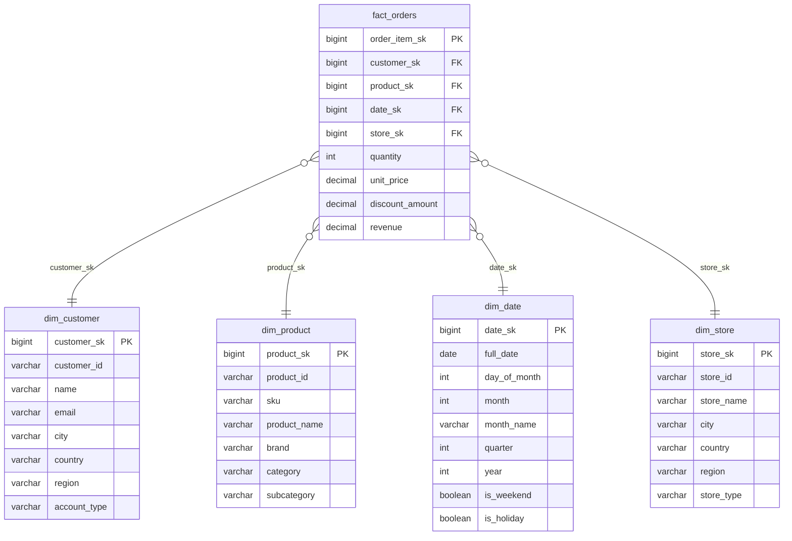
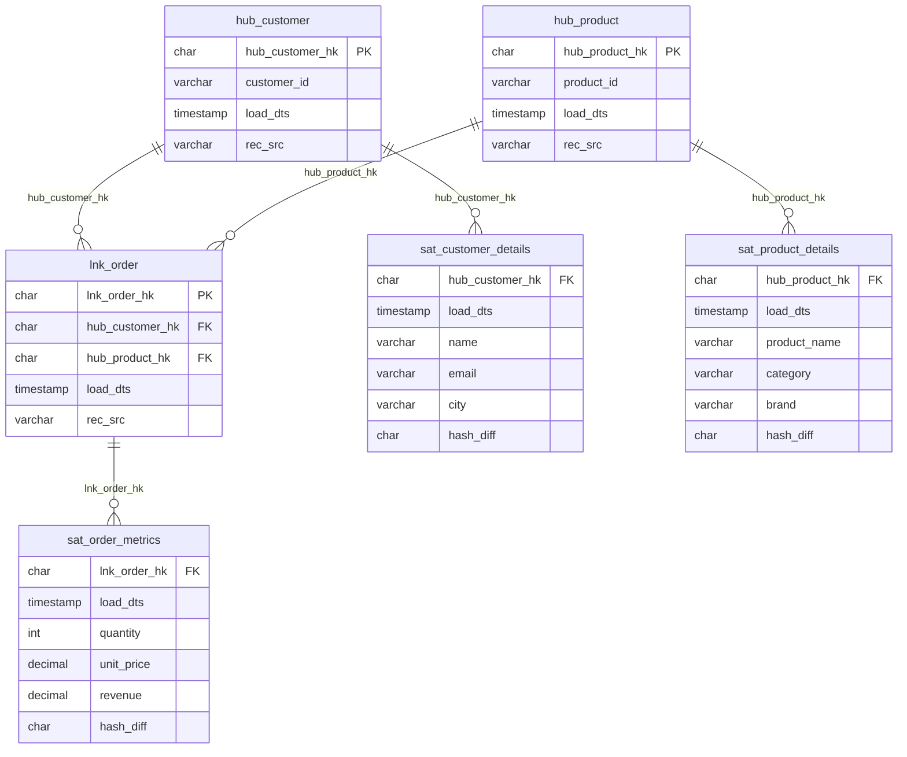
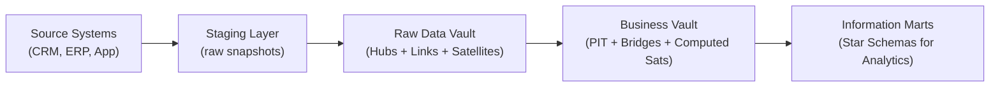
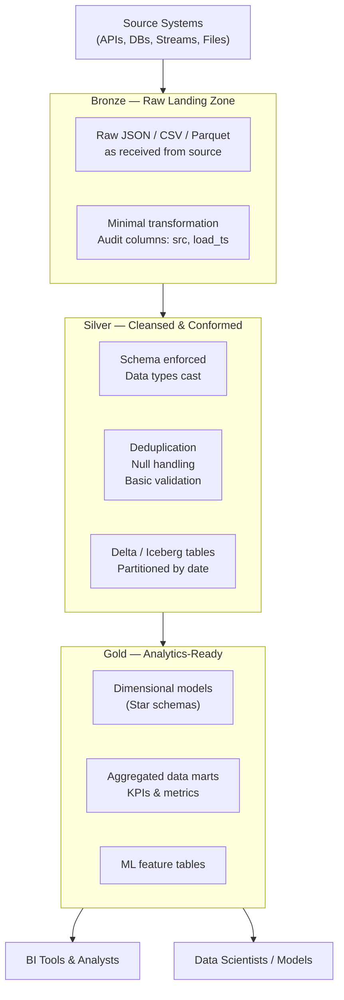
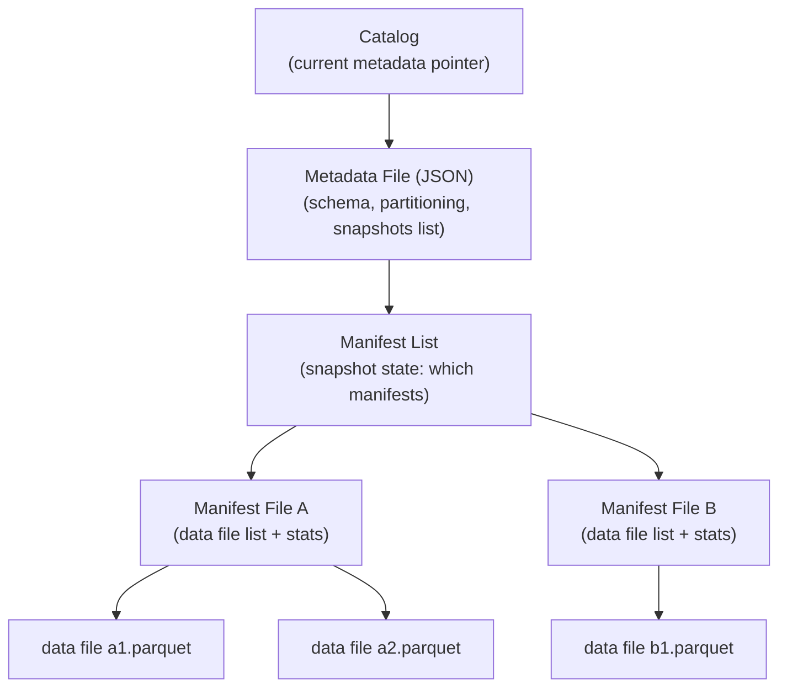
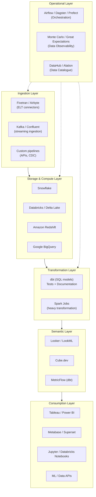
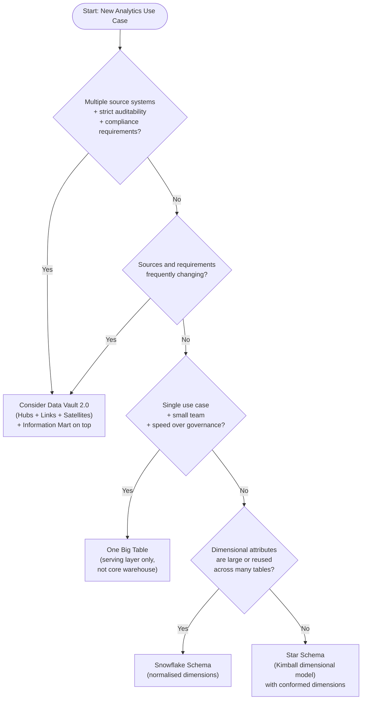

# Data Modelling: A Complete Learning Guide

> A thorough, narrative guide for engineers who want to truly understand data modelling — from first principles through to the modern lakehouse. Read it like a book.

---

## Table of Contents

**Part I — Foundations**
1. [What Is Data Modelling?](#chapter-1--what-is-data-modelling)
2. [OLTP vs OLAP: Two Different Worlds](#chapter-2--oltp-vs-olap-two-different-worlds)
3. [The Building Blocks](#chapter-3--the-building-blocks)
4. [Kimball vs Inmon: The Great Debate](#chapter-4--kimball-vs-inmon-the-great-debate)

**Part II — Dimensional Modelling**
5. [Star Schemas](#chapter-5--star-schemas)
6. [Snowflake Schemas](#chapter-6--snowflake-schemas)
7. [Fact Table Types](#chapter-7--fact-table-types)
8. [Slowly Changing Dimensions](#chapter-8--slowly-changing-dimensions)
9. [Special Dimension Patterns](#chapter-9--special-dimension-patterns)

**Part III — Data Vault 2.0**
10. [Hubs, Links, and Satellites](#chapter-10--hubs-links-and-satellites)
11. [Advanced Data Vault Structures](#chapter-11--advanced-data-vault-structures)
12. [Data Vault in Practice](#chapter-12--data-vault-in-practice)

**Part IV — Physical Storage and Database Design**
13. [Columnar vs Row-Based Storage](#chapter-13--columnar-vs-row-based-storage)
14. [Amazon Redshift: MPP Design](#chapter-14--amazon-redshift-mpp-design)
15. [PostgreSQL for Analytics](#chapter-15--postgresql-for-analytics)

**Part V — The Modern Data Lake and Lakehouse**
16. [Schema-on-Read and the Medallion Architecture](#chapter-16--schema-on-read-and-the-medallion-architecture)
17. [Delta Lake: ACID on a Lake](#chapter-17--delta-lake-acid-on-a-lake)
18. [Apache Iceberg: Built for Scale](#chapter-18--apache-iceberg-built-for-scale)
19. [The One Big Table Debate](#chapter-19--the-one-big-table-debate)

**Part VI — Advanced and Operational Topics**
20. [Semi-Structured Data](#chapter-20--semi-structured-data)
21. [Schema Evolution and Backward Compatibility](#chapter-21--schema-evolution-and-backward-compatibility)
22. [dbt and the Transformation Layer](#chapter-22--dbt-and-the-transformation-layer)
23. [Modelling for Performance](#chapter-23--modelling-for-performance)

**Part VII — Bringing It All Together**
24. [The Modern Data Stack](#chapter-24--the-modern-data-stack)
25. [Choosing the Right Model](#chapter-25--choosing-the-right-model)

---

# Part I — Foundations

## Chapter 1 — What Is Data Modelling?

Before we write a single `CREATE TABLE` statement, it is worth pausing to ask what data modelling actually is, and why it deserves careful thought.

At its most fundamental, **data modelling is the practice of deciding how to organise data so that it can be stored, queried, and understood reliably**. That definition sounds deceptively simple — but the decisions you make here cascade into everything downstream. A schema designed thoughtfully today means analysts write simpler SQL, pipelines run faster, and on-call engineers sleep soundly. A schema designed carelessly today means three years of technical debt, surprise query timeouts, and an entire team that has quietly given up trusting the numbers.

Think of it this way: data modelling is not about the data you have right now. It is about the questions your organisation will ask of that data — now and in the future. Your job is to build a structure that makes the right questions easy to answer and makes wrong questions visibly wrong.

### The Three Levels of Data Modelling

Practitioners commonly distinguish three levels of data modelling, each serving a different audience and purpose.

**Conceptual modelling** is the highest level of abstraction. At this level, you are drawing boxes and arrows — entities and relationships — without worrying about databases, data types, or implementation. A conceptual model for an e-commerce platform might simply state: "A Customer places many Orders. An Order contains many Products. A Product belongs to one Category." This is the language of business stakeholders and product managers, and it captures the domain before any technical decisions intrude.

**Logical modelling** takes those concepts and refines them into precise entities, attributes, and relationships, still independent of any particular database technology. You start naming columns, identifying primary keys, and resolving relationships (a many-to-many between Order and Product becomes an OrderLine entity). The logical model is the agreement between engineering and the business about what the data means.

**Physical modelling** is where you translate the logical model into actual database constructs: specific data types, index choices, partitioning schemes, distribution keys, compression encoding. Physical modelling is deeply tied to the technology you are using — the right physical design for Redshift looks very different from the right physical design for PostgreSQL or a Parquet data lake.

Most of this guide lives at the logical and physical levels, because that is where data engineers spend most of their time. But never forget the conceptual level. When a data model becomes confusing, it is almost always because someone skipped the conceptual conversation and jumped straight into `CREATE TABLE`.

### The Mental Model Shift

A common failure mode is treating data modelling as a storage problem: "How do we save this data?" The correct frame is an access problem: "How do we make this data answerable?" These sound similar but lead to radically different decisions. Storage-centric thinking leads to models that mirror the source system — normalised, transaction-optimised, and completely useless for analytics. Access-centric thinking leads to models shaped around the questions the business asks, optimised for reads, and designed to stay correct as the data grows.

This shift is the central idea behind the distinction between OLTP and OLAP data modelling, which is where we begin.

---

## Chapter 2 — OLTP vs OLAP: Two Different Worlds

Every data engineering discussion eventually runs into the OLTP / OLAP split, and yet it is astonishing how often the difference is explained badly. Let us fix that with a concrete example.

### The Same Domain, Two Models

Suppose you are building an e-commerce platform. You have customers, orders, order line items, products, and product categories. Here is how the same domain looks in each model.

**The OLTP model** is what your application's backend database looks like. It is designed to handle a torrent of small, concurrent read-write operations: a customer placing an order, an inventory update, a payment being processed. The primary virtues are **data integrity** and **write speed**. This model is heavily normalised — every piece of information lives in exactly one place.

```
customers        (customer_id PK, email, name, address_id FK)
addresses        (address_id PK, street, city, country)
orders           (order_id PK, customer_id FK, placed_at, status)
order_items      (item_id PK, order_id FK, product_id FK, quantity, unit_price)
products         (product_id PK, name, sku, category_id FK)
categories       (category_id PK, name, parent_category_id FK)
```

This model is clean. If a customer changes their address, you update one row in `addresses` and every associated record instantly reflects the change. No redundancy, no anomalies. But ask the business question "What were our top-selling product categories by revenue last month?" and you need to join six tables across potentially millions of rows. That query will be slow, and running it on your primary OLTP database will threaten the performance of the application itself.

**The OLAP model** is what your analytics warehouse looks like. It is designed for a completely different workload: complex aggregations over large volumes of historical data, run by analysts and BI tools. The primary virtue is **query performance**. This model is deliberately denormalised.

```
fact_orders        (order_sk, customer_sk, product_sk, date_sk, quantity, revenue, discount)
dim_customer       (customer_sk, customer_id, name, email, city, country, region)
dim_product        (product_sk, product_id, sku, product_name, category, subcategory)
dim_date           (date_sk, full_date, day, month, quarter, year, is_weekend)
```

The category name lives directly inside `dim_product`. The city lives directly inside `dim_customer`. Yes, if a product's category changes, you need to decide how to handle that history — that is the Slowly Changing Dimension problem, which we discuss in Chapter 8. But the payoff is that the "top categories by revenue last month" query now joins only two tables and scans only the columns it needs.

### Normalisation: A Concept Worth Understanding Deeply

**Normalisation** is the process of structuring a relational database to reduce data redundancy and improve integrity. The normal forms (1NF, 2NF, 3NF, BCNF) describe progressively stricter rules for how data should be organised. The key insight of 3NF — the normal form most OLTP databases target — is that every non-key attribute should depend on the key, the whole key, and nothing but the key. In practical terms this means: no repeated groups, no partial dependencies, no transitive dependencies.

**Denormalisation** deliberately reverses this process, collapsing related tables together to reduce the number of joins required at query time. In an analytics model, denormalisation is not laziness — it is a deliberate performance trade-off. The redundancy you introduce is managed by your ETL pipeline, not by your query engine.

### When Each Model Applies

| Characteristic | OLTP | OLAP |
|---|---|---|
| Primary workload | Many fast reads/writes | Fewer, complex reads |
| Schema design | Highly normalised (3NF) | Denormalised (star/snowflake) |
| Optimised for | Write throughput, consistency | Scan performance, aggregations |
| Row count per query | Handful of rows | Millions to billions |
| Query pattern | Simple lookups, transactional | GROUP BY, aggregations, wide scans |
| Concurrency | Thousands of simultaneous users | Dozens of analysts |
| Change handling | In-place updates | Append-heavy, SCDs |

The rest of this guide is almost entirely about the OLAP world. But understanding the OLTP world is essential, because the data you model for analytics almost always originates in an OLTP system. The shape of the source influences the design of the target.

---

## Chapter 3 — The Building Blocks

Before diving into specific modelling patterns, we need a shared vocabulary. This chapter establishes the concepts that every subsequent chapter builds on. If you have been in data engineering for a while, this may feel familiar — but read it anyway, because the precise definitions matter.

### Grain

The **grain** of a fact table is the most important design decision in dimensional modelling. It answers the question: what does one row in this table represent?

A grain statement might be: "One row represents one line item on one order." Or: "One row represents the total sales for one store on one day." The grain defines the level of detail in the table and determines what you can and cannot answer with it. A finer grain gives you more flexibility — you can always aggregate up — but it also means more rows, more storage, and heavier queries.

The critical rule: **all rows in a fact table must be at the same grain**. Mixing grains in a single table is one of the most common and most damaging data modelling mistakes. If your fact table has one row per order on some days and one row per order-line-item on others, every aggregation becomes unpredictable.

### Fact Tables

A **fact table** stores the measurable, numeric events or outcomes of a business process. Facts are things you count, sum, average, or otherwise aggregate. Revenue, quantity sold, page views, call duration — these are facts.

In addition to numeric measures, a fact table contains **foreign keys** to its dimension tables, and it often includes the date/time of the event. What a fact table typically does not contain is descriptive text or slowly-changing attributes — those belong in dimensions.

The row count of a fact table is determined by the grain. A business with a million transactions per day and two years of history will have roughly 730 million rows in its transactional fact table. This is normal; fact tables are designed to be large.

### Dimension Tables

A **dimension table** provides the context for the facts. It answers the who, what, where, when, and how of each event. Dimensions are descriptive — they contain text, categories, and attributes that users filter and group by.

A `dim_product` table might contain: product key, product name, SKU, category, subcategory, brand, colour, size. A `dim_customer` table might contain: customer key, name, email, city, country, region, account type, acquisition channel.

Dimension tables tend to be much narrower than fact tables in terms of row count (thousands to millions, not billions), but much wider in terms of column count (30–100 columns is common for a rich dimension).

### Surrogate Keys vs Natural Keys

Every dimension table needs a primary key. You have two options.

A **natural key** is a key that already exists in the source data — a customer ID from the CRM, a product SKU, an employee number. It has business meaning and is recognisable.

A **surrogate key** is a synthetic, system-generated key — typically an auto-incrementing integer or a hash value — with no business meaning. It exists solely to uniquely identify a row in the dimension table.

Surrogate keys are strongly preferred in dimensional models for three reasons. First, natural keys from source systems can change, be reused, or have different formats across systems; surrogate keys are stable and consistent. Second, handling Slowly Changing Dimensions (Chapter 8) requires multiple rows for the same business entity with different effective dates — surrogate keys make this possible without ambiguity. Third, integer surrogate keys are smaller and faster to join on than string natural keys.

The natural key does not disappear — you keep it as a regular column in the dimension table for traceability. But the foreign key in the fact table always points to the surrogate key.

### Cardinality

**Cardinality** describes the number of distinct values in a column or the nature of a relationship between tables. High cardinality means many distinct values (customer IDs, order IDs); low cardinality means few distinct values (status flags, boolean fields, a handful of regions).

Understanding cardinality matters enormously for physical design decisions: indexing, distribution keys, compression encoding, and whether a column deserves its own dimension table or should be treated as a junk dimension (Chapter 9).

### Measures: Additive, Semi-Additive, Non-Additive

Not all facts behave the same way when aggregated, and understanding this prevents analytical errors.

**Additive measures** can be summed across any dimension. Revenue and quantity are additive: you can sum them by day, by product, by region, or across all three.

**Semi-additive measures** can be summed across some dimensions but not others. Account balance is the classic example: you can sum account balances across customers at a single point in time, but summing December 31 balances across all months of the year is meaningless. Semi-additive measures usually involve point-in-time snapshots.

**Non-additive measures** cannot be meaningfully summed at all. Ratios, percentages, and averages are non-additive. The conversion rate for one product category cannot be added to the conversion rate for another to get the conversion rate of both. You must store the component numerators and denominators as additive facts and compute ratios at query time.

---

## Chapter 4 — Kimball vs Inmon: The Great Debate

In the 1990s, two methodologists independently developed the foundational frameworks for how enterprises should build data warehouses. Their names were Ralph Kimball and Bill Inmon, and the debate between their approaches has never fully resolved. Understanding both schools is not merely historical — the tension between them shapes how data platforms are designed to this day.

### Bill Inmon: The Top-Down Enterprise Warehouse

Inmon's approach is often described as **top-down**. The idea is to start with the entire enterprise and build a single, centrally governed, normalised **Enterprise Data Warehouse (EDW)** that serves as the one source of truth for all data in the organisation.

In Inmon's model, the EDW is built in 3NF. Data from every source system is carefully integrated, cleaned, and stored in a subject-oriented, integrated, non-volatile, time-variant structure. Only after the EDW is established do you build **data marts** — denormalised, subject-specific subsets — that sit on top of the EDW and serve specific business units.

The philosophy is: get the integration and governance right first, then worry about presentation. An analyst querying the sales data mart is querying data that has already been reconciled against the HR data and the finance data in the underlying EDW. The numbers are consistent by construction.

**The strength of Inmon's approach is data integrity and consistency.** A single EDW means no conflicting numbers between departments. If the marketing team and the finance team both pull customer count, they get the same answer because both are reading from the same integrated source.

**The weakness is time and investment.** Building a well-governed, fully integrated EDW before delivering any business value is a long, expensive undertaking. Many such projects stalled or were cancelled before delivering results. The "big bang" nature of the approach is poorly suited to iterative delivery.

### Ralph Kimball: The Bottom-Up Dimensional Warehouse

Kimball's approach is **bottom-up**. Rather than building the full enterprise model first, you start with the most valuable business process and build a dimensional model (star schema) for it. You deliver it quickly, demonstrate value, and then build the next one.

The magic that prevents this from becoming a spaghetti of disconnected silos is the **conformed dimension**. When you build a `dim_customer` for the sales data mart, you define it carefully and document it. When you later build the marketing data mart, you reuse the same `dim_customer` rather than inventing a new definition. The sum of all these interconnected data marts — each built incrementally but sharing conformed dimensions — Kimball called the **data warehouse bus architecture**.

**The strength of Kimball's approach is speed to value and business alignment.** The first data mart can be delivered in weeks. Business users understand the star schema model intuitively. Query performance is optimised by design.

**The weakness is governance discipline.** If teams are not diligent about conforming their dimensions, you end up with subtle inconsistencies: the marketing definition of "active customer" differs from the finance definition. The bus architecture only works if someone is maintaining the conformed dimension definitions.

### How Data Vault Fits

Data Vault (covered in detail in Chapters 10–12) represents a third school, developed by Dan Linstedt. It sits conceptually between Inmon and Kimball. Like Inmon, it builds a centralised, integrated data layer. Like Kimball, it can be delivered incrementally. Its design is specifically engineered for auditability, scalability, and tolerance of change — properties that neither Inmon nor Kimball prioritised.

### Which to Choose?

| Factor | Lean Kimball | Lean Inmon | Lean Data Vault |
|---|---|---|---|
| Timeline pressure | ✓ Fast delivery | ✗ Slow | Moderate |
| Enterprise consistency | Moderate | ✓ Strong | ✓ Strong |
| Auditability / compliance | Moderate | Moderate | ✓ Built-in |
| Source system churn | ✗ Painful | Moderate | ✓ Designed for it |
| Team data modelling maturity | Lower barrier | Requires 3NF expertise | High complexity |
| Analytic query simplicity | ✓ Star schema | ✗ Needs data marts | Needs data marts |

In practice, many mature data platforms blend the approaches. A common architecture is: raw data lands in a staging layer, a Kimball-style dimensional model serves the analytics layer, and governance is enforced through conformed dimensions and a central data catalogue. Data Vault is adopted when the organisation specifically needs the audit trail and source flexibility it provides.

---

# Part II — Dimensional Modelling

## Chapter 5 — Star Schemas

The star schema is the most important single concept in analytical data modelling. If you understand it deeply — not just what it looks like, but why it is designed the way it is — you understand the foundation on which almost every analytics platform is built.

### The Anatomy of a Star

A star schema has a **fact table** at its centre, surrounded by **dimension tables** that radiate outward. When you draw it, it looks like a star. The fact table contains foreign keys pointing to each dimension, plus the numeric measures you want to analyse.

Here is a complete star schema for an e-commerce business, the domain we will use throughout this guide:



### A Query Walkthrough

With this schema, answering business questions is pleasingly mechanical. Consider: "What was the total revenue by product category for Q1 2024, broken down by customer region?"

```sql
SELECT
    dp.category,
    dc.region,
    SUM(fo.revenue)    AS total_revenue,
    SUM(fo.quantity)   AS units_sold
FROM fact_orders fo
JOIN dim_product dp ON fo.product_sk = dp.product_sk
JOIN dim_customer dc ON fo.customer_sk = dc.customer_sk
JOIN dim_date dd ON fo.date_sk = dd.date_sk
WHERE dd.year = 2024
  AND dd.quarter = 1
GROUP BY dp.category, dc.region
ORDER BY total_revenue DESC;
```

Notice that the fact table is the anchor — every other table joins to it. The filter on quarter and year hits `dim_date`, which is tiny. The grouping attributes (category, region) come from dimension tables. The aggregation (revenue, quantity) comes from the fact table. This pattern — join small dimensions to a large fact, filter on dimension attributes, aggregate fact measures — is the template for nearly every analytical query you will write.

### Conformed Dimensions and the Bus Matrix

A single star schema serves one business process. The real power of Kimball's methodology emerges when you build multiple star schemas that share the same dimensions.

Suppose you now build a second star schema for `fact_web_events` (page views, sessions) and a third for `fact_support_tickets`. If all three share the same `dim_customer` and `dim_date`, you have built **conformed dimensions**. A conformed dimension is defined once, governed centrally, and used consistently across all fact tables that refer to it.

The practical consequence is enormous: you can now join across different business processes. You can ask "Which customer segments have high purchase revenue but also high support ticket volume?" because both `fact_orders` and `fact_support_tickets` use the same `dim_customer` with the same `customer_sk`.

A useful planning tool is the **bus matrix** — a grid with business processes as rows and dimensions as columns. A tick indicates that a particular dimension is used in a particular fact table. Building this matrix before modelling forces you to identify shared dimensions and ensures that the team agrees on conformed definitions before building begins.

### Why Star Schemas Perform Well

The performance benefits of a star schema are not accidental. They arise from three structural properties.

First, the **join depth is always one**. Every dimension joins directly to the fact table. No matter how many dimensions you have, a query never has to traverse a chain of joins — it always reads the fact table and then fans out to individual dimension lookups. This keeps query plans simple and predictable.

Second, **dimension tables are small**. Joining a billion-row fact table to a million-row customer dimension is far less expensive than joining two billion-row tables together. The database can often load the entire dimension into memory (a hash join or broadcast join) and scan the fact table in a single pass.

Third, **dimension columns are highly compressible**. Categories, regions, and status codes repeat heavily. In a columnar store (see Chapter 13), this means dimension data compresses dramatically, reducing the I/O cost of filtering.

---

## Chapter 6 — Snowflake Schemas

The snowflake schema is the natural extension of the star schema in the direction of normalisation. The name comes from its visual appearance — when dimension tables are further broken down into sub-dimension tables, the diagram looks like a snowflake rather than a star.

### What Changes in a Snowflake

In a star schema, the `dim_product` table might look like this:

| product_sk | product_name | brand | category | subcategory |
|---|---|---|---|---|
| 1 | Blue Denim Jacket | Levi's | Clothing | Jackets |
| 2 | Red Sneakers | Nike | Footwear | Running |
| 3 | Black Jeans | Levi's | Clothing | Trousers |

The category and subcategory names are repeated for every product in that category. In a snowflake schema, you would normalise this into a hierarchy:

```
dim_product       (product_sk, product_id, product_name, brand_sk FK, subcategory_sk FK)
dim_brand         (brand_sk, brand_name, parent_company)
dim_subcategory   (subcategory_sk, subcategory_name, category_sk FK)
dim_category      (category_sk, category_name, department)
```

Now category names are stored exactly once. Updating "Clothing" to "Apparel" changes one row in `dim_category`. There is no redundancy.

### The Real Trade-Off

| Property | Star Schema | Snowflake Schema |
|---|---|---|
| Number of dimension tables | Fewer, wider | More, narrower |
| Data redundancy | Some | Minimal |
| Storage consumption | Slightly higher | Slightly lower |
| Query complexity | Simpler joins | More joins required |
| Query performance | Generally faster | Can be slower |
| ETL complexity | Simpler | More complex |
| Understanding for analysts | Easier | Harder |

In modern cloud analytics, **storage is cheap and query execution is valuable**. Saving disk space by normalising dimension tables is almost never worth the join overhead and analytical complexity it introduces. This is why the dominant recommendation in the industry is: start with a star schema and snowflake only when you have a specific, concrete reason to do so.

The legitimate reasons to snowflake include: a dimension that is genuinely enormous (tens of millions of rows) where avoiding redundancy matters; a dimension hierarchy that is reused across many fact tables; or a case where the normalised sub-dimension is queried independently in its own right.

---

## Chapter 7 — Fact Table Types

Kimball's dimensional modelling framework defines three types of fact tables, each suited to a different kind of business question. Understanding which type to reach for is one of the most practically important decisions in analytical schema design.

### Type 1: Transaction Fact Tables

The **transaction fact table** records individual business events as they happen. Its grain is one row per event — one row per order line item, one row per web page view, one row per sensor reading. It is the most common type and the one most people think of when they hear "fact table."

Transaction fact tables grow without bound: new events are appended continuously and rows are never updated. They can grow to hundreds of billions of rows in high-volume systems. Their strength is precision — every event is captured — and their weakness is that querying them for aggregate trends requires scanning huge volumes of data.

Example — our e-commerce `fact_orders` (grain: one row per order line item):

| order_item_sk | customer_sk | product_sk | date_sk | quantity | unit_price | discount | revenue |
|---|---|---|---|---|---|---|---|
| 100001 | 4421 | 882 | 20240115 | 2 | 49.99 | 5.00 | 94.98 |
| 100002 | 4421 | 1103 | 20240115 | 1 | 29.99 | 0.00 | 29.99 |
| 100003 | 9017 | 882 | 20240116 | 3 | 49.99 | 15.00 | 134.97 |

### Type 2: Periodic Snapshot Fact Tables

The **periodic snapshot fact table** captures the state of something at regular intervals — the end of each day, week, or month — regardless of whether any events occurred. Its grain is one row per entity per period.

The canonical example is an inventory or account balance table. You want to know: "What was our inventory level for each SKU at the end of each day last month?" You cannot answer this from a transaction fact table without reconstructing state from events — and that reconstruction is expensive and error-prone. The periodic snapshot table is the right tool.

One crucial design rule: **a row must be inserted for every period, even if nothing changed**. If Product 882 had no stock movement on January 17, you still insert a row with quantity = 150 (the unchanged balance). This ensures that queries for a specific date always find a row, preventing gaps from confusing aggregations.

Example — `fact_inventory_daily` (grain: one row per SKU per day):

| snapshot_sk | product_sk | warehouse_sk | date_sk | on_hand_qty | reserved_qty | available_qty |
|---|---|---|---|---|---|---|
| 1 | 882 | 3 | 20240115 | 150 | 20 | 130 |
| 2 | 882 | 3 | 20240116 | 150 | 25 | 125 |
| 3 | 882 | 3 | 20240117 | 147 | 25 | 122 |

Semi-additive measures (like `on_hand_qty`) live naturally in snapshot fact tables — you can sum across SKUs within a single day, but summing across days gives nonsense. The correct query for "average inventory across last week" would use `AVG`, not `SUM`.

### Type 3: Accumulating Snapshot Fact Tables

The **accumulating snapshot fact table** is the least common but arguably the most conceptually interesting type. It models the lifecycle of a business process that passes through predictable, discrete stages. Think of an order fulfillment pipeline: order placed → payment confirmed → items picked → shipped → delivered → (possibly) returned.

The grain is one row per process instance — one row per order, regardless of how many stages it passes through. Crucially, that row is **updated** as the process advances. It contains multiple date foreign keys, one for each milestone. When an order ships, the row is retrieved and its `shipped_date_sk` is populated. When it is delivered, `delivered_date_sk` is populated. The row is a running summary of where the process stands.

This makes accumulating snapshot tables unique among fact types: they are the only ones where rows are regularly revisited and updated, not just appended.

Example — `fact_order_fulfillment` (grain: one row per order):

| order_sk | customer_sk | placed_date_sk | paid_date_sk | picked_date_sk | shipped_date_sk | delivered_date_sk | days_to_ship | days_to_deliver |
|---|---|---|---|---|---|---|---|---|
| 5001 | 4421 | 20240115 | 20240115 | 20240116 | 20240117 | 20240120 | 2 | 5 |
| 5002 | 9017 | 20240116 | 20240116 | NULL | NULL | NULL | NULL | NULL |

Order 5002 is in-flight — it has been placed and paid for but not yet picked or shipped. Those fields are NULL and will be filled in as the process progresses. The lag columns (`days_to_ship`, `days_to_deliver`) allow simple average calculations for process monitoring: "What is our average time from order placement to shipment this month?"

### Complementary Use

In a mature data warehouse, all three types coexist and serve different analytical purposes. Transaction tables answer "what happened and when, in detail?" Periodic snapshots answer "what was the state at a given point in time?" Accumulating snapshots answer "how is our process performing end-to-end?" They are not alternatives; they are complements.

---

## Chapter 8 — Slowly Changing Dimensions

If there is one topic that separates data engineers who think carefully about data modelling from those who do not, it is Slowly Changing Dimensions. The problem is deceptively simple: dimension attributes change over time. A customer moves to a new city. A product is recategorised. An employee's department changes. How do you handle that change in the warehouse?

The wrong answer is obvious: blindly overwrite the old value. If you do that, all historical facts that were linked to this customer when they lived in London will now look like they belong to a customer in Berlin. Your historical reports break.

There is a taxonomy of strategies for handling this, numbered Type 0 through Type 7. Most of them are edge cases; Types 1, 2, and 3 are the workhorses.

### SCD Type 0: Retain Original

Type 0 simply preserves the original value forever, ignoring any changes in the source. Use this for attributes that should be immutable by design — the original sign-up date, the initial acquisition channel, the birth date. If the source sends an update, you explicitly discard it.

### SCD Type 1: Overwrite

In SCD Type 1, the dimension attribute is overwritten with the new value. History is not preserved. This is the simplest approach and the right choice when history genuinely does not matter — a corrected typo in a product name, a fixed data entry error, or an attribute where you always want the current value regardless of history.

Before and after a customer's email correction:

| customer_sk | customer_id | name | email |
|---|---|---|---|
| 4421 | CUST-7890 | Alice Chen | alce.chen@email.com |

After Type 1 update:

| customer_sk | customer_id | name | email |
|---|---|---|---|
| 4421 | CUST-7890 | Alice Chen | alice.chen@email.com |

All historical fact rows pointing to `customer_sk = 4421` now see the corrected email. This is appropriate because the email was wrong, not because it genuinely changed.

### SCD Type 2: Add a New Row

Type 2 is the most powerful and most commonly used SCD type. When a dimension attribute changes, a **new row** is inserted with a new surrogate key. The old row remains untouched. Fact rows recorded before the change point to the old dimension row; new fact rows point to the new dimension row. History is perfectly preserved.

A customer moves from London to Berlin:

Before:

| customer_sk | customer_id | name | city | valid_from | valid_to | is_current |
|---|---|---|---|---|---|---|
| 4421 | CUST-7890 | Alice Chen | London | 2021-03-01 | 9999-12-31 | Y |

After:

| customer_sk | customer_id | name | city | valid_from | valid_to | is_current |
|---|---|---|---|---|---|---|
| 4421 | CUST-7890 | Alice Chen | London | 2021-03-01 | 2024-02-20 | N |
| 8892 | CUST-7890 | Alice Chen | Berlin | 2024-02-21 | 9999-12-31 | Y |

Now your fact table rows from 2022 still point to `customer_sk = 4421` (the London version), and new orders from 2024 onwards point to `customer_sk = 8892` (the Berlin version). A regional report for 2022 correctly shows Alice's purchases attributed to London. A report for 2024 correctly shows them attributed to Berlin.

The implementation requirements: a `valid_from` and `valid_to` date (or a `is_current` flag, or both), and a natural key (`customer_id`) to identify which business entity the rows belong to. The surrogate key (`customer_sk`) is the dimension's primary key and must be unique across both rows.

The ETL challenge: you must detect that a relevant attribute has changed, close the current row by setting `valid_to`, and insert a new row with the new values.

### SCD Type 3: Add a New Column

Type 3 adds a new column to store the previous value, alongside the current value. This is a compromise — you get limited history (only the previous value, not the full history), but you can easily compare current and previous in a single row.

| customer_sk | customer_id | name | city | prev_city | city_changed_on |
|---|---|---|---|---|---|
| 4421 | CUST-7890 | Alice Chen | Berlin | London | 2024-02-21 |

The limitation is obvious: if Alice moves again — from Berlin to Paris — you lose the London history. Type 3 is appropriate only when you need exactly one step of history, which is rare. A common legitimate use case is tracking a metric that analysts frequently want to compare: current fiscal year vs prior fiscal year for a budget dimension.

### SCD Type 4: Mini-Dimension

Type 4 is used when a subset of dimension attributes changes very frequently — too frequently for Type 2 to be practical, because it would generate enormous numbers of new rows. The solution is to split the volatile attributes into a separate **mini-dimension** table, assign surrogate keys to each unique combination of those attribute values, and carry both the core dimension key and the mini-dimension key on the fact table.

For example, if customer demographic data (age band, income band, loyalty tier) changes monthly while the core identity data (name, email) changes rarely, you split them:

```
dim_customer          (customer_sk, customer_id, name, email)  -- stable attributes, Type 2
dim_customer_profile  (profile_sk, age_band, income_band, loyalty_tier)  -- volatile, shared combos
fact_orders           (..., customer_sk, profile_sk, ...)
```

The `dim_customer_profile` table contains every unique combination of the three attributes, not one row per customer. Many customers may share the same profile row if they have the same age band, income band, and loyalty tier.

### SCD Type 6: The Hybrid

Type 6 (sometimes called the "hybrid" type) combines Types 1, 2, and 3. It uses Type 2 to preserve full history via new rows, but also adds a current-value column (from Type 1) and a previous-value column (from Type 3) to each row. This means you can easily report both historical accuracy (using the `valid_from`/`valid_to` range) and current state (using the `current_city` column) from the same dimension.

| customer_sk | customer_id | name | city | current_city | prev_city | valid_from | valid_to | is_current |
|---|---|---|---|---|---|---|---|---|
| 4421 | CUST-7890 | Alice Chen | London | Berlin | London | 2021-03-01 | 2024-02-20 | N |
| 8892 | CUST-7890 | Alice Chen | Berlin | Berlin | London | 2024-02-21 | 9999-12-31 | Y |

`current_city` on the old row reflects the current state (Berlin), allowing a query to report all of Alice's historical orders attributed to her current city — a common "as-is" reporting requirement.

### SCD Types 5 and 7

**Type 5** extends Type 4 by also adding a foreign key from the core dimension to the current mini-dimension row, making it easy to retrieve the current demographic profile without joining the fact table.

**Type 7** uses both a full Type 2 dimension and a Type 1 current-row view to support both historical and current reporting through different access paths.

### Which Type to Use?

| Scenario | Recommended Type |
|---|---|
| Attribute was incorrect, needs correction | Type 1 |
| Full historical accuracy required | Type 2 |
| Only current vs previous value needed | Type 3 |
| Volatile attributes causing too many Type 2 rows | Type 4 |
| Both historical and current-state reporting needed | Type 6 |
| Immutable attributes (original acquisition date) | Type 0 |

In practice, most warehouses use a combination: Type 2 for the attributes that business users care most about historically, Type 1 for correctable fields, and possibly Type 6 for dimensions where "as-is" vs "as-was" reporting is a real business need.

---

## Chapter 9 — Special Dimension Patterns

Beyond the standard dimension table, Kimball's framework defines a set of dimension patterns for common design challenges. Each one exists to solve a specific problem, and knowing when to reach for each one is the mark of a mature data modeller.

### Junk Dimensions

Imagine your order line item has several low-cardinality flags and status codes: `is_gift_wrap` (Y/N), `is_express_shipping` (Y/N), `payment_method` (Card/PayPal/ApplePay/Voucher), `promo_applied` (Y/N). You could create a separate tiny dimension for each one, but that would add four surrogate key columns to your fact table and four tiny tables to your schema — needless clutter.

A **junk dimension** solves this by combining all these low-cardinality attributes into a single dimension table using a Cartesian product: every possible combination of the flag values gets one row.

```
dim_order_flags (flag_sk, is_gift_wrap, is_express_shipping, payment_method, promo_applied)
```

With 2 × 2 × 4 × 2 = 32 possible combinations, this dimension has at most 32 rows. The fact table gains a single `flag_sk` foreign key instead of four separate flags. Queries filtering by any combination of these attributes join to this tiny table and benefit from standard dimension join performance.

One practical note: you do not need to pre-generate all combinations. You can populate the junk dimension with only the combinations that actually appear in your data, and add new rows when new combinations are encountered during load.

### Degenerate Dimensions

A **degenerate dimension** is a dimension attribute that is stored directly on the fact table rather than in a separate dimension table. The canonical example is an order number or invoice number.

An order number has high cardinality (it is nearly unique per fact row), has no additional attributes beyond itself, and does not relate to any other entity in the warehouse. Creating a separate `dim_order` table with just a surrogate key and the order number would add a join with zero analytical benefit.

So instead, the order number lives as a column directly on the fact table:

```
fact_orders (..., order_id VARCHAR, ...)  -- order_id is a degenerate dimension
```

Degenerate dimensions are extremely useful for drillthrough — when an analyst sees a summary aggregate and wants to click through to the raw transactions, the degenerate dimension lets them do so without an additional lookup table.

### Role-Playing Dimensions

A **role-playing dimension** is a single physical dimension table that is used multiple times by a single fact table, each time in a different semantic role.

The date dimension is the classic example. The order fulfillment fact table needs dates for multiple milestones: when the order was placed, when it was shipped, when it was delivered. All three are dates, all have the same attributes (day, month, quarter, year), but they represent different events.

Rather than creating three separate copies of the date dimension, you keep one `dim_date` table and reference it multiple times:

```sql
SELECT
    fo.order_sk,
    placed.year        AS order_year,
    placed.month       AS order_month,
    shipped.full_date  AS ship_date,
    delivered.full_date AS delivery_date
FROM fact_order_fulfillment fo
JOIN dim_date placed    ON fo.placed_date_sk    = placed.date_sk
JOIN dim_date shipped   ON fo.shipped_date_sk   = shipped.date_sk
JOIN dim_date delivered ON fo.delivered_date_sk = delivered.date_sk;
```

The physical table `dim_date` is the same table; the aliases `placed`, `shipped`, and `delivered` are the roles. In BI tools like Looker or Power BI, you often need to create separate logical views or aliases of the dimension to expose each role distinctly to analysts.

### Conformed Dimensions

Already introduced in Chapter 5, a **conformed dimension** is a dimension that is defined once and shared identically across multiple fact tables or data marts. It is the mechanism that allows the Kimball bus architecture to work.

The key word is "identically." A conformed `dim_customer` must have the same primary key, the same field definitions, and the same grain across every fact table that uses it. If one team defines `region` as a three-letter code and another defines it as a full country name, those are not the same dimension and cannot be conformed.

Managing conformed dimensions at scale requires a central data governance function (or at minimum, a clearly owned data dictionary) and discipline in the ETL processes that populate them.

### Bridge Tables for Many-to-Many

Standard dimensional modelling assumes a many-to-one relationship from the fact table to each dimension. But sometimes reality is messier. A sales opportunity might be owned by multiple salespeople. A customer might belong to multiple customer segments. A product might have multiple promotional tags.

A **bridge table** resolves this many-to-many relationship between a fact and a dimension. Instead of the fact table joining directly to the dimension, it joins to the bridge table, which then joins to the dimension.

```
fact_opportunity  (opp_sk, ..., sales_rep_group_sk FK)
bridge_sales_rep  (sales_rep_group_sk, rep_sk, allocation_pct)
dim_sales_rep     (rep_sk, name, region, quota)
```

The `bridge_sales_rep` table assigns each opportunity to a group of reps, with an optional allocation percentage. Queries that aggregate by sales rep join through the bridge table and apply the weighting. The allocation percentage allows revenue to be split across multiple reps without double-counting the total — a common requirement in sales reporting.

Bridge tables are one of the more complex patterns in dimensional modelling and introduce the risk of fans of rows (inflated row counts from unweighted many-to-many joins). Handle them with care and always document the intended join semantics.

### Outrigger Dimensions

An **outrigger dimension** is a dimension that is referenced not from the fact table directly, but from another dimension table. It represents a sub-relationship that is stable and meaningful enough to warrant its own table but is not queried directly from facts.

For example, a `dim_store` table might contain a `geographic_area_sk` foreign key that links to a `dim_geographic_area` table. Geographic areas may be updated independently of store data — new regions are created, boundaries are redrawn — and it is cleaner to maintain them separately.

Outrigger dimensions are used sparingly. They add join depth to queries that need their attributes, and they introduce a small degree of snowflaking. Use them only when the sub-entity genuinely warrants independent lifecycle management.

---

# Part III — Data Vault 2.0

## Chapter 10 — Hubs, Links, and Satellites

Data Vault is a modelling methodology designed from first principles for **auditability, adaptability, and scalability**. While dimensional modelling asks "how do we answer business questions efficiently?", Data Vault asks a deeper question first: "how do we store enterprise data in a way that is always correct, never destructive, and easy to extend?" The answers to both questions matter — they just matter in different contexts.

Data Vault 2.0 (the current version, by Dan Linstedt) organises all data into exactly three structural types: Hubs, Links, and Satellites.

### Hubs: The Business Keys

A **Hub** represents a core business entity, identified by its business key. That is the entirety of what a Hub contains. No descriptive attributes. No relationships. Just the entity's natural business key, a surrogate hash key, a load timestamp, and a record source.

```sql
CREATE TABLE hub_customer (
    hub_customer_hk  CHAR(32)     NOT NULL,  -- MD5/SHA1 hash of the business key
    customer_id      VARCHAR(50)  NOT NULL,  -- the natural business key
    load_dts         TIMESTAMP    NOT NULL,  -- when this row was first loaded
    rec_src          VARCHAR(100) NOT NULL,  -- which source system it came from
    PRIMARY KEY (hub_customer_hk)
);
```

A Hub row is inserted once when a new business key is first seen, and never updated. If the same `customer_id` appears across two source systems, it is still one row in the Hub — with `rec_src` identifying the first system to report it.

The **hash key** (typically an MD5 or SHA-256 hash of the business key) serves as the surrogate identifier across the vault. Hashing rather than using an integer sequence is important for two reasons: it is deterministic (you can compute the same hash from the same key without looking up the database), and it enables parallel loading across systems without key collision.

### Links: The Relationships

A **Link** represents an association or relationship between two or more Hubs. Where a Hub captures what exists, a Link captures how things relate.

```sql
CREATE TABLE lnk_order (
    lnk_order_hk      CHAR(32)     NOT NULL,  -- hash of all component keys
    hub_customer_hk   CHAR(32)     NOT NULL,  -- FK to hub_customer
    hub_product_hk    CHAR(32)     NOT NULL,  -- FK to hub_product
    hub_date_hk       CHAR(32)     NOT NULL,  -- FK to hub_date
    load_dts          TIMESTAMP    NOT NULL,
    rec_src           VARCHAR(100) NOT NULL,
    PRIMARY KEY (lnk_order_hk)
);
```

Like Hubs, Links are insert-only. Once a relationship is recorded, it stays — even if the relationship is logically "ended" (a contract expires, an employee leaves a department). The history of relationships is preserved forever. If a relationship changes, a new Link row can represent the new state, and downstream processing determines validity windows.

Links can connect more than two hubs. An order line item might link a customer, a product, a date, and a promotion simultaneously.

### Satellites: The Descriptive Attributes

**Satellites** hold all the contextual, descriptive, and changing attributes for a Hub or Link. They are the only tables in the raw vault that ever receive multiple rows for the same entity — because they track change over time.

```sql
CREATE TABLE sat_customer_details (
    hub_customer_hk  CHAR(32)     NOT NULL,  -- FK to hub_customer
    load_dts         TIMESTAMP    NOT NULL,  -- when this record was loaded
    load_end_dts     TIMESTAMP,              -- end of validity (NULL = current)
    rec_src          VARCHAR(100) NOT NULL,
    hash_diff        CHAR(32)     NOT NULL,  -- hash of all attribute values (change detection)
    name             VARCHAR(200),
    email            VARCHAR(200),
    city             VARCHAR(100),
    country          VARCHAR(100),
    PRIMARY KEY (hub_customer_hk, load_dts)
);
```

When any attribute changes, a new Satellite row is inserted — the old row remains unchanged. The `load_end_dts` may be used to close the prior row (or this can be computed on read). The `hash_diff` column is a hash of all attribute values in the row, used to efficiently detect whether a row has actually changed (skip insert if hash is the same as the latest row for that key).

A Hub or Link can have multiple Satellites, which is one of Data Vault's most powerful features. You might have:
- `sat_customer_identity` — name, email (changes rarely, from the CRM)
- `sat_customer_behaviour` — loyalty tier, visit frequency (changes often, from an app)
- `sat_customer_demographics` — age band, income band (from a third-party enrichment source)

Different source systems and different update rates go into different Satellites, with no impact on each other.

### A Complete Data Vault Diagram



---

## Chapter 11 — Advanced Data Vault Structures

The raw vault (Hubs, Links, Satellites) stores everything faithfully. But it is not designed for easy querying — reconstructing a customer's profile at a given point in time from a hub and three satellites with different update cadences is non-trivial and slow. That is where the **Business Vault** structures come in.

### Point-in-Time (PIT) Tables

A **Point-in-Time table** is a Business Vault performance structure that pre-materialises the latest valid row from each Satellite for a given Hub, at a series of snapshot dates.

The problem it solves: imagine you want to rebuild a customer's profile as it existed on January 15, 2024. Your Hub has three Satellites — identity (updated rarely), behaviour (updated weekly), demographics (updated monthly). You need to find the most recent row in each Satellite with a `load_dts` less than or equal to January 15. Doing this for every customer and every date in a query is expensive — it requires multiple range lookups or lateral joins across three satellite tables.

The PIT table pre-computes this alignment:

```sql
CREATE TABLE pit_customer (
    hub_customer_hk            CHAR(32)   NOT NULL,
    snapshot_dts               TIMESTAMP  NOT NULL,
    sat_identity_load_dts      TIMESTAMP,  -- latest identity row as of snapshot
    sat_behaviour_load_dts     TIMESTAMP,  -- latest behaviour row as of snapshot
    sat_demographics_load_dts  TIMESTAMP,  -- latest demographics row as of snapshot
    PRIMARY KEY (hub_customer_hk, snapshot_dts)
);
```

Now a query to reconstruct customer state joins the Hub, the PIT, and each Satellite with an equi-join on both the hash key and the `load_dts` value from the PIT — no range scans, no expensive subqueries:

```sql
SELECT
    h.customer_id,
    si.name, si.email,
    sb.loyalty_tier,
    sd.income_band
FROM hub_customer h
JOIN pit_customer pit ON h.hub_customer_hk = pit.hub_customer_hk
    AND pit.snapshot_dts = '2024-01-15'
JOIN sat_customer_identity si ON h.hub_customer_hk = si.hub_customer_hk
    AND pit.sat_identity_load_dts = si.load_dts
JOIN sat_customer_behaviour sb ON h.hub_customer_hk = sb.hub_customer_hk
    AND pit.sat_behaviour_load_dts = sb.load_dts
JOIN sat_customer_demographics sd ON h.hub_customer_hk = sd.hub_customer_hk
    AND pit.sat_demographics_load_dts = sd.load_dts;
```

PIT tables are typically populated by a scheduled job that generates snapshots at daily or weekly intervals. They are strongly recommended whenever you are referencing two or more Satellites for the same Hub.

### Bridge Tables (in Data Vault)

In the context of Data Vault, a **Bridge table** is conceptually similar to a PIT table but spans across multiple Hubs and Links. Where a PIT table resolves satellite alignment for a single Hub, a Bridge table pre-joins multiple Hubs and Links into a flat key-only structure, ready to be joined to Information Mart fact tables.

```sql
CREATE TABLE brdg_order (
    snapshot_dts      TIMESTAMP  NOT NULL,
    lnk_order_hk      CHAR(32)   NOT NULL,
    hub_customer_hk   CHAR(32)   NOT NULL,
    hub_product_hk    CHAR(32)   NOT NULL,
    -- additional derived flags or grouping columns
    PRIMARY KEY (snapshot_dts, lnk_order_hk)
);
```

A Bridge table eliminates the complex join path through the vault when building Information Mart fact tables. Instead of re-deriving the customer and product relationships from the link structure on every mart refresh, the Bridge table provides a pre-resolved snapshot.

### Reference Tables

**Reference tables** in the vault hold system-controlled lookup data that does not originate from any particular source system — currency codes, country codes, status code descriptions. Unlike Hubs, they are not business entities with independent lifecycles. They are simply shared reference data that satellites might reference. They are loaded and governed centrally and are kept separate from Hub/Link/Satellite structures.

### The Business Vault

The **Business Vault** is the layer between the Raw Data Vault and the Information Mart. It is where business logic is applied. The Raw Vault stores data as received from source systems — no cleaning, no interpretation, no business rules. The Business Vault applies transformations and computations that are stable enough to be centralised.

Typical Business Vault objects include:
- **Computed Satellites** — derived attributes, business-rule-applied flags, cleansed versions of raw fields
- **PIT tables** (as above)
- **Bridge tables** (as above)
- **Business rule Links** — relationships inferred by business logic rather than directly sourced

The separation matters because it means the Raw Vault is always a faithful, immutable record of what was received. If a business rule changes, you recompute the Business Vault layer without touching the raw data. Auditors can always trace back to exactly what was loaded and when.

---

## Chapter 12 — Data Vault in Practice

Understanding the theory of Data Vault is one thing; understanding when to actually use it — and what the workflow looks like — is another.

### The Full Pipeline



Data arrives in the Staging layer as-is. The Raw Vault loading process splits each staged record into Hub inserts (if the business key is new), Link inserts (if the relationship is new), and Satellite inserts (if any attributes have changed). These three loads are **independent of each other** and can run in parallel — a major performance advantage for high-volume loads.

The Business Vault layer is rebuilt on schedule, applying business rules to the raw data and computing PIT/Bridge structures. The Information Mart layer, typically built as star schemas, is refreshed from the Business Vault. This is the layer analysts and BI tools query.

### Parallel Loading

One of Data Vault's architectural strengths is that Hubs, Links, and Satellites can all be loaded simultaneously. There are no cross-dependencies between a Satellite load and a different Hub's load. Even across multiple source systems, loads can run in parallel as long as each process handles the correct entity type. This makes Data Vault an excellent fit for high-throughput, multi-source ingestion pipelines.

### When Data Vault Shines

Data Vault is the right choice when most of the following are true:

- You have **many source systems** feeding the warehouse, with different structures and update patterns
- **Business requirements change frequently**, and you cannot afford to refactor the core model every time
- **Full auditability** is required — you must be able to prove, for any piece of data, when it was loaded, from which source, and what the original value was
- **Historical completeness** is non-negotiable — you need to reconstruct the state of any entity at any past point in time
- Your team has the **resources and maturity** to operate the additional complexity

### When It Is Overkill

Data Vault is not the right choice when:

- You have one or two well-understood source systems
- The business model is stable and the analytical questions are well-defined
- You have a small team with limited data modelling bandwidth
- Speed to first delivery is the highest priority

In these cases, a well-designed Kimball star schema — built carefully, with conformed dimensions — will serve you far better. Data Vault's power comes with genuine cost: more tables, more ETL code, harder-to-read queries, and a steeper learning curve.

---

# Part IV — Physical Storage and Database Design

## Chapter 13 — Columnar vs Row-Based Storage

The data model you design on paper is only half the story. How that data is physically stored on disk determines the performance characteristics of every query you run. The choice between row-based and columnar storage is one of the most consequential physical design decisions in data engineering.

### Row-Based Storage: Designed for Transactions

In a row-based (or row-oriented) store, the bytes of each row are stored contiguously on disk. When you read a row, all of its columns are co-located and retrieved together.

```
Row 1: [order_id=1001, customer_id=4421, product_id=882, qty=2, price=49.99, discount=5.00, ...]
Row 2: [order_id=1002, customer_id=9017, product_id=1103, qty=1, price=29.99, discount=0.00, ...]
Row 3: [order_id=1003, customer_id=4421, product_id=882, qty=3, price=49.99, discount=15.00, ...]
```

This layout is ideal for OLTP workloads. When your application retrieves a single order by ID, the database reads one set of contiguous disk pages and has all the columns it needs. When it inserts a new row, it appends the bytes for the new row in sequence. Row stores are engineered for random access to individual rows, concurrent writes, and fast single-record updates.

For analytics, row storage is fundamentally inefficient. Consider a query that sums `revenue` across 500 million rows. The database must read every single row — including every column it has no use for — just to extract the one numeric column it needs. For a table with 50 columns and a 1KB average row size, you are reading 500 million KB of data to extract roughly 4 bytes per row. The I/O waste is enormous.

### Columnar Storage: Designed for Analytics

In a columnar (or column-oriented) store, all values for a single column are stored contiguously together, followed by all values for the next column.

```
order_id column:  [1001, 1002, 1003, ...]
customer_id col:  [4421, 9017, 4421, ...]
product_id col:   [882, 1103, 882, ...]
revenue column:   [94.98, 29.99, 134.97, ...]
```

To sum revenue across 500 million rows, the database reads only the revenue column — a fraction of the total data. For a query that uses 3 out of 50 columns, you read roughly 6% of the data that a row store would require. This is why columnar databases can query terabytes of data in seconds: they are only reading the bytes that are actually needed.

### Compression: The Hidden Advantage

Columnar storage offers a second major advantage: vastly better compression. When all values in a column are of the same type and often have limited variety (status codes, region names, product categories), compression algorithms achieve enormous ratios.

**Run-Length Encoding (RLE)**: If a column stores the same value for many consecutive rows (e.g., the same region code for 10,000 contiguous rows after sorting), RLE encodes this as "10,000 copies of WEST" rather than storing the value 10,000 times. Compression ratios of 10x–100x are common.

**Dictionary Encoding**: A column with limited distinct values (e.g., `payment_method` with 5 possible values) is encoded as a dictionary mapping each value to a small integer, and the column stores only the integers. A 20-character string becomes a 1-byte integer, an immediate 20x compression.

**Delta Encoding**: For numeric sequences (timestamps, incrementing IDs), storing the difference between consecutive values rather than the values themselves dramatically reduces magnitude.

In practice, real-world analytics tables in Redshift or BigQuery often compress 5–10x over their raw size. This means less disk I/O, less memory pressure, and faster queries — compression pays for itself many times over.

### Implications for Data Modelling

Columnar storage changes several modelling intuitions.

**Wide tables are tolerable.** In a row store, a 200-column table is painful because every row read pulls all 200 columns whether needed or not. In a columnar store, queries reading 10 of those 200 columns truly only touch those 10 columns. This is why denormalised, wide dimension tables (as in star schemas) pair naturally with columnar systems.

**Avoid storing large blobs or wide text in fact tables.** The one caveat is truly large values — long JSON blobs, binary payloads, large text fields. Even in columnar storage, these inflate I/O for any query that touches the column (even a null check). Move large unanalysed blobs to a separate table.

**Sort order matters enormously.** Because columnar stores process data in block-level chunks, and because blocks contain contiguous ranges of rows, sorting the table by a commonly filtered column (like date) means that query filters can skip entire blocks of data that fall outside the filter range. This is the mechanism behind Redshift's zone maps, Parquet's row group statistics, and Iceberg's hidden partitioning.

**Updates are expensive.** Column stores are designed for append-heavy workloads. Updating a single row requires modifying multiple separate column files. Most columnar systems handle updates through a "delta" mechanism — writing changes to a small row-based delta store and periodically merging them into the columnar layout. This is why analytics tables should be treated as largely immutable, with changes handled through Slowly Changing Dimension patterns rather than in-place updates.

---

## Chapter 14 — Amazon Redshift: MPP Design

Amazon Redshift is a Massively Parallel Processing (MPP) columnar database, and its performance characteristics are deeply shaped by its distributed architecture. To use Redshift well, you need to understand how it stores and processes data.

### How MPP Works

A Redshift cluster consists of a **leader node** and multiple **compute nodes**. Each compute node is further divided into **slices** — independent processing units with their own CPU and memory. The leader node parses queries, generates execution plans, and coordinates results. The compute nodes execute the actual data processing in parallel.

Each table's data is distributed across all slices according to the table's distribution style. A query that aggregates 10 billion rows is broken into parallel tasks, with each slice processing only its local portion of the data and the leader node assembling the final result. The cluster does not get faster proportionally with more nodes (due to coordination overhead), but it gets significantly faster — large queries that would take hours on a single machine complete in minutes on a well-sized cluster.

The single most important question in Redshift design is: **does processing a query require moving data between nodes?** When it does, that data shuffle is expensive — network I/O between nodes is orders of magnitude slower than local CPU computation. The distribution key and sort key choices directly control how often this shuffle occurs.

### Distribution Styles

Redshift offers four distribution strategies.

**DISTSTYLE KEY**: Each row is assigned to a node based on the hash of a designated column (the DISTKEY). All rows with the same value in the DISTKEY column end up on the same node. If two large tables are both distributed on the same join column, matching rows are co-located and the join requires no data movement. This is the strategy for optimising large-to-large table joins.

```sql
CREATE TABLE fact_orders (
    order_sk     BIGINT NOT NULL,
    customer_sk  BIGINT NOT NULL DISTKEY,  -- join this table to dim_customer by customer_sk
    ...
);
```

**DISTSTYLE ALL**: The entire table is replicated to every compute node. Every node has a complete copy. Joins to an ALL-distributed table never require movement because the joining rows are always available locally. This is appropriate for small dimension tables (typically under 1 million rows or a few hundred MB). The `dim_date` table is a canonical candidate for ALL distribution — it is tiny and joined constantly.

**DISTSTYLE EVEN**: Rows are distributed round-robin across slices, regardless of content. No column has any special status. This guarantees even distribution (no skew) but means that joins on any column will always require data movement. Use EVEN for large tables that are never joined to other large tables — tables that are only queried with aggregations and no joins.

**DISTSTYLE AUTO**: Redshift determines and can dynamically change the distribution style based on observed query patterns. A good starting point for tables where you are uncertain.

**Avoiding Distribution Skew**: Choosing a DISTKEY with low cardinality or a heavily skewed distribution (e.g., `status` where 90% of rows are 'COMPLETE') places most data on one or two nodes, causing those nodes to be hotspots while others sit idle. Check `SVV_TABLE_INFO.skew_rows` to measure skew in your tables.

### Sort Keys

A **sort key** defines the on-disk sort order of a table's rows. Redshift divides each column into 1MB blocks and stores the minimum and maximum value in each block as a **zone map**. When a query includes a filter on the sort key column, Redshift checks the zone maps and skips any blocks whose min/max range does not include the filter value.

For a fact table sorted by `event_date`, a query filtering on the last 30 days will skip the blocks containing older data. On a table with 5 years of history, that might mean reading 2% of the data instead of 100%. The impact is enormous.

**Compound sort keys** specify multiple columns in order: `SORTKEY (event_date, customer_sk)`. The leading column is the primary sort; the second column is only effective within ties in the first. Zone map pruning works best on the leading column. Choose the column most frequently used in WHERE clauses as the first sort key.

**Interleaved sort keys** give equal weight to all columns in the sort key, making it effective for queries that filter on any subset of columns but not just the leading one. However, interleaved sort keys have higher maintenance overhead (VACUUM is slower) and Redshift now recommends AUTO sort keys over manual interleaved keys in most cases.

**Sort key as DISTKEY**: When a column is both the sort key and the distribution key (and you join two such tables on that column), Redshift can perform a **sort-merge join** — the most efficient join type, requiring no sort or redistribute steps because data is already sorted and co-located.

### Maintenance: VACUUM and ANALYZE

Redshift's performance depends on two periodic maintenance operations.

**VACUUM** has two jobs: reclaiming storage space from deleted/updated rows (which are marked as invisible but still occupy blocks), and re-sorting blocks that were inserted out of sort order. The `VACUUM SORT ONLY` variant re-sorts without reclaiming space, and `VACUUM DELETE ONLY` does the reverse. Auto VACUUM runs in the background, but heavily modified tables benefit from manual VACUUM after bulk loads.

**ANALYZE** collects column statistics (histograms, distinct value counts) that the query planner uses to choose join orders and execution strategies. Stale statistics cause poor query plans — Redshift may choose a nested loop join where a hash join would be far faster. Run ANALYZE after significant data loads. On modern Redshift, `ANALYZE` is often automated, but monitoring `SVV_TABLE_INFO.stats_off` tells you which tables have stale statistics.

---

## Chapter 15 — PostgreSQL for Analytics

PostgreSQL occupies an interesting position in analytics. It is not a columnar MPP system like Redshift, and it will never match Redshift's performance on 10-billion-row scans. But it is enormously capable for medium-scale analytics, and many engineering teams run significant analytical workloads on Postgres — particularly when their data lives there already, or when they need the full power of SQL with procedural extensions.

### BRIN Indexes for Large Append-Only Tables

For OLTP-style queries, the B-tree index is the workhorse. But B-tree indexes on very large tables are expensive to maintain and large to store. For append-only analytical tables where data is inserted in roughly sorted order (the most common case for time-series tables), **BRIN (Block Range Index)** offers a compelling alternative.

A BRIN index divides the table into blocks (ranges of pages) and stores only the minimum and maximum value of the indexed column within each block. The entire index is tiny — a BRIN on a 42MB table might occupy 24KB, while a B-tree on the same table might be 21MB. But for queries with range filters on a column that is well-correlated with physical row order (i.e., the table is mostly appended in sort order), BRIN can skip entire blocks that fall outside the filter range.

The key requirement is **physical correlation**: a BRIN on `created_at` is effective only if rows with similar `created_at` values are actually near each other on disk. This is true by default for append-only tables (new rows are appended in time order), and it can be maintained with periodic `CLUSTER` operations on tables that receive updates.

```sql
-- Tiny and effective for time-ordered tables
CREATE INDEX CONCURRENTLY idx_orders_created_brin
    ON orders USING BRIN (created_at)
    WITH (pages_per_range = 128);
```

### Table Partitioning

PostgreSQL's native range and list partitioning is the closest equivalent to data lake partitioning. By declaring a table as partitioned by a range of dates, Postgres automatically routes inserts to the correct child partition and performs **partition pruning** at query time — a query filtering on a date range will only scan the relevant child tables.

```sql
CREATE TABLE orders (
    order_id    BIGINT,
    placed_at   TIMESTAMP,
    ...
) PARTITION BY RANGE (placed_at);

CREATE TABLE orders_2024_q1 PARTITION OF orders
    FOR VALUES FROM ('2024-01-01') TO ('2024-04-01');

CREATE TABLE orders_2024_q2 PARTITION OF orders
    FOR VALUES FROM ('2024-04-01') TO ('2024-07-01');
```

For analytical tables that grow continuously, partitioning by month or quarter also simplifies retention management — dropping an old partition is essentially instantaneous and does not require a slow DELETE.

The limitation is that each partition is an independent table with its own indexes. There are no global indexes across partitions (as of recent Postgres versions). Queries that cannot use the partition key for pruning will scan all partitions.

### Materialized Views for Pre-Aggregation

Postgres materialized views persist the results of a query as a physical table that can be indexed and queried like any other table. This is the Postgres approach to pre-aggregation — the same concept as a summary table in a data warehouse.

```sql
CREATE MATERIALIZED VIEW mv_daily_sales AS
SELECT
    date_trunc('day', placed_at)  AS sale_date,
    product_id,
    SUM(quantity)                 AS total_qty,
    SUM(revenue)                  AS total_revenue
FROM orders
JOIN order_items USING (order_id)
GROUP BY 1, 2;

CREATE INDEX ON mv_daily_sales (sale_date, product_id);
```

Materialized views must be refreshed to reflect new data. `REFRESH MATERIALIZED VIEW CONCURRENTLY` allows reads to continue during the refresh (at the cost of requiring a unique index). For dashboard queries that run frequently and do not need real-time freshness, a materialized view refreshed hourly or nightly can provide enormous query speed improvements.

### Work Memory and Query Tuning

Postgres hash joins and sort operations are performed in memory up to a per-query limit controlled by the `work_mem` parameter. The default is often conservatively low (4MB). When a sort or hash join exceeds `work_mem`, it spills to disk — which is orders of magnitude slower.

For analytical sessions, setting a higher `work_mem` can dramatically improve performance:

```sql
SET work_mem = '512MB';  -- set per session for heavy analytical queries
```

Be careful: `work_mem` is per operation, not per query. A query with 5 hash joins could use up to 5 × `work_mem` of memory. On a shared server, raising it globally for all sessions can exhaust memory. The better approach is to raise it per-session for analytical users.

Use `EXPLAIN ANALYZE` to identify which operations are spilling to disk (`Sort Method: external merge Disk: X kB`) and target those with higher `work_mem`.

---

# Part V — The Modern Data Lake and Lakehouse

## Chapter 16 — Schema-on-Read and the Medallion Architecture

For most of data engineering history, data warehouses operated on a **schema-on-write** principle: before any data could be loaded, you had to define the schema. If a source sent data you had not anticipated, loading would fail. This offered predictability and data quality at the cost of rigidity and slow iteration.

The rise of distributed file systems (HDFS, S3) and big data processing engines (Hadoop, Spark) introduced a different paradigm: **schema-on-read**. Data is stored in its raw form — CSV, JSON, log files, whatever the source produces — and the schema is applied only when the data is read. A Spark job or a Presto query declares what structure it expects, and the engine imposes that interpretation.

Schema-on-read offers tremendous flexibility. You can store data from a new source before you have decided how to model it. You can reinterpret old data by applying a new schema later. You can re-process historical data with different logic when requirements change.

The danger is obvious: without discipline, schema-on-read becomes "no schema at all" — a data swamp where nobody knows what the data means, field names are inconsistent, and every query is a treasure hunt through malformed records.

The **Medallion Architecture** (popularised by Databricks) provides the discipline. It organises the data lake into three layers with progressively higher quality and structure.



### Bronze: The Raw Landing Zone

The Bronze layer receives data exactly as the source sends it. No schema enforcement, no cleaning, no transformation. The goal is a faithful, auditable copy of every piece of data that arrived.

Bronze tables typically include a few audit columns added by the ingestion framework: `_src_system`, `_load_timestamp`, `_file_name`. These allow tracing any Silver or Gold record back to the exact source record that produced it.

Because Bronze is kept as-is, you can always re-process it when your downstream transformations change. It is the safety net of the entire architecture.

### Silver: Cleansed and Conformed

The Silver layer is where you impose structure. Raw data is read from Bronze, parsed, validated, typed, and written to Silver as properly structured tables — typically Delta Lake or Iceberg format, partitioned by date, with defined column names and types.

At this layer: string dates become timestamps, null-handling logic is applied, duplicate records are resolved, and the data from different sources about the same entity is conformed to consistent representations. Schema enforcement is active — the Silver table definition is the contract.

### Gold: Analytics-Ready

The Gold layer contains the models that business users and analysts actually query. This might be a set of star schema tables (dimensional models built on top of Silver data), pre-aggregated summary tables for dashboards, or feature tables for machine learning.

The key principle of the Medallion architecture is that **each layer has a different audience and a different contract**. Engineers process Bronze. Data transformers own Silver. Analysts and data scientists consume Gold. Bugs in a Silver transformation do not touch Bronze. Refactoring a Gold model does not require re-ingesting Bronze.

---

## Chapter 17 — Delta Lake: ACID on a Lake

Before Delta Lake (and similar systems like Apache Iceberg and Apache Hudi), data lakes suffered from a fundamental reliability problem. A data lake is a collection of files on object storage. Files have no atomicity — if your pipeline writes 50 new Parquet files and then fails, 40 of them are on disk and 10 are not. Readers that arrive during the write see partial data. There is no transaction concept, no way to roll back a failed operation.

Delta Lake, introduced by Databricks, solves this by adding a **transaction log** on top of Parquet files, transforming a directory of files into a full ACID table.

### The Transaction Log

The Delta Lake transaction log is an ordered, append-only directory of JSON files (stored in `_delta_log/`) that records every change ever made to a Delta table. Each transaction creates a new JSON log entry containing:

- **Add actions**: new Parquet files added by this transaction
- **Remove actions**: files logically deleted by this transaction (marked as deleted, not physically removed)
- **Metadata actions**: schema changes, table property changes
- **Protocol actions**: Delta version compatibility declarations

When a reader opens a Delta table, it first reads the transaction log to determine which files constitute the current version of the table. It sees only the files that have been fully committed. A partially-completed write whose log entry was never committed is simply invisible.

Every 10 transactions (by default), Delta creates a **checkpoint** — a Parquet file that consolidates the cumulative state of all prior log entries. This prevents readers from having to replay thousands of individual log files on startup.

### Time Travel

Because the transaction log records every version of the table, Delta provides **time travel** — the ability to query any previous version of the table.

```sql
-- Query the table as it existed on a specific date
SELECT * FROM orders TIMESTAMP AS OF '2024-01-01';

-- Query the table at a specific transaction version
SELECT * FROM orders VERSION AS OF 42;
```

Time travel enables backfilling, debugging ("what did this table look like before today's pipeline?"), and regulatory compliance (reproduce a report as it would have appeared on an audit date).

### Schema Enforcement and Evolution

Delta enforces schema on write by default. If your pipeline tries to write a DataFrame with a column that does not exist in the table, or with an incompatible type, Delta will fail the write and leave the table unchanged. This prevents the accidental schema corruption that plagues unmanaged data lakes.

When you deliberately want to add a new column, you use **schema evolution**:

```python
df.write.format("delta") \
    .option("mergeSchema", "true") \
    .mode("append") \
    .save("/tables/orders")
```

Delta adds the new column to the table definition, and existing rows show NULL for that column. Removing or renaming columns requires an explicit `ALTER TABLE` statement.

### MERGE and Upsert

Delta's `MERGE` command enables upsert semantics — update existing rows if a condition is met, insert new rows if it is not. This is critical for Change Data Capture pipelines and for implementing SCD Type 2 logic in a data lake.

```sql
MERGE INTO orders AS target
USING updates AS source
ON target.order_id = source.order_id
WHEN MATCHED AND source.status != target.status THEN
    UPDATE SET target.status = source.status, target.updated_at = source.updated_at
WHEN NOT MATCHED THEN
    INSERT (order_id, customer_id, status, created_at, updated_at)
    VALUES (source.order_id, source.customer_id, source.status, source.created_at, source.updated_at);
```

### Z-Ordering and Liquid Clustering

After data is written to Delta, you can improve query performance for multi-dimensional filters using data layout optimisation.

**Z-ordering** re-sorts and co-locates rows that share similar values in the specified columns, writing them into the same files. A query filtering on both `region` and `product_category` will find the relevant rows concentrated in fewer files, reducing I/O. Z-ordering is applied with the `OPTIMIZE` command:

```sql
OPTIMIZE orders ZORDER BY (region, product_category);
```

The limitation of Z-ordering is that it requires a full rewrite if you change the target columns, and the clustering degrades as new data is added in unsorted order.

**Liquid Clustering** (Delta Lake 3.1+) is the successor to Z-ordering. It uses a tree-based algorithm that tracks data layout state in the transaction log and performs incremental clustering — new data is clustered without recomputing the layout of existing data. You can change the clustering columns without rewriting historical data. It handles cardinality, data skew, and small file accumulation automatically.

```sql
ALTER TABLE orders CLUSTER BY (region, product_category);
```

---

## Chapter 18 — Apache Iceberg: Built for Scale

Apache Iceberg was developed at Netflix to address limitations of Hive tables at petabyte scale. Where Hive's table metadata is a single directory listing (leading to problems with concurrent writes, slow query planning, and difficulty with schema changes), Iceberg uses a carefully designed metadata tree that provides ACID semantics, extremely fast scan planning, and expressive schema and partition evolution — all without rewriting data.

### The Three-Layer Architecture

Iceberg separates storage into three layers:

**Data Files**: The actual Parquet (or ORC, Avro) files containing row data. These are immutable — Iceberg never modifies a data file after it is written. All changes are expressed through new files and updated metadata.

**Metadata Layer**: A tree of metadata files that tracks table state.

**Catalog**: An external system that stores the pointer to the current metadata file for each table (AWS Glue, Hive Metastore, Nessie, REST catalog, etc.).



### Metadata Files

The **metadata file** (a JSON file like `v1.metadata.json`) is the table's control document. It records the current schema, the partitioning specification, a list of all snapshots ever taken, and the pointer to the current snapshot's manifest list. Every table operation creates a new metadata file; the catalog atomically updates its pointer to the new one.

### Snapshots and Atomic Commits

Every write creates a new **snapshot** — an immutable, complete view of the table at that point in time. A snapshot contains a reference to a manifest list, which lists all the manifests (and therefore all the data files) that make up the table state.

Adding new data creates a new snapshot that references both the new manifest (listing new files) and the previous manifests (listing existing files). Deleting data creates a new snapshot that references a manifest from which the deleted files have been removed. The previous snapshot — and all its data files — remain intact, which enables time travel and rollback.

The catalog update (the atomic replacement of the metadata pointer) is the commit. If anything fails before that step, the partially-written data files are orphaned but the table state is unchanged.

### Hidden Partitioning

Hive-style partitioning requires the query author to explicitly include the partition column in filters:

```sql
-- Hive: user must know and specify the partition column
SELECT * FROM orders WHERE dt = '2024-01-15';
```

Iceberg's **hidden partitioning** separates the physical partition layout from the logical query interface. You define a partitioning transform at the table level (e.g., partition by month of `placed_at`), and Iceberg automatically applies it during writes and query planning. Queries that filter on `placed_at` automatically benefit from partition pruning — the user does not need to know or specify how the data is partitioned:

```sql
-- Iceberg: filter on the logical column, Iceberg handles partition pruning
SELECT * FROM orders WHERE placed_at BETWEEN '2024-01-01' AND '2024-01-31';
```

### Partition Evolution

Unlike Hive tables, Iceberg allows **partition evolution** — changing the partitioning scheme of a table without rewriting its data. Old files are read with the old partition spec; new files use the new spec. Iceberg tracks which partition spec was used for each file in the manifest metadata.

This means you can start with monthly partitioning, notice that some months are too large, and switch to daily partitioning for new data — all without a migration job.

### Schema Evolution

Iceberg tracks schema evolution using **column IDs** rather than column names. When you rename a column, Iceberg assigns the new name to the existing column ID, and all existing data files (which store data by column ID internally in Parquet) automatically reflect the new name without rewriting.

Supported schema changes without data rewrite:
- Add columns (new columns are null in old files)
- Drop columns (old files retain the data, but it is hidden from readers)
- Rename columns
- Reorder columns
- Widen types (e.g., INT → BIGINT)

### Multi-Engine Support

One of Iceberg's design goals is engine-agnostic interoperability. The same Iceberg table can be queried from Spark, Trino, Flink, Dremio, Snowflake (via Iceberg connector), and AWS Athena. The specification is public and vendor-neutral. This makes Iceberg the ideal format for data lake tables that need to be shared across teams using different query engines.

---

## Chapter 19 — The One Big Table Debate

The One Big Table (OBT) pattern is exactly what it sounds like: a single, fully denormalised table containing everything you need for a particular analytical domain. No dimension tables, no joins — just a wide, flat table where every column you might ever filter or aggregate on is already present.

If you are a classically trained data modeller, your instinct is to reject OBT immediately. And for many use cases, that instinct is correct. But there are legitimate scenarios where OBT makes sense, and understanding when separates pragmatic engineering from dogma.

### Why OBT Is Tempting

In a modern columnar lakehouse, many of the historical objections to denormalisation are weaker than they used to be.

**Joins are expensive.** A simple analytical query on a well-designed star schema still requires 3–5 joins. Each join is a potential performance bottleneck, especially in a distributed system where the joined tables may need to be shuffled across nodes. An OBT eliminates all joins — the query planner's job is trivially simple.

**Columnar storage makes wide tables practical.** In a row-based database, a 200-column table means reading 200 columns per row even for a query that uses 3. In a columnar store, a 200-column table is virtually free for a 3-column query — you read only those 3 columns. The cost of width is nearly zero.

**Simpler for analysts.** An OBT requires no understanding of the data model. Analysts can query it without needing to know which table to join, which key to use, or which version of a dimension applies. This matters enormously for democratising data access.

### Why OBT Breaks Down

OBT's fundamental problem is that **it defers data modelling complexity rather than eliminating it**. The complexity does not disappear; it moves from the schema into the data pipelines and into every query.

**Slowly Changing Dimensions are awkward.** If a customer's region changes, what happens to the OBT? You either overwrite all historical rows (losing history) or insert new versions of every historical fact row (inflating the table dramatically and making deduplication a nightmare). Neither is clean.

**Definition drift.** Without conformed dimensions, each OBT implicitly defines its own version of "customer" or "region." When two OBTs built by different teams use different definitions, cross-domain analysis becomes impossible without reconciliation. This is the exact problem that Kimball's conformed dimensions were designed to prevent.

**Update costs.** Changing a dimension attribute (e.g., renaming a region) means updating potentially billions of rows in the OBT. In a columnar table format like Delta or Iceberg, this triggers large rewrites.

**No reuse.** The `dim_customer` in a star schema is built once and used by every fact table. An OBT's embedded customer attributes are built per-OBT and diverge over time.

### When OBT Is Appropriate

OBT works best as a **serving layer artefact** — a denormalised table purpose-built for a specific analytical use case — not as a core warehouse model.

Appropriate uses:
- A pre-joined, pre-filtered table built specifically for one dashboard or ML model
- Cases where the dimension attributes are stable and never need SCD treatment
- Time-critical analytics where join latency is genuinely unacceptable
- Small teams that need fast iteration over governance

Inappropriate uses:
- As the primary storage layer for enterprise data
- When dimension attributes change and history matters
- When multiple teams need consistent shared definitions of business entities
- As a replacement for dimensional modelling in a governed warehouse

The mature view is that OBT and dimensional modelling are not opponents. A well-governed data warehouse uses dimensional models as the canonical layer (for governance, consistency, and history) and builds OBTs on top as materialised, pre-joined serving tables for specific consumers. The OBT is derived from the gold standard — not the gold standard itself.

---

# Part VI — Advanced and Operational Topics

## Chapter 20 — Semi-Structured Data

Not all data arrives neatly in tabular form. JSON payloads, nested event objects, key-value metadata, and complex hierarchical documents are ubiquitous in modern data systems. The challenge for data modelling is deciding when to preserve that structure and when to flatten it, and how to query it efficiently in each case.

### The Spectrum of Approaches

There is a spectrum from fully flexible (store raw JSON, parse on read) to fully rigid (extract every field into its own column, reject unrecognised fields). Where you sit on this spectrum should be determined by how frequently each field is queried and how stable the JSON structure is.

**The promote-to-column pattern**: For fields that are queried in every report, in every WHERE clause, or in every GROUP BY, extract them into dedicated columns. The investment in ETL logic pays back immediately in query speed, index eligibility, and type safety.

**The JSONB/SUPER pattern**: For fields that are accessed occasionally, or whose structure varies by record, keep them in a native JSON container type and query them with the database's JSON operators. This is schema-on-read at the column level.

**The ignore pattern**: For fields that are never queried analytically — audit metadata, technical system fields, operational details — do not bother extracting them. Store the whole blob if you need it for debugging; otherwise discard it.

### PostgreSQL JSONB

PostgreSQL's `JSONB` type stores JSON in a binary, pre-parsed format. It can be indexed with GIN (Generalised Inverted Index) indexes, which support containment queries, key existence checks, and path-based value lookups.

```sql
-- Find all orders where the order metadata contains a specific promo code
SELECT order_id, placed_at
FROM orders
WHERE metadata @> '{"promo_code": "SUMMER20"}';

-- GIN index makes this efficient
CREATE INDEX idx_orders_metadata ON orders USING GIN (metadata);
```

For more targeted queries, the `jsonb_path_ops` GIN variant (instead of default `jsonb_ops`) is smaller and faster for path-based containment queries, though it cannot check for key existence alone.

A practical pattern for mixed-schema data in Postgres:

```sql
CREATE TABLE events (
    event_id     BIGINT PRIMARY KEY,
    user_id      BIGINT,              -- extracted: always queried
    event_type   VARCHAR(50),          -- extracted: always queried, often filtered
    occurred_at  TIMESTAMP,            -- extracted: always queried, sort/partition key
    properties   JSONB                 -- everything else: queried occasionally
);
```

For particularly important JSONB fields that become frequently queried, Postgres lets you create generated columns:

```sql
ALTER TABLE events ADD COLUMN campaign_id VARCHAR
    GENERATED ALWAYS AS (properties->>'campaign_id') STORED;

CREATE INDEX ON events (campaign_id);
```

### Amazon Redshift SUPER and PartiQL

Redshift's `SUPER` data type stores semi-structured data in a native binary form, combined with the **PartiQL** query language extension for navigating inside it. It allows you to ingest and query JSON without pre-defining every field as a column.

```sql
-- Table with a SUPER column
CREATE TABLE web_events (
    event_id     BIGINT,
    user_id      BIGINT,
    occurred_at  TIMESTAMP,
    properties   SUPER
);

-- Query inside the SUPER column with dot notation
SELECT
    event_id,
    properties.page_name,
    properties.referrer.domain
FROM web_events
WHERE properties.device_type = 'mobile'
  AND properties.session.duration_seconds > 30;
```

Redshift handles missing keys gracefully (returning NULL rather than an error), which allows the same query to run across records with different JSON shapes. This is useful for event data where different event types carry different properties.

The recommendation for Redshift is the same as for Postgres: use SUPER for variable or rarely queried attributes, but promote stable, high-frequency fields to real columns. Redshift cannot build traditional indexes inside SUPER columns; zone maps (from sort keys) provide the primary form of scan pruning.

### Nested Parquet in Spark

Parquet natively supports nested data: columns can be arrays, maps, or structs. A Spark schema might look like:

```
event_id: BIGINT
user_id: BIGINT
occurred_at: TIMESTAMP
properties: STRUCT<
    device_type: STRING,
    page_name: STRING,
    session: STRUCT<
        session_id: STRING,
        duration_seconds: INT
    >
>
tags: ARRAY<STRING>
```

Spark SQL can navigate nested fields with dot notation and handle arrays with `explode()`:

```sql
SELECT
    event_id,
    properties.device_type,
    properties.session.duration_seconds,
    tag
FROM events
LATERAL VIEW explode(tags) AS tag
WHERE properties.page_name = '/checkout';
```

This is powerful, but engines outside Spark may struggle with complex nested types. If your data needs to be accessible from multiple engines (Trino, Athena, Flink), favour simpler flattened schemas or ensure your nested types are within the common subset supported by all engines.

---

## Chapter 21 — Schema Evolution and Backward Compatibility

A data schema is never finished. Business requirements change, source systems are updated, new analytical questions arise. Handling schema evolution gracefully — without breaking downstream consumers, corrupting historical data, or requiring mass data migrations — is a core operational data engineering skill.

### The Expand-Migrate-Contract Pattern

The safest approach to schema changes follows a three-phase lifecycle.

**Phase 1: Expand.** Add the new structure to the schema without removing anything old. Add the new column, create the new table, add the new enum value. Both old and new structures coexist. All existing consumers continue to function unmodified.

**Phase 2: Migrate.** Update all producers and consumers to use the new structure. This might be updating an ETL pipeline to populate a new column, updating a BI report to use a new table, or updating an application to write to the new field. During this phase, both old and new code may be running simultaneously — which is why Phase 1 kept both available.

**Phase 3: Contract.** Once all consumers have migrated, remove the old structure. Drop the deprecated column, archive the old table, remove the old code path. This phase should not happen until you have verified no consumer is reading the old structure.

### Deprecation Discipline

Before contracting (removing), you must deprecate. Deprecation is a communication and governance step: marking something as "scheduled for removal" and notifying all consumers with a timeline. In a self-serve data platform, this means:
- Adding a deprecation notice to the data catalogue entry
- Adding a comment to the column definition (`-- DEPRECATED: use new_column instead, to be removed 2025-Q3`)
- Communicating via a changelog, Slack announcement, or data platform newsletter
- Checking lineage tools for any downstream dependencies you might have missed

### Confluent Schema Registry and Avro Compatibility Modes

When data flows through a streaming platform (Kafka), schema evolution is more complex because producers and consumers operate independently and may not be updated simultaneously. The **Confluent Schema Registry** provides schema governance for Kafka messages, enforcing compatibility rules when new schema versions are registered.

Avro (the most common schema format for Schema Registry) defines three compatibility modes:

**Backward Compatibility** (default): New consumers can read data written by old producers. You can add optional fields (with defaults) or remove fields. The new schema can always decode old messages. This is the most common mode — it protects consumers from breaking when producers are updated.

**Forward Compatibility**: Old consumers can read data written by new producers. You can add fields without defaults (old consumers will ignore unknown fields) but cannot remove fields that old consumers expect.

**Full Compatibility**: New schemas must be both backward and forward compatible with the previous version. Only additive changes with defaults are allowed. The most restrictive mode but the safest for long-lived shared topics.

Each mode also has a **transitive** variant that checks compatibility against all previous versions, not just the immediately preceding one.

```json
{
  "type": "record",
  "name": "Order",
  "fields": [
    {"name": "order_id",    "type": "long"},
    {"name": "customer_id", "type": "long"},
    {"name": "revenue",     "type": "double"},
    {"name": "discount",    "type": ["null", "double"], "default": null}
  ]
}
```

Adding `discount` with a default of `null` is backward compatible — old consumers that know nothing about this field will still deserialise the message correctly (the field is optional with a default value). Removing `order_id` would be backward incompatible — old messages in the topic will have `order_id`, and new consumers expecting the field would fail.

### Schema Evolution in Delta Lake and Iceberg

Both Delta and Iceberg handle additive schema evolution gracefully. Adding a column is a metadata-only operation — existing data files are unchanged, and the new column appears as NULL for all existing rows. Neither system requires a full table rewrite for column additions.

Renaming and type widening (INT → BIGINT) are supported in Iceberg through its column ID system. Delta supports renaming with `ALTER TABLE RENAME COLUMN` in recent versions.

For destructive changes (dropping a column, narrowing a type), both systems require careful handling. Delta allows you to drop a column, but the physical data files still contain the old data — the column simply becomes invisible to readers. Running `REORG TABLE` (Spark 3.4+) on a Delta table with dropped columns compacts files to physically remove the old data.

The practical advice: treat schema changes in columnar table formats like code changes. Use version control for your schema definitions (dbt schemas, DDL scripts), review changes through a pull request process, and test that downstream models and dashboards still pass validation after the change.

---

## Chapter 22 — dbt and the Transformation Layer

In any data platform, there is a transformation layer between raw data and analytics-ready models. For years this was Spark jobs, SQL procedures, or hand-rolled Python scripts — difficult to test, impossible to document consistently, and varying wildly in quality across teams.

**dbt (data build tool)** has become the dominant framework for this transformation layer. It deserves a dedicated chapter not because it is a data modelling tool per se, but because it shapes and enforces how data modelling decisions are implemented.

### What dbt Is (and Is Not)

dbt is a **transformation framework**. It takes SQL SELECT statements, wraps them in a DAG (directed acyclic graph) of dependencies, and materialises the results as tables or views in your data warehouse or lakehouse. dbt does not load data (that is an ingestion tool's job), and it does not serve data (that is a BI tool's job). It transforms data that is already in a storage system.

The power of dbt is that it turns SQL-based transformation into software engineering: version control, testing, documentation, modular composition, and automated execution are all first-class features.

### Models, Sources, and the DAG

In dbt, a **model** is a SQL file that defines a transformation. The output of the SELECT statement becomes a table or view in your warehouse. Models can depend on other models, and dbt resolves dependencies automatically.

```sql
-- models/gold/dim_customer.sql
SELECT
    customer_id,
    full_name,
    email,
    city,
    country,
    region
FROM {{ ref('silver_customers') }}  -- reference to another dbt model
WHERE is_deleted = false
```

The `{{ ref() }}` function tells dbt that this model depends on `silver_customers`. dbt builds a DAG from all such dependencies and executes models in topological order. Running `dbt run` builds the entire graph; running `dbt run --select dim_customer+` builds `dim_customer` and all its downstream dependencies.

**Sources** are declarations of external tables that are not managed by dbt — typically raw tables in the Bronze layer loaded by Fivetran, Airbyte, or a custom ingestion pipeline. Declaring a source tells dbt where the data comes from, enabling lineage tracking.

### Materialisation Strategies

dbt provides four built-in materialisation types, and choosing the right one for each model is a practical performance decision.

**View**: The model is a database view — no data is stored, the SQL runs on each query. Best for lightweight transformations that are not queried frequently. No storage cost, always fresh.

**Table**: The model is rebuilt as a full table on every `dbt run`. Every row is recomputed from scratch. Best for models where the source data changes significantly between runs and the table is small-to-medium in size.

**Incremental**: The model is a table that is extended with new rows on each run, rather than rebuilt from scratch. On the first run, the full dataset is materialised. On subsequent runs, only rows that match an `is_incremental()` filter are processed and upserted (or appended). This is the right choice for large fact tables that grow continuously.

```sql
-- models/gold/fact_orders.sql
{{ config(materialized='incremental', unique_key='order_item_sk') }}

SELECT
    order_item_sk,
    customer_sk,
    product_sk,
    date_sk,
    quantity,
    revenue
FROM {{ ref('silver_order_items') }}


WHERE updated_at > (SELECT MAX(updated_at) FROM {{ this }})

```

**Ephemeral**: The model is inlined as a CTE (Common Table Expression) into any model that depends on it. No physical object is created. Best for intermediate transformations that are used by exactly one downstream model.

### Tests and Documentation

dbt treats data quality as a first-class concern. Models declare **tests** that are checked on every run.

Built-in tests include:
- `not_null`: a column must not contain NULL values
- `unique`: a column must not have duplicate values
- `accepted_values`: a column must contain only a specified set of values
- `relationships`: a foreign key must reference a valid primary key in another model

```yaml
# models/gold/schema.yml
models:
  - name: dim_customer
    columns:
      - name: customer_sk
        tests:
          - not_null
          - unique
      - name: country
        tests:
          - not_null
          - accepted_values:
              values: ['US', 'UK', 'DE', 'FR', 'CA']
```

**Documentation** is written alongside the schema definitions in YAML files. dbt compiles this into a browsable data catalogue (served via `dbt docs serve`) that shows table descriptions, column definitions, lineage graphs, and test results. For the first time, this makes the data dictionary a living document that stays in sync with the actual code.

### How dbt Enforces the Layered Architecture

The Medallion architecture described in Chapter 16 maps naturally onto dbt's folder structure:

```
models/
  staging/        # one model per source table, minimal transformation
  intermediate/   # joins, deduplication, business logic
  marts/
    core/         # conformed dimensions, primary fact tables
    marketing/    # marketing-specific aggregates
    finance/      # finance-specific aggregates
```

Teams that adopt this convention gain the architectural discipline of the layered model almost for free. A junior analyst knows to look in `marts/` for the tables they should query. An engineer debugging a data quality issue knows to look in `staging/` for the raw representation.

---

## Chapter 23 — Modelling for Performance

A data model that correctly represents the business but cannot be queried in a reasonable time is not a useful data model. Performance is not an afterthought — it must be built into the model from the beginning. This chapter synthesises the performance techniques from earlier chapters into a unified framework.

### Partition Pruning: The Single Biggest Win

In almost every large-scale analytics system, the single most impactful performance technique is partition pruning — restricting the amount of data scanned by dividing it into partitions and only reading the relevant ones.

The model's role is to make partitioning useful. Choose partition columns that:
1. Are present in the WHERE clause of most queries
2. Have sufficient cardinality to create meaningful partitions (not too few distinct values, not too many)
3. Grow naturally over time without requiring historical partitions to be rewritten (typically: a date column)

A fact table partitioned by `event_date` means that a query for "last 30 days" reads roughly 1/36th of a 3-year table. Without partitioning, it reads everything.

In Redshift, sort keys perform the equivalent role via zone maps. In Spark / Delta / Iceberg, physical partitioning plus row group statistics achieve the same effect. The principle is universal: help the query engine skip data it does not need.

### Co-Located Joins: Eliminating Data Shuffles

In distributed systems (Redshift, Spark), the most expensive operation is moving data between nodes for a join. Design your tables so that the rows that need to be joined together are already on the same node (or the same executor in Spark).

In **Redshift**: use matching DISTKEY columns on two large tables that are frequently joined. When `fact_orders` and `fact_web_events` are both distributed on `customer_sk`, the customer-level join between them requires no data movement.

In **Spark**: use buckets on join keys for frequently joined large tables, or ensure that one side of a join is small enough for a broadcast join. The `spark.sql.autoBroadcastJoinThreshold` setting controls the automatic broadcast threshold (default 10MB; raise it for larger dimensions that still fit in executor memory).

```python
# Explicitly broadcast a dimension table
from pyspark.sql.functions import broadcast

result = fact_df.join(
    broadcast(dim_customer_df),
    on="customer_sk",
    how="inner"
)
```

### Pre-Aggregation and Materialized Views

The most expensive part of a dashboard query is often the aggregation over the raw fact table. If the same aggregation is run dozens of times per day (as dashboards refresh), pre-materialising the aggregate result pays enormous dividends.

**Summary tables** are the oldest form of pre-aggregation: a dedicated table populated nightly with `GROUP BY` results. They are simple, fast to query, and easy to maintain — at the cost of data freshness.

**Materialized views** are maintained by the database automatically, refreshed on schedule or incrementally. Redshift, Postgres, BigQuery, and Snowflake all support materialized views. For frequently-executed reports, a materialized view updated hourly is often the right balance between freshness and performance.

**Aggregating Fact Tables**: For extremely high-volume fact tables (billions of rows), consider maintaining a separate aggregated fact table at a coarser grain alongside the transactional fact table. The transactional table supports drill-down; the aggregated table supports dashboards. dbt's incremental models are well-suited for maintaining such aggregations.

### Avoiding Common Performance Anti-Patterns

**SELECT ***: In a columnar store, this reads all columns. If a table has 50 columns and your query needs 5, SELECT * reads 10x the necessary data. Always be explicit.

**Functions in WHERE clauses on indexed/sorted columns**: `WHERE YEAR(event_date) = 2024` prevents the query engine from using zone maps or partitions on `event_date`. Use `WHERE event_date >= '2024-01-01' AND event_date < '2025-01-01'` instead.

**Cross joins or accidental cartesian products**: Joining a dimension to a fact via a many-to-many relationship without a proper bridge table inflates row counts unpredictably. Always verify join cardinality.

**Too many small files**: In a data lake, a fact table with millions of tiny Parquet files (from streaming ingestion) performs orders of magnitude worse than the same data in a smaller number of properly-sized files (128MB–512MB target). Delta's `OPTIMIZE` command and Iceberg's compaction are designed to solve this.

**Late statistics updates**: Redshift and Postgres query planners make join-order and strategy decisions based on statistics. If statistics are stale (after a major load), the planner may choose a terrible plan. Running `ANALYZE` after major loads keeps the planner accurate.

### The Iterative Performance Tuning Workflow

1. **Identify the slow query** from monitoring/observability tools
2. **Run EXPLAIN ANALYZE** to understand the actual execution plan
3. **Find the expensive node**: is it a sequential scan on a huge table? A hash join with memory spill? A sort on an unsorted column?
4. **Apply the model fix**: add a partition, change distribution, add a materialized view, pre-aggregate
5. **Re-run and measure**: confirm the improvement is real and does not regress other queries
6. **Document the decision**: note why the physical design choice was made, so future engineers understand it

---

# Part VII — Bringing It All Together

## Chapter 24 — The Modern Data Stack

The "Modern Data Stack" is a term that emerged in the early 2020s to describe a new generation of cloud-native, best-of-breed data tools that replaced the monolithic on-premises data warehouse. By 2026, the stack has continued to evolve — moving toward lakehouse-centric architectures, AI-assisted pipelines, and semantic layers. Understanding the end-to-end picture is essential for placing data modelling decisions in context.

### The Layers



### Where Data Modelling Decisions Live

Data modelling decisions touch every layer, but differently.

**In the ingestion layer**, modelling decisions are limited: you want to land data as faithfully as possible. Avoid transforming during ingestion (the ELT philosophy: Extract → Load raw → Transform). The one modelling decision here is the schema for raw landing tables — keep it as close to the source as possible.

**In the storage layer**, physical modelling decisions dominate: distribution keys, sort keys, compression, partitioning, clustering. These decisions are made once but impact every query that runs. For Snowflake (which manages clustering automatically via its virtual warehouse model), this layer is simpler; for Redshift or a self-managed Delta Lake, it requires more attention.

**In the transformation layer (dbt)**, the logical data model is implemented. This is where dimensional models are built: dimension tables are constructed, surrogate keys are generated, SCDs are managed, fact tables are populated from source data. dbt models are the living implementation of your data model — they should be reviewed with the same rigour as application code.

**In the semantic layer**, business metric definitions are formalised. A semantic layer (Looker's LookML, Cube.dev, or dbt's MetricFlow) is where "revenue" is defined as a calculation, where "active customer" is defined as a filter, and where dimension joins are pre-declared for self-service exploration. The semantic layer is the bridge between the physical data model and the business vocabulary.

**In the orchestration layer**, the execution schedule of the data model is managed. dbt models run on a schedule (nightly, hourly, or triggered by upstream events). An orchestration tool like Airflow or Dagster manages the dependencies, retries, alerting, and SLA monitoring.

**In the observability layer**, the ongoing health of the data model is monitored. Data observability tools detect anomalies: sudden drops in row counts, unexpected nulls in non-nullable columns, unexpected value distributions, freshness violations. These are the alarms for when your data model is receiving bad data from upstream.

### The 2025/2026 Shift

The stack is shifting in several important directions as of 2026:

**Streaming-first**: Teams that once ran nightly batch pipelines are moving to continuous streaming ingestion (Kafka, Flink, Kafka Streams) with near-real-time downstream models. This puts pressure on incremental dbt models and streaming table formats (Delta Streaming, Iceberg streaming appends).

**Lakehouse consolidation**: The gap between data lakes and data warehouses is closing. Databricks (with Delta Lake) and Snowflake (with Iceberg support) are converging on the lakehouse model — ACID transactions, SQL query capability, and cheap object storage as the foundation. For new data platforms, the debate of "lake vs warehouse" is increasingly moot.

**AI-assisted pipelines**: LLM-based tools are being integrated into every layer: auto-generating dbt models, anomaly detection, natural language query interfaces. The quality of the underlying data model determines whether these AI features are useful or produce hallucinations. Good data modelling is *more* important in an AI-assisted world, not less.

---

## Chapter 25 — Choosing the Right Model

After 24 chapters, the question that naturally surfaces is: given a specific situation, which model should I choose? There is no single correct answer — the right choice depends on data volume, team maturity, source system characteristics, analytical requirements, and organisational constraints. But there is a decision framework.

### The Decision Flowchart



### The Comprehensive Comparison Table

| Dimension | Star Schema | Snowflake Schema | Data Vault 2.0 | OBT | Lakehouse Star |
|---|---|---|---|---|---|
| **Query simplicity** | High | Moderate | Low (raw vault) | Highest | High |
| **Storage efficiency** | Moderate | High | Lower (many tables) | Lowest | Moderate |
| **Historical tracking** | SCD Type 2 | SCD Type 2 | Built-in (all sats) | Awkward | SCD Type 2 |
| **Source system flexibility** | Moderate | Moderate | High | Low | Moderate |
| **Auditability** | Moderate | Moderate | Very high | Low | Moderate |
| **Schema evolution** | Manual | Manual | Easy (add sats/links) | Hard | Delta/Iceberg native |
| **Implementation complexity** | Low | Low | High | Very low | Moderate |
| **Team skill requirement** | Moderate | Moderate | High | Low | Moderate |
| **Time to first delivery** | Weeks | Weeks | Months | Days | Weeks |
| **Best for** | Analytics, BI | Normalisation needs | Enterprise, compliance | Single use case | Modern cloud platforms |
| **Avoid when** | Full audit trail needed | Performance-critical | Small teams, fast delivery | Governance matters | Legacy warehouse required |

### Final Principles

After all the patterns, techniques, and technologies, a few principles cut across all of them.

**Design for the query, not the source.** Your data model is not a mirror of your operational systems — it is a structure shaped for the questions your business asks. The two are often very different.

**Prefer simple models.** The most common failure mode in data modelling is over-engineering. A well-maintained star schema that everyone understands is more valuable than an architecturally pure Data Vault that nobody can query. Add complexity only when you have a concrete problem that simpler approaches cannot solve.

**Everything changes.** Business requirements evolve. Source systems change. Data volumes grow beyond expectations. Design your models with evolution in mind — use surrogate keys, enforce explicit schema changes, and build a deprecation process before you need it.

**Performance must be modelled, not bolted on.** Distribution keys, sort orders, partitioning, and pre-aggregation need to be considered during schema design, not after the table is live and slow.

**Data quality is part of data modelling.** A model that permits nulls in non-nullable columns, or allows referential integrity violations, or has no tests, is not a complete model. dbt's test framework, database constraints, and data observability tools are all part of making the model trustworthy.

**The model reflects the organisation.** Conway's Law applies to data: the data models a team builds reflect the team's structure and communication patterns. Conformed dimensions require cross-team agreement. Data Vault requires centralised governance. OBTs can be built in silos. Invest in the data modelling conversations — the technical work is the easy part.

---

*This guide synthesises principles from Kimball Group's dimensional modelling literature, Data Vault 2.0 methodology, Databricks' Lakehouse architecture, Apache Iceberg and Delta Lake documentation, dbt Labs resources, and the accumulated practice of the data engineering community. The field continues to evolve rapidly — the principles here are durable; the specific tools will change.*
