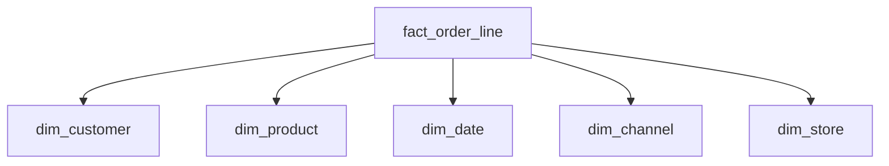
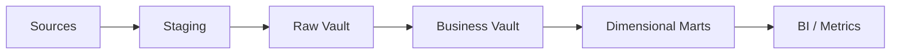
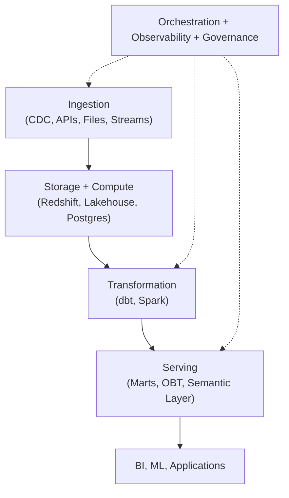
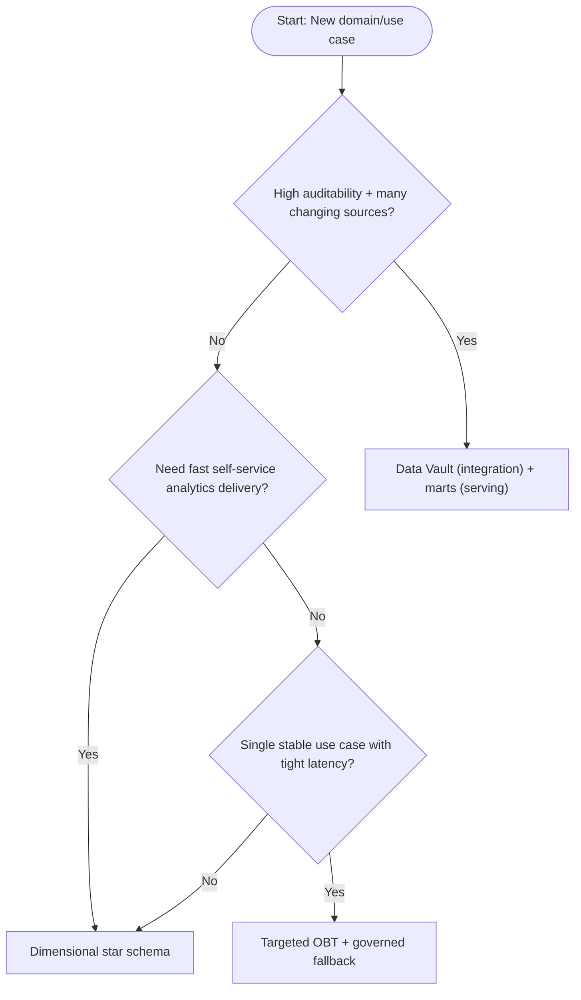

# Data Modelling: The Final Guide

> A long-form, narrative, source-backed learning guide that combines the strongest parts of `DataModelling-Sonnet.md` and `DataModelling-Codex.md` into one coherent path.
>
> Last curated: February 22, 2026.

---

## How to Read This Guide

Read this like a technical novel, not a glossary.

1. Part I gives you the worldview.
2. Part II and III build modeling depth.
3. Part IV and V translate the model into physical reality.
4. Part VI and VII harden it for production and decision-making.

A continuous case study (Northstar Commerce) runs through every part so concepts stay connected.

## Source Ledger

Primary and methodology sources used across the guide:

1. Kimball Bus Architecture: <https://www.kimballgroup.com/data-warehouse-business-intelligence-resources/kimball-techniques/kimball-data-warehouse-bus-architecture/>
2. Kimball SCD Part 2: <https://www.kimballgroup.com/2008/09/slowly-changing-dimensions-part-2/>
3. AWS Redshift table design best practices: <https://docs.aws.amazon.com/prescriptive-guidance/latest/query-best-practices-redshift/best-practices-tables.html>
4. Redshift distribution key guidance: <https://docs.aws.amazon.com/redshift/latest/dg/c_best-practices-best-dist-key.html>
5. Redshift sort key guidance: <https://docs.aws.amazon.com/redshift/latest/dg/c_best-practices-sort-key.html>
6. Redshift constraints guidance: <https://docs.aws.amazon.com/redshift/latest/dg/c_best-practices-defining-constraints.html>
7. Databricks schema enforcement: <https://docs.databricks.com/en/tables/schema-enforcement.html>
8. Databricks schema evolution: <https://docs.databricks.com/aws/en/data-engineering/schema-evolution>
9. Databricks Delta merge docs: <https://docs.databricks.com/aws/en/delta/merge>
10. Delta Lake update/merge docs: <https://docs.delta.io/latest/delta-update.html>
11. Databricks medallion architecture: <https://docs.databricks.com/gcp/en/lakehouse/medallion.html>
12. Apache Iceberg partitioning/hidden partitioning: <https://iceberg.apache.org/docs/1.4.2/partitioning/>
13. Apache Iceberg evolution: <https://iceberg.apache.org/docs/nightly/evolution/>
14. Spark SQL performance tuning (AQE): <https://spark.apache.org/docs/latest/sql-performance-tuning.html>
15. PostgreSQL partitioning: <https://www.postgresql.org/docs/current/ddl-partitioning.html>
16. PostgreSQL JSON/JSONB: <https://www.postgresql.org/docs/current/datatype-json.html>
17. PostgreSQL BRIN: <https://www.postgresql.org/docs/current/brin.html>
18. Confluent schema evolution compatibility: <https://docs.confluent.io/platform/current/schema-registry/fundamentals/schema-evolution.html>
19. DataVault4dbt documentation: <https://www.datavault4dbt.com/documentation/>

---

## Table of Contents

### Part I — Foundations
1. [What Is Data Modelling?](#chapter-1--what-is-data-modelling)
2. [OLTP vs OLAP](#chapter-2--oltp-vs-olap)
3. [Building Blocks and Grain-First Thinking](#chapter-3--building-blocks-and-grain-first-thinking)
4. [Kimball vs Inmon vs Where Data Vault Fits](#chapter-4--kimball-vs-inmon-vs-where-data-vault-fits)

### Part II — Dimensional Modelling
5. [Star Schema Deep Dive](#chapter-5--star-schema-deep-dive)
6. [Snowflake Schema Tradeoffs](#chapter-6--snowflake-schema-tradeoffs)
7. [Fact Table Types](#chapter-7--fact-table-types)
8. [SCDs in Real Systems](#chapter-8--scds-in-real-systems)
9. [Special Dimension Patterns](#chapter-9--special-dimension-patterns)

### Part III — Integration and Historical Modeling
10. [Keys and Identity Strategy](#chapter-10--keys-and-identity-strategy)
11. [Data Vault Core](#chapter-11--data-vault-core)
12. [Advanced Data Vault](#chapter-12--advanced-data-vault)
13. [Data Vault in Practice and Handoff to Marts](#chapter-13--data-vault-in-practice-and-handoff-to-marts)

### Part IV — Physical Modeling by Engine
14. [Columnar vs Row-Based Implications](#chapter-14--columnar-vs-row-based-implications)
15. [Redshift Physical Modeling](#chapter-15--redshift-physical-modeling)
16. [PostgreSQL for Mixed Analytics](#chapter-16--postgresql-for-mixed-analytics)
17. [Spark Runtime-Aware Modeling](#chapter-17--spark-runtime-aware-modeling)
18. [Delta Lake Modeling](#chapter-18--delta-lake-modeling)
19. [Iceberg Modeling](#chapter-19--iceberg-modeling)

### Part V — Lakehouse and Serving Strategy
20. [Medallion Architecture and Schema-on-Read Boundaries](#chapter-20--medallion-architecture-and-schema-on-read-boundaries)
21. [OBT vs Star vs Semantic Layer](#chapter-21--obt-vs-star-vs-semantic-layer)
22. [Semi-Structured Modeling Strategy](#chapter-22--semi-structured-modeling-strategy)

### Part VI — Governance and Operations
23. [Schema Evolution Governance and Compatibility Contracts](#chapter-23--schema-evolution-governance-and-compatibility-contracts)
24. [dbt as Transformation Discipline](#chapter-24--dbt-as-transformation-discipline)
25. [Modeling for Performance](#chapter-25--modeling-for-performance)
26. [Anti-Patterns and Operational Playbooks](#chapter-26--anti-patterns-and-operational-playbooks)

### Part VII — Synthesis
27. [The Modern Data Stack and Where Modeling Decisions Live](#chapter-27--the-modern-data-stack-and-where-modeling-decisions-live)
28. [Choosing the Right Model](#chapter-28--choosing-the-right-model)
29. [Northstar Recap: End-to-End Modeling Story](#chapter-29--northstar-recap-end-to-end-modeling-story)

### Appendices
- [Appendix A: Practical Implementation Checklist](#appendix-a-practical-implementation-checklist)
- [Appendix B: Glossary](#appendix-b-glossary)
- [Appendix C: 30-Day Mastery Path](#appendix-c-30-day-mastery-path)
- [Appendix D: Worked Modeling Patterns (Detailed)](#appendix-d-worked-modeling-patterns-detailed)
- [Appendix E: Migration and Operating Runbooks](#appendix-e-migration-and-operating-runbooks)
- [Appendix F: Extended Decision Matrices](#appendix-f-extended-decision-matrices)
- [Appendix G: Deep Study Questions and Self-Checks](#appendix-g-deep-study-questions-and-self-checks)

---

# Part I — Foundations

Part I establishes the mental model you will use for the rest of the guide.  
If these foundations are clear, every later design tradeoff will feel like a logical consequence rather than a memorized rule.

## Chapter 1 — What Is Data Modelling?

Data modelling is where business meaning becomes system behavior.

Most teams define it as “table design.” That definition is too small. A stronger definition is:

Data modelling is the act of deciding how reality becomes data, how data becomes answers, and how answers remain trustworthy as systems and organizations change.

Three levels still matter:

1. Conceptual model: business entities and relationships, technology-agnostic.
2. Logical model: attributes, keys, and rules, still mostly engine-agnostic.
3. Physical model: storage layout, indexing/distribution/partitioning, engine-specific.

A mature platform does not choose one of these. It keeps all three explicit.

### The Mental Shift

Early-career modeling usually mirrors source systems.

Senior modeling starts from questions:

1. Which questions are high-value and recurring?
2. Which questions require historical truth?
3. Which questions require low latency?
4. Which questions are too expensive to answer from raw structures?

This guide follows that shift.

### Northstar Case Continuation

We begin with Northstar Commerce, a retailer with:

1. E-commerce orders and returns.
2. Store transactions.
3. Campaign attribution events.
4. Partner marketplace feeds.

The model must answer financial, operational, and marketing questions consistently.

### References used in this chapter

1. <https://www.kimballgroup.com/data-warehouse-business-intelligence-resources/kimball-techniques/kimball-data-warehouse-bus-architecture/>
2. <https://docs.databricks.com/gcp/en/lakehouse/medallion.html>

---

## Chapter 2 — OLTP vs OLAP

OLTP and OLAP are not competitors. They are different design centers.

### OLTP Reality

OLTP systems optimize:

1. Single-row lookups and updates.
2. High concurrency.
3. Strict transactional correctness.
4. Highly normalized schema design.

Example shape:

- `orders`
- `order_items`
- `products`
- `categories`
- `customers`
- `addresses`

This is excellent for write integrity. It is usually poor for wide historical analytics.

### OLAP Reality

OLAP systems optimize:

1. Large scans and aggregates.
2. Join patterns over dimensions.
3. Time-variant analysis.
4. Read performance and consistency of business metrics.

Example shape:

- `fact_order_line`
- `dim_product`
- `dim_customer`
- `dim_date`
- `dim_channel`

This is excellent for analytics and BI, and usually unsuitable for high-frequency transactional updates.

### Core Design Consequence

You should not expose primary OLTP schemas directly as enterprise analytics contracts.

You should preserve OLTP truth in raw integration layers, but serve analytics through models optimized for analytical access patterns.

### Northstar Case Continuation

Northstar keeps OLTP systems untouched and builds:

1. Raw ingestion (bronze).
2. Conformed business entities (silver).
3. Analytical serving contracts (gold).

### References used in this chapter

1. <https://docs.databricks.com/gcp/en/lakehouse/medallion.html>
2. <https://docs.aws.amazon.com/prescriptive-guidance/latest/query-best-practices-redshift/best-practices-tables.html>

---

## Chapter 3 — Building Blocks and Grain-First Thinking

Before star schemas and Data Vault, lock these primitives.

### Grain

Grain is the exact meaning of one fact row.

Examples:

1. One row per order line at checkout submission.
2. One row per payment event.
3. One row per customer per day snapshot.

Most metric disagreements are grain disagreements hidden inside SQL.

### Facts and Dimensions

Fact tables capture events or states with measurable quantities.

Dimension tables capture descriptive context used for slicing and grouping.

Useful rule:

If a field changes analytical grouping semantics over time, treat it as dimension behavior with explicit history policy.

### Cardinality and Relationship Shape

Never treat relationship cardinality as “obvious.”

1. One-to-many, many-to-many, optional relationships must be made explicit.
2. Many-to-many relationships often require bridge patterns to avoid row explosion.

### Measure Taxonomy

1. Additive: sum across all dimensions and time.
2. Semi-additive: additive across dimensions, not across time (balance).
3. Non-additive: ratios/percentages, derived from additive components.

### Northstar Case Continuation

Northstar metric contract begins with grain statements:

1. `fact_order_line_event`: one row per order-line status change.
2. `fact_payment_event`: one row per payment lifecycle event.
3. `fact_customer_daily_snapshot`: one row per customer per calendar date.

### References used in this chapter

1. <https://www.kimballgroup.com/data-warehouse-business-intelligence-resources/kimball-techniques/kimball-data-warehouse-bus-architecture/>
2. <https://www.kimballgroup.com/2008/09/slowly-changing-dimensions-part-2/>

---

## Chapter 4 — Kimball vs Inmon vs Where Data Vault Fits

This debate is often framed as a fight. It is better understood as architectural emphasis.

### Inmon (Top-Down)

Inmon emphasizes an integrated enterprise data warehouse first, then marts.

Strengths:

1. Enterprise integration discipline.
2. Strong central governance.

Risks:

1. Slower first business value.
2. Heavy upfront design burden.

### Kimball (Bottom-Up Dimensional)

Kimball emphasizes business-process dimensional models with conformed dimensions and incremental delivery.

Strengths:

1. Fast business value.
2. Strong query usability.
3. Clear semantic interfaces for analytics.

Risks:

1. Without governance, marts can drift.
2. Teams may overfit local optimizations.

### Data Vault Position

Data Vault 2.0 is best seen as an integration and history architecture, not a direct replacement for dimensional serving.

Typical modern blend:

1. Data Vault (or equivalent) for integration and audit-friendly history.
2. Dimensional marts for consumption and self-service analytics.

### Northstar Case Continuation

Northstar adopts:

1. Kimball-style marts for immediate BI value.
2. Vault-style integration layer as source and compliance complexity grows.

### References used in this chapter

1. <https://www.kimballgroup.com/data-warehouse-business-intelligence-resources/kimball-techniques/kimball-data-warehouse-bus-architecture/>
2. <https://www.datavault4dbt.com/documentation/>

---

# Part II — Dimensional Modelling

Part II turns foundational concepts into analytical model shapes that teams actually ship and maintain.  
The focus here is semantic clarity, historical correctness, and query usability.

## Chapter 5 — Star Schema Deep Dive

Now that the conceptual frame is in place, we move into the canonical serving pattern for analytics.  
A star schema keeps one fact table in the center and dimensions around it.

### Why It Works

It aligns with analytical behavior:

1. Filter by dimensions.
2. Aggregate facts.
3. Compare across time/channel/customer/product.

Minimal join paths and explicit semantics make star schemas durable for analytics teams.

### Anatomy



### Example Query

```sql
SELECT
  d.year,
  c.channel_name,
  SUM(f.net_revenue) AS net_revenue,
  SUM(f.units) AS units
FROM fact_order_line f
JOIN dim_date d       ON f.date_sk = d.date_sk
JOIN dim_channel c    ON f.channel_sk = c.channel_sk
WHERE d.calendar_date >= DATE '2026-01-01'
  AND d.calendar_date <  DATE '2026-02-01'
GROUP BY d.year, c.channel_name
ORDER BY d.year, c.channel_name;
```

### Design Decisions That Matter

1. Fact grain declaration in table docs.
2. Conformed dimensions reused across marts.
3. Surrogate keys for stable joins and historical correctness.
4. Controlled SCD policy per dimension attribute group.

### Northstar Case Continuation

Northstar launches first production mart with:

1. `fact_order_line`.
2. `dim_customer`.
3. `dim_product`.
4. `dim_date`.
5. `dim_channel`.

This delivers initial revenue and return dashboards quickly.

### References used in this chapter

1. <https://www.kimballgroup.com/data-warehouse-business-intelligence-resources/kimball-techniques/kimball-data-warehouse-bus-architecture/>
2. <https://docs.aws.amazon.com/prescriptive-guidance/latest/query-best-practices-redshift/best-practices-tables.html>

---

## Chapter 6 — Snowflake Schema Tradeoffs

Snowflake schemas normalize parts of dimensions into additional tables.

Example:

1. `dim_product` splits category/subcategory into separate linked tables.

### Why Teams Use It

1. Reduce redundancy in very large dimensions.
2. Preserve strict hierarchy governance.
3. Share subdimensions across domains.

### Cost of the Choice

1. More joins per query.
2. Higher semantic friction for self-service users.
3. Increased sensitivity to optimizer behavior.

### Practical Rule

Start with star for serving layers unless a clear, measured reason requires snowflaking.

### Northstar Case Continuation

Northstar snowflakes only one area: regulatory product classification hierarchy reused by finance and compliance.

All other analytical surfaces remain star-shaped.

### References used in this chapter

1. <https://www.kimballgroup.com/data-warehouse-business-intelligence-resources/kimball-techniques/kimball-data-warehouse-bus-architecture/>
2. <https://docs.aws.amazon.com/redshift/latest/dg/c_designing-tables-best-practices.html>

---

## Chapter 7 — Fact Table Types

Three fact table forms are foundational.

### 1. Transaction Fact

One row per atomic business event.

Example: one row per order line event.

### 2. Periodic Snapshot Fact

One row per entity per period.

Example: one row per customer per day with balance and engagement indicators.

### 3. Accumulating Snapshot Fact

One row per lifecycle entity updated as milestones complete.

Example: fulfillment lifecycle row with order_placed_at, picked_at, shipped_at, delivered_at.

### Complementary Use

Serious models combine all three:

1. Transaction facts for forensic detail.
2. Periodic snapshots for trending and SLA monitoring.
3. Accumulating snapshots for process analytics.

### Northstar Case Continuation

Northstar uses all three by Q2 because each answers a different operational question set.

### References used in this chapter

1. <https://www.kimballgroup.com/data-warehouse-business-intelligence-resources/kimball-techniques/kimball-data-warehouse-bus-architecture/>
2. <https://docs.databricks.com/gcp/en/lakehouse/medallion.html>

---

## Chapter 8 — SCDs in Real Systems

Slowly changing dimensions are where conceptual correctness and pipeline mechanics collide.

### SCD Types Worth Knowing

1. Type 0: retain original.
2. Type 1: overwrite.
3. Type 2: new row per meaningful change.
4. Type 3: prior value in extra column.
5. Type 4: history table pattern.
6. Type 5/6/7: hybrids for specific reporting behavior.

### Type 2 Operational Core

Type 2 needs:

1. Surrogate key per version.
2. Begin and end effective timestamps.
3. Current flag.
4. Non-overlapping validity windows.
5. Surrogate key pipeline to map facts to correct version.

Kimball’s key warning still applies: Type 2 without a disciplined surrogate key pipeline creates historical lies.

### Common Production Failure

Facts loaded before corresponding dimension version is available.

Response options:

1. Retry queue.
2. Temporarily route to unknown key with alert.
3. Backfill once dimension state exists.

### Northstar Case Continuation

Northstar `dim_customer` policy:

1. Type 2 for region, segment, loyalty tier.
2. Type 1 for typo/display corrections.
3. Reason-code field for meaningful change categories.

### References used in this chapter

1. <https://www.kimballgroup.com/2008/09/slowly-changing-dimensions-part-2/>
2. <https://docs.databricks.com/aws/en/delta/merge>
3. <https://docs.delta.io/latest/delta-update.html>

---

## Chapter 9 — Special Dimension Patterns

Dimensional models become truly practical when you use the “small” patterns correctly.

### Junk Dimensions

Bundle low-cardinality flags into one dimension instead of polluting facts with many binary fields.

### Degenerate Dimensions

Keep transactional identifiers in fact table where useful (invoice/order number), without separate dimension.

### Role-Playing Dimensions

Reuse one dimension with different semantic aliases, such as order date vs ship date vs delivery date.

### Bridge Tables for Many-to-Many

When dimensional relationships are truly many-to-many, bridge tables preserve correctness and prevent duplicate counting.

### Outriggers

Secondary dimensions connected to a primary dimension can help specific governance needs but add complexity.

### Northstar Case Continuation

Northstar adds:

1. A promo-attribution bridge for multi-touch campaign analysis.
2. Role-playing `dim_date` aliases for order, ship, and delivery milestones.

### References used in this chapter

1. <https://www.kimballgroup.com/data-warehouse-business-intelligence-resources/kimball-techniques/kimball-data-warehouse-bus-architecture/>
2. <https://docs.databricks.com/gcp/en/lakehouse/medallion.html>

---

# Part III — Integration and Historical Modeling

Part III shifts from consumer-facing simplicity to integration resilience.  
This is where identity, lineage, and long-term historical fidelity become first-class design concerns.

## Chapter 10 — Keys and Identity Strategy

Most model failures are not caused by SQL syntax or storage engines. They are caused by identity mistakes.

### Key Types

1. Natural key: source business identifier.
2. Surrogate key: warehouse-generated, immutable analytic join key.
3. Durable key: cross-source identity anchor.
4. Hash key/hashdiff: common in vault implementations.

### Identity Decisions

1. Never discard source business keys.
2. Never use mutable natural keys as the only historical join key.
3. Keep cross-source identity resolution separate from consumer-facing dimensions.

### Why This Is Hard

Real enterprises have:

1. Reused IDs across source systems.
2. Changed key formats.
3. Late identity merges and splits.

Identity strategy must survive those realities.

### Northstar Case Continuation

Northstar customer identity columns:

1. `customer_nk` (source key).
2. `customer_dk` (durable cross-source identity).
3. `customer_sk` (dimension surrogate key per historical version).

### References used in this chapter

1. <https://www.kimballgroup.com/2008/09/slowly-changing-dimensions-part-2/>
2. <https://docs.aws.amazon.com/redshift/latest/dg/c_best-practices-defining-constraints.html>

---

## Chapter 11 — Data Vault Core

Data Vault 2.0 decomposes integration into Hubs, Links, and Satellites.

### Hubs

Hubs represent core business keys.

They store:

1. Business key.
2. Hub hash key/surrogate.
3. Load timestamp.
4. Record source metadata.

### Links

Links represent relationships between hubs.

They capture n-ary relationships and keep relationship change history as insert-oriented structures.

### Satellites

Satellites store descriptive attributes and history.

They are attached to hubs or links and usually hold the bulk of historical changes.

### Why Teams Adopt It

1. High source volatility.
2. Heavy audit requirements.
3. Multi-source integration complexity.
4. Need for insert-oriented, lineage-friendly loads.

### Northstar Case Continuation

As partner feeds grow, Northstar adds raw vault entities for product and merchant domains.

### References used in this chapter

1. <https://www.datavault4dbt.com/documentation/>
2. <https://www.datavault4dbt.com/documentation/macro-instructions/>

---

## Chapter 12 — Advanced Data Vault

Vault usability improves dramatically with advanced structures.

### PIT Tables

Point-in-time tables pre-resolve satellite alignment by snapshot points.

This avoids repeated complex temporal joins.

### Bridge Structures

Business-vault bridges pre-assemble relationship paths and speed mart loading and recurrent query patterns.

### Business Vault Layer

Business vault is where standardized business rules and derived entities live.

It is not raw ingest, and not yet end-user serving.

### Practical Note from DataVault4dbt

DataVault4dbt includes macros for:

1. PIT.
2. Snapshot control.
3. Effectivity satellites.
4. Multi-active satellites.

This tooling can reduce implementation inconsistency across teams.

### Northstar Case Continuation

Northstar introduces PIT over customer and product satellites to reduce expensive range joins in daily mart builds.

### References used in this chapter

1. <https://www.datavault4dbt.com/documentation/macro-instructions/business-vault/pit/>
2. <https://www.datavault4dbt.com/documentation/general-usage-notes/multi-source-entites/>
3. <https://www.datavault4dbt.com/documentation/macro-instructions/satellites/effectivity-satellite/>

---

## Chapter 13 — Data Vault in Practice and Handoff to Marts

The most common mistake is querying raw vault directly for business analytics.

### Recommended Flow



### Why This Handoff Matters

1. Raw vault optimizes integration and audit.
2. Marts optimize semantic accessibility and query simplicity.
3. Collapsing them into one layer usually satisfies neither audience.

### Operational Guardrail

Define explicit contracts between vault and mart layers:

1. Which entities are mart-ready.
2. Which rules are still integration-only.
3. Which latency and quality guarantees apply.

### Northstar Case Continuation

Northstar pipeline:

1. Raw vault hourly loads.
2. Business vault rule application every 30 minutes.
3. Marts refreshed in SLA windows for finance and operations.

### References used in this chapter

1. <https://www.datavault4dbt.com/documentation/>
2. <https://docs.databricks.com/gcp/en/lakehouse/medallion.html>

---
# Part IV — Physical Modeling by Engine

Part IV keeps logical semantics stable while adapting physical design to engine behavior.  
The same business model can perform brilliantly or collapse depending on physical layout choices.

## Chapter 14 — Columnar vs Row-Based Implications

Before diving into engine-specific details, we anchor one core truth: storage model is a modeling decision, not just a database setting.

### Row-Based Strengths

Row stores are ideal when workloads need:

1. Frequent single-row reads/writes.
2. Strict transactional updates.
3. Low-latency point lookups.

### Columnar Strengths

Columnar systems excel when workloads need:

1. Large scans over a subset of columns.
2. Heavy aggregation.
3. Compression gains from homogeneous column segments.

### Modeling Consequences

1. Columnar engines tolerate wider analytic tables better.
2. Row engines often need stronger indexing and pre-aggregation to serve OLAP-style queries.
3. Hybrid architectures are common: OLTP row store plus analytical columnar store.

### Northstar Case Continuation

Northstar keeps OLTP operations in row stores and analytical marts in columnar/lakehouse surfaces.

### References used in this chapter

1. <https://docs.aws.amazon.com/prescriptive-guidance/latest/query-best-practices-redshift/best-practices-tables.html>
2. <https://www.postgresql.org/docs/current/ddl-partitioning.html>

---

## Chapter 15 — Redshift Physical Modeling

Redshift performance is highly sensitive to physical table design.

### Distribution Choices

Use distribution strategy to reduce data movement on joins:

1. `DISTKEY` for large-table join collocation when one dominant key exists.
2. `DISTSTYLE ALL` for smaller dimensions joined frequently.
3. AUTO when workload is uncertain, then validate with query metrics.

### Sort Key Choices

Sort key affects pruning and scan efficiency:

1. Align sort keys with frequent range predicates.
2. Avoid speculative multi-column complexity without query evidence.
3. Re-evaluate as access patterns evolve.

### Constraints Reality

Redshift docs are explicit: PK/FK constraints are informational to the optimizer and not enforced as transactional integrity rules.

Therefore:

1. enforce uniqueness and referential checks in pipelines/tests.
2. treat constraints as optimization hints, not safety guarantees.

### Example DDL

```sql
CREATE TABLE fact_order_line (
    order_line_sk      BIGINT IDENTITY(1,1),
    order_id           VARCHAR(64),
    customer_sk        BIGINT,
    product_sk         BIGINT,
    date_sk            INTEGER,
    channel_sk         INTEGER,
    units              INTEGER,
    net_revenue        NUMERIC(18,2),
    ingested_at        TIMESTAMP
)
DISTSTYLE KEY
DISTKEY (order_id)
SORTKEY (date_sk, order_id);
```

### Northstar Case Continuation

Northstar uses AUTO initially, then locks physical keys for the top marts after measured workload evidence.

### References used in this chapter

1. <https://docs.aws.amazon.com/prescriptive-guidance/latest/query-best-practices-redshift/best-practices-tables.html>
2. <https://docs.aws.amazon.com/redshift/latest/dg/c_best-practices-best-dist-key.html>
3. <https://docs.aws.amazon.com/redshift/latest/dg/c_best-practices-sort-key.html>
4. <https://docs.aws.amazon.com/redshift/latest/dg/c_best-practices-defining-constraints.html>

---

## Chapter 16 — PostgreSQL for Mixed Analytics

Postgres can support mixed workloads if modeled intentionally.

### Partitioning

Use declarative partitioning for large time-ranged data and ensure query predicates support pruning.

### BRIN Strategy

BRIN indexes summarize page ranges and are effective for large append-like tables with value locality (for example time-based events).

### JSONB Strategy

JSONB is powerful for flexible attributes, but hot analytical keys should be promoted to typed columns for predictable performance and governance.

### Materialized Views

Materialized views can reduce repeated heavy joins/aggregates when refreshed with a controlled cadence.

### Example

```sql
CREATE TABLE order_events (
  event_id         BIGSERIAL,
  order_line_id    TEXT NOT NULL,
  event_time       TIMESTAMPTZ NOT NULL,
  payload          JSONB,
  PRIMARY KEY (event_id, event_time)
) PARTITION BY RANGE (event_time);

CREATE INDEX idx_order_events_event_time_brin
  ON order_events USING BRIN(event_time);
```

### Northstar Case Continuation

Northstar keeps partner payload raw in JSONB for ingestion flexibility, then promotes recurring attributes into conformed silver columns.

### References used in this chapter

1. <https://www.postgresql.org/docs/current/ddl-partitioning.html>
2. <https://www.postgresql.org/docs/current/brin.html>
3. <https://www.postgresql.org/docs/current/datatype-json.html>

---

## Chapter 17 — Spark Runtime-Aware Modeling

Spark modeling is inseparable from shuffle behavior.

### Runtime Principles

1. Every shuffle boundary is a potential cost cliff.
2. Skew dominates long-tail stage completion.
3. AQE can repair some plans, but does not eliminate poor model/layout choices.

### AQE Capabilities

Spark SQL docs describe AQE features such as:

1. post-shuffle partition coalescing.
2. skewed partition handling.
3. join strategy adaptation at runtime based on collected stats.

### Design Actions

1. Keep broadcastable dimensions small and stable.
2. Pre-aggregate where business semantics allow.
3. Control small-file proliferation.
4. Monitor stage-level shuffle and skew metrics.

### Example (Join Strategy)

```python
from pyspark.sql import functions as F

fact = spark.table("gold.fact_order_line")
dim  = spark.table("gold.dim_channel")

# Hint used only when dimension size is consistently tiny
result = (fact
    .join(dim.hint("broadcast"), "channel_sk")
    .groupBy("calendar_date", "channel_name")
    .agg(F.sum("net_revenue").alias("net_revenue")))
```

### Northstar Case Continuation

Northstar uses AQE defaults first, then adds targeted hints only after Spark UI evidence.

### References used in this chapter

1. <https://spark.apache.org/docs/latest/sql-performance-tuning.html>
2. <https://docs.databricks.com/gcp/en/lakehouse/medallion.html>

---

## Chapter 18 — Delta Lake Modeling

Delta adds transaction semantics and schema controls on object storage.

### Schema Enforcement and Evolution

Delta rejects incompatible writes by default in governed layers unless evolution pathways are explicitly enabled.

Use principle:

1. bronze flexible.
2. silver controlled.
3. gold strict.

### MERGE and Upsert Reality

Both Delta docs and Databricks docs call out a key caveat:

If multiple source rows match one target row, merge semantics can be ambiguous and may fail depending on conditions/logic.

So merge requires:

1. deterministic source deduplication.
2. explicit match conditions.
3. data-quality assertions before merge.

### Example Pattern

```sql
MERGE INTO gold.dim_customer t
USING silver.customer_changes s
ON t.customer_nk = s.customer_nk
WHEN MATCHED AND t.hashdiff <> s.hashdiff THEN
  UPDATE SET current_flag = false, valid_to = s.change_ts
WHEN NOT MATCHED THEN
  INSERT (customer_sk, customer_nk, customer_name, valid_from, valid_to, current_flag)
  VALUES (s.customer_sk, s.customer_nk, s.customer_name, s.change_ts, TIMESTAMP '9999-12-31', true);
```

### Northstar Case Continuation

Northstar blocks gold merges unless source uniqueness checks pass in CI.

### References used in this chapter

1. <https://docs.databricks.com/en/tables/schema-enforcement.html>
2. <https://docs.databricks.com/aws/en/data-engineering/schema-evolution>
3. <https://docs.databricks.com/aws/en/delta/merge>
4. <https://docs.delta.io/latest/delta-update.html>

---

## Chapter 19 — Iceberg Modeling

Iceberg separates logical schema from physical partition behavior using table metadata.

### Hidden Partitioning

Iceberg partition transforms are managed in metadata; users query source columns while the engine handles partition projection and pruning behavior.

This improves contract stability because consumers do not need to encode physical partition logic directly into query shape.

### Evolution

Iceberg supports metadata-driven:

1. schema evolution.
2. partition evolution.
3. snapshot-based table history.

This enables physical optimization changes without rewriting every query contract.

### Northstar Case Continuation

Northstar keeps business contracts stable while changing partition transforms over time for improved pruning on evolving workloads.

### References used in this chapter

1. <https://iceberg.apache.org/docs/1.4.2/partitioning/>
2. <https://iceberg.apache.org/docs/nightly/evolution/>

---

# Part V — Lakehouse and Serving Strategy

Part V reconnects architecture and consumption.  
This is where we decide how flexible raw data becomes governed business interfaces without losing speed.

## Chapter 20 — Medallion Architecture and Schema-on-Read Boundaries

Medallion is useful because it clarifies where flexibility ends and governed semantics begin.

### Typical Layer Contract

1. Bronze: raw landing, lineage, replayability.
2. Silver: cleaned, conformed, typed entities.
3. Gold: business-facing marts and metric-ready surfaces.

### Practical Boundary Rule

Schema-on-read flexibility belongs mostly in Bronze and early Silver.

Gold should behave like a schema-on-write contract surface.

### Diagram


### Northstar Case Continuation

Northstar allows partner payload drift in bronze but blocks unmanaged schema changes in gold.

### References used in this chapter

1. <https://docs.databricks.com/gcp/en/lakehouse/medallion.html>
2. <https://docs.databricks.com/en/tables/schema-enforcement.html>

---

## Chapter 21 — OBT vs Star vs Semantic Layer

There is no universal serving shape.

### One Big Table (OBT)

Strength:

1. very simple downstream querying.

Risks:

1. high redundancy.
2. fragile evolution.
3. duplicated semantics across teams.

### Star Schema

Strength:

1. balance between usability and governed dimensional logic.

Risks:

1. some join complexity remains.

### Semantic Layer

Strength:

1. central metric definitions and reusable business logic.

Risks:

1. adds governance and tooling complexity.

### Decision Heuristic

1. High governance, multi-domain reuse: star + semantic layer.
2. Fast tactical dashboard with stable scope: targeted OBT acceptable.
3. Large enterprise: avoid OBT as sole canonical model.

### Northstar Case Continuation

Northstar uses star as canonical gold, semantic layer for core KPIs, and one tactical OBT for executive dashboard latency requirements.

### References used in this chapter

1. <https://www.kimballgroup.com/data-warehouse-business-intelligence-resources/kimball-techniques/kimball-data-warehouse-bus-architecture/>
2. <https://docs.databricks.com/gcp/en/lakehouse/medallion.html>

---

## Chapter 22 — Semi-Structured Modeling Strategy

Semi-structured modeling is the art of deciding what to flatten, when, and for whom.

### Practical Classification

1. Hot attributes: frequently queried and filtered, promote to typed columns.
2. Warm attributes: queried occasionally, promote selectively.
3. Cold attributes: rarely used, keep nested/raw.

### Engine Nuances

1. Postgres JSONB: strong flexibility and indexing options, but not a substitute for governed relational modeling.
2. Redshift SUPER/PartiQL ecosystems can model semi-structured content, but critical fields should still be promoted for stable analytics paths.
3. Spark/Delta/Iceberg nested structs are efficient, but cross-engine serving may require flatter contracts.

### Example

```sql
-- JSONB extraction pattern in Postgres
SELECT
  order_id,
  payload->>'campaign_id' AS campaign_id,
  payload->>'device_class' AS device_class
FROM raw_order_events
WHERE payload ? 'campaign_id';
```

### Northstar Case Continuation

Northstar reviews top queried nested keys monthly and promotes recurring keys into silver/gold contracts.

### References used in this chapter

1. <https://www.postgresql.org/docs/current/datatype-json.html>
2. <https://docs.databricks.com/gcp/en/lakehouse/medallion.html>
3. <https://docs.aws.amazon.com/prescriptive-guidance/latest/query-best-practices-redshift/best-practices-tables.html>

---
# Part VI — Governance and Operations

Part VI is about keeping models trustworthy under continuous change.  
Good modeling is not complete at deploy time; it remains healthy only with explicit governance and operational discipline.

## Chapter 23 — Schema Evolution Governance and Compatibility Contracts

Most production data incidents are contract incidents, not transformation syntax errors.

### Expand-Migrate-Contract

Use a deliberate sequence:

1. Expand: add fields/interfaces in backward-compatible way.
2. Migrate: move producers and consumers gradually.
3. Contract: remove deprecated paths only after verified migration.

### Compatibility Modes

Confluent Schema Registry describes backward, forward, full, and transitive modes. Pick mode by domain criticality, not convenience.

### Governance Requirements

1. CI checks for breaking schema changes.
2. Change tickets with migration and rollback plans.
3. Deprecation windows with explicit deadlines.
4. Owner accountability for downstream communication.

### Northstar Case Continuation

Northstar sets:

1. backward compatibility default for gold interfaces.
2. full compatibility for high-stability finance contracts.
3. versioned breaking changes only with migration windows.

### References used in this chapter

1. <https://docs.confluent.io/platform/current/schema-registry/fundamentals/schema-evolution.html>
2. <https://docs.databricks.com/aws/en/data-engineering/schema-evolution>
3. <https://iceberg.apache.org/docs/nightly/evolution/>

---

## Chapter 24 — dbt as Transformation Discipline

dbt does not replace modeling. It operationalizes it.

### Why dbt Belongs in a Modeling Guide

Model quality is only real when transformation code, tests, docs, and lineage stay synchronized.

That is exactly what dbt enforces in SQL-first teams.

### Core Concepts

1. Models: SQL transforms.
2. `ref()` links: DAG dependencies.
3. Materializations: table, view, incremental, ephemeral.
4. Tests: not-null, unique, relationships, custom assertions.
5. Docs: versioned model semantics.

### Example Model

```sql
-- models/gold/dim_customer.sql
SELECT
    customer_sk,
    customer_nk,
    customer_name,
    loyalty_tier,
    valid_from,
    valid_to,
    current_flag
FROM {{ ref('silver_customer_conformed') }};
```

### Example Schema Tests

```yaml
version: 2
models:
  - name: dim_customer
    columns:
      - name: customer_sk
        tests: [not_null, unique]
      - name: customer_nk
        tests: [not_null]
```

### Operational Model Benefit

dbt makes data model governance executable:

1. Pull requests for semantic changes.
2. Automated tests in CI.
3. Documentation tied to code.

### Northstar Case Continuation

Northstar uses dbt to encode:

1. surrogate key pipeline assumptions.
2. SCD validity constraints.
3. orphan-fact relationship tests.

### References used in this chapter

1. <https://docs.getdbt.com/docs/build/models>
2. <https://docs.getdbt.com/docs/build/materializations>
3. <https://docs.getdbt.com/docs/build/data-tests>

---

## Chapter 25 — Modeling for Performance

Performance is an outcome of model shape, physical layout, and query behavior.

### High-Leverage Levers

1. Pruning: partition/sort keys aligned to real predicates.
2. Join locality: collocation/broadcast/bucketing by stable high-impact keys.
3. Pre-aggregation: summary marts for repeated dashboard paths.
4. File hygiene: avoid small-file explosions in lakehouse tables.

### Anti-Patterns to Remove Early

1. `SELECT *` on wide analytical tables.
2. Functions wrapping predicate columns, blocking pruning.
3. Many-to-many joins without bridge logic.
4. Ignoring stats maintenance and blaming engine choice.

### Iterative Tuning Loop

1. Identify slow workload.
2. Inspect plan and stage/runtime metrics.
3. Fix model/layout root cause.
4. Re-measure and document.

### Northstar Case Continuation

Northstar performance contracts:

1. P95 dashboard query SLA.
2. Daily refresh completion SLA.
3. reconciliation pipeline completion SLA.

Model changes are tied directly to these SLOs.

### References used in this chapter

1. <https://docs.aws.amazon.com/prescriptive-guidance/latest/query-best-practices-redshift/best-practices-tables.html>
2. <https://spark.apache.org/docs/latest/sql-performance-tuning.html>
3. <https://iceberg.apache.org/docs/1.4.2/partitioning/>

---

## Chapter 26 — Anti-Patterns and Operational Playbooks

Senior teams encode failure patterns before incidents happen.

### High-Frequency Anti-Patterns

1. Missing grain declarations.
2. Mixed-grain facts hidden under one table.
3. Type 2 dimensions with overlapping validity windows.
4. Unbounded schema evolution in curated layers.
5. Business-critical KPIs defined in multiple places.

### Playbook Template

For each anti-pattern define:

1. Signal.
2. Diagnostic query.
3. Containment step.
4. Corrective model change.
5. Owner and SLA.

### Example Playbook: SCD Overlap

Signal:

1. two current rows for same natural key.

Diagnostic query:

```sql
SELECT customer_nk, COUNT(*)
FROM dim_customer
WHERE current_flag = true
GROUP BY customer_nk
HAVING COUNT(*) > 1;
```

Containment:

1. pause downstream merge.
2. isolate conflicting key set.

Correction:

1. repair validity windows.
2. add pre-merge uniqueness assertion.

### Northstar Case Continuation

Northstar reviews model health weekly:

1. orphan-fact rate.
2. unknown key share.
3. schema drift counts.
4. late-arriving dimension failure rates.

### References used in this chapter

1. <https://spark.apache.org/docs/latest/sql-performance-tuning.html>
2. <https://docs.aws.amazon.com/prescriptive-guidance/latest/query-best-practices-redshift/best-practices-tables.html>
3. <https://docs.confluent.io/platform/current/schema-registry/fundamentals/schema-evolution.html>

---

# Part VII — Synthesis

Part VII consolidates the whole guide into practical decision frameworks.  
At this point the question is no longer “what is data modeling,” but “which model should we choose next, and why.”

## Chapter 27 — The Modern Data Stack and Where Modeling Decisions Live

A modern stack is a system of layers where modeling decisions surface in different forms.



### Where Modeling Lives

1. In ingestion: model for faithful capture.
2. In transform: model for conformance and semantics.
3. In serving: model for usability and performance.
4. In governance: model for contract stability.

### 2026 Shift to Note

1. Lakehouse and warehouse boundaries continue to blur.
2. Streaming pressure increases demand for incremental model discipline.
3. AI-assisted tooling amplifies both good and bad model quality.

### Northstar Case Continuation

Northstar aligns ownership by layer so model semantics do not drift across teams.

### References used in this chapter

1. <https://docs.databricks.com/gcp/en/lakehouse/medallion.html>
2. <https://spark.apache.org/docs/latest/sql-performance-tuning.html>

---

## Chapter 28 — Choosing the Right Model

Use decision logic, not ideology.

### Decision Flow



### Comparison Table

| Criterion | Star | Snowflake | Data Vault | OBT | Star + Semantic Layer |
|---|---|---|---|---|---|
| Query simplicity | High | Medium | Low (raw) | Very high | Very high |
| Governance flexibility | Medium | Medium | High | Low | High |
| Auditability | Medium | Medium | Very high | Low | High |
| Change tolerance | Medium | Medium | High | Low | High |
| Time to first value | Fast | Fast | Slower | Fastest | Medium |
| Best use | General BI | Hierarchy-heavy dims | Enterprise integration | Narrow dashboard use | Large governed analytics programs |

### Decision Rubric

1. Choose simplest model that can satisfy current correctness + change requirements.
2. Add complexity only with measurable trigger conditions.
3. Keep serving contracts stable even when integration layers evolve.

### Northstar Case Continuation

Northstar sequence:

1. Star-first for speed.
2. Vault layer when source volatility/compliance escalates.
3. Semantic layer for cross-domain KPI governance.

### References used in this chapter

1. <https://www.kimballgroup.com/data-warehouse-business-intelligence-resources/kimball-techniques/kimball-data-warehouse-bus-architecture/>
2. <https://www.datavault4dbt.com/documentation/>
3. <https://docs.databricks.com/gcp/en/lakehouse/medallion.html>

---

## Chapter 29 — Northstar Recap: End-to-End Modeling Story

This chapter closes the loop.

### Phase 1: Foundational Delivery

Northstar starts with a star schema to deliver high-value dashboards quickly.

Outcomes:

1. fast adoption.
2. common KPI language.
3. visible value that funds deeper architecture.

### Phase 2: Historical Correctness and Identity Hardening

SCD Type 2 and durable identity strategy are introduced.

Outcomes:

1. “as-was” historical reporting becomes reliable.
2. cross-source customer analysis stabilizes.

### Phase 3: Integration Scale and Audit Readiness

Vault structures are added to absorb volatile partner and ERP sources.

Outcomes:

1. source lineage and replayability improve.
2. historical fidelity is preserved under change.
3. marts remain consumer-friendly because serving layer is still dimensional.

### Phase 4: Governance Maturity

Schema contracts, dbt tests, and playbooks are formalized.

Outcomes:

1. fewer silent semantic regressions.
2. faster incident diagnosis.
3. safer change velocity.

### The Meta-Lesson

Great data modeling is not static design perfection.

It is sustained alignment across:

1. business semantics.
2. pipeline behavior.
3. physical performance.
4. governance contracts.

Northstar succeeds not by choosing one “best” pattern forever, but by sequencing patterns in response to real constraints while keeping consumer semantics coherent.

### References used in this chapter

1. <https://www.kimballgroup.com/2008/09/slowly-changing-dimensions-part-2/>
2. <https://docs.confluent.io/platform/current/schema-registry/fundamentals/schema-evolution.html>
3. <https://docs.databricks.com/gcp/en/lakehouse/medallion.html>
4. <https://www.datavault4dbt.com/documentation/>

---

## Appendix A: Practical Implementation Checklist

1. Declare grain for every fact table before coding ETL.
2. Classify every dimensional attribute by SCD policy.
3. Define key strategy: natural, durable, surrogate.
4. Decide integration model and serving model boundaries.
5. Add contract tests for uniqueness, relationships, and nullability.
6. Define schema evolution policy and compatibility mode.
7. Tie physical design choices to real query patterns.
8. Add incident playbooks for top model failure patterns.
9. Track model quality metrics as first-class operational KPIs.

## Appendix B: Glossary

1. Grain: exact semantic meaning of one row.
2. Conformed dimension: shared dimension reused across subject areas.
3. SCD Type 2: historical versioning with new row per significant change.
4. PIT table: point-in-time helper for vault temporal joins.
5. Compatibility mode: allowed schema change behavior for producer/consumer safety.

## Appendix C: 30-Day Mastery Path

1. Days 1-4: Chapters 1-4.
2. Days 5-10: Chapters 5-9 with one modeled domain exercise.
3. Days 11-16: Chapters 10-13 and identity + history drills.
4. Days 17-22: Chapters 14-22 and engine-specific experiments.
5. Days 23-27: Chapters 23-26 and governance/playbook design.
6. Days 28-30: Chapters 27-29 and model-selection recap.

## Final Note

If you remember one thing from this guide, remember this:

A data model is not a diagram artifact. It is a long-lived contract between truth, performance, and change.

## Appendix D: Worked Modeling Patterns (Detailed)

This appendix is intentionally implementation-heavy. It is where narrative decisions become executable patterns.

### D1. Grain Declaration Templates

Use these templates in model docs and code reviews.

Template for transaction fact:

```text
Table: fact_order_line_event
Grain: One row per (order_line_id, event_type, event_time, source_event_seq)
Event time column: event_time
Processing time column: ingested_at
Dedup key: (source_system, source_event_id)
Late-arrival handling: accepted up to 14 days with restatement flag
```

Template for periodic snapshot:

```text
Table: fact_customer_daily_snapshot
Grain: One row per (customer_dk, snapshot_date)
Snapshot cadence: daily at 02:00 UTC
Backfill policy: allowed for 35 days
```

Template for accumulating snapshot:

```text
Table: fact_fulfillment_lifecycle
Grain: One row per order_line_id lifecycle
Milestone columns: placed_at, picked_at, packed_at, shipped_at, delivered_at
Update policy: idempotent milestone fill, never clear non-null milestone
```

### D2. SCD Type 2 End-to-End Pattern

#### Step 1: Normalize incoming change stream

```sql
WITH ranked AS (
    SELECT
        customer_nk,
        customer_name,
        loyalty_tier,
        region,
        change_ts,
        ROW_NUMBER() OVER (
            PARTITION BY customer_nk, change_ts
            ORDER BY source_priority DESC, ingested_at DESC
        ) AS rn
    FROM silver.customer_changes_raw
)
SELECT *
FROM ranked
WHERE rn = 1;
```

#### Step 2: Compute hashdiff for tracked attributes

```sql
SELECT
    customer_nk,
    MD5(CONCAT_WS('||', COALESCE(customer_name,''), COALESCE(loyalty_tier,''), COALESCE(region,''))) AS hashdiff,
    customer_name,
    loyalty_tier,
    region,
    change_ts
FROM silver.customer_changes_dedup;
```

#### Step 3: Close current row and insert new version

```sql
MERGE INTO gold.dim_customer t
USING silver.customer_changes_hashed s
ON t.customer_nk = s.customer_nk
WHEN MATCHED
  AND t.current_flag = true
  AND t.hashdiff <> s.hashdiff
THEN UPDATE SET
  current_flag = false,
  valid_to = s.change_ts
WHEN NOT MATCHED THEN
  INSERT (
    customer_sk,
    customer_nk,
    customer_name,
    loyalty_tier,
    region,
    hashdiff,
    valid_from,
    valid_to,
    current_flag
  ) VALUES (
    s.customer_sk,
    s.customer_nk,
    s.customer_name,
    s.loyalty_tier,
    s.region,
    s.hashdiff,
    s.change_ts,
    TIMESTAMP '9999-12-31',
    true
  );
```

#### Step 4: Window overlap assertion

```sql
SELECT customer_nk
FROM (
    SELECT
      customer_nk,
      valid_from,
      valid_to,
      LAG(valid_to) OVER (PARTITION BY customer_nk ORDER BY valid_from) AS prev_valid_to
    FROM gold.dim_customer
) x
WHERE prev_valid_to > valid_from;
```

### D3. Surrogate Key Pipeline Pattern

Fact loading should map business key + event_time to correct dimension version.

```sql
SELECT
  f_raw.order_line_id,
  d.customer_sk,
  f_raw.event_time,
  f_raw.net_revenue
FROM silver.order_line_events f_raw
JOIN gold.dim_customer d
  ON f_raw.customer_nk = d.customer_nk
 AND f_raw.event_time >= d.valid_from
 AND f_raw.event_time <  d.valid_to;
```

If no match:

1. send to retry queue.
2. after retry limit, route to unknown surrogate key.
3. emit data quality event.

### D4. Data Vault Loading Skeleton

#### Hub load

```sql
INSERT INTO raw_vault.hub_customer (hk_customer_h, customer_nk, load_dts, rsrc)
SELECT DISTINCT
  MD5(customer_nk) AS hk_customer_h,
  customer_nk,
  CURRENT_TIMESTAMP,
  'crm'
FROM staging.crm_customers s
WHERE NOT EXISTS (
  SELECT 1 FROM raw_vault.hub_customer h WHERE h.customer_nk = s.customer_nk
);
```

#### Link load

```sql
INSERT INTO raw_vault.link_order_customer (hk_link_order_customer_l, hk_order_h, hk_customer_h, load_dts, rsrc)
SELECT
  MD5(CONCAT(order_nk, '||', customer_nk)) AS hk_link_order_customer_l,
  MD5(order_nk) AS hk_order_h,
  MD5(customer_nk) AS hk_customer_h,
  CURRENT_TIMESTAMP,
  'oms'
FROM staging.order_headers;
```

#### Satellite load

```sql
INSERT INTO raw_vault.sat_customer_profile (hk_customer_h, hashdiff, customer_name, region, load_dts, rsrc)
SELECT
  MD5(customer_nk) AS hk_customer_h,
  MD5(CONCAT_WS('||', customer_name, region)) AS hashdiff,
  customer_name,
  region,
  CURRENT_TIMESTAMP,
  'crm'
FROM staging.crm_customers s
WHERE NOT EXISTS (
  SELECT 1
  FROM raw_vault.sat_customer_profile t
  WHERE t.hk_customer_h = MD5(s.customer_nk)
    AND t.hashdiff = MD5(CONCAT_WS('||', s.customer_name, s.region))
);
```

### D5. PIT Construction Outline

Daily PIT table for customer:

```sql
CREATE TABLE business_vault.pit_customer_daily AS
SELECT
  d.snapshot_date,
  h.hk_customer_h,
  MAX(s.load_dts) AS sat_profile_load_dts
FROM calendar_dim d
JOIN raw_vault.hub_customer h ON 1=1
JOIN raw_vault.sat_customer_profile s
  ON s.hk_customer_h = h.hk_customer_h
 AND s.load_dts <= d.snapshot_date
GROUP BY d.snapshot_date, h.hk_customer_h;
```

This pre-resolves “latest valid satellite row as-of snapshot” and reduces repetitive temporal join complexity.

### D6. Redshift Diagnostics Queries

Table skew check:

```sql
SELECT
  "table",
  diststyle,
  skew_rows,
  skew_sortkey1,
  unsorted
FROM SVV_TABLE_INFO
WHERE schema = 'gold'
ORDER BY skew_rows DESC;
```

Heavy redistribution detection (workload-specific system views vary by setup; adapt to your cluster monitoring convention).

### D7. Spark AQE Debug Checklist

When a Spark job regresses:

1. check if AQE is enabled.
2. inspect stage DAG for shuffle-heavy transitions.
3. inspect skewed task duration distribution.
4. compare input file counts and median file size.
5. verify broadcast threshold behavior against actual dimension sizes.
6. test with and without manual hints.
7. track spill metrics and executor memory pressure.

### D8. Delta Merge Safety Checklist

Before each production merge:

1. assert source key uniqueness for merge condition.
2. assert no nulls in merge key columns.
3. record source row count and target impact counts.
4. execute dry-run predicate checks.
5. capture post-merge anomaly checks.

Validation SQL:

```sql
SELECT merge_key, COUNT(*)
FROM silver.incremental_changes
GROUP BY merge_key
HAVING COUNT(*) > 1;
```

### D9. Iceberg Maintenance Checklist

1. monitor snapshot growth and retention windows.
2. compact small files periodically.
3. evolve partition spec only with observed workload evidence.
4. re-baseline query performance after each spec evolution.

### D10. Contract Change Template

```text
Change ID: DM-2026-014
Domain: customer
Change type: additive column
Field: customer_preferred_language
Compatibility mode: backward
Effective date: 2026-04-01
Backfill strategy: null for historical records
Consumer impact: optional field only
Rollback strategy: stop writes + hide semantic usage in serving layer
Owner: data-platform-customer-domain
```

### Appendix D References

1. <https://www.kimballgroup.com/2008/09/slowly-changing-dimensions-part-2/>
2. <https://docs.databricks.com/aws/en/delta/merge>
3. <https://docs.delta.io/latest/delta-update.html>
4. <https://www.datavault4dbt.com/documentation/>
5. <https://docs.aws.amazon.com/redshift/latest/dg/c_best-practices-best-dist-key.html>
6. <https://spark.apache.org/docs/latest/sql-performance-tuning.html>
7. <https://iceberg.apache.org/docs/nightly/evolution/>

## Appendix E: Migration and Operating Runbooks

### E1. OLTP-to-Analytics Modeling Migration Plan

#### Stage 0: Discovery

1. inventory source tables and critical business processes.
2. identify metric owners and conflicting definitions.
3. profile source key quality and null behavior.

Deliverables:

1. process map.
2. initial bus matrix.
3. source contract risk list.

#### Stage 1: Raw Landing and Reconciliation

1. ingest source tables/events with minimal transformation.
2. persist lineage fields (`source_system`, `ingested_at`, `source_event_id`).
3. build row-count and checksum reconciliation.

Deliverables:

1. bronze/raw tables.
2. daily reconciliation dashboard.

#### Stage 2: Conformance Layer

1. standardize types/timezones.
2. resolve cross-source identity.
3. codify canonical dimensions and facts.

Deliverables:

1. silver conformed entities.
2. key-mapping datasets.

#### Stage 3: First Gold Mart

1. choose one business process.
2. ship one star mart with explicit grain and SCD policy.
3. validate with BI users and finance stakeholders.

Deliverables:

1. first production dashboard.
2. signed-off metric definitions.

#### Stage 4: Governance Hardening

1. introduce schema contracts and compatibility checks.
2. add model tests and incident playbooks.
3. enforce review gates for semantic changes.

Deliverables:

1. contract policy.
2. runbooks.
3. ownership map.

### E2. Dimensional-to-Vault Coexistence Strategy

If you already have marts and need vault integration:

1. do not rip-and-replace marts.
2. build raw vault in parallel from same sources.
3. create compatibility views feeding existing marts.
4. migrate marts incrementally to business-vault-backed inputs.

Validation gates:

1. metric parity.
2. latency parity.
3. lineage parity.

### E3. Warehouse-to-Lakehouse Migration Strategy

#### Contract-first migration

1. freeze logical schema contracts first.
2. migrate physical storage/engine implementation under those contracts.
3. compare outputs by controlled backfills.

#### Dual-run validation

Run legacy and target models in parallel and compare:

1. row counts.
2. aggregate metrics.
3. key-level diffs on sampled cohorts.

Example parity query pattern:

```sql
SELECT
  a.date_key,
  a.channel,
  a.net_revenue AS legacy_revenue,
  b.net_revenue AS target_revenue,
  (a.net_revenue - b.net_revenue) AS delta
FROM legacy_mart.daily_channel_sales a
JOIN target_mart.daily_channel_sales b
  ON a.date_key = b.date_key
 AND a.channel = b.channel
WHERE ABS(a.net_revenue - b.net_revenue) > 0.01;
```

### E4. Incident Severity Grid for Data Model Failures

| Severity | Example | Immediate Action | SLA |
|---|---|---|---|
| Sev-1 | Financial KPI materially wrong in executive dashboards | Freeze publication, activate rollback dataset, incident bridge | 1 hour |
| Sev-2 | Domain mart stale or partial | Publish freshness banner, run backfill/recovery job | 4 hours |
| Sev-3 | Non-critical dimension quality drift | Create defect ticket, patch in next scheduled run | 2 days |

### E5. Data Model Change Review Checklist

Before approving model PR:

1. Is grain explicit and unchanged?
2. If changed, is there versioning and migration path?
3. Are SCD semantics documented and tested?
4. Are contract compatibility implications analyzed?
5. Are performance impacts benchmarked?
6. Is rollback path concrete?
7. Are downstream consumers notified?

### E6. Ownership Matrix Template

| Layer | Primary Owner | Secondary Owner | Change Approval |
|---|---|---|---|
| Bronze ingestion | Data platform ingestion team | Domain team | Ingestion lead |
| Silver conformance | Domain data engineering | Data architecture | Domain tech lead |
| Gold marts | Analytics engineering | Domain data engineering | Analytics lead |
| Semantic metrics | BI governance | Finance/data office | Metric council |
| Contracts | Data governance | Platform engineering | Governance lead |

### E7. Northstar Operational Cadence

Daily:

1. reconciliation checks.
2. freshness checks.
3. unknown-key anomaly monitoring.

Weekly:

1. SCD overlap audit.
2. top query regression review.
3. schema drift summary.

Monthly:

1. model entropy review (duplicate marts, duplicate metric logic).
2. physical layout optimization review.
3. consumer contract health score.

### Appendix E References

1. <https://docs.confluent.io/platform/current/schema-registry/fundamentals/schema-evolution.html>
2. <https://docs.getdbt.com/docs/build/data-tests>
3. <https://docs.aws.amazon.com/prescriptive-guidance/latest/query-best-practices-redshift/best-practices-tables.html>
4. <https://docs.databricks.com/gcp/en/lakehouse/medallion.html>

## Appendix F: Extended Decision Matrices

### F1. SCD Policy Matrix by Attribute Class

| Attribute class | Example | Suggested SCD | Reason |
|---|---|---|---|
| Legal identity | date_of_birth | Type 0 or controlled Type 1 | Should rarely change; governance heavy |
| Correctable descriptive text | customer_display_name | Type 1 | Current-state reporting priority |
| Segmentation attribute | loyalty_tier | Type 2 | Historical cohort analysis requires as-was value |
| Regulatory category | compliance_risk_band | Type 2 | Audit and historical trace required |
| Operational noisy field | last_login_ip | None / separate event store | High churn, low dimensional value |

### F2. Star vs Vault Trigger Matrix

| Trigger condition | Stay star-only | Introduce vault integration |
|---|---|---|
| Number of heterogeneous sources | <= 3 stable | > 3 with frequent schema drift |
| Audit requirement | moderate | strict/reconstructive |
| Change velocity | moderate | high and unpredictable |
| Team maturity | small analytics team | dedicated architecture + platform ownership |

### F3. OBT Risk Matrix

| Risk | Symptom | Mitigation |
|---|---|---|
| Semantic duplication | KPI defined in multiple OBT columns | move KPI logic to semantic layer |
| Evolution pain | column churn breaks dashboards | versioned OBT contracts + stable star fallback |
| Cost inflation | repeated large scans | targeted aggregates + pruning strategy |

### F4. Engine Selection Heuristic (Modeling Lens)

| Need | Redshift | Spark/Delta | Iceberg | Postgres |
|---|---|---|---|---|
| Managed warehouse analytics | strong | medium (depends on platform ops) | medium | low-medium |
| Multi-engine table portability | medium | medium | high | low |
| Heavy streaming + batch convergence | medium | high | high | low |
| Low operational overhead for medium workloads | high | medium | medium | high (small-medium scale) |

### F5. Data Quality Assertion Catalog

#### Fact table checks

1. no null business keys.
2. no impossible negative quantities where disallowed.
3. no future event times beyond allowed skew.
4. duplicate event key detection.

#### Dimension checks

1. surrogate key uniqueness.
2. natural key not null.
3. single current row constraint for type 2 dims.
4. no overlapping validity windows.

#### Contract checks

1. required columns present.
2. allowed enum set not violated.
3. backward compatibility assertions.

### F6. Query Review Questions for Modelers

Before shipping a model, ask:

1. Which 10 questions will this model answer repeatedly?
2. Which joins are unavoidable, and are they affordable?
3. Which columns are hot filters and should drive layout?
4. What is the expected late-arrival behavior?
5. What is the failure behavior if an upstream key disappears?
6. How will this model be tested in CI and in runtime observability?

### F7. Metric Definition Contract Template

```text
Metric name: return_adjusted_net_revenue
Definition: gross_revenue - discounts - refunded_amount
Fact source: fact_order_line_event
Grain: order_line event
Dimensions allowed: date, channel, product, region
Exclusions: cancelled_before_capture = true
Freshness SLA: T+30 minutes
Owner: finance_analytics
```

### F8. Model Maturity Levels

| Level | Characteristics |
|---|---|
| L1 Ad hoc | query-specific tables, no explicit contracts |
| L2 Structured | star marts, documented grain, basic tests |
| L3 Governed | contract checks, SCD discipline, ownership boundaries |
| L4 Scalable | integration+serving separation, performance SLOs, playbooks |
| L5 Adaptive | continuous model review, controlled evolution, platform portability |

### F9. Northstar Maturity Self-Assessment

Northstar quarterly questions:

1. Do all production facts have explicit grain docs?
2. Do all type 2 dimensions pass overlap checks daily?
3. Are contract breaks caught pre-deploy?
4. Are top dashboard metrics defined exactly once?
5. Is source-of-truth lineage available per KPI?

### Appendix F References

1. <https://www.kimballgroup.com/data-warehouse-business-intelligence-resources/kimball-techniques/kimball-data-warehouse-bus-architecture/>
2. <https://www.kimballgroup.com/2008/09/slowly-changing-dimensions-part-2/>
3. <https://docs.confluent.io/platform/current/schema-registry/fundamentals/schema-evolution.html>
4. <https://docs.getdbt.com/docs/build/data-tests>
5. <https://spark.apache.org/docs/latest/sql-performance-tuning.html>

## Appendix G: Deep Study Questions and Self-Checks

Use this appendix after reading each part. The goal is to force model-level reasoning, not memorization.

### G1. Foundations Self-Checks

1. Can you define one business process and state its event grain in one sentence?
2. Can you explain why an OLTP model for that process would fail as a direct BI contract?
3. Can you identify three measures and classify them as additive, semi-additive, or non-additive?
4. Can you describe one metric disagreement that is actually a grain disagreement?

### G2. Dimensional Modeling Drills

For a subscription business domain, design:

1. one transaction fact.
2. one periodic snapshot fact.
3. one accumulating snapshot fact.
4. one customer dimension with explicit SCD policy by attribute class.

Then answer:

1. Which dimensions should be conformed?
2. Which joins are mandatory for top 5 analytics questions?
3. What unknown-key behavior is acceptable vs unacceptable?

### G3. Identity and SCD Drills

Given this change sequence for `customer_nk = C123`:

1. 2026-01-01 region = NA
2. 2026-01-10 region = EMEA
3. 2026-01-12 region = EMEA (duplicate replay)
4. 2026-01-18 region = APAC

Questions:

1. How many type 2 rows should exist after dedup?
2. What are `valid_from` and `valid_to` windows?
3. Which event rows map to which `customer_sk`?
4. How does late-arriving event on 2026-01-09 get resolved?

### G4. Data Vault Reasoning Drills

You have 7 source systems with overlapping product keys and conflicting attribute quality.

Questions:

1. Which entities become hubs first?
2. Which relationships become links first?
3. Which satellites must be source-specific vs integrated?
4. Which marts should still remain dimensional and why?

### G5. Engine-Specific Decision Drills

#### Redshift

1. You observe high redistribution in top dashboard query. Which two table design changes do you test first?
2. If `DISTKEY` candidate is highly skewed, what is your fallback and why?

#### Spark

1. AQE enabled but job still has long-tail stragglers. What model and key-shape checks do you run first?
2. When do you choose broadcast hints, and when do you remove them?

#### Delta

1. A merge fails because multiple source rows match target row. What source conditioning and contract checks are missing?
2. Which layer should permit automatic schema expansion, and which should reject it?

#### Iceberg

1. Which signs indicate partition spec should evolve?
2. How do you keep consumer SQL stable during spec change?

#### Postgres

1. When does BRIN beat B-tree for event tables?
2. Which JSONB attributes should be promoted to typed columns first?

### G6. Governance and Contract Drills

A producer wants to rename `gross_revenue` to `gross_amount` in a gold table.

Questions:

1. Is this breaking?
2. Which compatibility mode would reject it?
3. What expand-migrate-contract sequence should be used?
4. How do you test downstream impact before contract phase?

### G7. Performance Forensics Drill

Symptom: dashboard latency regressed from 8s to 48s after source onboarding.

Checklist:

1. Did grain change or duplicate keys increase cardinality?
2. Did joins become many-to-many unexpectedly?
3. Did partition/sort pruning behavior degrade?
4. Did file-count explosion occur in lakehouse tables?
5. Did dimension size cross broadcast threshold?

Write your root-cause narrative as:

1. semantic cause.
2. physical cause.
3. corrective action.
4. prevention test.

### G8. Northstar Final Mastery Questions

1. Why did Northstar choose star first and vault later instead of vault first?
2. Which three controls made SCD correctness sustainable?
3. What was the highest-risk schema evolution point in the story?
4. Which serving surface should remain stable even if storage engine changes?
5. Which operational metric best predicts model trust decline?

### G9. Personal Model Review Template

Use this template before shipping any new model:

```text
Model name:
Business process:
Declared grain:
Primary consumer personas:
Top 5 queries supported:
SCD policy by attribute group:
Key strategy (NK/DK/SK):
Compatibility mode:
Performance assumptions:
Known failure modes:
Runbook links:
```

### Appendix G References

1. <https://www.kimballgroup.com/2008/09/slowly-changing-dimensions-part-2/>
2. <https://spark.apache.org/docs/latest/sql-performance-tuning.html>
3. <https://docs.confluent.io/platform/current/schema-registry/fundamentals/schema-evolution.html>
4. <https://docs.databricks.com/aws/en/delta/merge>
5. <https://iceberg.apache.org/docs/nightly/evolution/>
