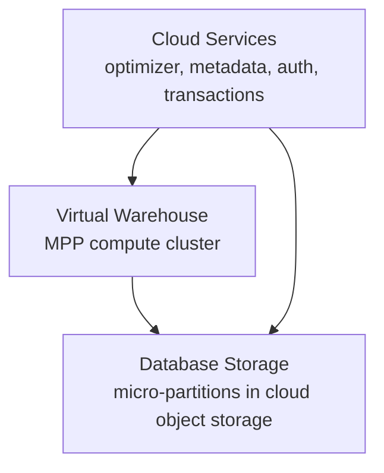
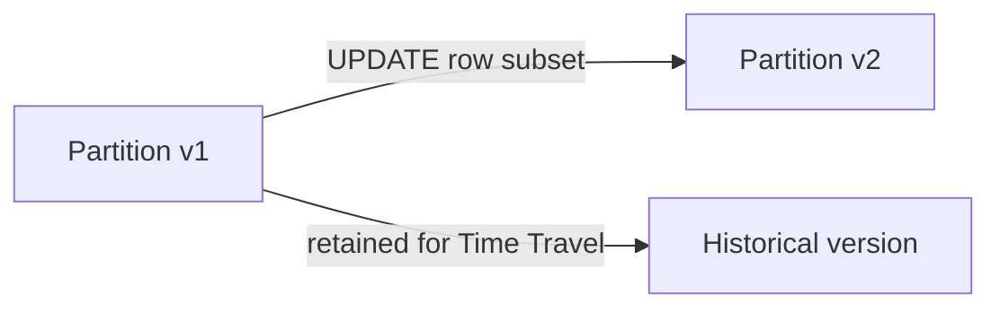
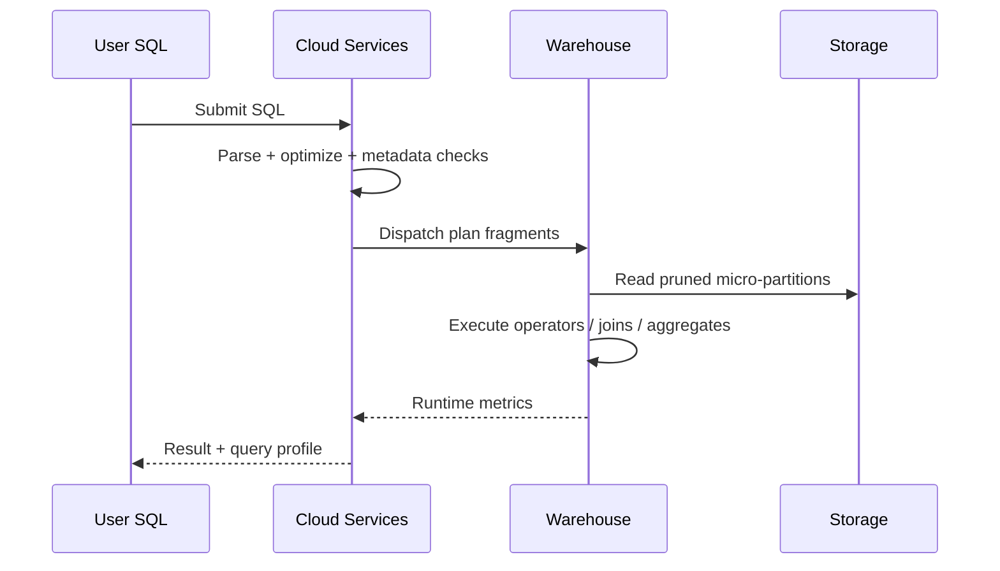

# Snowflake: Deep Learning Guide for Data Engineers

## How to Read This Guide in One Sitting (4-Hour Path)

This document is built for a single focused read. Think of it as a technical story: each section introduces one layer of Snowflake, then connects that layer to query behavior, operability, and cost.

Recommended 4-hour flow:

1. Hour 1: Read sections 3 to 6 to lock the architecture model (storage, compute, services, query life cycle).
2. Hour 2: Read sections 8 to 10 to understand ingestion and transformation primitives (COPY, Snowpipe, Streams, Tasks, Dynamic Tables, VARIANT).
3. Hour 3: Read sections 11 to 14 to master data safety, performance, transactions, and governance.
4. Hour 4: Read sections 15 to 18 and then scan references for follow-up deep dives.

How to use each section:

- Read "What it is" and "Why it matters" first.
- Do not skip "How it works internally" and "How to validate"; that is where production intuition comes from.
- Use SQL snippets to anchor concepts, not as copy-paste production scripts.
- Answer self-checks before moving on.

Scope and source policy:

- Source of truth is official Snowflake docs.
- Community material is used only as supplemental intuition when consistent with official behavior.
- Redshift comparisons are concise and optional.

Reading posture for maximum retention:

- Do not memorize settings first. Memorize causal chains. Example: weak pruning -> large scan -> warehouse pressure -> spill/queue -> cost spike.
- Pause at each \"How to validate\" block and map where that evidence appears in Snowsight or account usage views.
- Write one sentence per section: \"If this fails in production, the first thing I check is ___.\" This turns passive reading into operational memory.

If you keep only three principles after one pass, keep these:

1. Snowflake performance is mostly data-elimination quality plus workload isolation quality.
2. Persistent cost problems are usually ownership and policy problems, not one bad query.
3. Governance design shapes architecture outcomes as much as schema design.

A final reading tip: whenever a section introduces a feature, ask two follow-up questions immediately:

1. \"What evidence would tell me this feature is helping?\"
2. \"What evidence would tell me this feature is silently increasing cost or complexity?\"

That habit converts feature familiarity into engineering judgment.

You are not trying to memorize Snowflake syntax. You are building a stable diagnostic mindset that survives changing workloads, team growth, and platform evolution.
That mindset is the difference between reactive tuning and deliberate platform engineering.

## Core Mental Model: Why Snowflake Feels Different

### What it is

Snowflake is not just "a faster warehouse." It is a cloud-native data platform whose core design decision is strict separation of storage and compute, coordinated by a shared services layer ([Snowflake architecture](https://docs.snowflake.com/en/user-guide/intro-key-concepts)).

### Why it matters

Most warehouse mistakes come from carrying over mental models from tightly coupled systems:

- Assuming compute nodes own data locality.
- Tuning distribution/sort keys as primary levers.
- Treating maintenance as manual (vacuum/analyze-style loops).

In Snowflake, the first-order levers are different: metadata quality, pruning selectivity, warehouse behavior, and cost-aware workload isolation.

### How it works internally

At a high level, every query path is coordinated across three layers:



- Storage layer persists data in immutable micro-partitions with rich metadata.
- Compute layer (virtual warehouses) is stateless from a persistence perspective.
- Cloud services orchestrate optimization, metadata lookups, transaction visibility, and governance.

### Performance and cost implications

- You do not optimize by pre-distributing data to nodes. You optimize by enabling partition and column pruning.
- You can isolate workloads by warehouse rather than competing in one shared compute pool.
- Auto-suspend and warehouse sizing choices often matter more to cost than many query-level micro-optimizations ([Warehouses overview](https://docs.snowflake.com/en/user-guide/warehouses-overview), [Cost controls for warehouses](https://docs.snowflake.com/en/user-guide/cost-controlling-controls)).

### Deeper intuition: metadata-first optimization

In tightly coupled systems, tuning often starts with where data physically lives. In Snowflake, tuning starts with what data can be excluded before expensive execution begins. Because partition metadata is centrally available, optimizer decisions can remove large amounts of work before warehouse-heavy operators run.

That changes tuning order:

1. Improve pruning and predicate selectivity.
2. Improve workload isolation and warehouse mapping.
3. Only then decide whether more compute is necessary.

If you reverse this order, you can easily pay more while solving the wrong bottleneck.

### Mental model drills

Use these quick drills to test whether your Snowflake thinking is aligned:

Drill 1: a query is slow and bytes scanned doubled, but warehouse utilization is unchanged.

- Correct instinct: inspect pruning/selectivity and recent data layout changes.
- Weak instinct: immediately resize warehouse.

Drill 2: query runtime increased mostly due to queue time during office hours.

- Correct instinct: inspect warehouse isolation/concurrency policy.
- Weak instinct: rewrite SQL without addressing capacity contention.

Drill 3: cost increased without a matching increase in delivered dashboards or data products.

- Correct instinct: inspect idle leakage, ownership tags, and workload routing.
- Weak instinct: assume one \"expensive query\" is the only explanation.

Drill 4: data governance incident exposes extra rows.

- Correct instinct: audit role hierarchy and row/masking policy attachments with simulation tests.
- Weak instinct: patch one query and assume systemic safety is restored.

These drills train you to identify layer-appropriate fixes. Strong Snowflake practitioners solve the right class of problem first.

### Concept integration map

To make the rest of this guide easier, keep this causal map in mind:

1. Data layout quality influences pruning quality.
2. Pruning quality influences scan volume.
3. Scan volume influences memory pressure and operator cost.
4. Operator cost influences execution time.
5. Execution time + concurrency influences queue pressure.
6. Queue pressure + autosuspend policy influences user-perceived latency.
7. All of the above influence credit consumption.

This map helps you avoid local optimization traps. For example:

- reducing queue time by scaling out might help immediately, but if scan volume is still exploding, costs rise and latency variance returns later.
- improving one operator can help one query, but if workloads remain mixed in one warehouse, noisy-neighbor incidents persist.

Use this map during postmortems:

1. Start from user symptom.
2. Walk backward through the chain.
3. Identify the earliest unstable link.
4. Fix that link before applying downstream compensating changes.

When teams institutionalize this reasoning, platform changes become coherent. You stop seeing random config churn and start seeing decision trails that can be defended with evidence.

### Minimal SQL example

```sql
-- Environment sanity checks before tuning anything
SELECT CURRENT_ACCOUNT(), CURRENT_REGION(), CURRENT_ROLE(), CURRENT_WAREHOUSE();
SHOW WAREHOUSES;
```

### Common pitfalls

- Treating Snowflake like a cluster you must "balance" manually.
- Over-sizing one warehouse for every workload instead of splitting ETL/BI/DS paths.
- Ignoring metadata-driven pruning and blaming compute first.

### How to validate in UI/system views

- Snowsight Query History and Query Profile to inspect scan, pruning, and operator costs ([Query History & profile](https://docs.snowflake.com/en/user-guide/ui-query-profile)).
- `SHOW WAREHOUSES` to validate autosuspend/autoresume and scaling configuration.

### Common misconceptions to reject early

1. \"Bigger warehouse always means better architecture.\"
   - Better architecture means stable latency and predictable cost under real workload variance.
2. \"If query text is unchanged, performance regressions must be infrastructure problems.\"
   - Data shape and layout drift can change behavior significantly without SQL edits.
3. \"Governance can be added after performance tuning.\"
   - Governance choices influence object design, sharing, and policy evaluation behavior from day one.
4. \"Cost control is finance-only work.\"
   - Engineering choices about warehouse isolation, ingestion shape, and tuning discipline are primary cost drivers.

### Self-check

1. Why is compute-storage separation not just a scalability feature but also a governance and cost feature?
2. Which layer decides transaction visibility and optimization rules?
3. If two warehouses query the same table, what data copy semantics apply?

## Architecture Internals: Storage, Compute, Cloud Services

### What it is

Snowflake’s architecture is described as hybrid shared-disk/shared-nothing: central persistent storage with MPP execution inside each warehouse ([Architecture overview](https://docs.snowflake.com/en/user-guide/intro-key-concepts), [SIGMOD paper](https://www.snowflake.com/wp-content/uploads/2019/06/Snowflake_SIGMOD.pdf)).

### Why it matters

This hybrid model explains two things new users find surprising:

- High concurrency without forcing table redistribution design.
- Isolation of workloads by warehouse instead of queue-based contention in one cluster.

### How it works internally

#### Database storage layer

- Snowflake reorganizes loaded data into optimized, compressed, columnar internal representation.
- Persistent storage lives in cloud object storage managed by Snowflake.
- Table types include standard Snowflake tables, Iceberg tables, and hybrid tables ([Key concepts](https://docs.snowflake.com/en/user-guide/intro-key-concepts)).

#### Compute layer (virtual warehouses)

- A warehouse is an independent compute cluster for SQL/Snowpark execution.
- Warehouses do not share compute resources with each other.
- Multi-cluster mode scales concurrency by adding clusters as queue pressure grows ([Multi-cluster warehouses](https://docs.snowflake.com/en/user-guide/warehouses-multicluster)).

#### Cloud services layer

- Query parsing and optimization.
- Metadata management.
- Authentication and access control.
- Transaction coordination and infrastructure management.

### Performance and cost implications

- Separate warehouses are often the cleanest solution to noisy-neighbor workloads.
- Multi-cluster improves concurrency, not single-query speed; resizing warehouse size helps single-query speed ([Multi-cluster warehouses](https://docs.snowflake.com/en/user-guide/warehouses-multicluster)).
- Cloud services usage is included but can become material under high metadata/control-plane-heavy patterns; monitor account cost views for anomalies.

### Deep dive: architecture translated into operating model

A scalable Snowflake operating model usually starts with warehouse personas:

- `etl_wh`: scheduled transforms and backfills.
- `bi_wh`: dashboard and ad hoc read concurrency.
- `sandbox_wh`: exploratory development with strict autosuspend.
- `specialized_wh`: memory-heavy or compute-heavy edge workloads.

This is not just a naming convention. It creates decision boundaries:

- platform team defines safe defaults per persona;
- domain teams tune query/model quality inside their persona;
- finance/ops teams can attribute cost and exceptions clearly.

When all workloads run in one warehouse, triage becomes ambiguous. A spike could be bad SQL, concurrency burst, or wrong autosuspend policy, and nobody has a clean ownership boundary. Persona-aligned warehouses reduce this ambiguity and shorten incident resolution.

A second pattern is SLA class separation:

- low-latency interactive queries,
- medium-latency operational reporting,
- high-throughput batch and backfill.

Do not let one class dictate policy for all classes. Snowflake gives low-friction compute isolation; exploit it deliberately.

### Minimal SQL example

```sql
CREATE OR REPLACE WAREHOUSE etl_wh
  WAREHOUSE_SIZE = 'LARGE'
  AUTO_SUSPEND = 300
  AUTO_RESUME = TRUE
  MIN_CLUSTER_COUNT = 1
  MAX_CLUSTER_COUNT = 2
  SCALING_POLICY = 'STANDARD';

SHOW WAREHOUSES LIKE 'ETL_WH';
```

### Common pitfalls

- Using one warehouse for all user personas.
- Enabling multi-cluster to fix long-running query latency.
- Ignoring queue metrics and relying only on average query time.

### How to validate in UI/system views

- Snowsight warehouse monitoring panels and query queue indicators.
- `SHOW WAREHOUSES` output for active policy and cluster bounds.
- `SNOWFLAKE.ACCOUNT_USAGE.QUERY_HISTORY` for queue and runtime patterns.

### Deep dive: architecture failure modes in real teams

Three recurring failure modes appear as teams scale:

1. \"Single giant warehouse syndrome\"
   Everything runs on one large warehouse because it is easy initially. Over time, queueing, noisy-neighbor effects, and attribution ambiguity explode. The fix is not just resizing; it is separating workloads by intent and SLA.

2. \"Platform without ownership\"
   Warehouses exist but have no owners, no intended workload profile, and no budget envelope. Performance incidents then become blame cycles because nobody can say which queries belong where.

3. \"Policy drift\"
   Autosuspend values, cluster counts, and size choices accumulate as one-off fixes. Months later the configuration is inconsistent and expensive. Without periodic standardization, architecture quality decays.

A practical architecture governance checklist:

- each warehouse has a documented purpose;
- each warehouse has an owner;
- each warehouse has target p95 latency and budget boundaries;
- each warehouse has a review cadence.

If a team cannot answer those four bullets, architecture work is incomplete even if queries currently run.

### Self-check

1. When should you scale up versus scale out?
2. Why is a separate BI warehouse often preferable to larger shared ETL compute?
3. Which architecture layer owns optimizer logic?

## Storage Internals: Micro-Partitions, Metadata, Pruning, Copy-on-Write

### What it is

Snowflake stores table data in immutable micro-partitions (50 MB to 500 MB uncompressed), organized in columnar format with metadata such as value ranges and distinct counts ([Micro-partitions & clustering](https://docs.snowflake.com/en/user-guide/tables-clustering-micropartitions)).

### Why it matters

Micro-partitions drive almost all Snowflake performance behavior:

- Pruning determines scan volume.
- DML rewrites partition versions rather than in-place updates.
- Time Travel and many snapshot semantics depend on immutable history.

### How it works internally

#### Micro-partition metadata

For each partition Snowflake tracks per-column stats (for example ranges and distinct value signals) and uses them during planning to skip partitions that cannot satisfy predicates.

#### Natural clustering and overlap

Data lands in partitions based on load order and can overlap on value ranges. Overlap depth affects how many partitions must be scanned for a filter.

#### Copy-on-write DML

`UPDATE`, `DELETE`, and `MERGE` do not mutate existing partitions in place. Snowflake writes new partition versions and updates metadata pointers. Older versions remain available for retention windows ([Time Travel](https://docs.snowflake.com/en/user-guide/data-time-travel)).



### Performance and cost implications

- Predicate selectivity quality is often more important than raw warehouse size.
- High-churn DML patterns can inflate compute and storage side effects due to partition rewrites.
- Reclustering and rewrite-heavy operations can increase storage-related footprint temporarily (including historical retention windows).

### Minimal SQL examples

```sql
-- Inspect clustering quality on a critical filter key
SELECT SYSTEM$CLUSTERING_INFORMATION('ANALYTICS.FACT_ORDERS', '(ORDER_DATE)');
```

Representative command (inline): `ALTER TABLE analytics.fact_orders CLUSTER BY (order_date, customer_id);`

### Common pitfalls

- Assuming clustering key is mandatory for every table.
- Over-clustering medium/small tables with low pruning upside.
- Running broad `UPDATE` operations repeatedly instead of batch rewrite design.

### How to validate in UI/system views

- Query Profile: partition scan/selectivity behavior.
- `SYSTEM$CLUSTERING_INFORMATION` and related clustering metrics.
- Storage and history monitoring when applying heavy DML/reclustering.

### Deep dive: pruning economics and rewrite strategy

For very large tables, the central objective is workload elimination, not raw compute expansion. If a query can avoid scanning most partitions, runtime often drops more than by resizing compute.

Practical storage-tuning questions:

1. Are your dominant filters aligned with natural ingest order?
2. How quickly is partition overlap depth rising on those filters?
3. Are frequent updates rewriting broad partition surfaces that could be modeled differently?

A common high-value pattern for mutable domains is hot/cold separation:

- keep recent mutable records in a smaller high-churn table,
- compact and promote older stable records to a low-churn historical table,
- expose a unified semantic view to consumers.

This reduces rewrite amplification and usually improves predictable pruning.

Another practical rule: evaluate clustering only on real production filter shapes. A clustering key can look useful in synthetic tests but provide minimal benefit against real ad hoc predicates. Always compare before/after profile evidence and storage impact across representative windows.

Storage thought experiment to internalize tradeoffs:

- Scenario A: table is append-heavy, filters are mostly on recent dates, and updates are rare.
  - Natural clustering is often enough.
  - Extra clustering effort may provide little incremental value.
- Scenario B: table is append-heavy but business filters are on customer/account keys with weak correlation to load order.
  - Partition overlap grows quickly for those keys.
  - Explicit clustering may produce material scan reduction.
- Scenario C: table has frequent broad updates across historical records.
  - Copy-on-write amplification can dominate cost.
  - Data model redesign (batch rewrite windows, hot/cold split, or change-capture reshaping) often has higher ROI than clustering alone.

The point is to tune the storage lifecycle, not just one knob.

### Self-check

1. Why does immutable storage make Time Travel feasible?
2. What symptom indicates poor clustering for your main filter path?
3. When is clustering cost not worth it?

## Compute Internals: Virtual Warehouses, Caching, Concurrency, Spill

### What it is

Virtual warehouses are Snowflake compute clusters used to execute queries and data operations. They support autosuspend/autoresume, resizing, and (optionally) multi-cluster concurrency scaling ([Warehouses overview](https://docs.snowflake.com/en/user-guide/warehouses-overview)).

### Why it matters

Most day-2 operations work is warehouse management:

- Choosing right size for latency-sensitive workloads.
- Configuring suspend windows for cache economics.
- Preventing queue saturation under concurrency spikes.

### How it works internally

#### Cache layers and behavior

Practical cache model:

- Result cache: returns identical query results quickly when eligible.
- Local warehouse cache: persisted while warehouse remains running.
- Remote storage: source of truth when cache misses occur.

Autosuspend clears local cache, so aggressive suspend intervals can trade lower idle cost for worse repeated-read latency ([Warehouse cache guidance](https://docs.snowflake.com/en/user-guide/performance-query-warehouse-cache)).

#### Concurrency model

- Single-cluster warehouses queue once concurrency exceeds capacity.
- Multi-cluster warehouses add clusters according to min/max and scaling policy to reduce queueing ([Multi-cluster warehouses](https://docs.snowflake.com/en/user-guide/warehouses-multicluster)).

#### Spill behavior

When memory pressure is high, execution can spill to local then remote storage, increasing latency.

### Performance and cost implications

- Query warehouses (BI) often benefit from longer autosuspend than highly bursty ETL if cache reuse is high.
- Multi-cluster improves concurrency but can increase credit consumption; use only when queue pressure is the bottleneck.
- Frequent remote spill is usually a sign of under-sizing, skew, or plan inefficiency.

### Minimal SQL examples

```sql
ALTER WAREHOUSE bi_wh SET
  AUTO_SUSPEND = 600,
  AUTO_RESUME = TRUE;
```

```sql
-- Identify spill-heavy queries
SELECT query_id,
       warehouse_name,
       bytes_spilled_to_local_storage,
       bytes_spilled_to_remote_storage,
       execution_status
FROM SNOWFLAKE.ACCOUNT_USAGE.QUERY_HISTORY
WHERE start_time >= DATEADD('day', -7, CURRENT_TIMESTAMP())
  AND bytes_spilled_to_remote_storage > 0
ORDER BY bytes_spilled_to_remote_storage DESC
LIMIT 50;
```

### Common pitfalls

- Setting autosuspend extremely low for dashboard-heavy read patterns.
- Increasing warehouse size without inspecting pruning and join choices first.
- Ignoring queue time in SLA discussions.

### How to validate in UI/system views

- Snowsight Query History: queue time, bytes scanned, spill metrics.
- Warehouse monitoring for cluster count and utilization.
- Query profile expensive nodes to isolate memory-heavy stages.

### Deep dive: warehouse design patterns that age well

A warehouse strategy should survive growth, not only solve this week’s load. Useful patterns:

1. Baseline + burst pattern:
   - set a conservative baseline size for steady demand,
   - allow limited burst capacity (via temporary resize or bounded multi-cluster),
   - revert automatically after surge windows.
2. Cold-path isolation:
   - route exploratory or one-off analyst workloads to dedicated compute,
   - protect SLA paths from unpredictable query shapes.
3. Spill-first triage:
   - if spill increases, check pruning and joins first,
   - only then increase size if plan quality is already reasonable.

Caching policy deserves explicit thought. A warehouse that suspends too aggressively may repeatedly pay cold-read penalties. A warehouse that never suspends may silently leak credits. The right answer is workload-specific and evidence-based, not universal.

Finally, avoid hidden cross-team coupling: every shared warehouse should have an owner, usage policy, and escalation path. Without ownership, queue incidents repeat and costs drift.

### Self-check

1. Why can low autosuspend increase costs in some patterns despite less idle time?
2. Which problem does multi-cluster solve best?
3. What is your first action when remote spill spikes?

## Query Lifecycle and Performance Debugging

### What it is

A Snowflake query goes through parse, optimize, execution dispatch, and profile reporting. Debugging means correlating plan behavior with scan/pruning/spill/queue metrics, not just looking at total duration ([Query profile](https://docs.snowflake.com/en/user-guide/ui-query-profile)).

### Why it matters

Without a consistent debugging method, teams make random warehouse size changes and accumulate cost without predictable performance gains.

### How it works internally



A practical operator-first lens for profile reading:

1. Scan nodes: bytes and partition pruning quality.
2. Join nodes: build/probe balance and skew patterns.
3. Aggregate/sort nodes: memory and spill.
4. End-to-end: queue time vs execution time.

### Performance and cost implications

- High queue + low execution means concurrency/warehouse assignment issue.
- High execution + low scan often means CPU-heavy function/operator path.
- High scan + weak pruning means model or predicate problem first.

### Minimal SQL examples

```sql
-- Recent slow queries with context
SELECT query_id,
       query_text,
       warehouse_name,
       total_elapsed_time,
       execution_time,
       queued_overload_time,
       bytes_scanned,
       bytes_spilled_to_remote_storage
FROM SNOWFLAKE.ACCOUNT_USAGE.QUERY_HISTORY
WHERE start_time >= DATEADD('day', -3, CURRENT_TIMESTAMP())
ORDER BY total_elapsed_time DESC
LIMIT 25;
```

Representative analysis query (inline): group `QUERY_HISTORY` by `warehouse_name` and compare `AVG(bytes_scanned)` with `AVG(total_elapsed_time)` to detect repeated heavy-scan patterns.

### Common pitfalls

- Comparing queries without normalizing for data volume/time window.
- Ignoring warehouse queue metrics and blaming SQL.
- Tuning one query by harming concurrency for everyone else.

### How to validate in UI/system views

- Query Profile and Query Insights panes for expensive operators.
- `QUERY_HISTORY`, `AGGREGATE_QUERY_HISTORY`, and information schema functions.
- Pair profile screenshots with exact SQL revisions for reproducible tuning.

### Deep dive: a repeatable regression protocol

Use a fixed protocol for every major performance regression:

1. Capture baseline evidence:
   - exact SQL or query hash,
   - warehouse and role context,
   - profile snapshot with top expensive operators.
2. Classify bottleneck:
   - queue-dominant,
   - scan/pruning-dominant,
   - spill/memory-dominant,
   - operator-specific hotspot.
3. Apply one controlled change:
   - either query/model change or warehouse policy change, not both initially.
4. Re-run on comparable input windows.
5. Keep the change only if the expected node-level metrics improve.

This prevents expensive false positives where runtime improves once due to cache timing or low concurrent load, then regresses in normal traffic.

### Deep dive case study: diagnosing a real regression

Imagine this pattern:

- A daily dashboard query ran in ~25 seconds for months.
- It now fluctuates between 40 and 180 seconds.
- Team increased warehouse size twice; variance persisted.

Step-by-step diagnosis:

1. Baseline split:
   - Compare historical runs by day and input volume.
   - Separate queue time from execution time.
   - Result: queue is low; execution variance is high.
2. Profile comparison:
   - Good run: scan node reads ~20 GB with strong pruning.
   - Bad run: same query reads 140+ GB with weak pruning.
3. Root cause hypothesis:
   - new ingestion pattern changed data ordering,
   - partition overlap increased on key filter columns.
4. Confirm:
   - `SYSTEM$CLUSTERING_INFORMATION` shows rising depth.
   - no major join-plan structural changes.
5. Fix:
   - add explicit clustering key on dominant filter path,
   - adjust ingestion batching to preserve better locality.
6. Verify:
   - scan bytes drop to stable band,
   - runtime variance collapses,
   - warehouse size can be reduced back to original.

Lessons from this case:

- expensive symptoms can be storage-layout symptoms, not compute shortages.
- queue metrics can be healthy while execution quality deteriorates.
- one profile screenshot is not enough; compare good vs bad runs under similar load.

Second mini-case: concurrency illusion

- Team reports \"query slowdown\" during business hours.
- Profile execution nodes look healthy.
- Queue time dominates total elapsed time.
- Root fix is warehouse isolation or bounded multi-cluster, not SQL rewrite.

This is why a clean diagnostic taxonomy (queue, scan, spill, operator hotspot) is non-negotiable in Snowflake operations.

### End-to-end walkthrough: one analytics query across layers

Consider this common business question: \"What is yesterday’s gross revenue by region, excluding refunded orders, compared to the prior 7-day rolling average?\"

A naive way to think about this query is \"it does a scan + group by.\" A Snowflake-accurate way is to trace it across layers:

1. Cloud services layer:
   - parses SQL,
   - resolves objects and policies,
   - consults metadata for candidate partition elimination,
   - prepares optimized execution plan.
2. Compute layer:
   - warehouse executes scan, filter, join (if needed), aggregate, and window logic.
   - memory pressure and spill behavior depend on row width/cardinality after filtering.
3. Storage layer:
   - only relevant micro-partitions and columns are touched when pruning and projection are effective.

Now assume the query regresses after a schema change. Where might the regression originate?

- New predicate wrapped with non-sargable expression reduced partition pruning.
- Added semi-structured extraction in the hot path increased CPU cost.
- Added policy evaluation logic increased per-row overhead.
- Warehouse routing changed and introduced queueing.

The key insight: one SQL edit can affect all three layers differently.

Operational decision tree for this walkthrough:

1. Check queue time proportion.
   - high queue: capacity/isolation issue.
   - low queue: continue.
2. Check bytes scanned and partition elimination.
   - high scan jump: storage/pruning issue.
   - stable scan: continue.
3. Check spill and expensive operators.
   - high spill: cardinality/memory issue.
   - no spill: continue.
4. Check recent policy and schema changes.
   - changed row/masking policy or nested extraction path may explain CPU shift.

From this single walkthrough, you can see why mature teams maintain:

- query baselines,
- schema-change impact reviews,
- policy-change impact tests,
- warehouse routing governance.

Without these practices, each regression appears \"new\" even when the pattern is known.

### Self-check

1. How do you distinguish warehouse saturation from poor SQL shape?
2. Which profile node types usually reveal pruning problems?
3. Why should tuning experiments change one major variable at a time?

## Data Ingestion: Stages, COPY INTO, Snowpipe, Snowpipe Streaming

### What it is

Snowflake ingestion spans batch and continuous patterns:

- Stages (internal/external) for file access.
- `COPY INTO` for bulk ingestion.
- Snowpipe for event-driven file ingestion.
- Snowpipe Streaming for lower-latency row ingestion paths ([Stages and loading guides](https://docs.snowflake.com/en/user-guide/data-load-overview), [Snowpipe intro](https://docs.snowflake.com/en/user-guide/data-load-snowpipe-intro)).

### Why it matters

Ingestion architecture determines downstream latency, idempotency complexity, and cost profile. Many platform incidents originate in ingestion assumptions (duplicates, file ordering, schema drift).

### How it works internally

#### Stages

A stage is an addressable data landing surface. External stages reference cloud object storage; internal stages are Snowflake-managed.

#### `COPY INTO`

Bulk loads parse files with explicit file format rules and ingest into table storage with partition metadata generation.

#### Snowpipe

Snowpipe uses managed compute for continuous, event-triggered file ingestion. It decouples file arrival from dedicated warehouse scheduling.

#### Snowpipe Streaming

For low-latency scenarios, streaming APIs ingest rows without waiting for file batching, trading design complexity for lower end-to-end lag.

### Performance and cost implications

- Batch `COPY INTO` on right-sized warehouses is often simplest and most cost-efficient for predictable windows.
- Snowpipe reduces orchestration overhead for near-real-time file ingestion but requires robust event setup and monitoring.
- Very small-file patterns inflate metadata overhead and can degrade downstream read efficiency.

### Minimal SQL examples

```sql
-- External stage and file format
CREATE OR REPLACE FILE FORMAT ff_json
  TYPE = JSON
  STRIP_OUTER_ARRAY = TRUE;

CREATE OR REPLACE STAGE ext_ingest_stage
  URL = 's3://my-bucket/raw/orders/'
  STORAGE_INTEGRATION = my_s3_int
  FILE_FORMAT = ff_json;
```

```sql
-- Bulk load with load metadata support
COPY INTO raw.orders_landing
FROM @ext_ingest_stage
PATTERN = '.*orders.*\\.json'
ON_ERROR = 'CONTINUE';
```

Representative command (inline): `CREATE OR REPLACE PIPE raw.orders_pipe AUTO_INGEST = TRUE AS COPY INTO raw.orders_landing FROM @ext_ingest_stage PATTERN = '.*orders.*\\.json';`

### Common pitfalls

- Relying on schema inference for production critical ingestion.
- Ignoring duplicate delivery semantics in event-driven designs.
- Allowing uncontrolled tiny files to accumulate.

### How to validate in UI/system views

- Load history and copy history views/tables for file-level status.
- Snowpipe monitoring and failed file alerts.
- Row-count reconciliation between landing and source control totals.

### Deep dive: ingestion architecture that survives failure

Pick ingestion mode based on failure handling and replay requirements, not only latency goals.

1. Scheduled batch with `COPY INTO`:
   - best when arrivals are predictable and reconciliation checkpoints are mandatory.
2. Snowpipe:
   - best when file arrival is continuous and you want event-driven ingestion without warehouse scheduling loops.
3. Snowpipe Streaming:
   - best when row-level freshness requirements are strict and file batching is too slow.

For each pattern, define idempotency explicitly:

- unique file/event identity,
- deduplication keys in landing-to-curated merges,
- replay strategy for partial failures.

Most ingestion incidents are not parser failures. They are semantic failures: duplicates, missing windows, or schema drift handled inconsistently across environments. Solve those with explicit contracts and reconciliation tests.

### Deep dive case study: from batch-only to mixed-latency ingestion

Suppose a team starts with nightly bulk loads and then receives a new requirement: critical events must appear within 5 minutes, while full historical fidelity remains mandatory.

A robust hybrid design:

1. Keep nightly bulk `COPY INTO` for full backfill and reconciliation authority.
2. Add Snowpipe for near-real-time file arrivals from operational systems.
3. Use a deterministic dedup key so overlapping records from both paths reconcile safely.
4. Route both feeds into a landing table, then merge into curated tables with explicit precedence logic.

Why this works:

- batch path provides stable replay and auditability,
- near-real-time path improves freshness,
- deterministic merge semantics avoid double counting.

Common mistakes in this migration:

- assuming event ordering is guaranteed,
- skipping source event IDs,
- treating low-latency requirements as reason to bypass reconciliation.

Validation checklist for hybrid ingestion:

- late-arriving file test (does pipeline still converge correctly?),
- duplicate event injection test (does dedup hold?),
- schema evolution test (does new optional field break transforms?),
- outage replay test (can missed window be replayed cleanly?).

Teams that institutionalize these tests avoid most ingestion-related incidents.

### Self-check

1. When is Snowpipe preferable to scheduled `COPY`?
2. Why are tiny files an ingestion and query problem?
3. What is your deduplication strategy when events may be retried?

## Transformation Patterns: Streams, Tasks, Dynamic Tables

### What it is

Snowflake provides two major transformation styles:

- Imperative: Streams + Tasks (explicit control of CDC and scheduling).
- Declarative: Dynamic Tables (freshness targets and automatic refresh orchestration).

References: [Streams intro](https://docs.snowflake.com/en/user-guide/streams.html), [Tasks intro](https://docs.snowflake.com/en/user-guide/tasks.html), [Dynamic tables vs streams/tasks](https://docs.snowflake.com/en/user-guide/dynamic-tables-and-streams).

### Why it matters

Choosing the wrong model leads to either hidden complexity or hidden cost:

- Streams/Tasks give control and flexibility but need orchestration discipline.
- Dynamic Tables reduce orchestration burden but require understanding target lag and refresh behavior.

### How it works internally

#### Streams

A stream stores an offset against source table/view changes and exposes change records with metadata columns such as `METADATA$ACTION`, `METADATA$ISUPDATE`, and `METADATA$ROW_ID` ([Streams intro](https://docs.snowflake.com/en/user-guide/streams-intro)).

Streams can become stale if offsets fall outside retention windows; staleness prevention requires consumption strategy and retention awareness ([Streams staleness](https://docs.snowflake.com/en/user-guide/streams.html)).

#### Tasks

Tasks run SQL/procedures on schedules or conditions. Compute can be serverless or user-managed warehouse based ([Tasks intro](https://docs.snowflake.com/en/user-guide/tasks.html)).

#### Dynamic Tables

Dynamic tables materialize query results to freshness goals (`TARGET_LAG`). Incremental refresh and full refresh modes have compatibility and performance constraints; notably, incremental downstream from full refresh is not supported ([Dynamic table refresh modes](https://docs.snowflake.com/en/user-guide/dynamic-tables-performance-refresh-mode), [Target lag](https://docs.snowflake.com/en/user-guide/dynamic-tables-target-lag)).

### Performance and cost implications

- Streams + Tasks are ideal when you need deterministic step logic, custom retries, and conditional branching.
- Dynamic Tables are strong for declarative pipelines and consistent freshness semantics, but refresh cost depends on query shape and change volume.
- Use `DOWNSTREAM` lag intentionally; if no downstream consumer with explicit lag exists, refresh behavior may differ from expectations.

### Minimal SQL examples

```sql
-- Stream + task pattern
CREATE OR REPLACE STREAM raw.orders_stream ON TABLE raw.orders_landing;

CREATE OR REPLACE TASK etl.orders_upsert_task
  WAREHOUSE = etl_wh
  SCHEDULE = '5 MINUTE'
  WHEN SYSTEM$STREAM_HAS_DATA('RAW.ORDERS_STREAM')
AS
MERGE INTO analytics.orders_curated t
USING (
  SELECT *
  FROM raw.orders_stream
  WHERE METADATA$ACTION IN ('INSERT', 'DELETE')
) s
ON t.order_id = s.order_id
WHEN MATCHED AND s.METADATA$ACTION = 'DELETE' THEN DELETE
WHEN MATCHED THEN UPDATE SET status = s.status, amount = s.amount
WHEN NOT MATCHED THEN INSERT (order_id, status, amount) VALUES (s.order_id, s.status, s.amount);
```

```sql
-- Dynamic table pattern
CREATE OR REPLACE DYNAMIC TABLE analytics.orders_hourly
  TARGET_LAG = '10 minutes'
  WAREHOUSE = etl_wh
AS
SELECT DATE_TRUNC('hour', order_ts) AS order_hour,
       COUNT(*) AS order_count,
       SUM(amount) AS gross_amount
FROM analytics.orders_curated
GROUP BY 1;
```

### Common pitfalls

- Treating streams as persistent change storage instead of offsets + change window semantics.
- Running tasks without robust retry/error monitoring and ownership boundaries.
- Setting aggressive dynamic-table target lag without measuring refresh duration and skipped refreshes.

### How to validate in UI/system views

- Task history and error diagnostics.
- Stream freshness/staleness indicators and offset consumption patterns.
- `INFORMATION_SCHEMA.DYNAMIC_TABLE_REFRESH_HISTORY` for lag, duration, and skip analysis.

### Deep dive: choosing the right transformation contract

A useful decision frame is \"control vs abstraction\":

- Streams + Tasks maximize control over sequencing, conditional logic, and side effects.
- Dynamic Tables maximize abstraction by letting you define freshness intent and letting the platform orchestrate refresh logic.

Use Streams + Tasks when:

- you need deterministic CDC replay behavior,
- you need explicit retry/dead-letter branches,
- you must coordinate with external systems or procedural steps.

Use Dynamic Tables when:

- transformations are stable and declarative,
- freshness can be described as lag objectives,
- operational overhead of custom orchestration is becoming a bottleneck.

Mature teams often run both:

- Dynamic Tables for broad reusable semantic transforms.
- Streams + Tasks for exception-heavy operational pipelines.

The key is to document ownership boundaries. If nobody owns lag tuning, skipped-refresh triage, and schema-change impact, either model becomes unreliable.

### Deep dive case study: choosing Dynamic Tables versus Streams+Tasks

You need two outcomes from the same source:

- a business-facing hourly aggregate with clear freshness SLA,
- an operational CDC flow that triggers conditional corrections and alerts.

Best-fit split:

1. Dynamic Table for hourly aggregate:
   - declarative target lag,
   - minimal orchestration maintenance,
   - good fit for stable aggregation logic.
2. Streams + Tasks for operational CDC:
   - conditional logic and branching,
   - explicit retry/error handling,
   - deterministic merge and side-effect control.

This split avoids forcing one tool to do both jobs poorly.

Anti-pattern to avoid:

- putting exception-heavy operational logic inside declarative refresh flows.

Why it fails:

- hidden complexity accumulates in SQL definitions,
- troubleshooting becomes harder,
- ownership of failures becomes unclear.

Conversely, anti-pattern on the imperative side:

- implementing simple, stable aggregates as complex task DAGs with little business benefit.

Why it fails:

- high operational burden,
- increased failure surface,
- unnecessary orchestration debt.

The architecture principle: align abstraction level to workload volatility.

### Self-check

1. What is the key conceptual difference between stream offset tracking and CDC log storage?
2. When do dynamic tables reduce operational burden versus hide critical complexity?
3. Why can a too-low target lag increase both cost and freshness misses?

## Semi-Structured Data Internals: VARIANT, FLATTEN, Performance

### What it is

Snowflake supports semi-structured data via `VARIANT`, `OBJECT`, and `ARRAY`, enabling schema-on-read and hybrid modeling in analytical pipelines ([Semi-structured guide](https://docs.snowflake.com/en/user-guide/semistructured-overview)).

### Why it matters

Semi-structured pipelines fail when teams either over-flatten too early or never normalize repeated access paths. You need a deliberate balance between flexibility and performance.

### How it works internally

- `VARIANT` stores structured and semi-structured values with type awareness.
- Path extraction enables direct filtering and projection from nested structures.
- `FLATTEN` expands arrays/objects to relational rows when needed.

Snowflake metadata and optimization features can still help with semi-structured filters, and features like search optimization can accelerate selected lookup patterns on semi-structured columns ([Search optimization](https://docs.snowflake.com/en/user-guide/search-optimization-service.html)).

### Performance and cost implications

- Avoid repeatedly parsing large nested blobs at query time for hot analytical paths.
- Materialize frequently used attributes into typed columns in curated layers.
- Use `FLATTEN` carefully; uncontrolled explode patterns can create huge intermediate row sets.

### Minimal SQL examples

```sql
-- Query nested attributes from VARIANT
SELECT payload:customer.id::NUMBER AS customer_id,
       payload:order.total::NUMBER AS total_amount
FROM raw.events
WHERE payload:event_type::STRING = 'purchase';
```

Representative commands (inline):
- `SELECT ... FROM raw.events, LATERAL FLATTEN(input => payload:items) f`
- `ALTER TABLE raw.events ADD SEARCH OPTIMIZATION ON EQUALITY(payload:event_type);`

### Common pitfalls

- Leaving all business-critical fields in deeply nested `VARIANT` forever.
- Flattening everything upfront and multiplying storage and compute cost.
- Casting inconsistently across models and introducing silent data quality drift.

### How to validate in UI/system views

- Query Profile row expansion effects around `FLATTEN`.
- Query history scan and runtime changes before/after partial normalization.
- Search optimization progress for optimized tables (`SHOW TABLES` progress fields).

### Deep dive: semi-structured modeling that stays maintainable

Use a three-layer pattern:

1. Raw ingestion layer:
   - preserve original payload and source metadata.
2. Curated projection layer:
   - promote high-value attributes to typed columns.
3. Consumer layer:
   - expose stable business models with controlled schema evolution.

This avoids two extremes:

- over-flattening everything upfront,
- or keeping everything opaque in `VARIANT` forever.

Promote a nested attribute when it becomes a frequent filter, join key, aggregation dimension, or governance-critical field. Keep low-frequency exploratory attributes nested and revisit quarterly based on query access patterns.

Performance warning: `FLATTEN` can multiply rows dramatically. Always combine flattening with selective predicates and explicit projection to avoid uncontrolled explosion.

### Deep dive case study: avoiding semi-structured performance collapse

Scenario:

- event payload contains nested arrays of items and metadata.
- dashboard team begins querying this payload directly for high-traffic metrics.
- runtime and scan costs grow sharply.

Stabilization approach:

1. Keep raw payload untouched for auditability.
2. Promote top 8-12 business-critical fields to typed columns in curated table.
3. Keep occasional long-tail attributes in `VARIANT`.
4. Restrict broad `FLATTEN` to controlled ETL transformations, not high-concurrency BI paths.
5. Add search optimization only for validated selective filters.

Outcome pattern:

- core dashboards read typed curated columns with predictable performance,
- exploratory investigations still retain full raw payload access,
- schema evolution remains manageable without repeated full rewrites.

This pattern balances flexibility and performance and is usually easier for governance teams because critical fields become explicit, typed, and policy-friendly.

### Self-check

1. Which fields should remain in `VARIANT` and which should be promoted to typed columns?
2. What are two symptoms that `FLATTEN` usage is excessive?
3. When does search optimization help semi-structured workloads most?

## Time Travel, Fail-safe, Zero-Copy Clone, and Recovery Patterns

### What it is

Snowflake provides layered recovery and reproducibility primitives:

- Time Travel for historical data access and object recovery within retention windows.
- Fail-safe as a non-configurable 7-day recovery safety layer after Time Travel.
- Zero-copy cloning for instant metadata-based environment branching.

References: [Time Travel](https://docs.snowflake.com/en/user-guide/data-time-travel), [Fail-safe](https://docs.snowflake.com/en/user-guide/data-failsafe), [Cloning](https://docs.snowflake.com/en/user-guide/object-clone).

### Why it matters

These features are often misunderstood as backup substitutes. They are powerful but have distinct responsibilities, cost implications, and operational boundaries.

### How it works internally

#### Time Travel

- Enabled by default with standard retention behavior.
- Extended retention (up to 90 days) is edition-sensitive and configurable on eligible object scopes.
- Effective retention can be influenced by account-level minimum retention parameters.

#### Fail-safe

- Starts after Time Travel retention ends.
- Seven days, non-configurable, best-effort recovery by Snowflake operations.
- Not intended for user self-service historical querying.

#### Zero-copy cloning

- Clone operations duplicate metadata pointers, not physical data blocks.
- Storage cost grows when cloned objects diverge via copy-on-write.

### Performance and cost implications

- Longer retention increases historical storage footprint.
- Clone-heavy dev/test workflows are cost-efficient when clones are short-lived and lightly modified.
- Broad mutation in clones can quickly remove the initial storage advantage.

### Minimal SQL examples

```sql
-- Time Travel query
SELECT *
FROM analytics.orders_curated
AT (OFFSET => -60 * 30); -- 30 minutes ago
```

Representative commands (inline):
- `UNDROP TABLE analytics.orders_curated;`
- `CREATE OR REPLACE DATABASE analytics_dev CLONE analytics_prod;`

### Common pitfalls

- Confusing Fail-safe with user-facing restore tooling.
- Setting retention to 0 without understanding recovery consequences.
- Assuming all object types clone identically in all contexts.

### How to validate in UI/system views

- Storage metrics for Time Travel bytes and historical footprint.
- Object-level retention parameters and account-level minimum-retention settings.
- Controlled clone tests in lower environments before process standardization.

### Deep dive: recovery engineering, not just recovery features

Build a recovery runbook around intent:

1. Investigate past state: use Time Travel queries to inspect data at prior points.
2. Restore dropped objects: use `UNDROP` where retention permits.
3. Isolate and test fixes: use zero-copy clones for safe replay and validation.

Runbooks should include verification gates:

- row-count and checksum comparisons,
- critical KPI parity checks,
- explicit sign-off before restoring downstream consumption.

For regulated workloads, define retention tiers by data domain rather than one global value. This keeps recovery posture aligned with business risk while limiting unnecessary historical storage growth.

### Deep dive: clone workflows for safe change management

Zero-copy cloning is not only a recovery primitive; it is a delivery primitive.

Useful engineering patterns:

1. Pre-release validation clone:
   - clone production-like datasets into isolated environment,
   - run migration scripts and metric validation,
   - promote only after parity checks pass.
2. Incident replay clone:
   - branch at known-good point,
   - replay suspect pipeline changes,
   - compare output against expected baselines.
3. Backfill rehearsal:
   - test heavy reprocessing logic on clone before touching production objects.

Guardrails:

- enforce TTL/lifecycle policies for temporary clones,
- track clone ownership and purpose,
- prevent long-lived forgotten clones from silent storage growth.

Teams that treat clones as governed engineering assets, not ad hoc conveniences, get faster delivery and safer operations.

### Self-check

1. What problem does Fail-safe solve that Time Travel does not?
2. Why can clone workflows still create substantial storage costs?
3. When would you deliberately keep retention above minimum defaults?

## Performance Tuning: Clustering, Search Optimization, Warehouse Strategy

### What it is

Snowflake tuning is a layered discipline:

1. Query shape and model design.
2. Pruning and storage layout (natural clustering, explicit clustering, search optimization).
3. Warehouse sizing and concurrency policy.
4. Optional acceleration services (for suitable workloads).

References: [Clustering and micro-partitions](https://docs.snowflake.com/en/user-guide/tables-clustering-micropartitions), [Search optimization](https://docs.snowflake.com/en/user-guide/search-optimization-service.html), [QAS](https://docs.snowflake.com/en/user-guide/query-acceleration-service), [Warehouses considerations](https://docs.snowflake.com/en/user-guide/warehouses-considerations).

### Why it matters

Teams over-index on warehouse size first. In Snowflake, the highest-leverage gains often come from reducing scanned partitions and improving predicate effectiveness.

### How it works internally

#### Clustering strategy

Use explicit clustering for large, filter-heavy tables where natural load order does not align with dominant predicates.

#### Search optimization service

Maintains search access paths to speed selective lookups on supported predicate classes, including selected semi-structured searches.

#### Query acceleration service (QAS)

Offloads eligible query portions to shared compute resources; best for certain scan/filter and outlier scenarios. It is edition-feature gated and billed separately when used.

#### Warehouse strategy

- Resize for single-query latency constraints.
- Multi-cluster for concurrency constraints.
- Keep workload-specific warehouses for isolation.

### Performance and cost implications

- Clustering, search optimization, and QAS can all increase spend; each must be tied to measurable SLA gains.
- Overusing optimizations can create maintenance cost with little benefit for low-selectivity workloads.
- Tuning is non-additive; combining all features blindly may not improve outcomes.

### Minimal SQL examples

```sql
-- Enable QAS for outlier-heavy workloads
ALTER WAREHOUSE bi_wh SET
  ENABLE_QUERY_ACCELERATION = TRUE,
  QUERY_ACCELERATION_MAX_SCALE_FACTOR = 8;
```

Representative analysis query (inline): inspect `SNOWFLAKE.ACCOUNT_USAGE.QUERY_ACCELERATION_ELIGIBLE` for queries with high `eligible_query_acceleration_time`.

### Common pitfalls

- Enabling advanced services without baseline and success criteria.
- Applying clustering keys before verifying filter paths and overlap depth.
- Ignoring edition prerequisites and governance approval for cost-bearing features.

### How to validate in UI/system views

- Before/after query profile comparison with identical workload windows.
- Account usage views for service-specific consumption.
- Warehouse and query attribution cost trend checks.

### Deep dive: layered tuning playbook

Use this strict order:

1. Query/model design.
2. Storage/pruning quality.
3. Warehouse policy.
4. Optional managed acceleration features.

Why this order works: each step constrains the search space of the next. If pruning is poor, warehouse adjustments often mask issues instead of fixing them. If workload isolation is wrong, query rewrites can still suffer unpredictable queue behavior.

Define success criteria before tuning:

- p95 latency goal,
- throughput/concurrency goal,
- credit envelope.

A change that improves one metric while violating the other two is not a production success.

### Deep dive: benchmark framework for trustworthy tuning

To make tuning decisions robust, benchmark in three phases:

1. Controlled baseline phase:
   - fixed input slice,
   - fixed warehouse policy,
   - repeated runs to capture variance band.
2. Candidate phase:
   - one change only,
   - same input and concurrency window,
   - repeated runs for variance comparison.
3. Production shadow phase:
   - test during realistic concurrency and data drift,
   - confirm gains persist under real-world conditions.

Metrics to compare:

- p50/p95 total elapsed time,
- queue time share,
- bytes scanned,
- spill volumes,
- credits consumed per run.

Decision criteria should be predeclared:

- Keep change if p95 improves by target margin AND credit delta stays within budget.
- Roll back if gains are unstable or come primarily from favorable cache artifacts.

Common benchmarking trap: optimizing against unrealistic filters. If benchmark filters are narrower than production behavior, pruning gains can look exaggerated. Always include representative \"messy\" ad hoc query shapes in test windows.

Another trap: tuning one query while harming fleet behavior. A bigger warehouse may speed one query but increase idle leakage and cost volatility platform-wide. Evaluate in workload context, not query isolation only.

### Practical optimization playbooks

Use these playbooks as fast starting points:

Playbook A: selective lookup query is slow

1. confirm filter selectivity and predicate form;
2. check pruning evidence in profile;
3. evaluate search optimization eligibility;
4. benchmark before/after with representative values.

Use this when most latency comes from finding small slices in large tables.

Playbook B: aggregation query slow with stable input volume

1. inspect scan growth and overlap depth;
2. verify grouping keys and pre-aggregation opportunities;
3. check spill behavior around aggregation nodes;
4. test clustering or model adjustments if pruning is weak.

Use this when runtime drift appears over months without obvious query text changes.

Playbook C: query fast off-hours, slow during business hours

1. split queue time from execution time;
2. if queue dominates, apply workload isolation or multi-cluster bounds;
3. if execution dominates, continue with plan/operator tuning.

Use this to avoid misdiagnosing concurrency as SQL inefficiency.

Playbook D: memory spill appears suddenly

1. check recent schema changes (wider rows, nested extraction);
2. check join cardinality explosion;
3. test selective projection and earlier filtering;
4. resize compute only after model/query controls are applied.

Use this when remote spill starts dominating elapsed time.

Playbook E: tuning win does not persist

1. verify benchmark realism (input, concurrency, cache state);
2. verify that plan shape changed for the expected reason;
3. test across multiple days and workload windows;
4. keep only changes with stable gains.

Use this to prevent fragile optimization debt.

These playbooks work because they are evidence-first and layer-aware. They minimize random tuning and keep platform behavior explainable to both engineering and operations stakeholders.

### Self-check

1. Which optimization would you test first for selective point lookup workloads?
2. Why is warehouse resize alone often insufficient?
3. What baseline metrics must exist before enabling QAS broadly?

## Transactions, Isolation, and Concurrency Semantics

### What it is

Snowflake supports ACID semantics with statement-level consistency and transaction behavior based on `READ COMMITTED` isolation for tables ([Transactions](https://docs.snowflake.com/en/sql-reference/transactions.html)).

### Why it matters

Without isolation clarity, teams misread concurrent updates and produce brittle ETL assumptions.

### How it works internally

- `READ COMMITTED` means each statement sees committed data as of statement start.
- In multi-statement transactions, later statements can observe commits from other transactions that occurred after earlier statements.
- Statements in the same transaction see their own uncommitted writes.

This model aligns with many analytical use cases, but it differs from serializable assumptions common in OLTP systems.

### Performance and cost implications

- Long-running transactions can hold operational complexity and delay cleanup visibility.
- Broad write concurrency on hot objects can increase contention and retry logic complexity in application-level workflows.

### Minimal SQL example

```sql
BEGIN;

UPDATE analytics.accounts
SET risk_flag = 'HIGH'
WHERE account_id = 42;

-- Additional statements here may observe new committed data from other sessions
-- while still seeing this transaction's own uncommitted updates.

COMMIT;
```

### Common pitfalls

- Assuming snapshot isolation semantics across all statements in a long transaction.
- Using oversized transaction scopes for large ETL batches without failure isolation strategy.
- Mixing DDL and DML transaction expectations without explicit tests.

### How to validate in UI/system views

- Controlled two-session tests in lower environments.
- Transaction event and query history correlation.
- Explicit rollback/commit behavior verification in integration tests.

### Deep dive: transaction boundaries for analytics engineering

In analytics pipelines, huge transaction scopes are tempting but risky. Prefer bounded transactional units that isolate failure domains and make retry behavior explicit.

Useful pattern:

- stage raw changes,
- apply deterministic merge in bounded batches,
- commit frequently enough to keep failure blast radius manageable,
- record audit markers for restart points.

This pattern aligns with `READ COMMITTED` semantics and keeps concurrent pipeline behavior easier to reason about.

Concurrency planning tip: design idempotent merge logic and replay checkpoints before tuning performance. In data engineering, correctness failures under concurrency are more expensive than moderate latency regressions. If retries can double-apply business events, no amount of warehouse tuning fixes the core reliability issue.

### Self-check

1. What does `READ COMMITTED` guarantee and what does it not guarantee?
2. Why can two statements in one transaction see different external commits?
3. What transaction boundaries are safest for large ETL merges?

## Security and Governance: RBAC, Masking, Row Access, Network Controls

### What it is

Snowflake governance combines role-based access control with policy-based data protection and network boundary controls.

References: [Access control overview](https://docs.snowflake.com/user-guide/security-access-control-overview), [Dynamic data masking](https://docs.snowflake.com/en/user-guide/security-column-ddm-intro), [Row access policies](https://docs.snowflake.com/en/user-guide/security-row-intro), [Network policies](https://docs.snowflake.com/en/user-guide/network-policies), [Private connectivity](https://docs.snowflake.com/en/user-guide/private-connectivity-inbound).

### Why it matters

Strong architecture without strong governance still fails production. Most breaches or compliance incidents come from weak privilege design, policy gaps, or unmanaged network exposure.

### How it works internally

#### RBAC hierarchy

System roles (for example `ACCOUNTADMIN`, `SECURITYADMIN`, `SYSADMIN`) define admin responsibilities, but production patterns should use least-privilege custom roles and clear role ownership boundaries.

#### Dynamic data masking

Masking policies are schema objects applied to columns; policy logic evaluates query-time context and role conditions to reveal or obfuscate values.

#### Row access policies

Row-level filters are evaluated before masking in combined-policy scenarios, which affects both security semantics and query output behavior.

#### Network controls

Network policies and network rules can constrain access origin. Private connectivity (PrivateLink/Private Service Connect variants) hardens ingress posture for regulated environments.

### Performance and cost implications

- Policy complexity can impact query behavior and troubleshooting complexity.
- Governance architecture must include observability to avoid "secure but opaque" operations.
- Private connectivity may add setup overhead but can materially improve security posture.

### Minimal SQL examples

```sql
-- Column masking policy
CREATE OR REPLACE MASKING POLICY pii_email_mask AS (val STRING) RETURNS STRING ->
  CASE
    WHEN CURRENT_ROLE() IN ('ANALYST_PII_FULL') THEN val
    ELSE '***MASKED***'
  END;

ALTER TABLE analytics.customers
  MODIFY COLUMN email SET MASKING POLICY pii_email_mask;
```

Representative command (inline): create row access policy and attach with `ALTER TABLE ... ADD ROW ACCESS POLICY ... ON (region)`.

### Common pitfalls

- Overusing high-privilege system roles for daily operations.
- Embedding business logic in security policies without ownership/versioning.
- Rolling out masking and row policies without simulation tests.

### How to validate in UI/system views

- `POLICY_REFERENCES` and tag/policy lineage checks.
- Role simulation and controlled role-based query tests.
- Network policy/rule audits plus login access verification.

### Deep dive: governance blueprint for platform teams

A resilient governance model has three role tiers:

1. platform-admin roles with tightly controlled usage,
2. domain producer/consumer roles aligned to data ownership,
3. temporary exception roles for incident response with explicit expiry.

Policy design should follow software lifecycle discipline:

- version control,
- test harnesses for role simulation,
- staged rollout,
- explicit rollback procedures.

Most governance failures happen when policy ownership is unclear. Assign a data owner and a technical owner for every masking and row policy. Security owns the framework; domain owners own business visibility rules.

Governance incident drill recommendation:

1. simulate a role that should have restricted access,
2. confirm row and column restrictions apply as expected,
3. confirm audit evidence is captured,
4. validate rollback procedure in lower environment.

Run this drill quarterly. Governance controls degrade over time when schemas evolve and policy attachments are not reviewed.

### Self-check

1. Why should `ACCOUNTADMIN` not be the default working role?
2. In combined policies, which evaluates first: row access or masking?
3. What is your rollback plan if a policy blocks critical workflows?

## Sharing and Collaboration: Secure Sharing, Reader Accounts, Marketplace

### What it is

Snowflake collaboration supports:

- Secure data sharing between Snowflake accounts.
- Reader accounts for non-Snowflake consumers.
- Listings/Marketplace for governed cross-region and cross-cloud distribution.

References: [Secure data sharing intro](https://docs.snowflake.com/en/user-guide/data-sharing-intro), [Reader accounts](https://docs.snowflake.com/en/user-guide/data-sharing-reader-create.html), [Marketplace and listings](https://docs.snowflake.com/en/user-guide/data-marketplace), [Sharing options overview](https://docs.snowflake.com/en/guides-overview-sharing).

### Why it matters

Collaboration is where Snowflake’s architecture becomes strategic: real-time sharing without data-copy ETL loops can radically reduce latency and integration overhead.

### How it works internally

#### Secure sharing

Shares expose read-only database objects to consumer accounts. Data is not copied into consumer storage as part of sharing semantics; consumers pay compute to query imported data.

#### Reader accounts

Provider-managed accounts for consumers without Snowflake contracts. Provider retains operational and cost responsibility.

#### Marketplace/listings

Listings productize sharing with discoverability, governance workflows, optional monetization, and cross-region fulfillment mechanisms.

### Performance and cost implications

- Sharing secure views instead of raw tables can enforce stronger data minimization.
- Provider must model compute/storage responsibility boundaries clearly, especially for reader-account scenarios.
- Listing fulfillment and regional strategy affect operating cost and data freshness governance.

### Minimal SQL examples

```sql
-- Provider: create share and grant objects
CREATE OR REPLACE SHARE sales_share;
GRANT USAGE ON DATABASE analytics TO SHARE sales_share;
GRANT USAGE ON SCHEMA analytics.public TO SHARE sales_share;
GRANT SELECT ON VIEW analytics.public.secure_sales_view TO SHARE sales_share;
```

Representative command (inline): `CREATE DATABASE shared_sales FROM SHARE provider_account.sales_share;`

### Common pitfalls

- Sharing base tables when secure views should enforce row/column restrictions.
- Ignoring lifecycle management for revoked access and schema changes.
- Treating reader accounts as "set and forget" despite provider accountability.

### How to validate in UI/system views

- `SHOW SHARES`, `SHOW GRANTS TO SHARE`, and consumer-side imported object checks.
- Access simulation for expected row/column visibility.
- Listing usage and entitlement monitoring where applicable.

### Deep dive: sharing as a data product contract

Treat every shared dataset as a product:

- define freshness expectations,
- define schema compatibility guarantees,
- define allowed usage and revocation process,
- define support ownership and incident response.

Secure views are often better than base-table sharing because they enforce minimization and reduce accidental exposure. Reader accounts should be used selectively, because operational accountability remains with the provider.

Operationally, sharing should include change notification contracts:

- when schemas evolve,
- when sensitive columns are reclassified,
- when refresh cadence changes.

Without these contracts, consumers treat data products as unstable and create redundant copy pipelines, losing the main benefit of secure sharing.

### Self-check

1. Why is secure sharing typically lower-latency than ETL-based sharing?
2. Who pays for compute when querying shared data?
3. When are reader accounts operationally justified?

## Cost and FinOps: Credit Mechanics, Monitoring, Control Loops

### What it is

Snowflake cost governance combines warehouse control, workload attribution, and recurring optimization loops.

References: [Cost controls for warehouses](https://docs.snowflake.com/en/user-guide/cost-controlling-controls), [Exploring overall cost](https://docs.snowflake.com/en/user-guide/cost-exploring-overall), [Attributing cost](https://docs.snowflake.com/en/user-guide/cost-attributing), [Account usage views](https://docs.snowflake.com/en/sql-reference/account-usage).

### Why it matters

FinOps is not separate from architecture. In Snowflake, bad workload design appears quickly as credit waste, especially when warehouses are always-on or poorly isolated.

### How it works internally

#### Credit consumption drivers

- Warehouse runtime (including idle if not suspended).
- Additional managed services (for example optional acceleration/optimization features when enabled/used).
- Storage and historical retention effects.

#### Attribution model

Use account usage views and tags to map spend to teams, domains, and workloads:

- `WAREHOUSE_METERING_HISTORY` for warehouse credits.
- `QUERY_ATTRIBUTION_HISTORY` for query-level allocation where applicable.
- `TAG_REFERENCES` to map objects to cost centers.

#### Control loop

A practical weekly loop:

1. Detect high-cost warehouses and outlier queries.
2. Diagnose cause (queue, scan, spill, idle, or policy).
3. Apply one change at a time.
4. Re-measure before rollout.

### Performance and cost implications

- Autosuspend settings often produce immediate cost savings when idle patterns are high.
- Workload isolation with right-sized warehouses improves both spend attribution and predictable SLAs.
- Aggressive optimization services without proven ROI increase noise and budget uncertainty.

### Minimal SQL examples

```sql
-- Warehouses with autosuspend disabled (high-risk cost posture)
SHOW WAREHOUSES
  ->> SELECT "name" AS warehouse_name,
             "size" AS warehouse_size,
             "auto_suspend"
      FROM $1
      WHERE IFNULL("auto_suspend", 0) = 0;
```

Representative analysis queries (inline):
- aggregate `WAREHOUSE_METERING_HISTORY` by warehouse/day to detect fast-growing consumers.
- join tag metadata with metering views to attribute credits by `COST_CENTER`.

### Common pitfalls

- Treating monthly billing review as sufficient control.
- Ignoring timezone alignment when reconciling usage views.
- Running shared warehouses without ownership/accountability tags.

### How to validate in UI/system views

- Snowsight Cost Management for top spend drivers.
- `ACCOUNT_USAGE` queries in UTC for reconciliations.
- Periodic checks for warehouses with unsafe autosuspend settings.

### Deep dive: weekly FinOps operating cycle

A practical weekly cycle:

1. detect top cost movers and anomalies,
2. classify cause (idle leakage, queue pressure, scan inefficiency, policy drift),
3. apply one bounded change,
4. re-measure in comparable windows,
5. document decisions and owners.

Strong teams pair performance and spend KPIs:

- p95 latency target,
- credit envelope,
- cost per delivered business artifact.

This prevents one-sided tuning where speed improves but budget predictability collapses.

### Deep dive: cost anti-pattern catalog

Cost anti-pattern 1: Oversized always-on BI warehouse

- Symptom: stable high credit burn even during low interactive usage windows.
- Root cause: long idle windows and no cache-informed autosuspend policy.
- Fix: tune autosuspend based on query cadence; separate truly real-time dashboards from occasional exploratory workloads.

Cost anti-pattern 2: Multi-cluster enabled everywhere by default

- Symptom: improved queue metrics but total credits jump without corresponding business throughput increase.
- Root cause: concurrency scaling solving occasional spikes permanently.
- Fix: bound max clusters and apply only where queue pressure is frequent and SLA-critical.

Cost anti-pattern 3: Missing ownership tags

- Symptom: monthly invoice surprises with no clear responsible team.
- Root cause: warehouses and objects not mapped to accountable owners/cost centers.
- Fix: enforce tagging policy in provisioning workflows and block non-compliant deployment paths.

Cost anti-pattern 4: \"performance first, budget later\" culture

- Symptom: repeated tuning wins that cannot be kept because budget is exceeded.
- Root cause: no joint latency + cost acceptance criteria.
- Fix: require both SLO and budget envelope in every tuning change request.

Cost anti-pattern 5: no lifecycle cleanup

- Symptom: stale warehouses, stale clones, stale optimization features continue consuming resources.
- Root cause: no periodic hygiene review.
- Fix: quarterly cleanup review with explicit archive/delete actions and owner sign-off.

### 30-day cost stabilization plan

Week 1: visibility

1. inventory all warehouses with owner, purpose, and autosuspend values.
2. identify top 20 expensive query patterns from account usage.
3. classify each expensive pattern into queue, scan, spill, or policy-origin categories.

Week 2: fast controls

1. enforce autosuspend hygiene for non-critical warehouses.
2. cap or tune multi-cluster settings where queue pressure is low.
3. route ad hoc workloads to dedicated lower-cost isolated warehouses.

Week 3: structural fixes

1. prioritize 5 highest-impact pruning/tuning opportunities.
2. review ingestion file-size patterns causing repeated scan inefficiency.
3. remove or rollback low-ROI optimization features.

Week 4: governance and recurrence

1. finalize tagging coverage and ownership accountability.
2. publish weekly dashboard with cost + latency paired metrics.
3. define exception workflow for teams needing temporary budget overruns.

Success criteria for day 30:

- measurable credit reduction without SLA regression,
- improved predictability of spend by workload class,
- documented owners for every major warehouse and optimization policy.

### Self-check

1. Which two controls usually produce the fastest cost reduction without breaking SLAs?
2. Why is cost attribution weak without tagging discipline?
3. What metric indicates cost is being spent on queue relief versus useful work?

## Redshift-to-Snowflake Quick Mapping (Appendix Style)

This appendix is intentionally concise. Use it to translate existing instincts, not to redesign Snowflake as Redshift.

| Redshift concept | Snowflake analogue | Practical note |
|---|---|---|
| Cluster (leader + compute) | Virtual warehouse + shared services | Compute is decoupled; isolate workloads by warehouse. |
| DISTKEY | None (no user-managed distribution key) | Focus shifts to pruning and warehouse strategy. |
| SORTKEY | Natural clustering + optional clustering key | Use explicit clustering only when pruning ROI is clear. |
| VACUUM / ANALYZE | Managed internals | Maintenance mindset changes to observability + tuning. |
| Concurrency scaling/WLM | Multi-cluster warehouses + isolation by warehouse | Scale-out for concurrency, resize for single-query latency. |
| Spectrum/external query patterns | External stages, Iceberg/externals, sharing/listings | Architecture choice depends on data product and governance goals. |

Redshift-to-Snowflake behavior shifts worth remembering:

1. Do not start with physical distribution design; start with query patterns and predicate design.
2. Warehouse boundaries are a strategic workload isolation tool.
3. Copy-on-write storage semantics make recovery and cloning workflows different from vacuum-centric systems.

Quick migration anti-patterns:

- One giant warehouse replacing one giant cluster.
- Lifting ETL logic without revisiting freshness and orchestration primitives.
- Ignoring policy model redesign (RBAC + masking + row policies).

Practical migration translation examples:

1. Legacy pattern: heavy nightly staging table rewrites plus manual maintenance windows.
   Snowflake-native adaptation:
   - use landing + curated layers,
   - use merge-based incremental processing,
   - rely on metadata-driven optimization and observability rather than manual vacuum routines.

2. Legacy pattern: one workload manager queue for everything.
   Snowflake-native adaptation:
   - separate warehouses by workload class,
   - reserve concurrency scaling for real queue-sensitive paths,
   - tie each warehouse to an owner and budget boundary.

3. Legacy pattern: security applied mostly at schema boundary.
   Snowflake-native adaptation:
   - role hierarchy with least privilege,
   - row and masking policies where data sensitivity requires,
   - audited sharing contracts for cross-team and cross-org consumption.

Migration success signal: teams stop asking \"what is the Snowflake equivalent of X command\" and start asking \"which Snowflake operating model best serves this workload's SLA, governance, and cost profile.\" That mindset shift is the real migration.

### Extended migration pitfall catalog

Pitfall 1: copying physical design assumptions directly

Many migration teams spend early weeks searching for perfect DISTKEY/SORTKEY analogues. In Snowflake, those instincts often distract from metadata/pruning and workload isolation design, which are usually more impactful.

Pitfall 2: treating warehouse size as one-dimensional performance control

Redshift migrations often start with \"pick a big warehouse and tune later.\" This can hide model and query issues while inflating cost. In Snowflake, cost and performance become more stable when warehouses are tied to workload personas and measured against explicit SLO+budget targets.

Pitfall 3: underestimating governance redesign

A lift-and-shift role model from older systems may not map cleanly to Snowflake policy capabilities. Migration should include explicit RBAC hierarchy redesign, policy ownership assignment, and policy test automation.

Pitfall 4: orchestration migration without semantic redesign

Moving cron/Airflow schedules to tasks one-for-one can preserve legacy complexity. Evaluate whether declarative Dynamic Tables reduce operational burden for stable transforms, while keeping imperative flows for exception-heavy pipelines.

Pitfall 5: missing replay and recovery rehearsal

Teams trust Time Travel and cloning conceptually but never rehearse recovery workflows. Production readiness requires practiced runbooks, not documentation alone.

Pitfall 6: insufficient cost attribution from day one

Without warehouse/object tagging and ownership discipline, migration success is hard to prove. You need attributable cost baselines before and after migration to make tuning decisions credible.

Pitfall 7: accepting feature parity framing

The goal is not one-to-one command parity. The goal is better operating behavior under cloud-native constraints: faster isolation, clearer ownership, stronger governance, and predictable costs.

Self-check:

1. Which Redshift optimization instinct is most harmful when directly copied to Snowflake?
2. What Snowflake feature replaces much of manual maintenance overhead?
3. Why should warehouse strategy be designed per workload persona?

## 4-Hour Revision Checklist

Use this checklist after your first read.

### A. Architecture confidence

- I can explain the three-layer architecture without notes.
- I can describe how micro-partition metadata enables pruning.
- I know when to scale up versus multi-cluster scale out.

### B. Data pipeline confidence

- I can choose between `COPY`, Snowpipe, and Snowpipe Streaming for a scenario.
- I can choose between Streams+Tasks and Dynamic Tables for a scenario.
- I understand stream staleness risk and target lag behavior.

### C. Performance confidence

- I can read query profile nodes and identify likely bottlenecks.
- I can define a controlled tuning experiment with before/after metrics.
- I can explain when clustering/search optimization/QAS are justified.

### D. Governance confidence

- I can sketch a least-privilege role hierarchy.
- I know masking vs row policy evaluation implications.
- I understand secure sharing versus reader-account tradeoffs.

### E. FinOps confidence

- I can identify top cost drivers from account usage views.
- I can propose two low-risk cost reductions immediately.
- I can build weekly optimization loops with owner accountability.

### One-pass reinforcement plan (30 minutes after first read)

1. Re-open sections 5, 7, and 12 and summarize each in five bullets from memory.
2. Write one synthetic incident:
   - symptom,
   - likely root cause,
   - first three validation checks,
   - likely fix path.
3. Write one architecture memo for your imaginary team:
   - warehouse personas,
   - governance role boundaries,
   - weekly FinOps review structure.

If you can do this without reading line-by-line again, you have moved from conceptual familiarity to practical operational understanding.

### Rapid oral exam prompts (self-practice)

Use these prompts to verify depth, not memorization:

1. Explain micro-partition pruning to a teammate in under 60 seconds.
2. Explain why multi-cluster helps concurrency but not necessarily single-query latency.
3. Explain one scenario where autosuspend should be longer, not shorter.
4. Explain why `READ COMMITTED` can surprise teams expecting full transaction snapshots.
5. Explain the difference between stream offsets and a durable event log.
6. Explain when Dynamic Tables are the wrong abstraction.
7. Explain how a policy misattachment can produce a data exposure incident even if SQL is unchanged.
8. Explain the business tradeoff of extended retention windows.
9. Explain why clone-heavy workflows can still increase storage over time.
10. Explain how to decide between clustering and search optimization.
11. Explain what evidence proves a tuning change worked.
12. Explain the difference between queue-related latency and execution-related latency.
13. Explain why ingestion idempotency is an architecture concern, not just ETL detail.
14. Explain why secure sharing can outperform ETL-based sharing for fresh data products.
15. Explain how to turn cost dashboards into actionable engineering decisions.

If you hesitate on more than three prompts, re-read sections 5, 7, 9, 12, and 16.

### 30-minute re-read strategy (for later revision)

When you revisit this guide days later, use this compressed path:

1. 8 minutes: sections 3 and 4 (mental model + architecture).
2. 8 minutes: sections 5, 7, and 12 (pruning + debugging + tuning).
3. 7 minutes: sections 9 and 16 (transformation and FinOps control loop).
4. 7 minutes: sections 14 and 15 (governance and sharing boundaries).

Goal of this short pass:

- recover causal reasoning quickly,
- refresh failure-mode detection patterns,
- keep platform and cost ownership mental models sharp.

If this 30-minute pass feels hard, repeat the capstone simulation once. Doing one full simulation is more valuable than rereading random subsections without context.

A useful long-term habit is to keep a personal \"Snowflake decisions notebook\": each entry captures symptom, diagnosis path, chosen fix, and measured impact. Over time this becomes your own operational playbook and speeds up both interviews and production troubleshooting.

### Final knowledge test (short answer)

1. Why can improving pruning beat doubling warehouse size?
2. Why can aggressive autosuspend increase both latency and cost in specific workloads?
3. What does `READ COMMITTED` imply for multi-statement transactions?
4. When would you avoid Dynamic Tables even though they are easier to operate?
5. How do zero-copy clones still generate storage cost over time?

### Capstone simulation: end-to-end architecture review

Use this simulation to test whether you can reason across all layers.

Scenario:

Your company runs a retail analytics platform on Snowflake. In the last month:

- dashboard p95 latency increased from 12s to 45s during business hours,
- monthly credits increased by 38%,
- one incident exposed too many rows to a regional analyst role,
- near-real-time order pipeline often misses a 10-minute freshness objective.

You have one week to produce a stabilization plan.

Step 1: Establish facts before hypotheses

Collect:

1. query history by warehouse with queue/execution/spill/scan metrics,
2. warehouse configurations and recent policy changes,
3. dynamic table refresh history and task history,
4. policy references and recent RBAC changes,
5. cost trends by warehouse and cost center.

Goal of this step: classify each symptom by layer (storage, compute, cloud-services policy, orchestration, governance).

Step 2: Build a symptom-to-root-cause matrix

Example matrix:

- latency spike during business hours:
  likely queue pressure and mixed workload contention.
- credit growth:
  likely multi-cluster overuse plus idle leakage and repeated heavy scans.
- row-level exposure incident:
  likely role/policy misattachment or policy logic drift.
- freshness misses:
  likely target lag too aggressive for current transform complexity or upstream ingestion irregularity.

Step 3: Define no-regret changes (low-risk, high-certainty)

1. workload isolation:
   split BI, ETL, and ad-hoc into separate warehouses with explicit owners.
2. autosuspend hygiene:
   enforce non-zero autosuspend defaults unless justified by documented cache economics.
3. policy review gate:
   require policy simulation tests before security-policy deployment.
4. freshness triage:
   inspect dynamic table refresh durations and identify whether skipped refreshes are due to resource contention or query complexity.

Step 4: Define controlled experiments (medium-risk changes)

1. pruning improvement experiment:
   test clustering or model adjustment on top scan-heavy tables.
2. concurrency experiment:
   compare bounded multi-cluster settings versus warehouse resize under identical load windows.
3. transformation model experiment:
   compare dynamic-table target lag adjustments against stream/task imperative flow for one problematic pipeline.

Each experiment should have:

- explicit success metric,
- explicit rollback condition,
- measured cost impact.

Step 5: Security containment and hardening

Immediate:

1. patch exposed row access/masking policy path.
2. validate with role simulation.
3. audit shares and secure views for related exposure vectors.

Hardening:

1. enforce policy ownership metadata.
2. add quarterly governance drills.
3. include policy-impact checks in deployment pipeline.

Step 6: FinOps stabilization

Short-term:

1. disable or cap non-essential multi-cluster scale-out where queue pressure is low.
2. identify top 10 query patterns by spend and classify into:
   useful work, avoidable scan, avoidable queue, avoidable idle.

Medium-term:

1. define cost per business artifact KPI (for example cost per dashboard refresh set).
2. enforce mandatory cost-center tags on warehouses and major objects.
3. build weekly review cadence with engineering and finance together.

Step 7: Deliverables expected from a strong data platform engineer

1. a one-page architecture decision memo,
2. a query tuning runbook template,
3. a governance incident postmortem with control improvements,
4. a FinOps scorecard and review rhythm.

What \"good\" looks like after stabilization:

- latency returns near baseline with lower variance,
- credits flatten or decline while business throughput stays stable,
- freshness SLO misses become rare and explainable,
- governance incidents become preventable with automated checks.

Use this simulation as your comprehension test. If you can walk through it coherently, you have internalized Snowflake as an operating system for data workloads, not just a SQL endpoint.

## References

### Snowflake Official

1. [Snowflake key concepts and architecture](https://docs.snowflake.com/en/user-guide/intro-key-concepts)
2. [Micro-partitions & data clustering](https://docs.snowflake.com/en/user-guide/tables-clustering-micropartitions)
3. [Overview of warehouses](https://docs.snowflake.com/en/user-guide/warehouses-overview)
4. [Warehouse considerations](https://docs.snowflake.com/en/user-guide/warehouses-considerations)
5. [Multi-cluster warehouses](https://docs.snowflake.com/en/user-guide/warehouses-multicluster)
6. [Optimizing warehouse cache](https://docs.snowflake.com/en/user-guide/performance-query-warehouse-cache)
7. [Monitor query activity with Query History / Query Profile](https://docs.snowflake.com/en/user-guide/ui-query-profile)
8. [Data loading overview](https://docs.snowflake.com/en/user-guide/data-load-overview)
9. [Introduction to Snowpipe](https://docs.snowflake.com/en/user-guide/data-load-snowpipe-intro)
10. [Streams intro](https://docs.snowflake.com/en/user-guide/streams-intro)
11. [Introduction to streams (staleness and retention)](https://docs.snowflake.com/en/user-guide/streams.html)
12. [Introduction to tasks](https://docs.snowflake.com/en/user-guide/tasks.html)
13. [Dynamic tables compared to streams/tasks/materialized views](https://docs.snowflake.com/en/user-guide/dynamic-tables-and-streams)
14. [Dynamic table target lag](https://docs.snowflake.com/en/user-guide/dynamic-tables-target-lag)
15. [Dynamic table refresh and refresh modes](https://docs.snowflake.com/en/user-guide/dynamic-tables-refresh)
16. [Optimize dynamic table performance](https://docs.snowflake.com/en/user-guide/dynamic-tables-performance-refresh-mode)
17. [Semi-structured data overview](https://docs.snowflake.com/en/user-guide/semistructured-overview)
18. [Search Optimization Service](https://docs.snowflake.com/en/user-guide/search-optimization-service.html)
19. [Query Acceleration Service](https://docs.snowflake.com/en/user-guide/query-acceleration-service)
20. [Understanding & using Time Travel](https://docs.snowflake.com/en/user-guide/data-time-travel)
21. [Understanding and viewing Fail-safe](https://docs.snowflake.com/en/user-guide/data-failsafe)
22. [Object cloning](https://docs.snowflake.com/en/user-guide/object-clone)
23. [Transactions reference](https://docs.snowflake.com/en/sql-reference/transactions.html)
24. [Access control overview](https://docs.snowflake.com/user-guide/security-access-control-overview)
25. [Dynamic data masking intro](https://docs.snowflake.com/en/user-guide/security-column-ddm-intro)
26. [Row access policies intro](https://docs.snowflake.com/en/user-guide/security-row-intro)
27. [Network policies](https://docs.snowflake.com/en/user-guide/network-policies)
28. [Private connectivity for inbound traffic](https://docs.snowflake.com/en/user-guide/private-connectivity-inbound)
29. [Secure data sharing intro](https://docs.snowflake.com/en/user-guide/data-sharing-intro)
30. [Manage reader accounts](https://docs.snowflake.com/en/user-guide/data-sharing-reader-create.html)
31. [Snowflake Marketplace and listings](https://docs.snowflake.com/en/user-guide/data-marketplace)
32. [Data sharing and collaboration overview](https://docs.snowflake.com/en/guides-overview-sharing)
33. [Cost controls for warehouses](https://docs.snowflake.com/en/user-guide/cost-controlling-controls)
34. [Exploring overall cost](https://docs.snowflake.com/en/user-guide/cost-exploring-overall)
35. [Attributing cost](https://docs.snowflake.com/en/user-guide/cost-attributing)
36. [Account Usage views](https://docs.snowflake.com/en/sql-reference/account-usage)

### Engineering and Research

1. [The Snowflake Elastic Data Warehouse (SIGMOD 2016)](https://www.snowflake.com/wp-content/uploads/2019/06/Snowflake_SIGMOD.pdf)

### Vetted Community (Supplemental)

1. [Automatic Clustering at Snowflake (Engineering Blog)](https://www.snowflake.com/en/engineering-blog/automatic-clustering-at-snowflake/)
2. [Deep Dive into the Internals of Snowflake Virtual Warehouses](https://medium.com/snowflake/deep-dive-into-the-internals-of-snowflake-virtual-warehouses-d6d9676127d2)
3. [Snowflake micro-partitions explainer (supplemental)](https://www.chaosgenius.io/blog/snowflake-micro-partitions)
