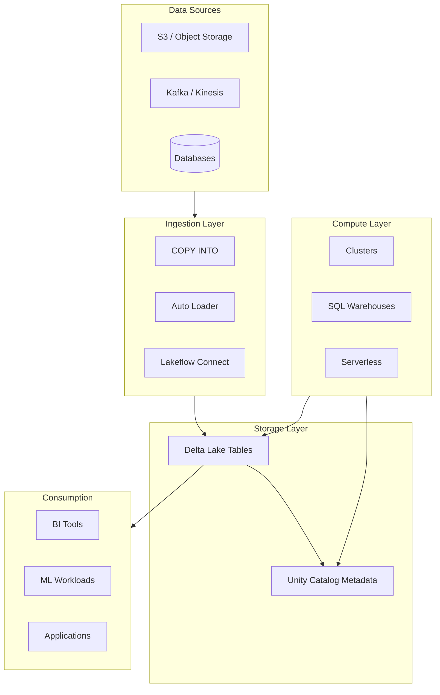
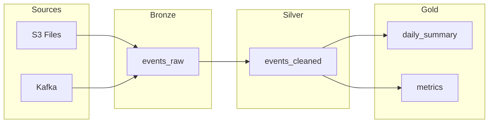

# Databricks: Deep Dive for Data Engineers

A comprehensive guide to Databricks fundamentals and internals for Senior Data Engineers transitioning from Amazon Redshift.

---

## Table of Contents

1. [Introduction and Redshift Mental Model](#1-introduction-and-redshift-mental-model)
2. [Architecture Fundamentals](#2-architecture-fundamentals)
3. [Delta Lake Deep Dive](#3-delta-lake-deep-dive)
4. [Unity Catalog and Data Governance](#4-unity-catalog-and-data-governance)
5. [Medallion Architecture](#5-medallion-architecture)
6. [Compute Resources](#6-compute-resources)
7. [Data Ingestion](#7-data-ingestion)
8. [Structured Streaming](#8-structured-streaming)
9. [Jobs and Orchestration](#9-jobs-and-orchestration)
10. [Best Practices and Operational Guidance](#10-best-practices-and-operational-guidance)
11. [Appendix: Quick Reference](#11-appendix-quick-reference)

---

## 1. Introduction and Redshift Mental Model

### 1.1 Why This Guide Exists

If you're a Senior Data Engineer coming from Amazon Redshift, you're used to a **shared-nothing MPP data warehouse** with columnar storage, WLM (Workload Management), and tight AWS integration. Databricks is a different beast: a **lakehouse platform** built on Apache Spark, with compute fully decoupled from storage and open-table formats. This section maps your Redshift knowledge to Databricks concepts so you can navigate the platform quickly.

**Reference:** [Databricks Introduction](https://docs.databricks.com/aws/en/introduction/)

### 1.2 Redshift vs Databricks: Architecture Comparison

| Dimension | Amazon Redshift | Databricks |
|-----------|-----------------|------------|
| **Architecture** | MPP data warehouse (shared-nothing) | Lakehouse: Spark + Delta Lake on object storage |
| **Storage** | Columnar; RA3 separates compute from S3 | Delta Lake (Parquet + transaction log) in S3/ADLS/GCS |
| **Compute** | Fixed or elastic clusters; Concurrency Scaling | Ephemeral clusters, SQL warehouses, serverless |
| **Data format** | Redshift-native (compressed columnar) | Open: Delta, Parquet; interoperable |
| **SQL** | Redshift SQL (PostgreSQL dialect) | Spark SQL (ANSI SQL with extensions) |
| **Workload isolation** | WLM queues | Separate clusters or SQL warehouses per workload |
| **Orchestration** | External (Airflow, Step Functions) or stored procedures | Lakeflow Jobs (native) |
| **Governance** | IAM + Redshift grants | Unity Catalog (centralized, cross-workspace) |

### 1.3 Key Conceptual Mappings

| Redshift Concept | Databricks Equivalent |
|------------------|------------------------|
| Redshift cluster | **Cluster** (all-purpose, jobs) or **SQL warehouse** (BI/ad-hoc) |
| Redshift Spectrum | Delta Lake tables on S3; no separate "Spectrum"—all data is in Delta/Parquet |
| Concurrency Scaling | Serverless SQL warehouses; autoscaling clusters; multiple clusters |
| Redshift database/schema | **Catalog** and **Schema** in Unity Catalog (`catalog.schema.table`) |
| COPY from S3 | **COPY INTO** or **Auto Loader** for incremental ingestion |
| WLM | Separate compute (clusters/warehouses) per workload; job concurrency limits |
| VACUUM (Redshift) | **OPTIMIZE** + **VACUUM** in Delta (different semantics; see Section 3) |
| Unload to S3 | `INSERT OVERWRITE` or `COPY INTO` with Delta/Parquet; or use Delta Sharing |

### 1.4 When to Use Databricks vs Redshift

**Choose Databricks when:**

- You need **streaming**, **ML**, or **Python/Scala** workloads alongside SQL analytics
- You want a **single platform** for data engineering, analytics, and ML
- You need **open formats** (Delta, Parquet) for portability and multi-tool access
- You require **fine-grained governance** (Unity Catalog) across many workspaces
- Your data is diverse: structured, semi-structured, unstructured

**Choose Redshift when:**

- Your workload is **primarily SQL BI** with predictable patterns
- You need **deep AWS integration** (Glue, SageMaker, Lambda) and prefer managed AWS
- Cost predictability via **reserved instances** is critical
- You want minimal operational overhead for pure warehouse workloads

**References:**
- [Databricks vs Redshift: Key Differences 2024](https://getorchestra.io/guides/databricks-vs-amazon-redshift-key-differences-2024)
- [Redshift vs Databricks: Which Data Warehousing Solution? (Medium)](https://medium.com/operations-research-bit/redshift-vs-databricks-which-data-warehousing-solution-is-for-you-41735d2328a0)

### 1.5 Open-Source Foundation

Databricks is built on and manages several open-source projects:

- **Apache Spark** — Distributed compute engine
- **Delta Lake** — Transactional storage layer (Parquet + transaction log)
- **Unity Catalog** — Open-source governance (announced 2024)
- **MLflow** — ML lifecycle management
- **Delta Sharing** — Open protocol for sharing data

All tables on Databricks are **Delta tables by default** unless you explicitly use another format.

**Reference:** [Databricks Introduction — Managed Open Source](https://docs.databricks.com/aws/en/introduction/)

---

## 2. Architecture Fundamentals

### 2.0 Spark Execution Model (For Redshift Users)

**If you're coming from Redshift:** Redshift is a single MPP system. Spark is a **distributed execution framework**:

- **Driver** — Single node; coordinates the job; holds the logical plan and schedules tasks
- **Executors** — Worker nodes; run tasks; hold partitions of data in memory/disk
- **RDD / DataFrame** — Logical representation of data; actual data is partitioned across executors

A typical query: Driver compiles SQL to a logical plan → physical plan (with stages) → tasks scheduled to executors. Shuffles occur when data must move between executors (e.g. GROUP BY, JOIN). Tuning often means reducing shuffles and maximizing partition pruning.

**Reference:** [Apache Spark on Databricks](https://docs.databricks.com/aws/en/spark/)

### 2.1 The Lakehouse Architecture

A **data lakehouse** combines the benefits of data lakes (cheap, scalable storage; diverse data types) with those of data warehouses (ACID transactions, schema enforcement, BI performance). Databricks implements this with:

- **Delta Lake** — ACID transactions, schema enforcement, time travel
- **Unity Catalog** — Unified governance
- **Apache Spark** — Scalable compute decoupled from storage



**Reference:** [What is a Data Lakehouse?](https://docs.databricks.com/aws/en/lakehouse/)

### 2.2 Lake vs Warehouse vs Lakehouse

| | Data Lake | Data Warehouse | Lakehouse |
|--|-----------|----------------|----------|
| **Storage** | Raw files (Parquet, JSON, etc.) | Proprietary columnar | Open formats (Delta, Parquet) |
| **ACID** | Typically no | Yes | Yes (Delta) |
| **Schema** | Schema-on-read | Schema-on-write | Schema-on-write with evolution |
| **BI** | Limited | Optimized | Optimized |
| **ML** | Strong | Weak | Strong |
| **Cost** | Low | Higher | Low (object storage) |

The lakehouse gives you **one copy of data** for analytics, ML, and streaming—no syncing between a lake and a warehouse.

**Reference:** [What is a Data Lakehouse? — Lakehouse vs Lake vs Warehouse](https://docs.databricks.com/aws/en/lakehouse/)

### 2.3 Compute-Storage Decoupling

**If you're coming from Redshift:** With RA3, you already have compute-storage separation. In Databricks, this is the default: **all data lives in your cloud object store** (S3, ADLS, GCS). Compute (clusters, SQL warehouses) is ephemeral and connects to that storage. You can:

- Scale compute independently of data size
- Run multiple workloads (different clusters) on the same tables
- Use spot instances for cost savings without risking data

Data is never "in" the cluster—it's always read from and written to object storage. Delta tables are just directories of Parquet files plus a transaction log.

### 2.4 Data Flow: Ingestion → Processing → Serving

1. **Ingestion** — Raw data lands in bronze tables (COPY INTO, Auto Loader, connectors)
2. **Processing** — Transformations in silver (cleansing, deduplication) and gold (aggregation)
3. **Serving** — Gold tables feed BI, ML, and applications

This is the **medallion architecture** (Section 5).

**Reference:** [What is a Data Lakehouse? — How does it work?](https://docs.databricks.com/aws/en/lakehouse/)

### 2.5 Workspace and Organization

- **Workspace** — Environment for notebooks, jobs, dashboards, and data exploration. Each workspace has a URL (e.g. `https://xxx.cloud.databricks.com`).

- **Notebook** — Web-based interface for code (SQL, Python, Scala, R) with runnable cells. Replaces ad-hoc SQL scripts and stored procedures.

- **Git folder (Repos)** — Folder synced with a Git repo for version control. Use for production code.

- **Library** — Code package attached to a cluster (e.g. PyPI, Maven). Prefer cluster-scoped libraries for reproducibility.

- **Account** — Top-level Databricks account. Contains workspaces, metastores, and users.

- **Metastore** — Unity Catalog metadata container. Typically one per region. Catalogs and schemas live in a metastore.

- **DBFS (Databricks File System)** — Abstraction over object storage. Paths like `dbfs:/mnt/` or `/dbfs/mnt/`. Used for checkpoint locations, temp data, and some legacy patterns. Prefer Unity Catalog volumes for new development.

- **Volumes** — Unity Catalog object for unstructured/semi-structured data (files, not tables). Path: `'/Volumes/catalog/schema/volume_name/'`. Use for landing zones, model artifacts, etc.

**Reference:** [Databricks Getting Started — Concepts](https://docs.databricks.com/aws/en/getting-started/concepts), [What are Unity Catalog volumes?](https://docs.databricks.com/aws/en/volumes/)

---

## 3. Delta Lake Deep Dive

### 3.1 Core Concepts

Delta Lake extends **Parquet** with a **transaction log** to provide ACID guarantees. On Databricks, every table you create is a Delta table unless you specify otherwise.

**Formula:** `Delta Lake = Parquet data files + JSON/Parquet transaction log`

**Reference:** [What is Delta Lake in Databricks?](https://docs.databricks.com/aws/en/delta/)

### 3.2 ACID Guarantees

| Property | Meaning |
|----------|---------|
| **Atomicity** | All changes in a transaction succeed or fail as a unit |
| **Consistency** | Readers see a consistent view of data |
| **Isolation** | Concurrent operations don't corrupt data |
| **Durability** | Committed changes persist (in object storage) |

Databricks uses **WriteSerializable** isolation by default—stronger than snapshot isolation for writers. Reads use snapshot isolation.

**Reference:** [What are ACID guarantees on Databricks?](https://docs.databricks.com/aws/en/lakehouse/acid)

### 3.3 Transaction Log Internals

Every Delta table has a `_delta_log/` directory alongside its data files.

```text
/path/to/table/
├── part-00000-xxx.parquet
├── part-00001-xxx.parquet
└── _delta_log/
    ├── 00000000000000000000.json   # Commit 0
    ├── 00000000000000000001.json   # Commit 1
    ├── 00000000000000000002.json   # Commit 2
    └── 00000000000000000010.checkpoint.parquet  # Aggregated checkpoint
```

#### How a Commit Works

1. **Writer** prepares the set of actions (AddFile, RemoveFile, Metadata, etc.)
2. **Writer** writes a new JSON file with the next sequential version number (e.g. `00000000000000000003.json`)
3. **Object storage** provides atomic put: the file either exists fully or not at all
4. **Readers** determine the latest version by listing `_delta_log/` and taking the highest version number

#### JSON Action Types

| Action | Purpose |
|--------|---------|
| `AddFile` | Adds a data file to the table; includes path, size, partition values, stats |
| `RemoveFile` | Marks a file as removed (e.g. after DELETE, UPDATE, OPTIMIZE) |
| `Metadata` | Schema, partitioning, table properties |
| `Protocol` | Reader/writer version requirements |

**Example JSON commit (simplified):**

```json
{"add":{"path":"part-00001.parquet","size":12345,"partitionValues":{"date":"2024-01-15"},"stats":"{\"numRecords\":1000,\"min\":{\"id\":1},\"max\":{\"id\":1000}}"}}
{"remove":{"path":"part-00000.parquet"}}
{"metadata":{"schema":{"fields":[{"name":"id","type":"long"},{"name":"date","type":"string"}],"partitionColumns":["date"]}}}
```

Each line in the JSON file is one action. Multiple actions can appear in a single commit.

#### Checkpoints

When the log grows (e.g. every 10 commits), Delta writes a **checkpoint** Parquet file. It contains the full state at that version. Readers can:

- Read the latest checkpoint
- Replay only the JSON files after it

This avoids replaying thousands of commits for large tables.

**Protocol:** [Delta Transaction Log Protocol](https://github.com/delta-io/delta/blob/master/PROTOCOL.md)

### 3.4 File Layout and Optimization

#### OPTIMIZE (Bin-Packing)

Small files hurt scan performance. `OPTIMIZE` rewrites small Parquet files into larger ones (bin-packing):

```sql
OPTIMIZE my_catalog.my_schema.my_table;

-- Optimize a single partition
OPTIMIZE my_table WHERE date = '2024-01-15';
```

- Idempotent: running twice has no extra effect
- Readers use snapshot isolation: they are not blocked
- **Predictive optimization** can run OPTIMIZE automatically for Unity Catalog managed tables

**Reference:** [Optimize data file layout](https://docs.databricks.com/aws/en/delta/optimize)

#### Z-ORDER

Clusters data by column values to improve predicate pushdown and data skipping:

```sql
OPTIMIZE my_table ZORDER BY (customer_id, date);
```

Use Z-ORDER on columns you filter/join on frequently. Databricks recommends **liquid clustering** over Z-ORDER for new tables when supported.

#### Liquid Clustering

Newer alternative to partitioning and Z-ORDER. Define clustering keys; Delta maintains clustering automatically. Supports `OPTIMIZE FULL` for full reclustering.

**Reference:** [Use liquid clustering for tables](https://docs.databricks.com/aws/en/delta/clustering)

#### Data Skipping

Delta stores min/max stats per file. Queries with filters can skip files that cannot contain matching rows. Z-ORDER and clustering improve this.

### 3.5 VACUUM

`VACUUM` removes data files that are no longer needed for the current table version and are older than the retention threshold (default 7 days).

```sql
VACUUM my_table;

VACUUM my_table DRY RUN;  -- Preview files to delete

VACUUM my_table LITE;     -- Use log-only (faster for large tables)
```

**Critical:** After `VACUUM`, you **cannot** time-travel to versions that relied on deleted files. Keep retention ≥ 7 days for most use cases.

**Reference:** [Remove unused data files with vacuum](https://docs.databricks.com/aws/en/delta/vacuum)

### 3.6 Time Travel and History

Every write creates a new **table version**. You can query past versions:

```sql
-- By timestamp
SELECT * FROM my_table TIMESTAMP AS OF '2024-01-15 10:00:00';

-- By version
SELECT * FROM my_table VERSION AS OF 42;

-- Restore to a previous version
RESTORE TABLE my_table TO VERSION AS OF 42;
RESTORE TABLE my_table TO TIMESTAMP AS OF '2024-01-15 10:00:00';
```

**History:**

```sql
DESCRIBE HISTORY my_table;
DESCRIBE HISTORY my_table LIMIT 5;
```

Output includes: `version`, `timestamp`, `userId`, `operation`, `operationMetrics`, `readVersion`, etc.

**Retention:** Time travel is limited by `delta.deletedFileRetentionDuration` (default 7 days). History is limited by `logRetentionDuration` (default 30 days).

**Reference:** [Work with table history](https://docs.databricks.com/aws/en/delta/history)

### 3.7 MERGE (Upsert)

`MERGE` is the primary upsert primitive in Delta Lake.

**Basic MERGE (insert + update):**

```sql
MERGE INTO target t
USING source s
ON t.id = s.id
WHEN MATCHED THEN UPDATE SET *
WHEN NOT MATCHED THEN INSERT *;
```

**MERGE with deletes (incremental sync):**

```sql
MERGE INTO target t
USING (SELECT * FROM source WHERE created_at >= current_date() - INTERVAL 5 DAYS) s
ON t.key = s.key
WHEN MATCHED THEN UPDATE SET *
WHEN NOT MATCHED THEN INSERT *
WHEN NOT MATCHED BY SOURCE AND t.created_at >= current_date() - INTERVAL 5 DAYS THEN DELETE;
```

- `WHEN MATCHED` — Source row matches target
- `WHEN NOT MATCHED` — Source row has no match (insert)
- `WHEN NOT MATCHED BY SOURCE` — Target row has no match in source (update or delete)

**Deduplication pattern:**

```sql
MERGE INTO logs
USING (SELECT DISTINCT * FROM new_logs) n
ON logs.unique_id = n.unique_id
WHEN NOT MATCHED THEN INSERT *;
```

#### MERGE Internals: How It Executes

1. **Read phase** — Read source and target; identify matched/unmatched rows using the join condition
2. **Partition pruning** — If target is partitioned and the match condition includes partition columns, Databricks can skip entire partitions (dynamic file pruning, requires Photon)
3. **Rewrite phase** — For matched rows, rewritten files exclude old versions and include updates; new files are added for inserts
4. **Transaction commit** — Single atomic commit with AddFile and RemoveFile actions

**Important:** Only one source row may match each target row. If the source has duplicates on the match key, pre-deduplicate with `SELECT DISTINCT` or a window function.

#### SCD Type 2 with MERGE

```sql
MERGE INTO dim_customer target
USING (
  SELECT *, current_timestamp() AS valid_from, '9999-12-31' AS valid_to
  FROM staging_customers
) source
ON target.customer_id = source.customer_id AND target.is_current = true
WHEN MATCHED AND target.email <> source.email THEN
  UPDATE SET is_current = false, valid_to = current_timestamp()
WHEN NOT MATCHED THEN
  INSERT (customer_id, name, email, valid_from, valid_to, is_current)
  VALUES (source.customer_id, source.name, source.email, source.valid_from, source.valid_to, true);
```

**Reference:** [Upsert into a Delta Lake table using merge](https://docs.databricks.com/aws/en/delta/merge)

### 3.7.1 Selective Overwrite

Overwrite only data matching a predicate instead of the full table:

```sql
INSERT OVERWRITE catalog.schema.table
SELECT * FROM source
WHERE partition_col = '2024-01-15';
```

Or with Delta's dynamic overwrite (partition overwrite mode):

```python
df.write.format("delta").mode("overwrite") \
  .option("replaceWhere", "date >= '2024-01-01'") \
  .saveAsTable("catalog.schema.table")
```

**Use case:** Refresh a single partition without touching others. More efficient than full overwrite.

**Reference:** [Selectively overwrite data with Delta Lake](https://docs.databricks.com/aws/en/delta/selective-overwrite)

### 3.8 Schema Evolution

- **mergeSchema** — Add new columns when writing; existing rows get NULL for new columns.
- **Column mapping** — Rename or drop columns without rewriting data (when enabled).
- **Constraints** — `NOT NULL`, `CHECK` constraints (Databricks Runtime 11.3+).

```sql
-- Enable mergeSchema on write
INSERT INTO my_table SELECT * FROM source;
-- Or: spark.conf.set("spark.databricks.delta.schema.autoMerge.enabled", "true")

-- Add a constraint
ALTER TABLE my_table ADD CONSTRAINT positive_id CHECK (id > 0);
```

**Delta constraints** — Enforce at write time:

```sql
ALTER TABLE my_table ADD CONSTRAINT valid_date CHECK (event_date >= '2020-01-01');
ALTER TABLE my_table ADD CONSTRAINT not_null_id CHECK (id IS NOT NULL);
```

Violations cause the write to fail. Use for critical invariants.

**Reference:** [Update table schema](https://docs.databricks.com/aws/en/delta/update-schema), [Constraints on Databricks](https://docs.databricks.com/aws/en/tables/constraints)

### 3.9 Data Skipping and Statistics

Delta stores **per-file statistics** (min, max, null count) in the transaction log. For a query like `WHERE date = '2024-01-15'`:

1. Delta reads the log and gets file-level stats
2. Files where `max(date) < '2024-01-15'` or `min(date) > '2024-01-15'` are skipped
3. Only files that might contain matching rows are read

**Z-ORDER** improves this by physically clustering data by key columns, so min/max ranges are tighter per file.

**Reference:** [Data skipping](https://docs.databricks.com/aws/en/delta/data-skipping)

### 3.10 Delta Table Properties

Key table properties for tuning:

| Property | Default | Purpose |
|----------|---------|---------|
| `delta.autoOptimize.optimizeWrite` | false | Auto compact small files on write |
| `delta.autoOptimize.autoCompact` | false | Auto compact after write |
| `delta.deletedFileRetentionDuration` | 7 days | Min age before VACUUM can delete files; affects time travel |
| `delta.logRetentionDuration` | 30 days | How long to keep transaction log entries |
| `delta.tuneFileSizesForRewrites` | true | Optimize file sizes during rewrites |

```sql
ALTER TABLE my_table SET TBLPROPERTIES (
  'delta.deletedFileRetentionDuration' = '7 days',
  'delta.autoOptimize.optimizeWrite' = 'true'
);
```

**Reference:** [Table properties reference](https://docs.databricks.com/aws/en/delta/table-properties)

### 3.10.1 Inspecting Table Details

```sql
DESCRIBE DETAIL catalog.schema.table;
```

Returns: `format`, `location`, `createdAt`, `lastModified`, `numFiles`, `sizeInBytes`, `properties`, `minReaderVersion`, `minWriterVersion`, etc. Use for debugging and understanding table state.

**Reference:** [Review table details with describe detail](https://docs.databricks.com/aws/en/delta/table-details)

### 3.11 Spark Configuration for Delta

Key Spark configs for Delta tuning:

| Config | Purpose |
|--------|---------|
| `spark.databricks.delta.optimizeWrite.enabled` | Auto compact small files on write |
| `spark.databricks.delta.autoCompact.minNumFiles` | Min files before auto compact (default 10) |
| `spark.databricks.delta.properties.defaults.xxx` | Default table properties for new tables |
| `spark.databricks.delta.schema.autoMerge.enabled` | Allow schema evolution on write |

Set at cluster or session level. Prefer table properties for table-specific settings.

### 3.12 Delta Clone and Change Data Feed

#### Clone

Create a copy of a table without copying data files:

```sql
CREATE TABLE new_table CLONE source_table;           -- Shallow: references same files
CREATE TABLE new_table DEEP CLONE source_table;      -- Deep: copies data
```

**Shallow clone** — Shares underlying files; changes to source don't affect clone. Useful for testing, branching.

**Deep clone** — Full copy; independent of source. Use for prod copies, migration.

#### Change Data Feed (CDF)

Track row-level changes (INSERT, UPDATE, DELETE) for CDC downstream:

```sql
ALTER TABLE my_table SET TBLPROPERTIES (delta.enableChangeDataFeed = true);
```

Then read changes:

```sql
SELECT * FROM table_changes('my_table', 0, 10);
```

**Reference:** [Delta Lake change data feed](https://docs.databricks.com/aws/en/delta/delta-change-data-feed), [Clone a Delta table](https://docs.databricks.com/aws/en/delta/clone)

---

## 4. Unity Catalog and Data Governance

### 4.1 Object Model

Unity Catalog uses a three-level hierarchy:

```text
Metastore
  └── Catalog
        └── Schema
              └── Table, View, Volume, Function, Model
```

**Full name:** `catalog.schema.object` (e.g. `prod_analytics.silver.customers`)

**Redshift mapping:** Redshift database ≈ Catalog; Redshift schema ≈ Schema. Unity Catalog adds the catalog level for better isolation (e.g. `dev`, `staging`, `prod`).

**Reference:** [What is Unity Catalog?](https://docs.databricks.com/aws/en/data-governance/unity-catalog/)

### 4.2 Managed vs External Tables

**When to use external:** You have existing data in S3/ADLS that other tools write to; you want to register it in Unity Catalog without moving files. Or you need to write to the same location from outside Databricks.

**When to use managed:** New development; full control over lifecycle; Delta-only. Preferred for most use cases.

| | Managed | External |
|--|---------|----------|
| **Lifecycle** | UC manages data; DROP deletes data | UC manages access only; data stays in your storage |
| **Format** | Delta only | Delta, Parquet, CSV, JSON, etc. |
| **Location** | UC-managed path (configurable per catalog/schema) | You specify external path |
| **Use case** | New tables, full control | Existing data, multi-tool write access |

**Managed storage hierarchy:** Metastore → Catalog → Schema. A table's location is resolved:

1. If schema has a location → use it
2. Else if catalog has a location → use `{catalog_location}/{schema_name}/`
3. Else use metastore default location

Example: Catalog `hr_prod` has location `s3://mycompany-hr-prod/unity-catalog/`. Table `hr_prod.payroll.employees` is stored at `s3://mycompany-hr-prod/unity-catalog/payroll/employees/`.

**Reference:** [Unity Catalog — Managed versus external](https://docs.databricks.com/aws/en/data-governance/unity-catalog/)

### 4.3 Securable Objects for External Data

- **Storage credentials** — Long-lived cloud credentials (e.g. IAM role) for storage access
- **External locations** — Path + storage credential; used for external tables and volumes

These let Unity Catalog govern access to data in your own buckets.

### 4.4 Access Control

Standard ANSI SQL:

```sql
GRANT SELECT ON TABLE catalog.schema.table TO `analytics-team`;
GRANT CREATE TABLE ON SCHEMA catalog.schema TO `data-engineering`;
REVOKE ALL PRIVILEGES ON TABLE catalog.schema.table FROM `user@example.com`;
```

**Principle of least privilege:** By default users have minimal access. Workspace catalog is auto-created for experimentation.

**Key privileges:**

| Object | Privileges |
|--------|------------|
| Catalog | `USE CATALOG`, `CREATE SCHEMA`, `USE SCHEMA`, `CREATE TABLE`, etc. |
| Schema | `USE SCHEMA`, `CREATE TABLE`, `CREATE FUNCTION`, etc. |
| Table | `SELECT`, `MODIFY`, `ALL PRIVILEGES` |
| Volume | `READ VOLUME`, `WRITE VOLUME` |

**Ownership:** Object owners can grant/revoke. Metastore admins can manage all objects.

**Reference:** [Manage privileges in Unity Catalog](https://docs.databricks.com/aws/en/data-governance/unity-catalog/manage-privileges/)

### 4.5 Workspace-Catalog Binding

You can restrict which catalogs are visible in which workspaces (e.g. prod catalog only in prod workspace). This supports environment isolation.

### 4.6 Delta Sharing (Data Sharing)

Unity Catalog supports **Delta Sharing** — an open protocol for sharing data with external consumers (other Databricks workspaces, BI tools, Python/R). Create shares (read-only collections of tables); recipients query without copying data.

**Redshift mapping:** Similar to Redshift data sharing, but uses open protocol and supports non-Redshift consumers.

---

## 5. Medallion Architecture

### 5.1 Bronze, Silver, Gold

| Layer | Purpose | Characteristics |
|-------|---------|-----------------|
| **Bronze** | Raw ingestion | Append-only, minimal transformation, preserve fidelity |
| **Silver** | Cleansed, validated | Deduplication, type casting, joins, schema enforcement |
| **Gold** | Business-ready | Aggregated, dimensional, optimized for consumption |

**Reference:** [What is the medallion lakehouse architecture?](https://docs.databricks.com/aws/en/lakehouse/medallion)

### 5.2 Bronze Layer

- Ingest from S3, Kafka, databases, etc.
- Store as Delta; prefer string/VARIANT for raw fields to handle schema drift
- Add metadata (e.g. `_metadata.file_name`, `_ingestion_timestamp`)
- Minimal validation

### 5.3 Silver Layer

- Read from bronze (prefer streaming reads for append-only sources)
- Deduplicate, cast types, handle nulls
- Enforce schema; resolve late and out-of-order data
- One validated, non-aggregated representation per entity

### 5.4 Gold Layer

- Read from silver
- Aggregate for reporting (e.g. daily summaries by region)
- Optimize with Z-ORDER or liquid clustering
- Model for BI (star/snowflake)

**Example:**

```sql
-- Gold: Weekly sales summary
CREATE OR REPLACE TABLE catalog.gold.weekly_sales AS
SELECT week, prod_id, region,
       SUM(units) AS total_units,
       SUM(units * rate) AS total_sales
FROM catalog.silver.orders
GROUP BY week, prod_id, region;
```

### 5.5 Complete Medallion Flow Example

```sql
-- Bronze: Raw ingestion (run via COPY INTO or Auto Loader job)
CREATE TABLE catalog.bronze.events (
  event_id STRING,
  user_id STRING,
  event_type STRING,
  payload STRING,  -- Keep raw as string for flexibility
  _ingestion_timestamp TIMESTAMP,
  _source_file STRING
);

-- Silver: Deduplicated, typed, cleansed
CREATE OR REPLACE TABLE catalog.silver.events AS
SELECT
  event_id,
  user_id,
  event_type,
  from_json(payload, 'struct<amount:double, item:string>') AS payload_struct,
  _ingestion_timestamp
FROM (
  SELECT *, row_number() OVER (PARTITION BY event_id ORDER BY _ingestion_timestamp DESC) AS rn
  FROM catalog.bronze.events
)
WHERE rn = 1;

-- Gold: Aggregated for analytics
CREATE OR REPLACE TABLE catalog.gold.daily_user_activity AS
SELECT
  date_trunc('day', _ingestion_timestamp) AS activity_date,
  user_id,
  count(*) AS event_count,
  count(DISTINCT event_type) AS event_types_seen
FROM catalog.silver.events
GROUP BY 1, 2;
```

### 5.6 Ingestion Frequency vs Cost vs Latency

| Mode | Cost | Latency | Use case |
|------|------|---------|----------|
| Continuous (streaming) | Higher | Lowest | Real-time pipelines |
| Scheduled (e.g. hourly) | Lower | Higher | Batch ETL |
| Batch (daily) | Lowest | Highest | Historical loads |

**Reference:** [Medallion architecture — Control costs](https://docs.databricks.com/aws/en/lakehouse/medallion)

### 5.7 Medallion Data Flow Diagram



---

## 6. Compute Resources

### 6.1 Overview

| Type | Use case | Management |
|------|----------|------------|
| **Serverless** | Notebooks, jobs, pipelines | Fully managed; no config |
| **Classic clusters** | Custom workloads, libraries | You configure size, autoscaling |
| **SQL warehouses** | BI, ad-hoc SQL | Serverless or classic; optimized for SQL |

**Reference:** [Compute](https://docs.databricks.com/aws/en/compute/)

### 6.2 Clusters

- **Standard** — Shared across users; Lakeguard provides isolation
- **Dedicated** — Single-user; stronger isolation
- **Instance pools** — Pre-warmed instances to reduce startup time. Reuse pools across clusters to reduce cold-start time.

**Cluster configuration for jobs:** Use smaller driver (e.g. i3.xlarge) + more workers for data-parallel workloads. Use larger driver for collect-heavy or driver-bound jobs.

- **Access modes** — For Unity Catalog, use "standard" or "dedicated" (not "no isolation"). Standard allows multi-user sharing with Lakeguard isolation; dedicated gives single-user isolation.
- **Autoscaling** — Configure min/max workers. Scale up under load; scale down when idle to save cost.

### 6.3 SQL Warehouses

Purpose: run SQL queries (query editor, BI tools, dashboards). Not for Spark/Python workloads.

**Types:**

- **Serverless** — Auto-provisioning, pay per query; recommended when available. No idle cost; scales to zero.
- **Pro** — Balanced cost/performance; good for mixed workloads
- **Classic** — Full control over sizing; for predictable, high-volume BI

**Sizing:** Choose size (Small to 4X-Large) and min/max clusters for autoscaling. Larger = more memory and parallelism per query. Queuing applies when all clusters are busy.

**If you're coming from Redshift:** A SQL warehouse is analogous to a Redshift cluster dedicated to BI. Use separate warehouses for different workload tiers (e.g. ad-hoc vs dashboards).

**Reference:** [Connect to a SQL warehouse](https://docs.databricks.com/aws/en/compute/sql-warehouse/), [SQL warehouse sizing and scaling](https://docs.databricks.com/aws/en/compute/sql-warehouse/warehouse-behavior)

### 6.4 Photon Engine

Photon is Databricks' native **vectorized** engine. It accelerates:

- SQL and DataFrame workloads
- Delta/Parquet reads and writes (including MERGE, UPDATE, DELETE)
- Joins (hash joins instead of sort-merge)
- Aggregations

#### How Photon Differs from Spark

| Aspect | Standard Spark | Photon |
|--------|----------------|--------|
| **Execution** | Row-at-a-time (volcano model) | Vectorized (columnar batches) |
| **Joins** | Sort-merge by default | Hash joins |
| **Code path** | JVM | C++ (native) |
| **UDF support** | Yes | No (falls back to Spark) |

#### Photon-Required Features

- **Dynamic file pruning** in MERGE, UPDATE, DELETE — skips files that cannot contain matching rows
- **H3 geospatial** functions
- **Predictive I/O** — prefetching for reads/writes

**Enable:** On by default for serverless and SQL warehouses; opt-in for classic clusters (Runtime 9.1 LTS+).

**Limitations:** No UDFs, RDDs, or Dataset APIs. Falls back to standard engine for unsupported operations.

**Reference:** [What is Photon?](https://docs.databricks.com/aws/en/compute/photon)

---

## 7. Data Ingestion

### 7.1 COPY INTO

`COPY INTO` loads files from cloud storage into a Delta table. It is **idempotent**: files already loaded are skipped.

```sql
COPY INTO catalog.schema.my_table
FROM 's3://bucket/path/to/data/'
FILEFORMAT = PARQUET;

-- With options
COPY INTO my_table
FROM 's3://bucket/events/'
FILEFORMAT = JSON
FORMAT_OPTIONS ('mergeSchema' = 'true')
COPY_OPTIONS ('mergeSchema' = 'true');
```

**Supported formats:** CSV, JSON, XML, Avro, ORC, Parquet, text, binary.

#### Full COPY INTO Example with Schema

```sql
-- Create target table with schema
CREATE TABLE catalog.schema.loan_risks (
  loan_id BIGINT,
  funded_amnt INT,
  paid_amnt DOUBLE,
  addr_state STRING
);

-- Load from Parquet
COPY INTO catalog.schema.loan_risks
FROM 's3://my-bucket/loans/'
FILEFORMAT = PARQUET;

-- With format options (e.g. CSV)
COPY INTO catalog.schema.events
FROM 's3://my-bucket/events/'
FILEFORMAT = CSV
FORMAT_OPTIONS (
  'header' = 'true',
  'delimiter' = ',',
  'mergeSchema' = 'true'
);
```

**Idempotency:** Files already loaded (by path) are skipped. Safe to run repeatedly (e.g. in a job).

**Force mode:** `COPY INTO ... FORCE` reprocesses all files (ignores skip). Use when schema or logic changed and you need a full reload.

**Patterns:**
- Run COPY INTO on a schedule (e.g. every hour) to poll for new files
- Use Auto Loader instead when you have many files or need schema evolution
- For Unity Catalog volumes: `FROM '/Volumes/catalog/schema/volume/path/'`

**Reference:** [Get started using COPY INTO](https://docs.databricks.com/aws/en/ingestion/cloud-object-storage/copy-into/)

### 7.2 Auto Loader

Auto Loader incrementally processes **new** files as they arrive. Built on Structured Streaming with the `cloudFiles` source.

**Benefits over plain file streaming:**

- File notification mode (S3 Event Notifications, etc.) — cheaper than listing
- Schema inference and evolution
- Exactly-once via checkpoint (RocksDB)
- Scales to billions of files

**Example (Python):**

```python
(spark.readStream
  .format("cloudFiles")
  .option("cloudFiles.format", "json")
  .option("cloudFiles.schemaLocation", "/path/to/checkpoint/schema")
  .load("s3://bucket/landing/")
  .writeStream
  .option("checkpointLocation", "/path/to/checkpoint")
  .table("catalog.schema.bronze_events"))
```

#### Auto Loader File Detection Modes

| Mode | How it works | Cost | Use case |
|------|--------------|------|----------|
| **Directory listing** | Periodically lists all files under the path | Higher (many LIST calls) | Simple setups, smaller scale |
| **File notification** | Uses cloud-native events (e.g. S3 Event Notifications) to discover new files | Lower | Production; millions of files |

With file notification, Auto Loader sets up a queue/event subscription. New files trigger events; Auto Loader processes only what's new. No repeated directory scans.

#### Schema Inference and Evolution

Auto Loader infers schema from sampled files. Schema is written to `schemaLocation`. When new files arrive with **new or different columns**:

- `mergeSchema` (or default in Lakeflow): New columns are added; existing rows get NULL
- Invalid or incompatible types can be rescued to a separate column or rejected (configurable)

**Reference:** [What is Auto Loader?](https://docs.databricks.com/aws/en/ingestion/cloud-object-storage/auto-loader/)

### 7.3 Lakeflow Connect (Managed Connectors)

For ingesting from **external systems** (MySQL, PostgreSQL, Kafka, Kinesis, EventHub, etc.), use **Lakeflow Connect** (managed connectors). Configure a connection; Databricks provisions and manages the connector infrastructure.

**Supported sources:** Databases (CDC), message buses (Kafka, Kinesis, Pub/Sub, EventHub, Pulsar). Data lands in Delta tables.

**Redshift mapping:** Similar to AWS DMS or Glue for database CDC; Databricks manages the connector.

**Reference:** [Managed connectors in Lakeflow Connect](https://docs.databricks.com/aws/en/ingestion/lakeflow-connect/)

### 7.4 Lakeflow Spark Declarative Pipelines

Declarative pipelines with **streaming tables** and **materialized views**. Less code, managed checkpoints and schema evolution.

**Concepts:**

- **Streaming table** — Delta table updated continuously from a streaming source (e.g. Auto Loader, Kafka). Defined with `CREATE STREAMING TABLE` or Python/SQL in a pipeline.
- **Materialized view** — Batch table refreshed on a schedule. Defined with `CREATE MATERIALIZED VIEW`.
- **Pipeline** — DAG of streaming tables and materialized views; dependencies managed automatically.

**Example (SQL):**

```sql
CREATE OR REPLACE STREAMING TABLE catalog.bronze.events
AS SELECT * FROM cloud_files('s3://bucket/events/', 'json');

CREATE OR REPLACE MATERIALIZED VIEW catalog.gold.daily_counts
AS SELECT date, count(*) AS cnt
FROM catalog.bronze.events
GROUP BY date;
```

**When to use:**

| Tool | Best for |
|------|----------|
| **COPY INTO** | Batch, scheduled, known schema |
| **Auto Loader** | Incremental file ingestion, schema evolution |
| **Lakeflow Pipelines** | End-to-end pipelines with minimal configuration, streaming + batch in one DAG |

**Expectations (data quality):** Lakeflow pipelines support expectations (e.g. `expect_or_fail`, `expect_or_drop`). Define rules on columns; invalid rows are dropped or fail the pipeline.

**Reference:** [Lakeflow Spark Declarative Pipelines](https://docs.databricks.com/aws/en/ldp/), [Expectations in pipelines](https://docs.databricks.com/aws/en/ldp/expectations)

---

## 8. Structured Streaming

### 8.1 Concepts

Structured Streaming is Spark's micro-batch streaming engine:

- Same APIs as batch (DataFrame, SQL)
- Exactly-once semantics with checkpoints
- Sources: Delta, Kafka, Kinesis, cloud storage (via Auto Loader)

**Reference:** [Structured Streaming concepts](https://docs.databricks.com/aws/en/structured-streaming/concepts)

### 8.2 How Micro-Batches Work

1. **Trigger** fires (e.g. every 30 seconds, or when data is available)
2. **Source** returns the next batch of data (Kafka offsets, new files, etc.)
3. **Processing** runs as a Spark batch job on that data
4. **Sink** writes output; checkpoint records progress
5. On failure, the job restarts and replays from the last checkpoint

**Exactly-once:** The checkpoint stores (source offsets, batch ID). The sink uses idempotent writes (e.g. Delta's transaction log). No duplicate or lost data.

### 8.3 Checkpoints

Each streaming query has a **checkpoint location**. It stores:

- Committed batch IDs
- Source offsets (Kafka, file paths, etc.)
- Sink metadata

**Critical:** Never reuse a checkpoint for a different query. Never delete a checkpoint while the query is running. Use unique checkpoint paths per query.

### 8.4 Triggers

| Trigger | Behavior |
|---------|----------|
| `Trigger.ProcessingTime("30 seconds")` | Run every 30 seconds |
| `Trigger.Once()` | Single batch, then stop (useful for backfills) |
| `Trigger.AvailableNow()` | Process all available data, then stop |
| `Trigger.Continuous("1 second")` | Low-latency continuous processing (experimental) |

### 8.5 Output Modes

| Mode | Behavior |
|------|----------|
| **Append** | Only new rows (default for most sinks) |
| **Complete** | Full result table each batch (aggregations) |
| **Update** | Only changed rows (supported for some sinks) |

Delta Lake streaming writes typically use **Append**.

### 8.6 Delta + Streaming

- **Streaming read:** `spark.readStream.format("delta").table("...")` — process new data as it arrives
- **Streaming write:** `df.writeStream.format("delta").option("checkpointLocation", "...").start()`
- **Change Data Feed** — Enables `_change_data`; track row-level INSERT/UPDATE/DELETE for CDC

**Redshift mapping:** Redshift streaming inserts are single-row. Structured Streaming is micro-batch at scale.

### 8.7 Full Streaming Example

```python
# Read from Kafka, write to Delta with exactly-once
df = (spark.readStream
  .format("kafka")
  .option("kafka.bootstrap.servers", "host:9092")
  .option("subscribe", "events")
  .load())

# Parse JSON value
from pyspark.sql.functions import from_json, col
from pyspark.sql.types import StructType, StructField, StringType, LongType

schema = StructType([
  StructField("event_id", StringType()),
  StructField("user_id", StringType()),
  StructField("event_type", StringType()),
  StructField("timestamp", LongType())
])

parsed = df.select(
  from_json(col("value").cast("string"), schema).alias("data")
).select("data.*")

(parsed.writeStream
  .format("delta")
  .option("checkpointLocation", "/mnt/delta/checkpoints/events")
  .outputMode("append")
  .table("catalog.schema.events"))
```

---

## 9. Jobs and Orchestration

### 9.1 Lakeflow Jobs

- **Job** — Container for tasks and trigger
- **Task** — Unit of work (notebook, Python script, pipeline, etc.)
- **Trigger** — When to run (schedule, event, manual)

Tasks form a **DAG**. Use conditional logic (if/else, for each) for complex workflows.

**Reference:** [Lakeflow Jobs](https://docs.databricks.com/aws/en/jobs/)

### 9.2 Task Types

| Type | Purpose |
|------|---------|
| **Notebook** | Run a Databricks notebook with optional parameters |
| **Python script** | Run a Python file from a path or Git |
| **Pipeline** | Run a Lakeflow pipeline (streaming table, materialized view) |
| **SQL** | Run a SQL statement |
| **Wheel** | Run a Python package (e.g. dbt, custom ETL) |
| **Spark Submit** | Run a Spark application |

### 9.3 Triggers

| Trigger | Use case |
|---------|----------|
| **Schedule** | Cron expression (e.g. `0 0 2 * * ?` for 2 AM daily) |
| **Event** | File arrival in cloud storage, table change |
| **Manual** | On-demand run |
| **Continuous** | Always-running pipeline (streaming) |

### 9.4 Example: Daily ETL Job with Conditional Logic

```text
[Trigger: Daily 2 AM]
       |
       v
[Task 1: Ingest] ---> [Task 2: Transform Bronze→Silver]
       |                        |
       |                        v
       |               [Task 3: Transform Silver→Gold]
       |                        |
       |                        v
       |               [Task 4: Data Quality Check]
       |                        |
       |              +---------+---------+
       |              |                   |
       |         [Success]            [Failure]
       |              |                   |
       |              v                   v
       |         [Complete]          [Notify + Alert]
       |
       v
[If Task 1 fails: Retry or notify]
```

**Redshift mapping:** Replace stored procedures + external scheduler (e.g. Airflow) with native Lakeflow Jobs.

### 9.5 CI/CD and Databricks Asset Bundles

For infrastructure-as-code and CI/CD:

- **Databricks Asset Bundles (DAB)** — Define jobs, pipelines, and resources in YAML. Deploy via CLI (`databricks bundle deploy`).
- **Git integration** — Link jobs to Git branches; run from specific commits.
- **REST API / SDK** — Create and manage jobs programmatically.

**Reference:** [Databricks Asset Bundles](https://docs.databricks.com/aws/en/dev-tools/bundles/)

---

## 10. Best Practices and Operational Guidance

### 10.1 Delta Lake

- **File size:** Target 64–128 MB per file (compact with OPTIMIZE). Too many small files hurt scan performance; too few very large files hurt parallelism.
- **OPTIMIZE:** Run daily for active tables; use predictive optimization when possible. For partitioned tables, use `WHERE partition = value` to optimize incrementally.
- **VACUUM:** Run regularly; keep retention ≥ 7 days. Use `DRY RUN` first to inspect. Consider `LITE` mode for large tables.
- **Partitioning:** Partition by high-cardinality filter columns (e.g. date); avoid over-partitioning (e.g. not by user_id). Prefer liquid clustering over partitions for flexible query patterns.
- **MERGE:** Deduplicate source before merge if duplicates exist. Use partition predicates in the ON clause when possible for dynamic file pruning.

### 10.2 Unity Catalog

- Prefer **managed tables** for new development
- Use **catalogs** for environment/domain isolation (e.g. `dev`, `prod`, `hr`)
- One metastore per region

### 10.3 Cost

- Use **spot instances** for batch jobs
- Enable **autoscaling** on clusters
- Use **Photon** for SQL-heavy workloads
- Use **serverless** where available to avoid idle cost

### 10.4 Redshift-Specific Tips

- **WLM** — In Databricks, use separate clusters or SQL warehouses per workload
- **RA3** — Storage is always in S3; understand Delta file layout for performance
- **Concurrency** — More flexibility: multiple clusters, serverless warehouses, job concurrency limits

### 10.5 Troubleshooting and Observability

- **Spark UI** — View stages, tasks, shuffles, and bottlenecks. Access via cluster or job run.
- **Query history** — SQL warehouse runs record queries; inspect plans and duration.
- **System tables** — `system.compute.warehouse_usage`, `system.operational_data.job_runs` for cost and run analysis.

### 10.6 Common Data Engineering Patterns

**Incremental load with watermark:**

```sql
MERGE INTO target t
USING (
  SELECT * FROM source
  WHERE updated_at > (SELECT coalesce(max(updated_at), '1900-01-01') FROM target)
) s ON t.id = s.id
WHEN MATCHED THEN UPDATE SET *
WHEN NOT MATCHED THEN INSERT *;
```

**Backfill + incremental:** Run a one-time backfill for historical data, then switch to incremental (Auto Loader or COPY INTO with partition filters).

**Idempotent pipelines:** Design jobs to be re-runnable. Use MERGE instead of INSERT where upsert semantics apply; use COPY INTO (idempotent) or checkpoints for streaming.

---

## 11. Appendix: Quick Reference

### 11.1 Key URLs

| Topic | URL |
|-------|-----|
| Introduction | [docs.databricks.com/.../introduction](https://docs.databricks.com/aws/en/introduction/) |
| Lakehouse | [docs.databricks.com/.../lakehouse](https://docs.databricks.com/aws/en/lakehouse/) |
| Delta Lake | [docs.databricks.com/.../delta](https://docs.databricks.com/aws/en/delta/) |
| Unity Catalog | [docs.databricks.com/.../unity-catalog](https://docs.databricks.com/aws/en/data-governance/unity-catalog/) |
| Medallion | [docs.databricks.com/.../medallion](https://docs.databricks.com/aws/en/lakehouse/medallion) |
| Compute | [docs.databricks.com/.../compute](https://docs.databricks.com/aws/en/compute/) |
| Jobs | [docs.databricks.com/.../jobs](https://docs.databricks.com/aws/en/jobs/) |
| Auto Loader | [docs.databricks.com/.../auto-loader](https://docs.databricks.com/aws/en/ingestion/cloud-object-storage/auto-loader/) |
| COPY INTO | [docs.databricks.com/.../copy-into](https://docs.databricks.com/aws/en/ingestion/cloud-object-storage/copy-into/) |
| Structured Streaming | [docs.databricks.com/.../concepts](https://docs.databricks.com/aws/en/structured-streaming/concepts) |

### 11.2 SQL Cheat Sheet

```sql
-- Create managed table
CREATE TABLE catalog.schema.table (id BIGINT, name STRING)
USING DELTA;

-- COPY INTO
COPY INTO catalog.schema.table FROM 's3://bucket/path/' FILEFORMAT = PARQUET;

-- MERGE
MERGE INTO target t USING source s ON t.id = s.id
WHEN MATCHED THEN UPDATE SET * WHEN NOT MATCHED THEN INSERT *;

-- OPTIMIZE
OPTIMIZE catalog.schema.table;
OPTIMIZE catalog.schema.table ZORDER BY (col1, col2);

-- VACUUM
VACUUM catalog.schema.table;

-- Time travel
SELECT * FROM table VERSION AS OF 10;
SELECT * FROM table TIMESTAMP AS OF '2024-01-15 10:00:00';
RESTORE TABLE table TO VERSION AS OF 10;

-- History
DESCRIBE HISTORY catalog.schema.table;
```

### 11.3 Glossary

| Term | Definition |
|------|------------|
| **Catalog** | Top-level container in Unity Catalog; contains schemas |
| **Cluster** | Ephemeral Spark compute for notebooks/jobs |
| **Delta Lake** | Storage format: Parquet + transaction log; default on Databricks |
| **Lakehouse** | Architecture combining lake + warehouse capabilities |
| **Metastore** | Unity Catalog container for metadata; one per region |
| **Photon** | Databricks vectorized query engine |
| **Schema** | Container for tables, views, etc. within a catalog |
| **SQL warehouse** | Compute for SQL queries (BI, ad-hoc) |
| **Unity Catalog** | Unified governance for data and AI assets |
| **Auto Loader** | Incremental file ingestion with cloudFiles source |
| **Medallion** | Bronze/silver/gold data architecture pattern |
| **Time travel** | Query or restore previous table versions |

### 11.4 Redshift-to-Databricks Quick Reference

| Redshift | Databricks |
|----------|------------|
| `COPY ... FROM 's3://...'` | `COPY INTO table FROM 's3://...'` |
| `UNLOAD TO 's3://...'` | `COPY INTO location` or write Delta/Parquet |
| `VACUUM` | `OPTIMIZE` (compact) + `VACUUM` (delete old files) |
| `ANALYZE` | Stats in Delta log; `OPTIMIZE` refreshes |
| `INSERT ... SELECT` | `INSERT INTO ... SELECT` or `MERGE` for upserts |
| Redshift Spectrum | Delta tables on S3 (native) |
| WLM queues | Separate clusters or SQL warehouses |

---

### 11.5 Migration Checklist: Redshift to Databricks

| Step | Action |
|------|--------|
| 1 | Map Redshift databases/schemas to Unity Catalog catalogs/schemas |
| 2 | Export Redshift data to S3 (Parquet preferred) or use migration tools |
| 3 | Create Delta tables; load with COPY INTO or convert Parquet to Delta |
| 4 | Migrate ETL logic to notebooks or Lakeflow pipelines |
| 5 | Replace Redshift stored procedures with Lakeflow Jobs |
| 6 | Configure SQL warehouses for BI tools; update connection strings |
| 7 | Map IAM/Redshift grants to Unity Catalog privileges |

---

Document version: 1.0 | Generated for Data Engineering revision
