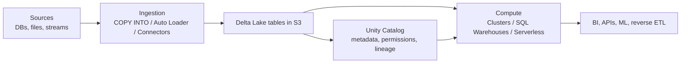
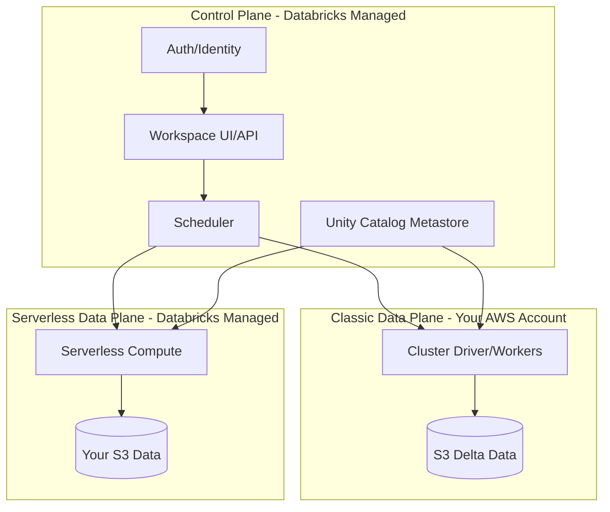

# Databricks: Master Learning Guide for Senior Data Engineers (Redshift -> Databricks)

## 1. How to Read This Guide (4-Hour Learning Path)

This guide is optimized for a senior data engineer moving from Redshift to Databricks. It is deep on internals, but intentionally concise.

Recommended one-sitting path:

1. Hour 1: Read Sections 2-5 to lock architecture, compute, and Delta internals.
2. Hour 2: Read Sections 6-8 to understand performance, DML/CDF, and governance.
3. Hour 3: Read Sections 9-13 to learn ingestion, streaming, pipelines, and orchestration.
4. Hour 4: Read Sections 14-16 and complete the self-checks and migration checklist.

How to use each section:

- Read `What it is` and `Why it matters` first.
- Focus on `How it works internally` to build diagnostic intuition.
- Use `Redshift mapping` to transfer existing mental models quickly.
- Do every `Self-check` before moving on.

If you keep three principles after one pass, keep these:

1. Databricks performance is mostly a data-layout and data-elimination problem before it is a compute-size problem.
2. Reliability comes from Delta transaction semantics plus idempotent pipeline design, not from "one perfect job run."
3. Governance design (Unity Catalog) is architecture, not just security paperwork.

---

## 2. Core Lakehouse Mental Model

### What it is

A lakehouse combines low-cost object storage (S3) with warehouse-grade guarantees (ACID, schema enforcement, governed access, high-performance SQL). Databricks does this by running Spark/Photon on top of Delta Lake tables in your cloud storage.

### Why it matters

You stop maintaining separate systems for data lake + warehouse + streaming landing + ML feature store copies. The same Delta tables can serve engineering, analytics, and AI workloads.

### How it works internally



- Data is persisted as Parquet files plus Delta transaction metadata (`_delta_log`).
- Compute is ephemeral; storage is durable and shared.
- Governance is centralized in Unity Catalog instead of per-cluster silos.

### Redshift mapping

- Redshift cluster storage -> Delta tables on S3.
- Spectrum external tables -> native Delta/Parquet access model.
- WLM queue isolation -> separate compute endpoints (job clusters, SQL warehouses, serverless).

### How to validate in production

- Confirm table format and location:

```sql
DESCRIBE DETAIL main.analytics.orders;
```

- Confirm transaction history exists:

```sql
DESCRIBE HISTORY main.analytics.orders;
```

- Confirm access model is governed by Unity Catalog (three-level namespace):

```sql
SHOW GRANTS ON TABLE main.analytics.orders;
```

### Common pitfalls

- Treating Databricks as "just another SQL endpoint" and ignoring Spark/Delta internals.
- Running all workloads on one shared all-purpose cluster.
- Designing file layouts without considering dominant filter predicates.

### Self-check

1. Why is compute-storage separation also a governance and operability feature?
2. What evidence shows your table is truly Delta and not raw Parquet?
3. Why can two separate compute endpoints safely read/write one Delta table?

---

## 3. Control Plane vs Data Plane (Classic + Serverless)

### What it is

Databricks architecture splits management/orchestration from execution/storage.

- Control plane: Databricks-managed services (UI, APIs, scheduler, metadata control).
- Data plane: where your compute executes and where data is read/written.

### Why it matters

This split drives security boundaries, networking design, and incident ownership.

### How it works internally



- Classic compute runs in your AWS account/VPC.
- Serverless compute runs in Databricks-managed infrastructure with secure access to your storage.
- Unity Catalog authorizes object access across both modes.

### Redshift mapping

Redshift feels like one tightly scoped runtime boundary per cluster. Databricks decouples orchestration and execution, so security/networking and responsibility boundaries are broader but more flexible.

### How to validate in production

- Check workspace/account console for serverless enablement and network posture.
- Verify job compute type per task (job cluster vs serverless vs existing cluster).
- Validate catalog/table access behavior is consistent across compute types.

### Common pitfalls

- Assuming serverless and classic have identical cost and startup behavior.
- Ignoring regional/metastore placement when designing multi-workspace environments.
- Mixing environment boundaries (dev/prod) inside one catalog without clear policy.

### Self-check

1. Which components are always Databricks-managed, regardless of classic vs serverless?
2. What changes operationally when moving a job from classic to serverless?
3. Why does metastore attachment matter for cross-workspace data sharing?

---

## 4. Compute Model (Clusters, Access Modes, DBR, Photon, SQL Warehouses)

### What it is

Databricks gives multiple compute personas:

- All-purpose clusters for interactive engineering.
- Job clusters for scheduled/repeatable ETL.
- SQL warehouses for BI/analytics.
- Serverless options for lower-ops operations.

### Why it matters

Wrong compute choice causes most early cost and reliability issues.

### How it works internally

- Databricks Runtime (DBR) packages Spark + optimized libraries/features.
- Photon accelerates vectorized execution for supported SQL/DataFrame operations.
- Cluster access modes enforce isolation and Unity Catalog compatibility.
- SQL warehouses use independent compute pools optimized for concurrent SQL.

#### Compute choice matrix

| Option | Best for | Startup profile | Cost profile | Governance posture | Avoid when |
|---|---|---|---|---|---|
| All-purpose cluster | Exploration, debugging, notebook iteration | Medium | Can leak idle cost | Good with standard/dedicated access mode | Production scheduled ETL is primary workload |
| Job cluster | Deterministic batch/stream tasks | Per-run startup | Efficient if autosized right | Strong for isolated runs | Ultra-low-latency interactive queries |
| SQL warehouse | BI dashboards, ad hoc SQL, JDBC/ODBC | Fast (serverless fastest) | Good for SQL concurrency | Strong UC integration | Python/Spark code execution required |
| Serverless compute | Fast startup, low ops burden | Fastest | Can be very efficient for bursty workloads | Strong, managed posture | You need deep infra-level customization |

### Redshift mapping

- Redshift primary cluster for everything -> split personas in Databricks.
- Concurrency Scaling -> warehouse autoscaling/serverless behavior.
- WLM tuning -> routing workloads to the right compute surface.

### How to validate in production

- Track queue time vs execution time in SQL warehouse query history.
- Track cluster utilization, autoscaling behavior, and idle windows.
- Compare same query with Photon enabled vs disabled where possible.

### Common pitfalls

- Running BI and heavy ETL on the same all-purpose cluster.
- Choosing larger nodes before fixing data skipping/file layout.
- Keeping interactive clusters running without strict auto-termination.

### Self-check

1. Which workloads should never share the same compute endpoint?
2. When does warehouse scaling help less than data-layout fixes?
3. Why are job clusters usually safer than long-running shared clusters for ETL?

---

## 5. Delta Lake Internals (`_delta_log`, OCC, ACID, Time Travel, Deletion Vectors)

### What it is

Delta Lake is a transactional table format: Parquet data files plus an append-only transaction log.

### Why it matters

Delta gives reliability primitives you depended on in warehouses: atomic commits, consistent reads, schema enforcement/evolution, and historical versions.

### How it works internally

- `_delta_log` contains ordered commits (JSON) and periodic checkpoints (Parquet).
- Readers compute the active snapshot by reading latest checkpoint + later commits.
- Writers use optimistic concurrency control (OCC):
  1. Read current table version.
  2. Produce candidate changes.
  3. Attempt commit.
  4. Detect conflicts; retry or fail if overlapping modifications conflict.
- Time travel uses historical snapshots for reads/restores.
- Deletion vectors allow logical row-level deletes/updates without immediate full file rewrites.

### Redshift mapping

- Redshift transactions are managed within cluster storage internals.
- Delta exposes table-version semantics explicitly; file-level operations back the transaction model.

### How to validate in production

```sql
DESCRIBE HISTORY main.analytics.orders;

SELECT *
FROM main.analytics.orders VERSION AS OF 120;

RESTORE TABLE main.analytics.orders TO VERSION AS OF 118;
```

- Inspect table properties and protocol features:

```sql
SHOW TBLPROPERTIES main.analytics.orders;
```

### Common pitfalls

- Treating object storage folder listing as truth instead of Delta snapshot semantics.
- Aggressive vacuum retention that breaks time-travel expectations.
- Ignoring concurrent-writer conflict patterns during high-volume MERGE workloads.

### Self-check

1. Why can a Delta table remain consistent even with many concurrent writers?
2. What is the practical difference between checkpoint and commit JSON files?
3. How do deletion vectors change DML performance behavior?

---

## 6. Delta Performance Mechanics (File Sizing, OPTIMIZE, Liquid Clustering, VACUUM, Data Skipping)

### What it is

Performance in Delta is primarily controlled by data elimination and file efficiency.

### Why it matters

Most "slow Databricks" incidents are rooted in poor layout and small-file pressure, not insufficient CPU.

### How it works internally

- Data skipping uses column-level min/max/null statistics to avoid irrelevant files.
- Small files increase metadata overhead and task scheduling cost.
- `OPTIMIZE` compacts files; clustering options improve predicate locality.
- Liquid clustering is the modern adaptive layout strategy for many high-cardinality patterns.
- `VACUUM` physically deletes stale files no longer needed by active snapshots.

Recommended operating targets:

- Prefer fewer, reasonably sized files (commonly ~64-256 MB effective range).
- Schedule compaction on hot tables.
- Choose clustering columns based on real filter predicates, not intuition.

### Redshift mapping

- Sort key intuition maps to data skipping/clustering decisions.
- Distkey intuition maps less directly; Databricks relies on runtime shuffles and file-locality pruning.

### How to validate in production

- Compare bytes scanned before/after layout changes.
- Use query plans (`EXPLAIN`) to verify predicate pushdown and pruning opportunities.
- Track file counts and average file sizes via `DESCRIBE DETAIL`.

```sql
DESCRIBE DETAIL main.analytics.orders;
EXPLAIN SELECT * FROM main.analytics.orders WHERE order_date >= current_date() - INTERVAL 7 DAYS;
```

### Common pitfalls

- Over-partitioning tables by high-cardinality columns.
- Running `OPTIMIZE` blindly on every table daily.
- Using `VACUUM` retention that conflicts with recovery or downstream readers.

### Self-check

1. Why can doubling compute fail to improve a layout-driven bottleneck?
2. Which metric tells you a table likely has a small-file problem?
3. When would you prefer liquid clustering over static partitioning?

---

## 7. Delta DML + CDF (MERGE/UPDATE/DELETE and CDC Patterns)

### What it is

Delta supports warehouse-grade DML plus change capture via Change Data Feed (CDF).

### Why it matters

This enables idempotent upserts and incremental downstream processing without full table rescans.

### How it works internally

- `MERGE` identifies matched/unmatched rows and applies atomic updates/inserts/deletes.
- Row-level changes create new table versions; old files remain until cleanup.
- CDF records row-change events (`insert`, `delete`, `update_preimage`, `update_postimage`) when enabled.
- Incremental consumers can read changes between versions/timestamps.

Minimal upsert pattern:

```sql
MERGE INTO main.silver.customers AS t
USING main.bronze.customer_changes AS s
ON t.customer_id = s.customer_id
WHEN MATCHED AND s.op = 'D' THEN DELETE
WHEN MATCHED THEN UPDATE SET *
WHEN NOT MATCHED AND s.op <> 'D' THEN INSERT *;
```

Enable/read CDF:

```sql
ALTER TABLE main.silver.customers
SET TBLPROPERTIES (delta.enableChangeDataFeed = true);

SELECT * FROM table_changes('main.silver.customers', 200, 220);
```

### Redshift mapping

- Redshift often requires staged patterns for robust upsert/delete logic at scale.
- Delta CDF gives explicit change streams per table version range.

### How to validate in production

- Check `DESCRIBE HISTORY` around each DML batch.
- Assert source deduplication before MERGE.
- Validate CDF windows consumed exactly once by downstream tasks.

### Common pitfalls

- Feeding duplicate keys into MERGE without deterministic tie-breakers.
- Treating CDF as permanent history instead of retention-bounded incremental feed.
- Forgetting delete semantics in CDC pipelines.

### Self-check

1. Why must CDC pipelines define deterministic ordering keys?
2. When is CDF better than scanning full tables with `updated_at` filters?
3. What failure mode occurs if MERGE source contains conflicting duplicates?

---

## 8. Unity Catalog Governance (Hierarchy, Managed vs External, Credentials, Privileges, Bindings)

### What it is

Unity Catalog (UC) is Databricks' centralized governance layer for data/AI assets.

### Why it matters

UC gives one permission model across workspaces and compute surfaces, with auditable access and lineage foundations.

### How it works internally

- Three-level namespace: `catalog.schema.object`.
- Metastore is region-scoped and attached to workspaces.
- Managed tables: Databricks manages storage paths/lifecycle.
- External tables: data stays in customer-defined external locations.
- Access to cloud paths is mediated via storage credentials and external locations.
- Privileges follow ANSI-style `GRANT/REVOKE` semantics.

### Redshift mapping

- Redshift DB/schema/table privileges are cluster-scoped.
- UC privileges span multiple workspaces attached to the same metastore.

### How to validate in production

```sql
SHOW CATALOGS;
SHOW SCHEMAS IN main;
SHOW GRANTS ON CATALOG main;
SHOW GRANTS ON TABLE main.silver.customers;
```

- Validate external location bindings and credential ownership via catalog explorer/admin views.

### Common pitfalls

- Starting with external everything when managed tables are sufficient.
- Granting broad catalog privileges instead of least privilege per schema/object.
- Blending dev/prod objects in one schema with weak naming conventions.

### Self-check

1. When should you use managed tables vs external tables?
2. Why is metastore design a platform decision, not team-local config?
3. Which UC object controls cloud path authorization for external data?

---

## 9. Medallion Architecture as an Operating Model (Bronze/Silver/Gold + Quality Gates)

### What it is

Medallion organizes data refinement into Bronze (raw), Silver (validated), Gold (serving).

### Why it matters

This creates explicit contracts and blast-radius boundaries: raw ingestion reliability, curated correctness, and consumption-specific serving.

### How it works internally

- Bronze: append-first ingestion with raw fidelity and ingestion metadata.
- Silver: typing, deduplication, normalization, business rule enforcement.
- Gold: denormalized aggregates and serving models optimized for BI/API consumption.
- Quality gates at Silver prevent low-quality data from contaminating Gold.

#### Ingestion frequency vs latency vs cost

| Mode | Latency | Cost | Operational overhead | Typical use |
|---|---|---|---|---|
| Continuous streaming | Lowest | Highest | Highest | Fraud, alerts, near real-time ops |
| Micro-batch (5-30 min) | Low | Medium | Medium | Operational analytics |
| Hourly batch | Medium | Lower | Lower | Standard analytics pipelines |
| Daily batch | Highest | Lowest | Lowest | Historical and finance reporting |

### Redshift mapping

Think of Bronze/Silver/Gold as formalized staging -> core -> marts, but with unified Delta storage and explicit streaming compatibility.

### How to validate in production

- Verify each layer has clear table contracts and owners.
- Confirm Silver has data quality metrics and failure/alert behavior.
- Confirm Gold refresh SLAs and downstream dependencies are explicit.

### Common pitfalls

- Skipping Silver and pushing raw data directly to Gold for speed.
- Overloading Gold with heavy cleansing logic.
- Not defining ownership and SLAs per layer.

### Self-check

1. Why does Silver exist even when Bronze data "looks fine"?
2. Which layer should own deduplication and schema enforcement?
3. What breaks when Gold becomes both data-cleansing and serving layer?

---

## 10. Ingestion Patterns (COPY INTO vs Auto Loader vs Pipeline-Managed)

### What it is

Databricks supports multiple ingestion approaches, each with different tradeoffs in statefulness, latency, and operations.

### Why it matters

Ingestion choice locks in idempotency behavior, schema evolution handling, and cost profile.

### How it works internally

- `COPY INTO`: file-based idempotent loading; simpler state model.
- Auto Loader: incremental discovery + checkpointed streaming ingestion from cloud storage.
- Pipeline-managed ingestion (Lakeflow): declarative ingestion integrated with quality and orchestration.

#### Ingestion choice matrix

| Option | Best for | State management | Schema evolution posture | Latency | Ops complexity |
|---|---|---|---|---|---|
| COPY INTO | Periodic file drops, simpler pipelines | Managed file-load tracking | Explicit/manual handling | Batch | Low |
| Auto Loader | Continuous incremental file ingestion | Checkpoints + schema location | Strong, configurable modes | Low to medium | Medium |
| Lakeflow pipeline-managed | End-to-end governed pipelines | Managed by pipeline runtime | Integrated with expectations/contracts | Low to medium | Medium to high |

Schema evolution decision rules:

- Strict contracts for finance/compliance datasets.
- Additive evolution for event-style ingestion with monitored drift.
- Rescue pattern for unknown fields when data loss is unacceptable.

### Redshift mapping

- Redshift `COPY` -> Databricks `COPY INTO` for straightforward batch loads.
- Kinesis/S3 incremental ingestion patterns -> Auto Loader/Pipeline-managed ingestion.

### How to validate in production

- Verify replay behavior with duplicate file arrival tests.
- Verify schema-drift alerting and fallback behavior.
- Verify checkpoint recovery from interrupted runs.

### Common pitfalls

- Using COPY INTO for near-real-time requirements.
- Running Auto Loader without durable checkpoint/schema locations.
- Accepting schema drift silently in critical business tables.

### Self-check

1. Which ingestion option gives easiest deterministic reprocessing for batch loads?
2. What two persistent paths are mandatory for robust Auto Loader pipelines?
3. When should unknown columns fail the pipeline vs be rescued?

---

## 11. Structured Streaming (State, Checkpoints, Triggers, Recovery)

### What it is

Structured Streaming runs incremental query plans over unbounded data using micro-batches (or continuous mode in specific cases).

### Why it matters

Streaming reliability depends more on state and checkpoint correctness than on SQL complexity.

### How it works internally

- Each trigger processes new input since last committed offset.
- Stateful operations (aggregations, dedup, stream-stream joins) persist state across batches.
- Checkpoints store offsets, progress, and state metadata for recovery.
- Exactly-once outcomes depend on source semantics + sink idempotency + checkpoint discipline.

Minimal pattern:

```python
(spark.readStream
  .table("main.bronze.events")
  .writeStream
  .option("checkpointLocation", "s3://my-bucket/checkpoints/silver_events")
  .trigger(processingTime="5 minutes")
  .table("main.silver.events"))
```

### Redshift mapping

Redshift is primarily batch warehouse processing. Structured Streaming introduces long-lived stateful compute behavior with different failure and retry semantics.

### How to validate in production

- Monitor end-to-end lag and input rate vs processed rate.
- Inspect watermark/state metrics for stateful queries.
- Simulate restart and confirm no duplicates/data gaps.

### Common pitfalls

- Changing query logic in ways incompatible with existing checkpoint state.
- Missing watermark design for late data.
- Keeping one giant stateful stream for unrelated entities.

### Self-check

1. Why can stateful streams fail even when source/sink are healthy?
2. What signals indicate checkpoint corruption or incompatibility risk?
3. How does trigger interval affect latency/cost tradeoff?

---

## 12. Lakeflow Pipelines (Streaming Tables, MVs, Expectations, AUTO CDC)

### What it is

Lakeflow Declarative Pipelines provide managed, declarative pipeline execution for streaming and batch transformations. (Code APIs may still use `dlt` naming.)

### Why it matters

It standardizes data quality, incremental processing, and dependency orchestration with less custom control-plane code.

### How it works internally

- Streaming tables define continuously updated datasets.
- Materialized views define refreshed computed datasets.
- Expectations enforce declarative data quality with warn/drop/fail actions.
- AUTO CDC handles ordered application of change streams (including SCD patterns).

Expectation example:

```python
import dlt

@dlt.table
@dlt.expect_or_drop("valid_order_id", "order_id IS NOT NULL")
def silver_orders():
    return spark.readStream.table("main.bronze.orders_raw")
```

AUTO CDC concept (Type 1 vs Type 2 decisions) should be chosen per serving need:

- Type 1: current-state serving tables.
- Type 2: full history/audit-friendly dimensions.

### Redshift mapping

This replaces large portions of custom orchestration glue and procedural data quality code around staging->core->mart flows.

### How to validate in production

- Validate expectation metrics and violation rates per dataset.
- Validate pipeline backfill/restart semantics.
- Validate CDC ordering keys and delete handling.

### Common pitfalls

- Treating expectations as documentation only (without alerting).
- Choosing Type 2 history when no consumer needs it.
- Hiding business-critical logic in opaque UDF chains.

### Self-check

1. What determines whether a dataset should be streaming table vs materialized view?
2. Why is ordering key quality central to AUTO CDC correctness?
3. What objective evidence shows expectations are actually effective?

---

## 13. Jobs/Workflows + Asset Bundles (Task Graphs, Retries, Environments, CI/CD)

### What it is

Lakeflow Jobs orchestrate tasks with dependencies/retries/schedules. Databricks Asset Bundles (DABs) define those resources as code for environment promotion.

### Why it matters

Without this, teams drift into manual UI-only operations and brittle environment differences.

### How it works internally

- A job is a DAG of tasks (notebooks, scripts, SQL, pipelines, etc.).
- Each task has retry policy, timeout, compute assignment, parameters.
- Bundle configs (`databricks.yml` + resource YAML files) enable versioned deployments.
- CI validates and deploys to dev/stage/prod targets.

Minimal workflow design pattern:

1. Ingest Bronze.
2. Build Silver with quality checks.
3. Build Gold serving tables.
4. Run validation task and notify on failure.

#### Minimal end-to-end scenario: Bronze -> Silver -> Gold

Use this as the smallest production-shaped reference design:

1. Ingestion (Bronze): Auto Loader reads raw JSON files into `main.bronze.orders_raw`.
2. Quality + typing (Silver): Lakeflow expectations enforce non-null keys and valid amounts into `main.silver.orders`.
3. Serving (Gold): SQL task aggregates to `main.gold.daily_revenue`.
4. Orchestration: Lakeflow Job DAG enforces `bronze -> silver -> gold -> validate` dependencies with retries.

Minimal Gold serving step:

```sql
CREATE OR REPLACE TABLE main.gold.daily_revenue AS
SELECT
  date(order_ts) AS order_date,
  region,
  SUM(amount) AS revenue
FROM main.silver.orders
GROUP BY 1, 2;
```

### Redshift mapping

Think of this as replacing external scheduler + SQL scripts + environment-specific manual setup with one platform-native orchestration/IaC model.

### How to validate in production

- Validate task-level retries and failure isolation.
- Validate environment-specific variables and secret resolution.
- Validate deployment pipeline can recreate resources from scratch.

### Common pitfalls

- Monolithic jobs with poor task boundaries.
- No backfill mode separate from daily incremental mode.
- UI-only job changes that bypass version control.

### Self-check

1. Which task boundaries maximize rerun efficiency after partial failures?
2. What should be parameterized by environment in bundles?
3. Why is idempotency required even with retries configured?

---

## 14. SQL for Redshift Engineers (Dialect + Performance Behavior)

### What it is

Databricks SQL is ANSI-forward with Spark SQL extensions. It is close enough to be productive quickly, different enough to require targeted relearning.

### Why it matters

Most migration bugs come from behavioral differences (null semantics, function behavior, optimization assumptions), not syntax conversion.

### How it works internally

- Query planning is Spark/Photon-based, with runtime adaptive behavior.
- File-level pruning and data layout influence scanned bytes more directly than in classic warehouse storage internals.
- Join strategies can shift based on statistics/runtime conditions.

Common translation examples:

```sql
-- Redshift-style QUALIFY patterns are supported in Databricks SQL
SELECT *
FROM main.silver.orders
QUALIFY row_number() OVER (PARTITION BY customer_id ORDER BY order_ts DESC) = 1;

-- Explode nested arrays/maps (Spark SQL idiom)
SELECT order_id, item
FROM main.silver.orders
LATERAL VIEW explode(items) t AS item;
```

### Redshift mapping

- Distkey/sortkey tuning mindset -> clustering + file pruning mindset.
- WLM queue management -> warehouse/workload routing.
- Stored procedure-heavy logic -> modular SQL + jobs/pipelines.

### How to validate in production

- Compare semantic results on representative edge-case datasets.
- Compare scanned bytes and runtime distributions for migrated workloads.
- Review explain plans for large joins and skew-sensitive aggregations.

### Common pitfalls

- Assuming physical distribution control comparable to Redshift distkeys.
- Porting SQL without validating null, timestamp, and collation assumptions.
- Ignoring nested/semi-structured data patterns where Databricks is stronger.

### Self-check

1. Why do two syntactically equivalent queries sometimes behave differently after migration?
2. Which Redshift tuning habits should be intentionally unlearned first?
3. What minimum validation set should exist for SQL migration signoff?

---

## 15. Cost/Performance/Operations Playbook (Decision Trees, Anti-Patterns, Observability)

### What it is

A practical operating model for day-2 reliability, performance, and spend control.

### Why it matters

Most platform pain appears after adoption: queue spikes, streaming lag, permissions drift, and cost surprises.

### How it works internally

Observability should connect:

- Data layout metrics (file counts, bytes scanned, skew).
- Compute metrics (queue time, runtime, autoscaling behavior).
- Pipeline metrics (freshness/lag, retries, SLA misses).
- Governance metrics (permission failures, policy drift).

#### Diagnostic playbook 1: Query is slow

1. Check queue time vs execution time.
2. If queue-dominant: route/split workload or scale warehouse concurrency.
3. If execution-dominant: inspect scanned bytes and pruning.
4. If scanned bytes high: fix layout (OPTIMIZE/clustering/partition strategy).
5. If scanned bytes normal but still slow: inspect skew, join strategy, UDF bottlenecks.

#### Diagnostic playbook 2: Streaming lag/backlog grows

1. Check input rate vs processed rate trend.
2. Check stateful operators and watermark design.
3. Check sink performance and checkpoint health.
4. Scale compute only after state/logic bottlenecks are understood.
5. Validate replay semantics before making structural query changes.

#### Diagnostic playbook 3: Unity Catalog permission denied

1. Verify principal identity and active role/group mapping.
2. Verify object path (`catalog.schema.object`) is correct.
3. Verify grants at catalog, schema, and object levels.
4. Verify external location/storage credential grants if external data is involved.
5. Re-test from intended compute surface (cluster vs warehouse) for parity.

#### Diagnostic playbook 4: Cost spike

1. Split by storage vs compute vs serverless SQL spend.
2. Identify top workloads by query/job runtime and scan volume.
3. Check idle leakage (interactive clusters, warehouse policies).
4. Check ingestion frequency and over-processing loops.
5. Apply routing, scheduling, and layout changes before brute-force downsizing.

### Redshift mapping

Redshift incidents often begin with queue/WLM behavior. In Databricks, begin with workload routing plus data elimination quality, then compute scaling.

### How to validate in production

- Define per-workload SLOs: latency, freshness, success rate, and cost envelope.
- Run weekly platform review: top cost movers, top failure modes, top regressions.
- Keep a known-good benchmark query set for regression detection.

### Common pitfalls

- No workload segmentation by persona.
- Cost triage without ownership tags and workload mapping.
- Performance tuning only at SQL text level.

### Self-check

1. Which metric tells you whether to scale concurrency vs optimize query/layout?
2. Why should cost incidents be triaged by workload class first?
3. What minimum evidence is required before changing cluster/warehouse size?

---

## 16. Migration Checklist + Glossary + Curated Official References

### 16.1 Redshift -> Databricks migration checklist

1. Platform and governance foundation
- Create account/workspace/metastore strategy by environment.
- Define catalog and schema boundaries (`dev`, `staging`, `prod`, domain-based).
- Establish identity groups and least-privilege grants.

2. Data migration and table contracts
- Land source data in S3 using stable path conventions.
- Create Delta table contracts for Bronze/Silver/Gold.
- Validate null/type/timezone semantics on representative samples.

3. Workload migration
- Prioritize high-value pipelines first (repeatable ETL before edge one-offs).
- Replace procedural orchestration with jobs/pipelines + retries.
- Rebuild BI endpoints on SQL warehouses with workload isolation.

4. Reliability and observability
- Define freshness and success SLOs per pipeline.
- Define runbooks for failure classes (permission, lag, quality, cost).
- Set alerting for SLA misses and abnormal spend.

5. Cutover and hardening
- Parallel-run critical datasets and reconcile results.
- Freeze legacy writes during final cutover window.
- Retire legacy schedules only after stable post-cutover period.

### 16.2 Glossary

| Term | Definition |
|---|---|
| Lakehouse | Open-storage architecture with warehouse-grade reliability and performance |
| Delta Lake | Transactional table format: Parquet + `_delta_log` |
| Unity Catalog | Centralized governance layer for data and AI assets |
| Metastore | Region-scoped metadata/governance container attached to workspaces |
| Catalog | Top-level namespace in UC |
| Schema | Namespace inside a catalog containing tables/views/functions |
| Managed table | Table whose data lifecycle/storage path is managed by Databricks |
| External table | Table referencing data in customer-managed external locations |
| Auto Loader | Incremental cloud-file ingestion with checkpoint/state management |
| CDF | Change Data Feed: row-level change stream from Delta versions |
| DAB | Databricks Asset Bundles for resource-as-code deployment |
| Photon | Native vectorized engine accelerating SQL/DataFrame execution |

### 16.3 First 30 days learning sequence (milestones)

1. Days 1-7: Architecture and Delta foundations
- Outcome: explain control/data plane and Delta snapshot semantics from memory.

2. Days 8-14: Ingestion and streaming reliability
- Outcome: build one Bronze->Silver ingestion with restart-safe checkpoints.

3. Days 15-21: Governance and orchestration
- Outcome: enforce least privilege in UC and deploy one workflow via bundles.

4. Days 22-30: Performance and cost operations
- Outcome: run one full performance/cost review and publish remediations.

### 16.4 Curated official references

- [Databricks introduction](https://docs.databricks.com/aws/en/introduction/)
- [Lakehouse architecture](https://docs.databricks.com/aws/en/lakehouse/)
- [Medallion architecture](https://docs.databricks.com/aws/en/lakehouse/medallion)
- [Delta Lake on Databricks](https://docs.databricks.com/aws/en/delta/)
- [Unity Catalog](https://docs.databricks.com/aws/en/data-governance/unity-catalog/)
- [Compute](https://docs.databricks.com/aws/en/compute/)
- [Photon](https://docs.databricks.com/aws/en/compute/photon)
- [Databricks SQL warehouses](https://docs.databricks.com/aws/en/compute/sql-warehouse/)
- [COPY INTO](https://docs.databricks.com/aws/en/ingestion/cloud-object-storage/copy-into/)
- [Auto Loader](https://docs.databricks.com/aws/en/ingestion/cloud-object-storage/auto-loader/)
- [Structured Streaming](https://docs.databricks.com/aws/en/structured-streaming/)
- [Lakeflow Declarative Pipelines](https://docs.databricks.com/aws/en/ldp/)
- [Lakeflow Jobs](https://docs.databricks.com/aws/en/jobs/)
- [Databricks Asset Bundles](https://docs.databricks.com/aws/en/dev-tools/bundles/)
- [Databricks SQL language reference](https://docs.databricks.com/aws/en/sql/language-manual/)

---

Document version: 1.0  
Audience: Senior data engineers transitioning from Redshift to Databricks  
Scope: Data engineering core (architecture, pipelines, governance, operations)
