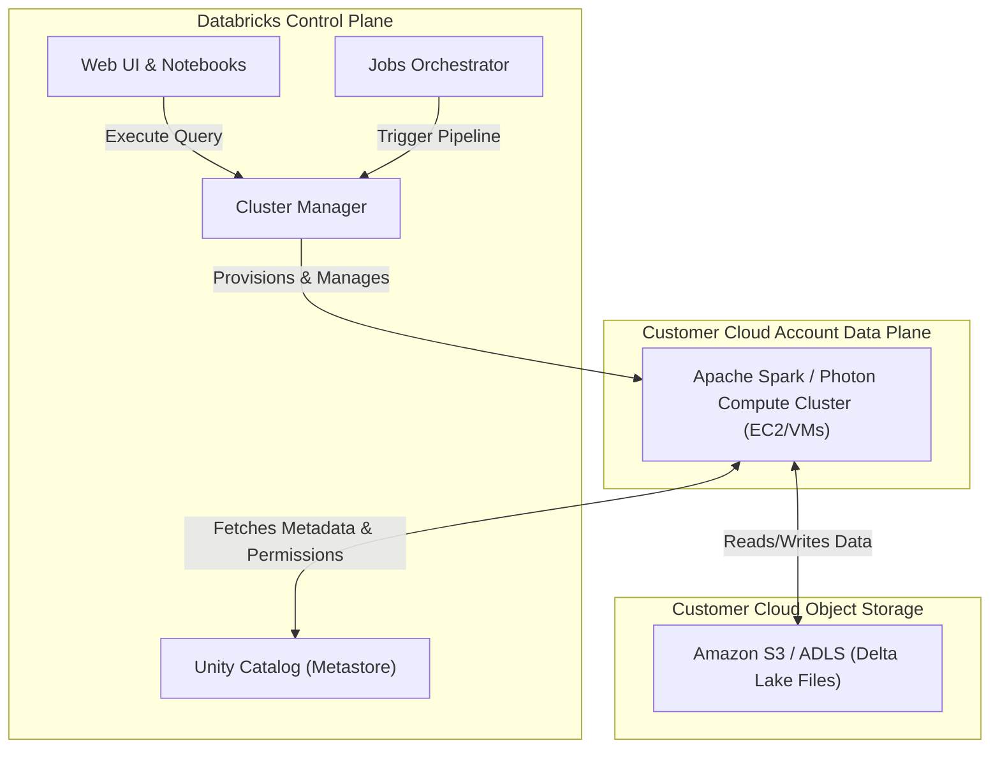
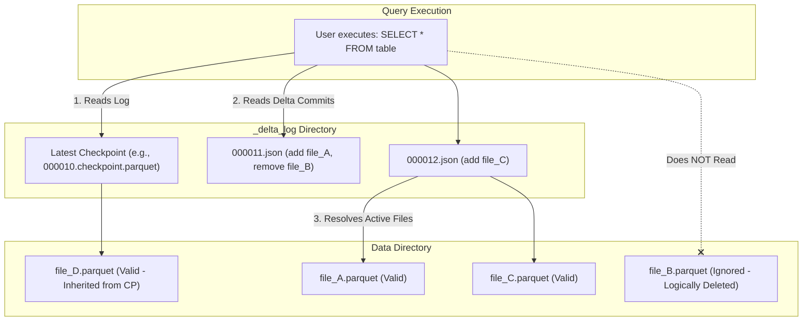

# The Comprehensive Guide to Databricks for Redshift Engineers

Welcome to Databricks! If you are a Senior Data Engineer coming from Amazon Redshift, you are likely accustomed to a Massively Parallel Processing (MPP) architecture where storage and compute are tightly coupled within a cluster. Databricks introduces a paradigm shift known as the **Data Lakehouse**, offering unparalleled scalability, flexibility, and a complete separation of compute and storage.

This guide will take you deep into the internals of Databricks, explaining how it works under the hood and mapping your existing Redshift knowledge to Databricks concepts.

---

## 1. Introduction & The Paradigm Shift

### The Lakehouse Architecture
Historically, organizations maintained a **Data Lake** (cheap, scalable object storage like Amazon S3 for unstructured/raw data) and a **Data Warehouse** (like Amazon Redshift, optimized for structured data and ACID transactions). Moving data between them required complex, brittle ETL pipelines.

Databricks pioneered the **Data Lakehouse** architecture, which combines the best of both worlds:
- The infinite scalability and low cost of data lakes.
- The reliability, schema enforcement, and ACID transactions of data warehouses.

### Redshift vs. Databricks: The Core Difference
* **Amazon Redshift (Classic MPP):** Redshift relies on a fixed cluster architecture consisting of a Leader Node and Compute Nodes. Data is distributed across these compute nodes using Distribution Keys and sorted using Sort Keys. Compute and storage scale together (though Redshift RA3 nodes introduced managed storage to mitigate this). When a node fails, the cluster must redistribute data.
* **Databricks (Decoupled Architecture):** Databricks fundamentally and completely separates compute from storage. Your data resides permanently in your cloud object storage (e.g., Amazon S3) in open-source formats (Parquet/Delta). When you run a query, Databricks spins up stateless, ephemeral compute clusters (Apache Spark / Photon) to process the data, and tears them down when finished.

*Reference: [Databricks vs. Amazon Redshift: key differences 2024](https://getorchestra.io/guides/databricks-vs-amazon-redshift-key-differences-2024)*

---

## 2. Core Architecture: Control Plane vs. Data Plane

Unlike a Redshift cluster that lives entirely in your AWS VPC, Databricks operates on a dual-plane architecture. This architecture ensures that Databricks can manage the orchestration and UI while keeping your actual data securely within your own cloud environment.

### The Control Plane
The **Control Plane** consists of backend services managed entirely by Databricks in their own AWS/Azure/GCP account.
- **Components:** Web Application (UI), Notebooks, Workspace configuration, Cluster Management, Jobs Orchestrator, and the Unity Catalog metastore.
- **Function:** It handles the "metadata" of your operations—saving your code, scheduling jobs, and sending instructions to spin up compute.

### The Data Plane
The **Data Plane** is where your data lives and where data processing actually happens.
- **Classic Data Plane:** This lives in **your** cloud account (e.g., your AWS VPC). The Control Plane sends an instruction to your cloud provider to spin up EC2 instances. These instances pull data from your S3 buckets, process it, and write it back. Databricks never pulls your raw data into its Control Plane.
- **Serverless Data Plane:** For services like Serverless SQL Warehouses, the compute runs in a Databricks-managed VPC, but still connects securely to your cloud storage. This removes the need for you to manage EC2 instances or wait for cluster startup times.

### Architectural Diagram

*Reference: [Architecture | Databricks on AWS](https://docs.databricks.com/aws/en/getting-started/architecture)*

---

## 3. Storage Internals: Delta Lake Deep Dive

In Redshift, storage is a proprietary columnar format hidden inside your cluster's EBS volumes or managed storage. In Databricks, the storage foundation is **Delta Lake**, an open-source storage layer that brings reliability to data lakes. 

### The Foundation: Parquet + Transaction Log
Delta Lake stores your actual data in standard, open-source **Parquet** files (a columnar format highly optimized for analytical queries). However, a folder full of Parquet files does not support ACID transactions (if a job fails halfway through, you are left with corrupted, partial files). 

To solve this, Delta Lake introduces the **Transaction Log**, stored in a `_delta_log` subfolder alongside your Parquet data files.

### The Transaction Log (`_delta_log`)
The `_delta_log` is the heart of Delta Lake and serves as the single source of truth for the table. It is an ordered record of every transaction (INSERT, UPDATE, DELETE, MERGE) that has ever occurred.

1. **Commit Files (`.json`):** Every time a change is made to the table, Delta writes a new JSON commit file (e.g., `00000000000000000001.json`). This file lists the exact Parquet files that were *added* to the table and the files that were *removed* (marked as logically deleted/tombstoned).
2. **Checkpoints (`.parquet`):** To prevent engines from having to read thousands of JSON files to figure out the table's state, Delta computes a "checkpoint" every 10 commits. This is a Parquet file containing the complete, aggregated state of the table at that exact commit.

When a query is executed, the engine simply reads the latest checkpoint and any subsequent JSON commits. It then knows exactly which Parquet files to read and which to ignore. This completely eliminates the slow, costly process of "listing" files from cloud storage directories.

### Optimistic Concurrency Control
Because compute is decoupled from storage, multiple clusters can try to write to the same Delta table simultaneously. Databricks handles this via **Optimistic Concurrency Control (OCC)**:
1. **Record the Start State:** A writer reads the current table version (e.g., version 10).
2. **Do the Work:** The writer processes data and creates new Parquet files.
3. **Attempt to Commit:** The writer attempts to write commit `00000000000000000011.json`. 
4. **Conflict Resolution:** If another cluster already wrote version 11, the writer checks if the other job touched the *exact same files* it was trying to touch. If the changes are independent (e.g., appending new files), Databricks automatically resolves the conflict and commits as version 12. If there is a direct conflict (e.g., updating the same row), the transaction fails with a `ConcurrentModificationException`, ensuring ACID guarantees.

### Transaction Resolution Diagram

*References:*
* *[Diving Into Delta Lake: Unpacking The Transaction Log](https://databricks.com/blog/2019/08/21/diving-into-delta-lake-unpacking-the-transaction-log.html)*
* *[Diving Into Delta Lake: DML Internals (Update, Delete, Merge)](https://www.databricks.com/blog/2020/09/29/diving-into-delta-lake-dml-internals-update-delete-merge.html)*

---

## 4. Data Layout & Optimization (The Redshift Shift)

In Redshift, you spend a lot of time defining `DISTKEY` (for data colocation across nodes to avoid broadcasting) and `SORTKEY` (to skip data blocks during scans). Because Databricks separates compute from storage, the mental model for data optimization changes.

### Redshift Distribution/Sort Keys vs. Databricks
* **Distribution Keys (Redshift):** In Databricks, there is no fixed concept of a "node" holding specific data permanently. Data is distributed across Spark partitions dynamically in memory at runtime. You do not define physical distribution keys for storage.
* **Sort Keys (Redshift):** In Databricks, sorting is handled at the storage layer via Partitioning, Z-Ordering, or Liquid Clustering. This serves the exact same purpose: allowing the engine to skip reading unnecessary data files (Data Skipping).

### Data Skipping
Delta Lake automatically collects statistics (min, max, null counts) for the first 32 columns of your data and stores them in the `_delta_log`. When a query includes a `WHERE` clause (e.g., `WHERE date = '2023-01-01'`), the engine reads the metadata first. If a file's `min_date` is '2023-02-01', Databricks knows it can completely skip reading that file. This is highly analogous to Redshift's zone maps.

### Z-Ordering
**Z-Ordering** is a technique to colocate related information in the same set of files. It maps multi-dimensional data to one dimension while preserving data locality.
* **How it works:** Instead of linearly sorting by Column A and then Column B, a Z-order curve interleaves the bits of multiple columns. This creates "Z-cubes" of files that are highly optimized for queries filtering on *any combination* of the Z-ordered columns.
* **Usage:** `OPTIMIZE my_table ZORDER BY (col_a, col_b)`

### Liquid Clustering (The Modern Standard)
While Z-Ordering and traditional hive-style partitioning work well, they are static. Changing a partition scheme requires a massive, expensive table rewrite.

Databricks recently introduced **Liquid Clustering**, which dynamically and incrementally clusters data.
* **How it differs:** Liquid Clustering replaces both traditional partitioning and Z-Ordering. You simply tell Databricks which columns are queried frequently (`CLUSTER BY (col_a, col_b)`). As data is ingested, Databricks automatically organizes the files into optimal Z-cubes incrementally. 
* **Benefits:** It adapts to changing access patterns and handles high cardinality columns (like user IDs) much better than static partitioning without the operational overhead of constant manual `OPTIMIZE` jobs.

### Maintenance Operations
* **`OPTIMIZE`**: Analogous to Redshift's background vacuum/sort. It compacts small files into larger ones (addressing the "small file problem") and applies Z-ordering or Liquid Clustering.
* **`VACUUM`**: Over time, `_delta_log` commits accumulate, and logically deleted Parquet files take up storage space. The `VACUUM` command physically deletes old, unreferenced Parquet files (typically older than 7 days) to save storage costs.

*References:*
* *[Deep Dive into Liquid Clustering, Z-ordering, and Partitioning](https://medium.com/@srinidhichundru/deep-dive-into-liquid-clustering-z-ordering-and-partitioning-part-2-4c11eb18ba8f)*

---

## 5. Compute: The Execution Engines (Spark & Photon)

If Delta Lake handles the storage, Apache Spark and the newer Photon engine handle the execution. In Redshift, the query planner distributes execution across the compute nodes. In Databricks, Spark does this dynamically.

### Apache Spark Internals
Under the hood, Databricks runs on a customized, highly optimized version of Apache Spark. 
A Databricks cluster consists of:
* **The Driver (Leader Node in Redshift terms):** The central coordinator. It maintains the `SparkContext`, receives the SQL or Python code, parses it, and builds an execution plan using the Catalyst Optimizer. It translates the plan into a Directed Acyclic Graph (DAG) of Stages and Tasks.
* **The Executors (Compute Nodes in Redshift terms):** Worker nodes that pull data from S3, execute the Tasks assigned by the Driver, cache data in memory if requested, and write results back out. 
* **Partitions:** When an Executor reads a Parquet file, it loads it into memory as a "Partition" (a chunk of data). Parallelism in Databricks is achieved by having multiple CPU cores process multiple partitions concurrently.

### The Photon Engine: C++ Vectorized Execution
Historically, Spark executed workloads using the Java Virtual Machine (JVM). As cloud networks and SSDs grew exponentially faster, CPU processing (specifically the overhead of the JVM) became the primary bottleneck. 

To solve this, Databricks wrote **Photon**, a native vectorized query engine written entirely in **C++**. 

**How Photon Works:**
* **Bypassing the JVM:** Photon executes directly on the bare metal, avoiding JVM memory overhead and garbage collection pauses.
* **Vectorized Processing (SIMD):** Traditional databases evaluate one row at a time. Photon uses Single Instruction, Multiple Data (SIMD) CPU instructions. This allows a modern CPU to process a "vector" (a batch of rows/columns) in a single CPU clock cycle.
* **Seamless Integration:** Photon integrates seamlessly with Spark. When a query is submitted, the query optimizer determines which portions of the DAG can be executed in C++ by Photon and which must fall back to standard Spark (e.g., custom UDFs). It requires zero code changes to activate.
* **Performance:** Photon provides up to a 12x price/performance improvement on standard BI and data engineering workloads, making it fiercely competitive with native cloud data warehouses like Redshift.

*References:*
* *[Databricks Photon Engine Overview](https://databricks.com/product/photon)*
* *[Announcing Photon Public Preview](https://www.databricks.com/blog/2021/06/17/announcing-photon-public-preview-the-next-generation-query-engine-on-the-databricks-lakehouse-platform.html)*

---

## 6. Data Engineering Workflows & Ingestion

Redshift relies heavily on the `COPY` command to load data from S3, or tools like AWS Glue for orchestration. Databricks provides native, highly robust tools for ingestion and orchestration.

### Auto Loader (The `COPY` Replacement)
**Auto Loader** is Databricks' solution for incrementally and efficiently processing new data files as they arrive in cloud storage.
* Instead of running batch `COPY` commands and manually tracking which files have been loaded, Auto Loader uses a technique called **Structured Streaming**.
* It maintains a state checkpoint. As new JSON, CSV, or Parquet files land in S3, Auto Loader automatically detects them and ingests exactly exactly once, providing robust error handling and schema inference/evolution.

### Delta Live Tables (DLT)
For building complex ETL pipelines, Databricks offers **Delta Live Tables**.
* **Declarative ETL:** Instead of writing complex Spark code to manage dependencies, you define the target state of your tables using SQL or Python. DLT automatically figures out the DAG and execution order.
* **Unified Batch and Streaming:** DLT seamlessly handles both batch data and streaming data within the same pipeline.
* **Data Quality:** DLT includes native "Expectations" allowing you to define constraints (e.g., `CONSTRAINT valid_id EXPECT (id IS NOT NULL) ON VIOLATION DROP ROW`), isolating bad data before it hits your downstream tables.

### Databricks Workflows (Jobs)
**Workflows** is the fully-managed orchestration service built into Databricks (comparable to Apache Airflow or AWS Step Functions). It allows you to schedule and trigger multi-task jobs consisting of Notebooks, SQL queries, DLT pipelines, or Python scripts.

*References:*
* *[What is Auto Loader?](https://docs.databricks.com/aws/en/ingestion/cloud-object-storage/auto-loader/)*
* *[Delta Live Tables introduction](https://docs.databricks.com/aws/en/delta-live-tables/)*

---

## 7. Data Governance: Unity Catalog

In Redshift, governance is handled via IAM roles, database users, and Grant/Revoke statements at the database level. 
Databricks handles governance across your entire organization via the **Unity Catalog**.

### The 3-Level Namespace
Unity Catalog introduces a strict 3-level namespace that standardizes how you address data, making it similar to traditional databases but scalable across multiple workspaces:
1. **Catalog:** The top-level container (e.g., `prod`, `dev`).
2. **Schema (Database):** A logical grouping within a catalog (e.g., `prod.sales`).
3. **Table/View:** The actual data object (e.g., `prod.sales.transactions`).

You query data simply: `SELECT * FROM prod.sales.transactions`.

### Centralized Governance Features
* **One Metastore:** Instead of having siloed metastores for different clusters, Unity Catalog provides a single, unified view of all data assets across all your Databricks workspaces.
* **Access Control:** You use standard SQL `GRANT`/`REVOKE` statements to manage permissions on Catalogs, Schemas, and Tables.
* **Automated Data Lineage:** Because Unity Catalog is deeply integrated with the execution engine, it automatically tracks data lineage down to the column level. If you create a view from a table, Unity Catalog visually maps that relationship without any manual configuration.

*References:*
* *[What is Unity Catalog?](https://docs.databricks.com/aws/en/data-governance/unity-catalog/index.html)*

---

## Conclusion

Transitioning from Amazon Redshift to Databricks requires shifting from a clustered, tightly-coupled mindset to a decoupled, scalable, lakehouse mindset. By understanding how Delta Lake's transaction log replaces traditional storage blocks, how Photon and Spark parallelize compute, and how Unity Catalog centralizes governance, you can architect modern, highly efficient data engineering pipelines on the Databricks platform.