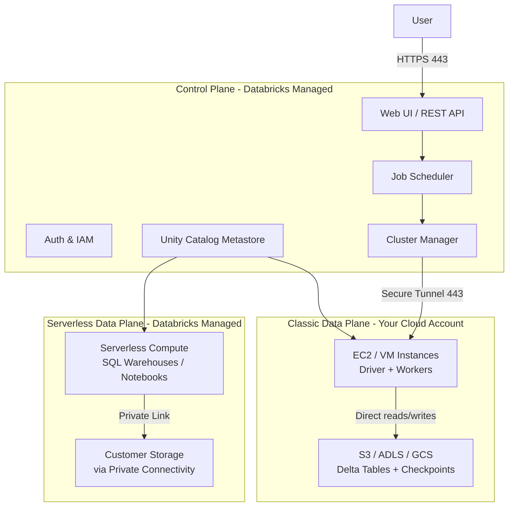
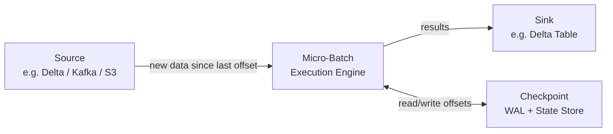

# Databricks: A Deep-Dive Guide for the Senior Data Engineer

> **Audience:** This guide is written for a Senior Data Engineer with deep experience in Amazon Redshift who is learning Databricks. Rather than just listing features, it explains *how things work internally* so you can make sound architectural decisions. Redshift analogies and comparisons appear throughout.

---

## Table of Contents

1. [The Lakehouse Paradigm](#1-the-lakehouse-paradigm)
2. [Architecture: Control Plane & Data Plane](#2-architecture-control-plane--data-plane)
3. [Compute: Clusters, Runtimes & SQL Warehouses](#3-compute-clusters-runtimes--sql-warehouses)
4. [Delta Lake Internals](#4-delta-lake-internals)
5. [Delta Lake Optimizations](#5-delta-lake-optimizations)
6. [Delta Lake DML: MERGE, UPDATE, DELETE & CDF](#6-delta-lake-dml-merge-update-delete--cdf)
7. [Unity Catalog & Data Governance](#7-unity-catalog--data-governance)
8. [Ingestion: Auto Loader & COPY INTO](#8-ingestion-auto-loader--copy-into)
9. [Structured Streaming](#9-structured-streaming)
10. [Lakeflow Spark Declarative Pipelines](#10-lakeflow-spark-declarative-pipelines)
11. [Jobs & Workflows (Lakeflow Jobs)](#11-jobs--workflows-lakeflow-jobs)
12. [SQL: Databricks vs Redshift](#12-sql-databricks-vs-redshift)
13. [Databricks Asset Bundles (DABs)](#13-databricks-asset-bundles-dabs)
14. [Key Redshift → Databricks Mental Model Shifts](#14-key-redshift--databricks-mental-model-shifts)

---

## 1. The Lakehouse Paradigm

### Why the Lakehouse Exists

The data industry spent years oscillating between two architectures:

**Data Warehouses (e.g., Redshift):**
- Excellent for structured analytics, SQL, BI
- Proprietary columnar storage — data is locked inside the warehouse
- Tight coupling of storage and compute (Redshift clusters store data on attached EBS/NVMe)
- Cannot directly run ML workloads; data must be exported first
- Schema-on-write enforced strictly

**Data Lakes (e.g., raw S3):**
- Cheap, scalable, open storage (Parquet on S3)
- No ACID guarantees — partial writes can corrupt reads
- No schema enforcement — "swamp" problem
- Terrible query performance without careful manual optimization
- No versioning, no rollback

The **Lakehouse** is the architectural answer: bring data warehouse features (ACID transactions, schema enforcement, query performance, BI tooling) *on top of* an open-format data lake. You store data in open formats on cheap cloud object storage (S3/ADLS/GCS), but get all the reliability and performance primitives of a warehouse.

> **Redshift analogy:** Imagine if Redshift stored its internal data as open Parquet files in S3, exposed a transaction log that guaranteed ACID, and let you query those files with any compute engine — Spark, Trino, Athena, Flink — simultaneously. That's the lakehouse.

### Open Formats vs Proprietary

| | Amazon Redshift | Databricks Delta Lake |
|---|---|---|
| Storage format | Proprietary columnar (not accessible outside Redshift) | Apache Parquet (open, widely supported) |
| Storage location | Cluster-attached EBS or Redshift Managed Storage (RMS) | Your S3/ADLS/GCS bucket |
| ACID support | Yes (within cluster) | Yes (via Delta transaction log) |
| Multi-engine access | No | Yes — Spark, Athena, Presto, Flink can read Delta |
| Schema evolution | Limited | Rich schema evolution support |
| Storage cost | RA3: separate from compute; DC2: bundled | Standard S3/ADLS pricing |

### Databricks Data Intelligence Platform

Databricks is the commercial platform that bundles:
- **Delta Lake** — open-source storage layer
- **Apache Spark** — distributed computation engine
- **Unity Catalog** — unified governance layer
- **Photon** — C++ vectorized query engine
- **MLflow** — open-source ML lifecycle management
- **Lakeflow** — data ingestion and pipeline orchestration
- **Databricks SQL** — SQL analytics layer with serverless warehouses

All of these run in a single unified platform with one security model, one lineage graph, and one governance layer.

> **Reference:** [Databricks Introduction](https://docs.databricks.com/aws/en/introduction/)

---

## 2. Architecture: Control Plane & Data Plane

### The Two-Plane Architecture

Databricks separates management from execution into two distinct planes. This is a fundamental architectural concept that has deep security and operational implications.



### Control Plane

The control plane is **hosted and managed by Databricks** in Databricks's own cloud infrastructure. It handles:

- **Web UI and REST API** — all user interactions, notebook editing, workflow configuration
- **Job scheduler** — triggering, monitoring, retrying jobs
- **Cluster manager** — requesting instances from your cloud account (via a cross-account IAM role in AWS)
- **Unity Catalog metastore** — all metadata, access control, lineage
- **Authentication and authorization** — SAML SSO, SCIM provisioning, token management

**Key insight:** The control plane never touches your data. Your data files in S3 go directly from your cluster to S3 — they do not pass through Databricks infrastructure.

### Classic Data Plane

The classic compute plane runs **inside your AWS account**. When you start a cluster:

1. Databricks's cluster manager (in the control plane) calls your account's EC2 API using the cross-account IAM role.
2. EC2 instances spin up inside your VPC.
3. A Databricks agent on each node opens an outbound HTTPS (port 443) tunnel back to the control plane — this is called **Secure Cluster Connectivity (SCC)**, formerly "No Public IP."
4. There are no inbound ports open on cluster nodes; no SSH required.

Your data never leaves your AWS account. Cluster nodes read/write directly to your S3 buckets using your account's IAM permissions.

### Serverless Data Plane

The serverless data plane runs in **Databricks-managed infrastructure** but in the same cloud region as your workspace. Used by:
- Serverless SQL Warehouses
- Serverless Jobs (notebooks, Python scripts)
- Serverless Pipelines

Access to your S3 data from the serverless plane flows through **Private Link** or **VPC endpoints** — data traverses cloud backbone, not public internet.

> **Reference:** [Databricks Architecture Concepts](https://docs.databricks.com/aws/en/getting-started/concepts)

### Account and Workspace Hierarchy

```
Databricks Account
├── Metastore (one per region, attached to workspaces)
│   ├── Catalog: production
│   │   ├── Schema: sales
│   │   │   ├── Table: orders
│   │   │   └── Table: customers
│   │   └── Schema: marketing
│   └── Catalog: development
└── Workspace A (e.g., us-east-1, team: data-engineering)
    ├── Clusters
    ├── Notebooks
    ├── Jobs
    └── SQL Warehouses
```

- A **Databricks account** is the top-level billing entity.
- An **account** can have multiple **workspaces** (typically one per environment or team).
- A **metastore** is created once per region and attached to workspaces. It is the Unity Catalog boundary — metadata is shared across all workspaces attached to the same metastore.

> **Redshift analogy:** In Redshift, each cluster is completely isolated. Sharing data between clusters requires COPY/UNLOAD or data sharing (Redshift RA3). In Databricks, any workspace attached to the same Unity Catalog metastore can query the same tables in the same data lake.

---

## 3. Compute: Clusters, Runtimes & SQL Warehouses

### 3.1 Cluster Types

Databricks has two fundamentally different cluster types based on *lifecycle*:

**All-Purpose Clusters**
- Created manually via UI, CLI, or API
- Persist until manually terminated (or auto-terminated after idle time)
- Shared among multiple users — multiple notebooks can attach to the same cluster
- Billed from start to termination (including idle time)
- Best for: interactive data exploration, development, ad-hoc analysis

**Job Clusters**
- Created automatically by the job scheduler when a job run starts
- **Ephemeral** — terminated immediately when the job run completes
- Cannot be restarted (a new cluster is created for the next run)
- Not shared between jobs; each job run gets its own fresh cluster
- Best for: production ETL jobs, scheduled batch workloads

> **Redshift analogy:** In Redshift, you have a single always-on cluster shared by all workloads (or separate clusters per workload, which is expensive). Job clusters in Databricks are the equivalent of spinning up a fresh Redshift cluster for each job, running it, and tearing it down — except this takes ~2 minutes and is the normal operating model.

**Shared Job Clusters** (within a single job): A single job can define a shared cluster used by multiple tasks within that job run. The cluster starts when the first task using it begins and terminates after the last task finishes.

### 3.2 Cluster Modes

Within all-purpose and job clusters, there are three compute modes:

| Mode | Driver | Workers | Use Case | Languages |
|---|---|---|---|---|
| Single Node | Yes | None | Single-machine ML, small data | Python, R, Scala, SQL |
| Standard | Yes | 1+ | Distributed ETL, batch jobs | Python, R, Scala, SQL |
| High Concurrency | Yes | 1+ | Multi-user interactive workloads | Python, R, SQL (not Scala) |

**High Concurrency** clusters isolate user code in separate processes via **table access control** and **process isolation**. Scala is excluded because JVM process isolation is not feasible. This is the mode used when multiple analysts share a cluster and you need per-user resource isolation and auditability.

> **Note:** In Databricks Runtime 13.0+, the equivalent of High Concurrency is **Shared Access Mode** with Unity Catalog, which provides stronger isolation using separate container namespaces.

### 3.3 Cluster Access Modes (Unity Catalog)

Unity Catalog requires clusters to be configured with a specific **access mode**. This is separate from cluster type/mode:

| Access Mode | Multi-User | Single-User | Unity Catalog |
|---|---|---|---|
| **Shared** | Yes | No | Required |
| **Single User** | No | Yes | Required |
| **No Isolation Shared** | Yes | No | Not supported |
| **Custom** | — | — | Not supported |

Only **Shared** and **Single User** access modes support Unity Catalog. Clusters without these modes cannot access Unity Catalog-managed tables.

### 3.4 Databricks Runtime (DBR)

The **Databricks Runtime** is the packaged set of components that runs on every cluster. It is not just Apache Spark — it includes:

- Apache Spark (specific version per DBR)
- Delta Lake (bundled, Databricks-optimized)
- Python, R, Scala, Java
- Databricks-specific performance patches (hundreds of optimizations not in OSS Spark)
- Photon vectorized engine (enabled by default on Photon-enabled clusters)
- Various ML libraries (in DBR ML variant)

**LTS vs Non-LTS:**
- **LTS (Long-Term Support):** Supported for 3 years. Recommended for production. Examples: 15.4 LTS (Spark 3.5.0), 14.3 LTS (Spark 3.5.0), 13.3 LTS (Spark 3.4.1).
- **Non-LTS:** 6-month support window. Useful for accessing cutting-edge features. Should not be used in production.

**Current LTS releases (as of early 2026):**

| DBR Version | Apache Spark | Support Until |
|---|---|---|
| 17.3 LTS | 4.0.0 | Oct 2028 |
| 16.4 LTS | 3.5.2 | May 2028 |
| 15.4 LTS | 3.5.0 | Aug 2027 |
| 14.3 LTS | 3.5.0 | Feb 2027 |
| 13.3 LTS | 3.4.1 | Aug 2026 |

> **Reference:** [Databricks Runtime Release Notes](https://docs.databricks.com/aws/en/release-notes/runtime/)

### 3.5 Photon Engine

Photon is Databricks's **next-generation query engine written in C++**, available since DBR 9.1 LTS (2021) and GA since August 2022. It is a parallel, vectorized execution engine that replaces the JVM-based Spark SQL code generation for supported operators.

**Why C++ and vectorization?**

The original Spark SQL used **whole-stage code generation** — at query planning time, it generated and compiled Java bytecode for entire pipeline stages. This is effective but has overhead:
- JVM warm-up time
- JVM garbage collection pressure
- Cannot exploit SIMD CPU instructions efficiently

Photon uses **columnar vectorized execution**:
1. Data is processed in columnar batches (not row by row)
2. C++ code can directly use **SIMD instructions** (AVX-512 on modern Intel/AMD CPUs) — processing 16+ values in a single CPU instruction
3. No GC pauses — native memory management
4. Tight integration with Parquet/Delta I/O for zero-copy reads

**What Photon accelerates:**

| Operation | Typical Speedup |
|---|---|
| Hash aggregations | 2-5x |
| Hash joins | 2-4x |
| Sort | 3-20x |
| Window functions | 2-3x |
| Wide table scans | 2-8x |
| Delta/Parquet writes (INSERT, MERGE, CTAS) | 2-4x |
| TPC-DS 1TB benchmark vs latest DBR | ~2x |

**Operators and expressions Photon supports:** Hash Aggregate, Hash Join, Sort, Window Function, Filter, Project, Scan (Delta/Parquet), Union, Expand, ScalarSubquery, Delta/Parquet Write Sink, and most common expressions including date/timestamp, string, arithmetic, conditional, and aggregation functions.

**What Photon does NOT support:**
- User-Defined Functions (Python UDFs, Scala UDFs)
- RDD API operations
- Dataset/DataFrame typed operations
- Structured Streaming stateful operations (stateless Kafka/Kinesis/Delta streaming supported)

When Photon encounters an unsupported operation, it seamlessly falls back to the standard Spark JVM engine for that operator. Mixed pipelines (some operators in Photon, some in JVM) work transparently.

**Enablement:**
- **SQL Warehouses:** Photon is always on — cannot be disabled
- **Serverless compute:** Photon on by default for notebooks and workflows
- **Classic clusters:** Enabled by default on DBR 9.1 LTS+; toggle via UI checkbox or API (`runtime_engine: PHOTON`)

> **Reference:** [Photon runtime](https://docs.databricks.com/aws/en/runtime/photon)

### 3.6 SQL Warehouses

SQL Warehouses are dedicated compute for running SQL queries, BI tools (Tableau, Power BI, Looker), and the Databricks SQL editor. They are separate from clusters — you cannot run notebooks on them.

**Three warehouse types:**

| Type | Compute Location | Scaling | Best For |
|---|---|---|---|
| **Serverless** | Databricks-managed | IWM (AI-powered) | Most workloads — recommended |
| **Pro** | Your cloud account | Manual cluster config | Custom network requirements |
| **Classic** | Your cloud account | Manual cluster config | Legacy |

**Serverless SQL Warehouses — Intelligent Workload Management (IWM):**

IWM is an AI-driven scaling system. When a query arrives:
1. IWM **predicts the resource requirements** of the query (using historical patterns and query analysis)
2. Checks current compute capacity across available clusters
3. If capacity exists: query starts **immediately**
4. If not: query is queued (max 1,000 queued queries)
5. IWM **upscales** aggressively when needed and **downscales** quickly when load drops

This is fundamentally different from Classic/Pro warehouses, which use a fixed rule-based autoscaler:

| Estimated time to process all queued queries | Clusters added (Classic/Pro) |
|---|---|
| > 22 minutes | +3 clusters + 1 per additional 15 min |
| 12-22 minutes | +3 clusters |
| 6-12 minutes | +2 clusters |
| 2-6 minutes | +1 cluster |

**Classic/Pro cluster sizes (AWS):**

| Size | Workers | Instance |
|---|---|---|
| 2X-Small | 1 | i3.2xlarge |
| X-Small | 2 | i3.2xlarge |
| Small | 4 | i3.4xlarge |
| Medium | 8 | i3.8xlarge |
| Large | 16 | i3.8xlarge |
| X-Large | 32 | i3.16xlarge |
| 2X-Large | 64 | i3.16xlarge |

> **Redshift analogy:** SQL Warehouses are the Databricks equivalent of Redshift Serverless or RA3 clusters for analytics queries. The key difference: SQL Warehouses query data in your S3 lake (open Parquet/Delta), while Redshift queries data loaded into its proprietary storage. With Redshift Spectrum you can query S3, but performance and feature parity is limited.

> **Reference:** [SQL Warehouses](https://docs.databricks.com/aws/en/compute/sql-warehouse/index.html)

---

## 4. Delta Lake Internals

Delta Lake is the storage layer that gives Databricks its ACID guarantees, time travel, and schema enforcement. Understanding its internals is critical for debugging performance issues, understanding concurrency behavior, and reasoning about data correctness.

### 4.1 Physical Layout

A Delta table is a directory in cloud object storage containing two things:

```
s3://mybucket/data/events/
├── _delta_log/                          ← Transaction log
│   ├── 00000000000000000000.json        ← Version 0 (initial CREATE TABLE)
│   ├── 00000000000000000001.json        ← Version 1 (first INSERT)
│   ├── 00000000000000000002.json        ← Version 2 (UPDATE)
│   ├── ...
│   ├── 00000000000000000010.checkpoint.parquet  ← Checkpoint at v10
│   └── _last_checkpoint                 ← Points to latest checkpoint
├── part-00000-abc123.parquet            ← Data files
├── part-00001-def456.parquet
├── date=2024-01-01/                     ← Hive-partitioned data (if partitioned)
│   └── part-00000-ghi789.parquet
└── _change_data/                        ← CDF files (if enabled)
    └── part-00000-xyz.parquet
```

The data files are standard **Apache Parquet** files. Nothing special. Any tool that can read Parquet can read the data — it's only the ACID guarantees, schema, and access control that live in the transaction log and Unity Catalog.

### 4.2 The Transaction Log (`_delta_log`)

The `_delta_log` is the **heart of Delta Lake** — an ordered, append-only log that is the single source of truth for the table's state. The principle: **if a file isn't in the log, it doesn't exist** (even if the physical Parquet file is in the directory).

**JSON commit files:**

Each version is a JSON file (`00000000000000000001.json`). One file per atomic transaction. Each JSON file contains a sequence of **actions**, one per line (newline-delimited JSON):

```json
{"commitInfo": {
  "timestamp": 1706745600000,
  "operation": "WRITE",
  "operationParameters": {"mode": "Append", "partitionBy": "[]"},
  "readVersion": 0,
  "isolationLevel": "WriteSerializable",
  "isBlindAppend": true
}}
{"add": {
  "path": "part-00000-abc123-c000.snappy.parquet",
  "partitionValues": {},
  "size": 1048576,
  "modificationTime": 1706745598000,
  "dataChange": true,
  "stats": "{\"numRecords\":50000,\"minValues\":{\"id\":1,\"event_date\":\"2024-01-01\"},\"maxValues\":{\"id\":50000,\"event_date\":\"2024-01-31\"},\"nullCount\":{\"id\":0,\"event_date\":0}}"
}}
{"add": {
  "path": "part-00001-def456-c000.snappy.parquet",
  ...
}}
```

**Action types in a commit:**

| Action | Purpose |
|---|---|
| `commitInfo` | Metadata: timestamp, operation, user, cluster info |
| `add` | Registers a new data file; includes file path, size, partition values, per-file statistics |
| `remove` | Tombstones a file (logical delete); actual file not immediately deleted |
| `metaData` | Schema change, table property change, partition column change |
| `protocol` | Upgrades the min reader/writer protocol version (e.g., enabling deletion vectors) |
| `txn` | Structured Streaming micro-batch ID (for exactly-once semantics) |

**Checkpoint files:**

Reading thousands of JSON files to reconstruct table state is expensive. Delta Lake solves this with **Parquet checkpoints** created every 10 commits by default. A checkpoint is a Parquet snapshot of the entire log state at a given version — it contains all currently active `add` actions (i.e., all live data files).

When a reader opens a Delta table:
1. Read `_last_checkpoint` to find the latest checkpoint version
2. Load the checkpoint Parquet file (fast — Parquet columnar read)
3. Read only the JSON commits *after* the checkpoint version
4. Merge to get the current snapshot

This means even a table with 10,000 commits only requires reading the latest checkpoint + at most 9 JSON files.

### 4.3 ACID Guarantees: How They Actually Work

**Atomicity:** A transaction is committed by atomically writing a new version JSON file to the `_delta_log`. Until that JSON file exists, the transaction hasn't happened. Data files can be written before the commit (they're just unregistered Parquet files), but they only become part of the table when the commit JSON is written. If a job crashes before writing the commit JSON, the data files are orphaned and will be cleaned up by VACUUM.

**Isolation and Optimistic Concurrency:**

Delta Lake uses **optimistic concurrency control** (OCC), not pessimistic locking. This is the opposite of Redshift's approach:

- **Redshift (pessimistic):** Acquires locks before writing. Other writers must wait. Guarantees no conflicts but creates contention.
- **Delta Lake (optimistic):** Assumes conflicts are rare. Multiple writers proceed in parallel, then **validate** before committing.

The OCC commit protocol for a writer:
1. **Read** the current table version (e.g., v5)
2. **Compute** changes: write new Parquet data files to storage
3. **Attempt to commit** as v6 by writing `000...006.json`
4. **If another writer already committed v6:** conflict detected
   - Delta checks if the conflicting commit touched the same data/partitions
   - If no overlap: **automatically retry** the commit as v7
   - If overlap: **throw a `ConcurrentModificationException`**

**Snapshot Isolation:** Readers always see a consistent snapshot. A reader that started at v5 continues to see v5 even while writers commit v6, v7, v8. The reader is never interrupted.

**Isolation Levels:**

| Level | Description | Default? |
|---|---|---|
| `WriteSerializable` | Write operations are serializable to each other; reads may see a non-serializable snapshot | Yes |
| `Serializable` | Both reads and writes are fully serializable; strongest guarantee | No (set via table property) |

For most production workloads, `WriteSerializable` is the correct choice — it provides correctness for write-heavy pipelines while allowing higher read concurrency.

```sql
-- Set serializable isolation for a critical table
ALTER TABLE my_table SET TBLPROPERTIES (
  'delta.isolationLevel' = 'Serializable'
);
```

### 4.4 Time Travel

Delta Lake's transaction log enables querying historical versions of a table. Every committed version is queryable until the data files are removed by VACUUM.

```sql
-- Query by timestamp
SELECT * FROM events TIMESTAMP AS OF '2024-01-15 00:00:00';
SELECT * FROM events TIMESTAMP AS OF current_timestamp() - INTERVAL 7 DAYS;

-- Query by version number
SELECT * FROM events VERSION AS OF 42;

-- Short-hand @ syntax
SELECT * FROM events@v42;
SELECT * FROM events@20240115000000000;  -- yyyyMMddHHmmssSSS format
```

In PySpark:

```python
df = spark.read.format("delta") \
    .option("versionAsOf", 42) \
    .load("s3://mybucket/data/events")

df = spark.read.format("delta") \
    .option("timestampAsOf", "2024-01-15") \
    .load("s3://mybucket/data/events")
```

**Restoring a table to a previous version:**

```sql
-- Restore entire table to a previous version
RESTORE TABLE events TO VERSION AS OF 42;
RESTORE TABLE events TO TIMESTAMP AS OF '2024-01-15';
```

`RESTORE` is a new commit that adds back the files that were active at the target version. It does not modify the transaction log history — it appends a new version that re-registers old files.

**Audit history:**

```sql
DESCRIBE HISTORY events;
DESCRIBE HISTORY events LIMIT 10;  -- Last 10 operations
```

Returns operation type, timestamp, user, notebook/job info, number of files added/removed for every version.

**Time travel retention:** Time travel works as long as the underlying data files haven't been deleted by VACUUM. The default VACUUM retention is **7 days**. To keep more history:

```sql
ALTER TABLE events SET TBLPROPERTIES (
  'delta.deletedFileRetentionDuration' = 'interval 30 days',
  'delta.logRetentionDuration' = 'interval 60 days'
);
```

### 4.5 Deletion Vectors

Deletion vectors (DVs), introduced in DBR 12.2 LTS, are a mechanism to **mark rows as deleted without rewriting the entire Parquet file**.

**The problem without DVs:** Deleting a single row from a 1GB Parquet file requires:
1. Reading the entire 1GB file
2. Filtering out the deleted row
3. Writing a new 1GB file (minus 1 row)
4. Registering the new file in the log and tombstoning the old file

This is a write amplification problem — deleting 1 row costs O(file size).

**How DVs work:**
1. `DELETE`/`UPDATE`/`MERGE` creates a small **deletion vector file** (a Roaring Bitmap that records which row positions are deleted) and registers it in the transaction log alongside the original Parquet file
2. The original Parquet file is **not rewritten**
3. Readers resolve the current table state by applying the DV bitmap to exclude deleted rows

```
_delta_log/00000000000000000005.json
→ "add": {
    "path": "part-00000-abc.parquet",
    "deletionVector": {
      "storageType": "u",          // inline or path
      "pathOrInlineDv": "<base85>", // encoded bitmap
      "offset": 1,
      "sizeInBytes": 36,
      "cardinality": 3             // 3 rows deleted
    }
  }
```

**Benefits:**
- DELETE of a few rows is now milliseconds instead of minutes
- No write amplification for small modifications
- Enables **row-level concurrency** (DBR 14.2+): two concurrent transactions modifying different rows in the same file no longer conflict

**Physical cleanup:** DVs are soft deletes. The deleted rows still exist in the Parquet file on disk. To physically remove them:

```sql
-- Rewrite Parquet files to apply all deletion vectors
REORG TABLE my_table APPLY (PURGE);
-- Then vacuum to clean up old files
VACUUM my_table;
```

**Enabling DVs:**

```sql
ALTER TABLE my_table SET TBLPROPERTIES (
  'delta.enableDeletionVectors' = true
);
```

> **Warning:** Enabling DVs upgrades the Delta protocol. Tables with DVs cannot be read by older Delta clients. Check client compatibility before enabling in multi-engine environments.

> **Reference:** [Deletion Vectors](https://docs.databricks.com/aws/en/delta/deletion-vectors.html)

---

## 5. Delta Lake Optimizations

### 5.1 Data Skipping

Data skipping is Delta Lake's primary mechanism for reducing I/O on selective queries. It works at the **file level** — not the row level.

**How statistics are collected:**

When data is written to a Delta table, the Databricks writer automatically collects per-file statistics for each data file:
- **`numRecords`** — total rows in the file
- **`minValues`** — minimum value per column
- **`maxValues`** — maximum value per column  
- **`nullCount`** — number of nulls per column

These statistics are stored **inline in the `add` action** of the transaction log (see Section 4.2 above). No separate statistics table, no `ANALYZE TABLE` required (though you can manually trigger recomputation).

**How skipping works at query time:**

```sql
SELECT * FROM events WHERE event_date = '2024-01-15' AND user_id = 12345;
```

1. Spark reads the `_delta_log` to get the list of all active files + their statistics
2. For each file, evaluates: can this file possibly contain rows matching the predicate?
   - File A: `minValues.event_date = '2024-01-01'`, `maxValues.event_date = '2024-01-10'` → **SKIP** (date range doesn't include 2024-01-15)
   - File B: `minValues.event_date = '2024-01-10'`, `maxValues.event_date = '2024-01-20'` → **READ** (might contain the date)
3. Only files that *might* contain matching rows are fetched from S3

**Statistics column limits:**

- By default, statistics are collected for the **first 32 columns** (by schema position)
- For Unity Catalog managed tables with Predictive Optimization: no 32-column limit; intelligently selected
- Override with table properties:

```sql
-- Index specific columns by name (DBR 13.3 LTS+)
ALTER TABLE events SET TBLPROPERTIES (
  'delta.dataSkippingStatsColumns' = 'user_id, event_date, product_id'
);

-- Manually recompute statistics
ANALYZE TABLE events COMPUTE DELTA STATISTICS;
```

**Effectiveness depends on data layout:** If all files contain overlapping value ranges for your filter columns (e.g., data is ingested in random order), skipping is ineffective — every file's min/max range overlaps with every predicate. This is why Z-ordering and Liquid Clustering exist: they co-locate related rows to maximize skipping.

### 5.2 The Small File Problem

Every streaming micro-batch, every incremental INSERT, every MERGE that touches a small number of partitions creates small Parquet files. Over time, a table can accumulate thousands of tiny files. This causes:

1. **Slow query planning:** Spark must read all `add` actions from the transaction log and check statistics for thousands of files
2. **High S3 API costs:** S3 charges per API call; opening 10,000 small files costs more than opening 100 large files
3. **Inefficient columnar compression:** Parquet compresses and encodes better with more data per file
4. **Reduced data skipping effectiveness:** More files means more files to check — and small files may only slightly overlap, diluting skipping gains

**Target file size:** Delta Lake targets **128MB to 1GB** per Parquet file for batch workloads. Streaming writes naturally produce small files (one set per micro-batch).

### 5.3 OPTIMIZE (Bin-Packing)

`OPTIMIZE` is the command to compact small files. Without a `ZORDER BY` clause, it performs **bin-packing**: combining many small files into fewer, larger files.

```sql
-- Compact all files in the table
OPTIMIZE events;

-- Compact only a specific partition (much faster for large tables)
OPTIMIZE events WHERE event_date = '2024-01-15';

-- With Z-ordering (legacy; prefer Liquid Clustering)
OPTIMIZE events ZORDER BY (user_id, event_type);
```

**Bin-packing internals:**
1. Scans the transaction log to identify all active files smaller than the target size
2. Groups files (bin-packing algorithm) to produce outputs near the target size
3. Writes new compacted Parquet files
4. Commits a new transaction: `remove` actions for all old files + `add` actions for new compacted files
5. Old files remain on disk until VACUUM

**Idempotent:** Running `OPTIMIZE` twice has no effect the second time — if files are already the right size, nothing is rewritten.

**Snapshot isolation:** Ongoing reads are not interrupted. Readers using the version *before* OPTIMIZE committed continue seeing the old files. New readers see the compacted files.

**Predictive Optimization:** For Unity Catalog managed tables, Databricks can automatically run OPTIMIZE in the background based on detected small file accumulation. Enable it per table or at the catalog/schema level:

```sql
ALTER TABLE events SET TBLPROPERTIES (
  'delta.autoOptimize.optimizeWrite' = 'true',    -- Compact during writes
  'delta.autoOptimize.autoCompact' = 'true'        -- Background compaction
);
```

### 5.4 Z-Ordering (Legacy Approach)

Z-ordering is a data layout technique that co-locates rows with similar values of specified columns into the same files, maximizing data skipping effectiveness for multi-dimensional queries.

**How Morton space-filling curves work:**

A Z-order curve (also called a Morton curve) maps multi-dimensional data to one dimension while preserving locality. For two columns (x, y):

1. Map each value to a range partition ID (0-255)
2. **Interleave the binary bits** of the two range IDs:
   - x = 6 = `0110`
   - y = 3 = `0011`
   - Interleaved (alternating bits from x and y): `00 11 01 10` = `0011` + ... 
   - Result: a single Z-value that encodes both dimensions
3. Sort data by Z-value
4. Write sorted data to files

The result: nearby Z-values correspond to nearby points in 2D space. A rectangular query region in (x, y) space becomes a small set of contiguous Z-value ranges, meaning fewer files need to be read.

**Limitations:**
- **Not incremental:** ZORDER requires rewriting the entire table (or partition). You can't ZORDER new data only.
- **Write amplification:** Expensive full table rewrite
- **Partition-scoped:** Z-ordering works *within* each partition independently. It does not sort data across partition boundaries.
- **Static layout:** If your query patterns change, you have to ZORDER again with different columns
- **Databricks recommendation:** Use Liquid Clustering instead for new tables

### 5.5 Liquid Clustering (Modern Approach)

Liquid Clustering is Databricks's replacement for both partitioning and Z-ordering. It provides:
- Multi-column co-location (like Z-ordering)
- **Incremental reclustering** — only new/modified data is reclustered
- **Flexible key redefinition** — change clustering keys without rewriting existing data
- **On-write clustering** — data can be clustered during the write itself
- **Row-level concurrency** — inherently compatible with deletion vectors

**How it works internally:**

Unlike Z-ordering which uses Morton curves (bit interleaving), Liquid Clustering uses **Hilbert space-filling curves**, which have better locality-preservation properties (nearby points in N-dimensional space stay closer together in 1D Hilbert order than Morton order).

Liquid clustering tracks which data files are "clustered" and which aren't. When you run `OPTIMIZE`, it only reclusters files that are not yet properly clustered — this is the **incremental** property.

**Creating a clustered table:**

```sql
-- New table with clustering
CREATE TABLE events (
  event_id BIGINT,
  user_id BIGINT,
  event_type STRING,
  event_date DATE,
  payload STRING
)
CLUSTER BY (user_id, event_date);

-- Add clustering to existing table (no data rewrite required!)
ALTER TABLE events CLUSTER BY (user_id, event_date);

-- Remove clustering
ALTER TABLE events CLUSTER BY NONE;
```

**Triggering clustering:**

```sql
-- Incremental clustering (only reclusters what needs it)
OPTIMIZE events;

-- Full reclustering (force rewrite all data, DBR 16.0+)
OPTIMIZE events FULL;
```

**On-write clustering:** For write operations above certain size thresholds, data is clustered during the write itself without needing a subsequent OPTIMIZE:

| Clustering keys | Unity Catalog managed | Other |
|---|---|---|
| 1 column | 64 MB | 256 MB |
| 2 columns | 256 MB | 1 GB |
| 3 columns | 512 MB | 2 GB |
| 4 columns | 1 GB | 4 GB |

Operations that support on-write clustering: `spark.write.mode("append")`, `COPY INTO` (Parquet), `CTAS/RTAS`, `INSERT INTO`.

**Automatic Liquid Clustering (DBR 15.4 LTS+):**

```sql
CREATE TABLE events (...) CLUSTER BY AUTO;
```

With `CLUSTER BY AUTO`, Databricks's query optimizer analyzes your actual query patterns over time and automatically selects the optimal clustering keys. It only changes keys when the predicted cost savings outweigh the reclustering cost.

**Choosing good clustering keys:**
- Columns most commonly used in `WHERE` filters
- High-cardinality columns (e.g., `user_id` with millions of distinct values) — they create fine-grained skipping
- Maximum **4 columns** (additional columns don't help and increase overhead)
- If two columns are highly correlated (e.g., `date` and `timestamp`), only include one

> **Redshift analogy:** Liquid Clustering is the flexible, dynamic version of Redshift's compound sort keys, but without the need to `VACUUM FULL` to re-sort data. In Redshift, sort key columns are fixed at table creation and require a deep copy to change. In Delta Lake with Liquid Clustering, you run `ALTER TABLE ... CLUSTER BY (new_cols)` and new data is immediately clustered on the new keys; old data is lazily reclustered over time.

### 5.6 VACUUM

VACUUM physically removes data files that are no longer part of the table state (tombstoned by `remove` actions) and older than the retention threshold.

```sql
-- Default: remove files older than 7 days
VACUUM events;

-- Preview what would be deleted (dry run)
VACUUM events DRY RUN;

-- Custom retention
VACUUM events RETAIN 168 HOURS;  -- 7 days

-- LITE mode: use log-based approach instead of full directory listing (DBR 16.1+)
VACUUM events LITE;
```

**What VACUUM deletes:**
- Data files referenced by `remove` actions in the log that are older than the retention threshold
- Stale CDF (`_change_data`) files
- Bloom filter index files (`_delta_index`)
- Orphaned Parquet files not referenced in the log (full VACUUM only)

**What VACUUM does NOT delete:**
- `_delta_log/` files (log compaction is managed separately by checkpoint rotation)
- Files in directories starting with `_` or `.`
- Any file newer than the retention threshold

**FULL vs LITE mode:**

| | FULL (default) | LITE (DBR 16.1+) |
|---|---|---|
| File discovery | Lists all files in table directory (expensive for large tables) | Uses transaction log to identify files to remove |
| Completeness | Catches orphaned files not in the log | Only removes log-referenced files |
| Performance | Slower for large tables | Faster |
| Requirement | None | Must have run a successful FULL VACUUM within the last 30 days |

**Retention and time travel trade-off:**

VACUUM is the mechanism that limits time travel. After VACUUM removes a file, any time travel query that needs that file will fail. The safety check prevents VACUUM with retention < 7 days by default:

```sql
-- Disable safety check (dangerous — breaks running jobs)
SET spark.databricks.delta.retentionDurationCheck.enabled = false;
VACUUM events RETAIN 0 HOURS;  -- ⚠️ Destroys all history immediately
```

**Sizing VACUUM jobs:**
- Driver needs 8-32 cores (file deletion is a driver-only operation — worker nodes only help with file listing)
- For tables with >10,000 files to delete, consider dedicated large driver instances
- Schedule VACUUM separately from OPTIMIZE — they are different workloads

> **Reference:** [VACUUM command](https://docs.databricks.com/aws/en/sql/language-manual/delta-vacuum.html)

---

## 6. Delta Lake DML: MERGE, UPDATE, DELETE & CDF

### 6.1 MERGE (UPSERT)

`MERGE` is Delta Lake's most powerful — and most complex — DML operation. It combines INSERT, UPDATE, and DELETE in a single atomic operation.

**Basic syntax:**

```sql
MERGE INTO target_table AS t
USING source_table AS s
  ON t.customer_id = s.customer_id
WHEN MATCHED AND s.operation = 'DELETE' THEN
  DELETE
WHEN MATCHED THEN
  UPDATE SET
    t.name = s.name,
    t.email = s.email,
    t.updated_at = s.updated_at
WHEN NOT MATCHED BY TARGET THEN
  INSERT (customer_id, name, email, created_at, updated_at)
  VALUES (s.customer_id, s.name, s.email, s.created_at, s.updated_at)
WHEN NOT MATCHED BY SOURCE THEN  -- DBR 12.2 LTS+
  UPDATE SET t.is_active = false;
```

The `WHEN NOT MATCHED BY SOURCE` clause handles rows in the *target* that have no corresponding row in the *source* — useful for implementing soft deletes or deactivation in SCD workflows.

**MERGE internals — Low Shuffle Merge (LSM):**

Pre-LSM (before DBR 10.4), MERGE worked naively:
1. Full join between source and target
2. All matched and unmatched rows shuffled through the network
3. Entire files containing any matched row were rewritten

This was expensive because for a typical MERGE touching 1% of rows, 99% of unchanged rows were still read, shuffled, and rewritten.

**Low Shuffle Merge (LSM, DBR 10.4+)** separates the processing:

```
Phase 1: Find files that need modification
  ├── Join source with target file metadata (data skipping)
  ├── Identify only files containing matched rows
  └── Skip files with no matched rows entirely

Phase 2: Process matched files only
  ├── Modified rows path: full join + update/delete logic
  └── Unmodified rows path: copy as-is (no shuffle, no recalculation)

Phase 3: Write new files + commit
  ├── New files for modified rows (preserving Z-order/clustering on best-effort)
  └── Original files for unmodified data (no rewrite!)
```

Result: 2-5x speedup for typical MERGE operations. The key insight is that LSM only shuffles and processes the rows that actually change.

**Performance considerations:**

```sql
-- Prefer MERGE with selective source data
-- ❌ Don't: MERGE entire fact table against entire dimension
MERGE INTO large_fact AS t USING large_dim AS s ON t.id = s.id ...;

-- ✅ Do: Filter source to only changed records
MERGE INTO orders AS t
USING (
  SELECT * FROM order_updates
  WHERE update_date = current_date()
) AS s
ON t.order_id = s.order_id ...;
```

**Optimizing MERGE with Liquid Clustering:** When the target table is clustered on the join key, Delta Lake's data skipping is maximally effective — most files can be skipped in Phase 1.

> **Redshift MERGE comparison:**
>
> In Redshift, `MERGE` is syntactic sugar for:
> ```sql
> BEGIN;
> CREATE TEMP TABLE source_temp AS SELECT ...;
> UPDATE target SET ... FROM source_temp WHERE target.key = source_temp.key;
> DELETE FROM target WHERE key IN (SELECT key FROM source_temp WHERE delete_flag);
> INSERT INTO target SELECT ... FROM source_temp WHERE NOT EXISTS (...);
> COMMIT;
> END;
> ```
> This always creates a temporary table and always processes all rows through full scans. Delta's Low Shuffle MERGE is fundamentally more efficient.

### 6.2 UPDATE and DELETE

```sql
-- Update with predicates
UPDATE events
SET processed = true, processed_at = current_timestamp()
WHERE event_date < '2024-01-01' AND processed = false;

-- Delete with predicates
DELETE FROM events
WHERE event_date < '2023-01-01';
```

With **Deletion Vectors enabled** (Section 4.5), both operations skip the Parquet file rewrite for small deletions/updates, making them dramatically faster.

### 6.3 Change Data Feed (CDF)

Change Data Feed captures **row-level change events** (inserts, updates, deletes) from a Delta table, enabling downstream consumers to process only changed rows.

**How CDF works internally:**

When CDF is enabled, every DML operation writes change event records to a `_change_data` directory alongside the table data files. Each change record includes the original row data plus metadata columns:

| Column | Type | Description |
|---|---|---|
| `_change_type` | string | `insert`, `update_preimage`, `update_postimage`, `delete` |
| `_commit_version` | long | Delta log version of the commit |
| `_commit_timestamp` | timestamp | Timestamp of the commit |

For updates, CDF writes **two records**: the `update_preimage` (before state) and `update_postimage` (after state). This allows downstream consumers to compute the delta.

**Note on insert-only operations:** Appends and full partition overwrites don't write to `_change_data` — they are computed directly from the transaction log (which is cheaper). CDF overhead is only incurred for UPDATE, DELETE, and MERGE.

**Enabling CDF:**

```sql
-- Enable on new table
CREATE TABLE customers (
  customer_id BIGINT,
  name STRING,
  email STRING
) TBLPROPERTIES ('delta.enableChangeDataFeed' = true);

-- Enable on existing table (only changes AFTER this point are captured)
ALTER TABLE customers SET TBLPROPERTIES ('delta.enableChangeDataFeed' = true);
```

**Reading CDF in streaming (recommended):**

```python
df = (spark.readStream
  .option("readChangeFeed", "true")
  .option("startingVersion", 10)          # or startingTimestamp
  .table("catalog.schema.customers"))

# Process the change stream
(df.writeStream
  .option("checkpointLocation", "/checkpoints/customer_cdf")
  .foreachBatch(process_changes)
  .start())
```

**Reading CDF in batch:**

```sql
-- Read changes between versions
SELECT * FROM table_changes('customers', 5, 15);

-- Read changes from a timestamp
SELECT * FROM table_changes('customers', '2024-01-01', '2024-01-31');
```

**Use cases:**
- **Incremental ETL:** Only process rows changed since the last run
- **CDC to external systems:** Stream changes to Kafka, JDBC, or other sinks
- **Audit trails:** Track who changed what and when
- **Downstream Delta tables:** Keep silver/gold tables in sync with bronze using only deltas

> **Reference:** [Delta Change Data Feed](https://docs.databricks.com/aws/en/delta/delta-change-data-feed.html)

---

## 7. Unity Catalog & Data Governance

### 7.1 Three-Level Namespace

Unity Catalog introduces a three-level namespace that replaces the legacy Hive Metastore's two-level namespace:

```
Legacy Hive:   database.table
Unity Catalog: catalog.schema.table
```

This extra level allows you to:
- Organize data by environment (`production`, `development`, `staging`)
- Organize by business domain (`sales`, `marketing`, `engineering`)
- Bind different catalogs to different workspaces for environment isolation

```sql
-- Reference tables with fully qualified names
SELECT * FROM production.sales.orders;
SELECT * FROM development.sales.orders;

-- Set default catalog for the session
USE CATALOG production;
USE SCHEMA sales;
SELECT * FROM orders;  -- Resolves to production.sales.orders
```

> **Redshift analogy:** Redshift uses `database.schema.table`. Unity Catalog's `catalog.schema.table` is analogous, but catalogs can span workspaces (like Redshift data sharing, but richer). Unity Catalog also has a metastore layer above catalogs.

### 7.2 Metastore and Account Hierarchy

```
Databricks Account
└── Unity Catalog Metastore (one per region)
    ├── Catalog: production
    │   ├── Schema: sales
    │   │   ├── Table: orders (managed Delta)
    │   │   ├── Table: customers (external Delta on s3://data/customers)
    │   │   └── Volume: raw_uploads (s3://uploads/...)
    │   └── Schema: marketing
    ├── Catalog: development
    └── Catalog: shared_data (accessible to external workspaces)
```

**Metastore:** The top-level container. One per region. Runs in Databricks's infrastructure — not in your account. All workspaces in the same region share the same metastore.

**Catalog:** The first namespace level. Created inside a metastore. Can be isolated to specific workspaces using workspace-catalog binding.

**Schema (Database):** The second level. Contains tables, views, volumes, functions, and models.

**Objects:**

| Type | Description |
|---|---|
| **Table (managed)** | Delta table; Databricks manages both metadata and data files |
| **Table (external)** | Any format; Databricks manages metadata only, data in your S3 |
| **View** | Saved query against one or more tables |
| **Materialized View** | Pre-computed query result stored as a Delta table |
| **Volume** | Logical volume of cloud storage for non-tabular files |
| **Function** | Scalar or table-valued UDF |
| **Model** | MLflow model registered in Unity Catalog |

### 7.3 Managed vs External Tables

**Managed tables:**
- Databricks controls *both* the metadata (in Unity Catalog) and the data files (in UC-managed storage on S3)
- `DROP TABLE` deletes the data files too
- Always Delta format
- Get automatic Predictive Optimization, automatic statistics, auto-liquid-clustering
- Recommended for most use cases

**External tables:**
- Databricks controls only the metadata
- `DROP TABLE` only removes the metadata entry; data files remain in S3
- Supports Delta, Parquet, CSV, JSON, Avro, ORC, Text
- Required when: data must be writable by non-Databricks tools; existing large datasets that shouldn't be copied; Redshift Spectrum / Athena / EMR also needs access

```sql
-- Create a managed table (Databricks manages storage)
CREATE TABLE production.sales.orders (
  order_id BIGINT,
  customer_id BIGINT,
  amount DECIMAL(12,2),
  order_date DATE
);

-- Create an external table (your S3 manages storage)
CREATE TABLE production.sales.raw_events
USING DELTA
LOCATION 's3://mybucket/data/raw_events';

-- Create an external table over existing Parquet
CREATE TABLE production.sales.legacy_data
USING PARQUET
LOCATION 's3://mybucket/legacy/parquet_data';
```

**Volumes (for non-tabular data):**

```sql
-- Create a managed volume (for files, images, PDFs, etc.)
CREATE VOLUME production.sales.reports;

-- Access files in a volume
LIST '/Volumes/production/sales/reports/';
COPY INTO bronze_table FROM '/Volumes/production/ingestion/raw/';
```

### 7.4 Storage Credentials and External Locations

To register external tables, Unity Catalog needs to know how to access the S3 buckets:

**Storage Credential:** An IAM role ARN (on AWS) that Unity Catalog can assume to access S3.

```sql
CREATE STORAGE CREDENTIAL my_s3_credential
WITH IAM_ROLE 'arn:aws:iam::123456789:role/databricks-uc-role';
```

**External Location:** Maps a specific S3 path to a storage credential.

```sql
CREATE EXTERNAL LOCATION my_data_location
URL 's3://mybucket/data/'
WITH (STORAGE CREDENTIAL my_s3_credential);
```

Once defined, any external table or external volume within this path can use this credential. Permissions on external locations are governed by Unity Catalog `GRANT` statements.

### 7.5 Access Control (ANSI SQL GRANT/REVOKE)

Unity Catalog uses standard ANSI SQL `GRANT` and `REVOKE` for access control, consistent across all object types.

**Privilege hierarchy:** Privileges granted at higher levels cascade down to children unless explicitly restricted.

```sql
-- Grant CREATE TABLE permission on a schema
GRANT CREATE TABLE ON SCHEMA production.sales TO `data-engineering-team`;

-- Grant SELECT on a specific table
GRANT SELECT ON TABLE production.sales.orders TO `analytics-team`;

-- Grant all privileges on a catalog
GRANT ALL PRIVILEGES ON CATALOG development TO `dev-team`;

-- Grant access to a volume
GRANT READ VOLUME ON VOLUME production.sales.reports TO `bi-team`;

-- Revoke access
REVOKE SELECT ON TABLE production.sales.customers FROM `marketing-team`;

-- Check grants
SHOW GRANTS ON TABLE production.sales.orders;
```

**Row-level security and column masking via Dynamic Views:**

```sql
-- Dynamic view: hide PII based on user's group membership
CREATE VIEW production.sales.customers_secure AS
SELECT
  customer_id,
  name,
  CASE
    WHEN IS_MEMBER('pii-readers') THEN email
    ELSE 'REDACTED'
  END AS email,
  country
FROM production.sales.customers_raw;
```

### 7.6 Workspace-Catalog Binding

By default, all workspaces attached to the same metastore can access all catalogs. You can restrict this to create environment isolation:

```sql
-- Bind the production catalog to only the production workspace
-- (done via REST API or Catalog Explorer, not SQL)
```

This prevents a developer using the `development` workspace from accidentally querying `production` data, even if they have SELECT privileges on the catalog.

### 7.7 Predictive Optimization

For Unity Catalog managed tables, Databricks can automatically run maintenance operations (OPTIMIZE, VACUUM, statistics collection) based on observed usage patterns:

```sql
-- Enable predictive optimization for a catalog
ALTER CATALOG production ENABLE PREDICTIVE OPTIMIZATION;

-- Or at the schema level
ALTER SCHEMA production.sales ENABLE PREDICTIVE OPTIMIZATION;
```

With predictive optimization enabled, Databricks:
- Monitors query patterns and table modification frequency
- Automatically schedules `OPTIMIZE` when small files accumulate
- Runs `VACUUM` to reclaim storage
- Updates column statistics for data skipping

This removes the need to manually schedule OPTIMIZE/VACUUM jobs.

> **Reference:** [Unity Catalog Overview](https://docs.databricks.com/aws/en/data-governance/unity-catalog/index.html)

---

## 8. Ingestion: Auto Loader & COPY INTO

### 8.1 Auto Loader

Auto Loader is the recommended way to ingest new files from cloud storage into Delta tables. It wraps Apache Spark Structured Streaming's `cloudFiles` source with production-grade file tracking, schema management, and exactly-once semantics.

**The core problem it solves:** You have an S3 prefix where new Parquet/JSON/CSV files land continuously (e.g., from Kafka Connect, Fivetran, an upstream system). You need to reliably process each file exactly once as it arrives — even across job failures and restarts.

**Basic Auto Loader pipeline:**

```python
(spark.readStream
  .format("cloudFiles")
  .option("cloudFiles.format", "json")
  .option("cloudFiles.schemaLocation", "s3://mybucket/checkpoints/events_schema")
  .load("s3://mybucket/raw/events/")
  .writeStream
  .option("checkpointLocation", "s3://mybucket/checkpoints/events")
  .option("mergeSchema", "true")
  .toTable("production.bronze.raw_events"))
```

### 8.2 File Discovery: Two Modes

**File Notification Mode (recommended for high-volume):**
- Auto Loader sets up **S3 Event Notifications → SQS** automatically
- New files trigger an SQS message; Auto Loader subscribes to the queue
- File discovery cost is O(number of new files) — does not list the entire directory
- Requires IAM permissions to create/manage SNS topics and SQS queues

**Directory Listing Mode (default):**
- Auto Loader periodically lists the S3 directory to discover new files
- Cost is O(number of files in the directory) — expensive for large directories
- Simpler setup — no additional AWS resources required
- Suitable for low-volume or development environments

```python
.option("cloudFiles.useNotifications", "true")    # File notification mode
.option("cloudFiles.useNotifications", "false")   # Directory listing mode (default)
```

### 8.3 Exactly-Once Semantics

Auto Loader tracks ingested files using a **RocksDB key-value store** embedded in the checkpoint directory. RocksDB is chosen for its fast key lookups (O(log n) on sorted keys stored on disk) and ability to handle billions of file entries.

When a new file is discovered:
1. Its metadata is written to RocksDB in the checkpoint
2. The file is processed and written to the Delta sink
3. On failure and restart, Auto Loader reads the checkpoint and only processes files NOT yet in RocksDB

Combined with Delta Lake's Structured Streaming exactly-once semantics (streaming micro-batch IDs stored as `txn` actions in the Delta log), this guarantees end-to-end exactly-once delivery.

### 8.4 Schema Inference

For formats without embedded schema (JSON, CSV), Auto Loader infers schema by sampling data:
- Samples the first **50 GB or 1,000 files**, whichever is hit first
- Stores the inferred schema in the `_schemas` directory at `cloudFiles.schemaLocation`
- **Default behavior for JSON/CSV:** All columns inferred as `STRING` to avoid type mismatch failures

```python
# Enable type inference (like DataFrameReader.inferSchema)
.option("cloudFiles.inferColumnTypes", "true")

# Override specific column types
.option("cloudFiles.schemaHints", "user_id BIGINT, amount DECIMAL(12,2), tags MAP<STRING,STRING>")
```

For typed formats (Parquet, Avro), Auto Loader samples files and merges schemas — respecting Parquet's embedded type information.

### 8.5 Schema Evolution Modes

When new columns appear in incoming files:

| Mode | Behavior | When to Use |
|---|---|---|
| `addNewColumns` (default when no schema provided) | Stream stops, adds new column to schema, restarts | Production: catch schema changes |
| `rescue` | New columns captured in `_rescued_data` JSON column | Never lose data; inspect later |
| `failOnNewColumns` | Stream fails; requires manual schema update | Strict schema enforcement |
| `none` (default when schema provided) | New columns ignored silently | Schema is known and fixed |

```python
.option("cloudFiles.schemaEvolutionMode", "rescue")
```

**Rescued data column:** When schema mismatches occur, unmatched fields are captured in `_rescued_data`:

```json
// Original row: {"user_id": 123, "new_field": "surprise"}
// Schema only has user_id column

// Written as:
{"user_id": 123, "_rescued_data": "{\"new_field\": \"surprise\", \"_file_path\": \"s3://...\"}"}
```

### 8.6 COPY INTO

`COPY INTO` is a SQL command for **idempotent batch ingestion** from cloud storage. Unlike Auto Loader (streaming), it runs as a one-time batch operation and can be re-run safely — it tracks which files it has already loaded and skips them.

```sql
COPY INTO production.bronze.events
FROM 's3://mybucket/raw/events/'
FILEFORMAT = PARQUET
FORMAT_OPTIONS ('mergeSchema' = 'true')
COPY_OPTIONS ('mergeSchema' = 'true');

-- Load specific files
COPY INTO production.bronze.events
FROM (SELECT *, _metadata.file_path AS source_file
      FROM 's3://mybucket/raw/events/')
FILEFORMAT = JSON
FILES = ('2024-01-15/events-001.json', '2024-01-15/events-002.json');

-- Load with pattern matching
COPY INTO production.bronze.events
FROM 's3://mybucket/raw/events/'
FILEFORMAT = JSON
PATTERN = '2024-01-*/events-*.json';
```

**COPY INTO vs Auto Loader:**

| | COPY INTO | Auto Loader |
|---|---|---|
| Execution model | Batch (runs once) | Streaming (continuous or scheduled) |
| File tracking | Internal Delta metadata | RocksDB checkpoint |
| Schema inference | Manual or via INFER_SCHEMA | Automatic |
| Schema evolution | Limited | Rich (4 modes) |
| Latency | Minutes (batch) | Seconds (streaming) |
| Best for | Daily/hourly batch loads, migrations | Continuous ingestion, streaming |
| Languages | SQL | Python, Scala |

> **Redshift analogy:** COPY INTO is most similar to Redshift's `COPY FROM S3` command — idempotent, batch, SQL-based file loading. Auto Loader is a new paradigm that Redshift doesn't have a direct equivalent for.

> **Reference:** [Auto Loader](https://docs.databricks.com/aws/en/ingestion/cloud-object-storage/auto-loader/index.html)

---

## 9. Structured Streaming

### 9.1 How the Micro-Batch Engine Works

Apache Spark Structured Streaming uses a **micro-batch processing model** (not a true continuous streaming model). Conceptually:

1. Spark periodically checks the source for new data (based on trigger interval)
2. New data since the last batch is processed as a mini-batch DataFrame
3. Results are written to the sink
4. Checkpoint is updated to record progress

This model trades pure latency (micro-batches can't be sub-second by default) for simplicity: all the standard Spark SQL operators work in streaming mode, and exactly-once semantics are straightforward to reason about.



### 9.2 Checkpointing

Checkpointing is mandatory for production streaming jobs. It provides fault tolerance and exactly-once semantics.

**What the checkpoint contains:**

```
s3://mybucket/checkpoints/my_stream/
├── commits/
│   ├── 0          # Committed batch 0
│   ├── 1          # Committed batch 1
│   └── ...
├── offsets/
│   ├── 0          # Source offsets at start of batch 0 (e.g., Kafka partition offsets)
│   ├── 1
│   └── ...
└── state/
    └── 0/         # State store (for stateful operations: aggregations, joins)
        └── 0.delta  # State as Delta files
```

**Key properties:**
- `offsets/`: Records the source offset *before* processing a batch. If the job crashes mid-batch, it replays from this offset.
- `commits/`: Records successfully completed batches. Prevents reprocessing on restart.
- `state/`: The stateful operator state (groupBy aggregations, stream-stream joins). Stored as Delta files for durability.

```python
(df.writeStream
  .option("checkpointLocation", "s3://mybucket/checkpoints/my_stream")
  .outputMode("append")
  .toTable("production.silver.processed_events"))
```

**Critical rule:** Each streaming query must have its own unique checkpoint location. Sharing a checkpoint between two different queries produces undefined, corrupt behavior.

### 9.3 Trigger Types

The trigger controls when Spark checks for new data:

**1. Default (Unspecified) — ~0ms**
```python
df.writeStream.toTable("my_table")  # No trigger specified
```
Runs micro-batches continuously as fast as possible. As soon as one batch completes, the next starts. Useful for near-real-time workloads.

**2. Processing Time — Fixed intervals**
```python
from pyspark.sql.streaming import Trigger
df.writeStream.trigger(processingTime='30 seconds').toTable("my_table")
```
Starts a new micro-batch every N seconds, regardless of whether the previous batch completed. If the previous batch takes longer than N seconds, the next batch starts immediately after completion.

**3. AvailableNow — Process all available data, then stop**
```python
df.writeStream.trigger(availableNow=True).toTable("my_table")
```
This is the replacement for the deprecated `Trigger.Once`. It:
- Processes all data available at the time of invocation
- Uses multiple micro-batches (unlike `Once` which used one big batch)
- Terminates automatically when all available data is processed

This is ideal for **scheduled incremental batch workloads**: run the streaming job on a schedule (every hour), let it process all new data, and stop. This gives you exactly-once semantics and incremental processing without a long-running streaming process.

**4. Real-Time — Sub-second latency (Preview, DBR 18.0+)**
```python
df.writeStream.trigger(realTime='5 minutes').toTable("my_table")
```
Achieves end-to-end latency under 1 second (typically ~300ms). The `'5 minutes'` parameter is the micro-batch *duration* (not interval) — use longer durations to amortize per-batch overhead.

> **Trigger.Once (deprecated):** In older code you may see `trigger(once=True)`. This is deprecated in DBR 11.3+ and replaced by `availableNow=True`. The key improvement: `availableNow` uses multiple micro-batches to process all available data, providing better backpressure control and lower peak memory usage.

### 9.4 Stateless vs Stateful Streaming

**Stateless operations** process each row independently, with no memory of previous rows:
- `filter()`, `select()`, `withColumn()`, `map()`
- Each micro-batch is processed independently
- Any output mode works (append, update, complete are all equivalent)

**Stateful operations** maintain state across micro-batches:
- Window aggregations: `groupBy(window("timestamp", "1 hour")).agg(count(...))`
- Running aggregations: `groupBy("user_id").agg(sum("amount"))`
- Stream-stream joins
- Deduplication: `dropDuplicates(["event_id"])`

For stateful operations, state is stored in the checkpoint's **state store** (backed by RocksDB in DBR 14.3+, or HDFS-based before that). This state grows unboundedly unless you use watermarks.

**Watermarks** define how late data can arrive before it's discarded:

```python
from pyspark.sql.functions import window

(events
  .withWatermark("event_timestamp", "10 minutes")  # Wait 10 min for late data
  .groupBy(window("event_timestamp", "1 hour"), "user_id")
  .agg(count("*").alias("event_count"))
  .writeStream
  .outputMode("append")    # Only emit finalized windows
  .toTable("production.silver.hourly_user_counts"))
```

The watermark `"10 minutes"` means: for a 1-hour window ending at 14:00, Databricks will wait until event_timestamp watermark reaches 14:10 (i.e., it has seen data with timestamps after 14:10) before finalizing and emitting that window.

**Output modes for stateful streaming:**

| Mode | Behavior | Requires |
|---|---|---|
| `append` | Only emit finalized rows (won't change in future batches) | Watermark required for aggregations |
| `update` | Emit all rows that changed in this batch (even if not final) | None |
| `complete` | Emit the entire result table every batch | Only for aggregations; can be expensive |

### 9.5 Recovery Constraints

When restarting a streaming job from checkpoint, there are strict constraints on what you can change:

| Change | Allowed? |
|---|---|
| Trigger interval | ✅ Yes |
| Input source *type* | ❌ No |
| Input source *parameters* (e.g., Kafka topic) | ⚠️ Depends on source |
| Output sink type | ⚠️ Specific combinations only |
| Adding/removing stateful operators | ❌ No |
| State schema changes | ❌ No |
| Grouping keys in aggregations | ❌ No |
| Filter/projection changes (stateless) | ✅ Some cases yes |

If you need to make a breaking change, you must start a new streaming job with a fresh checkpoint location.

> **Reference:** [Structured Streaming](https://docs.databricks.com/aws/en/structured-streaming/index.html)

---

## 10. Lakeflow Spark Declarative Pipelines

Lakeflow Spark Declarative Pipelines (formerly known as Delta Live Tables or DLT) is a declarative framework for building production data pipelines. Instead of writing imperative code to handle incremental processing, state management, retries, and schema evolution, you declare *what* you want and the engine figures out *how* to compute it incrementally.

### 10.1 Core Concepts

**Pipeline:** The top-level unit. Contains flows, tables, views, and configuration. Has its own compute (serverless or classic) and runs as a single unit.

**Flows:** The foundational concept — a flow reads from a source, applies transformations, and writes to a target. Types:
- **Append flow:** Streaming flow; always appends new data
- **Update flow:** Streaming flow; can update existing rows
- **Complete flow:** Streaming flow; replaces all data
- **Materialized view flow:** Batch flow; incrementally updates only changed results
- **AUTO CDC flow:** Streaming flow for CDC data with built-in out-of-order handling

**Streaming Tables:** Unity Catalog-managed Delta tables that act as streaming sinks. Can have multiple flows writing to them. High-throughput, incremental, exactly-once semantics.

**Materialized Views:** Unity Catalog-managed Delta tables where the engine determines whether to do a full recompute or an incremental update, based on source changes.

**Sinks:** External targets (Kafka topics, EventHub) that pipelines can write to.

**Views:** Intermediate query results that are *not* materialized — computed on demand, live only within the pipeline.

### 10.2 Streaming Tables vs Materialized Views

This is the most important design decision in Lakeflow Pipelines:

| | Streaming Table | Materialized View |
|---|---|---|
| Processing model | Streaming (incremental appends/CDC) | Batch (full recompute or incremental when possible) |
| Source requirement | Append-only / CDC sources | Any source |
| Supports updates/deletes | Via AUTO CDC | Yes (full recompute) |
| Throughput | High — designed for streaming | Lower — designed for aggregations |
| Idiomatic use | Bronze, Silver (raw ingestion, filtering) | Gold (aggregations, joins, business logic) |
| AUTO CDC | ✅ Yes | ❌ No |
| Streaming semantics | Yes | No |

**Recommended Medallion Architecture with Lakeflow Pipelines:**

```python
import dlt  # or: from databricks.sdk.streaming import declare_pipeline as dp

# Bronze: Raw ingestion as streaming table
@dlt.table(comment="Raw events from S3")
def bronze_events():
    return (spark.readStream
        .format("cloudFiles")
        .option("cloudFiles.format", "json")
        .option("cloudFiles.schemaLocation", "/Volumes/catalog/schema/vol/schema")
        .load("s3://mybucket/raw/events/"))

# Silver: Cleaned streaming table
@dlt.table(comment="Cleaned events with valid schema")
@dlt.expect_or_drop("valid_event_id", "event_id IS NOT NULL")
@dlt.expect("valid_amount", "amount >= 0")
def silver_events():
    return (spark.readStream
        .table("bronze_events")
        .where("event_type IS NOT NULL")
        .withColumn("processed_at", current_timestamp()))

# Gold: Aggregated materialized view
@dlt.table(comment="Daily event counts by type")
def gold_daily_event_counts():
    return (spark.read  # Note: spark.read, not readStream
        .table("silver_events")
        .groupBy("event_date", "event_type")
        .agg(count("*").alias("event_count"),
             sum("amount").alias("total_amount")))
```

### 10.3 Data Quality Expectations

Expectations are declarative data quality constraints applied to pipeline datasets. They replace manual validation code and provide built-in monitoring.

**Three enforcement actions:**

```python
# 1. WARN: Record violation in metrics, but pass row through (default)
@dlt.expect("valid_customer_age", "age BETWEEN 0 AND 120")

# 2. DROP: Discard violating rows, log count in metrics
@dlt.expect_or_drop("non_null_email", "email IS NOT NULL")

# 3. FAIL: Fail the pipeline update on any violation (manual fix required)
@dlt.expect_or_fail("positive_revenue", "revenue > 0")
```

In SQL:
```sql
CREATE OR REFRESH STREAMING TABLE silver_orders
COMMENT "Cleaned orders with quality checks"
AS SELECT * FROM STREAM(bronze_orders)
WHERE order_id IS NOT NULL
CONSTRAINT valid_amount EXPECT (amount > 0)
CONSTRAINT valid_customer EXPECT (customer_id IS NOT NULL) ON VIOLATION DROP ROW
CONSTRAINT non_negative_quantity EXPECT (quantity >= 0) ON VIOLATION FAIL UPDATE;
```

**Multiple expectations with shared policy:**
```python
order_quality_rules = {
  "valid_order_id": "order_id IS NOT NULL",
  "valid_amount": "amount > 0",
  "valid_status": "status IN ('PENDING', 'SHIPPED', 'DELIVERED', 'CANCELLED')"
}

@dlt.expect_all_or_drop(order_quality_rules)
def silver_orders():
    return spark.readStream.table("bronze_orders")
```

Expectations are tracked in the **pipeline event log** — you can query violation counts, rates, and trends over time, making it easy to detect upstream data quality degradation.

### 10.4 AUTO CDC: Handling Change Data

AUTO CDC is Lakeflow Pipelines' built-in CDC applier. It handles the hard problems of CDC processing:
- **Out-of-order events:** CDC records from upstream can arrive late or out of order. AUTO CDC correctly applies them based on the sequence column.
- **SCD Type 1 (overwrite):** Just keep the latest state
- **SCD Type 2 (history):** Track all changes with effective dates

```python
# SCD Type 1: Keep latest state
dlt.apply_changes(
    target = "silver_customers",
    source = "bronze_customer_cdc",
    keys = ["customer_id"],
    sequence_by = "update_timestamp",     # Order events by this column
    apply_as_deletes = expr("operation = 'DELETE'"),
    apply_as_truncates = expr("operation = 'TRUNCATE'"),
    except_column_list = ["operation", "update_timestamp"],
    stored_as_scd_type = 1
)

# SCD Type 2: Full history tracking
dlt.apply_changes(
    target = "silver_customers_history",
    source = "bronze_customer_cdc",
    keys = ["customer_id"],
    sequence_by = "update_timestamp",
    stored_as_scd_type = 2,
    track_history_column_list = ["name", "email", "address"]
)
```

For SCD Type 2, Databricks automatically adds `__START_AT`, `__END_AT` columns to track the validity window of each historical record.

### 10.5 Pipeline Execution Modes

**Triggered mode (default):** The pipeline runs, processes all pending data, and stops. Equivalent to `availableNow` trigger on streaming. Used for scheduled batch/micro-batch workloads.

**Continuous mode:** The pipeline runs continuously, processing data as it arrives. Used for near-real-time workloads where latency matters.

The mode affects stream-static joins: in triggered mode, static tables are snapshotted at the start of the update; in continuous mode, static tables reflect the most recent version at query time.

> **Reference:** [Lakeflow Spark Declarative Pipelines](https://docs.databricks.com/aws/en/dlt/index.html)

---

## 11. Jobs & Workflows (Lakeflow Jobs)

### 11.1 Job Architecture

A Lakeflow Job is the Databricks orchestration primitive. It defines a **Directed Acyclic Graph (DAG)** of tasks with dependencies, retry policies, compute configurations, and scheduling.

```
Job: Daily ETL Pipeline
├── Task: ingest_raw_events (Auto Loader notebook)
│   └── succeeds
│       ├── Task: transform_silver (PySpark script)
│       └── Task: update_dim_customers (dbt task)
│           └── succeeds
│               └── Task: compute_gold_aggregates (SQL task)
│                   └── succeeds
│                       └── Task: refresh_dashboard (Dashboard task)
```

### 11.2 Task Types

| Task Type | Description | Compute |
|---|---|---|
| **Notebook** | Run a Databricks notebook (Python/SQL/Scala/R) | All-purpose, job, serverless |
| **Python script** | Run a `.py` file from Git or workspace | All-purpose, job, serverless |
| **SQL** | Run SQL queries | SQL Warehouse (serverless or pro) |
| **Pipeline** | Run a Lakeflow Spark Declarative Pipeline | Serverless or classic pipeline |
| **dbt** | Run dbt transformations | SQL Warehouse |
| **JAR** | Run a compiled Spark application | Classic job cluster only |
| **Spark Submit** | Submit a Spark application | Classic job cluster only |
| **Python wheel** | Run a function from a `.whl` package | All-purpose, job, serverless |
| **For Each** | Iterate over a list and run a nested task per item | — |
| **If/Else** | Conditional branching based on a task output | — |
| **Run Job** | Invoke another job as a sub-task | — |
| **Dashboard** | Refresh a Databricks AI/BI Dashboard | — |

**For Each tasks** are powerful for parallelizing work across dynamic datasets:

```json
{
  "task_key": "process_regions",
  "for_each_task": {
    "inputs": "[\"us-east-1\", \"us-west-2\", \"eu-west-1\"]",
    "concurrency": 3,
    "task": {
      "task_key": "process_region_{{input}}",
      "notebook_task": {
        "notebook_path": "/ETL/process_region",
        "base_parameters": {"region": "{{input}}"}
      }
    }
  }
}
```

### 11.3 Compute for Tasks

**Best practice compute by task type:**

| Task type | Recommended | Why |
|---|---|---|
| Notebook, Python | Serverless jobs | No startup latency, auto-scales |
| SQL queries | Serverless SQL Warehouse | Instant start, IWM scaling |
| Pipeline | Serverless Pipeline | No cluster management |
| dbt | Serverless SQL Warehouse | SQL-native execution |
| JAR, Spark Submit | Classic job cluster | JAR execution requires JVM cluster |

**Shared job clusters:** A single job run can define a shared cluster used by multiple tasks, avoiding the startup cost of spinning up separate clusters per task:

```yaml
job_clusters:
  - job_cluster_key: shared_etl_cluster
    new_cluster:
      spark_version: "15.4.x-scala2.12"
      node_type_id: "r6g.4xlarge"
      num_workers: 4

tasks:
  - task_key: extract
    job_cluster_key: shared_etl_cluster
    notebook_task: {notebook_path: /ETL/extract}
    
  - task_key: transform
    depends_on: [{task_key: extract}]
    job_cluster_key: shared_etl_cluster  # Reuses same cluster
    notebook_task: {notebook_path: /ETL/transform}
```

### 11.4 Retry Policies

```json
{
  "task_key": "my_task",
  "max_retries": 3,
  "min_retry_interval_millis": 60000,  // 1 minute between retries
  "retry_on_timeout": false
}
```

**Continuous jobs:** Use exponential backoff automatically — if the job fails, Databricks waits increasingly longer before retrying (prevents thundering herd against flaky upstream systems).

**Serverless jobs:** Auto-optimized retries by default — Databricks analyzes the failure type and determines whether to retry immediately, wait, or escalate.

**Timeout:** If both `timeout_seconds` and `max_retries` are configured, the timeout applies *per attempt*, not to the total job run time.

### 11.5 Job Run Outcomes

A job run succeeds based on the **leaf tasks** (tasks with no downstream dependencies):

| Status | Meaning |
|---|---|
| **Succeeded** | All tasks succeeded |
| **Succeeded with failures** | Some non-leaf tasks failed, but all leaf tasks succeeded |
| **Failed** | One or more leaf tasks failed |
| **Timed Out** | Job run exceeded maximum allowed duration |
| **Canceled** | Manually canceled |
| **Skipped** | Exceeded max concurrent runs configuration |

### 11.6 Monitoring with System Tables

System tables in `system.lakeflow` expose operational metrics for jobs:

```sql
-- Recent job run performance
SELECT 
  job_name,
  run_state,
  date_trunc('day', start_time) AS run_date,
  round(datediff('second', start_time, end_time) / 60.0, 2) AS duration_minutes,
  result_state
FROM system.lakeflow.job_runs
WHERE start_time >= current_date() - INTERVAL 7 DAYS
ORDER BY start_time DESC;

-- Join with billing to get cost per job
SELECT 
  jr.job_name,
  jr.run_id,
  sum(u.dbus) AS total_dbus,
  sum(u.dbus * p.dbu_price) AS estimated_cost_usd
FROM system.lakeflow.job_runs jr
JOIN system.billing.usage u ON jr.run_id = u.usage_metadata.job_run_id
JOIN system.billing.list_prices p ON u.sku_name = p.sku_name
GROUP BY 1, 2;
```

> **Reference:** [Lakeflow Jobs](https://docs.databricks.com/aws/en/jobs/index.html)

---

## 12. SQL: Databricks vs Redshift

### 12.1 ANSI SQL Compliance

Databricks SQL uses ANSI SQL as its default dialect (enforced via `ANSI_MODE`, default `true` since DBR 17.0+). Key behaviors:

- **Division by zero:** Throws runtime exception (not NULL like Redshift)
- **Integer overflow:** Throws exception (not silent truncation)
- **Implicit casts:** Follows ANSI coercion rules (stricter than Redshift's PostgreSQL heritage)
- **String to number casts:** Fail on invalid input (use `TRY_CAST` for nullable behavior)

```sql
-- Redshift: returns NULL on invalid cast
SELECT CAST('abc' AS INT);  -- NULL in Redshift

-- Databricks ANSI mode: throws exception
SELECT CAST('abc' AS INT);  -- Error

-- Databricks with TRY_CAST: returns NULL safely
SELECT TRY_CAST('abc' AS INT);  -- NULL
```

### 12.2 QUALIFY Clause

`QUALIFY` filters the result of window functions — eliminating the need for a subquery wrapping:

```sql
-- ✅ Databricks: clean QUALIFY syntax
SELECT 
    order_id, 
    customer_id,
    amount,
    RANK() OVER (PARTITION BY customer_id ORDER BY amount DESC) AS amount_rank
FROM orders
QUALIFY amount_rank = 1;

-- ❌ Redshift equivalent: requires subquery
SELECT order_id, customer_id, amount, amount_rank
FROM (
    SELECT 
        order_id, 
        customer_id,
        amount,
        RANK() OVER (PARTITION BY customer_id ORDER BY amount DESC) AS amount_rank
    FROM orders
)
WHERE amount_rank = 1;
```

### 12.3 PIVOT and UNPIVOT

```sql
-- PIVOT: rows to columns
SELECT * FROM (
    SELECT customer_id, quarter, revenue FROM quarterly_revenue
)
PIVOT (
    SUM(revenue)
    FOR quarter IN ('Q1', 'Q2', 'Q3', 'Q4')
);
-- Returns: customer_id, Q1, Q2, Q3, Q4

-- UNPIVOT: columns to rows
SELECT customer_id, quarter, revenue
FROM quarterly_totals
UNPIVOT (
    revenue FOR quarter IN (Q1, Q2, Q3, Q4)
);
```

In Redshift, you must use `CASE` aggregation for PIVOT:
```sql
-- Redshift PIVOT equivalent (verbose)
SELECT 
    customer_id,
    SUM(CASE WHEN quarter = 'Q1' THEN revenue END) AS Q1,
    SUM(CASE WHEN quarter = 'Q2' THEN revenue END) AS Q2,
    ...
FROM quarterly_revenue
GROUP BY customer_id;
```

### 12.4 FILTER Clause on Aggregates

SQL standard FILTER clause for conditional aggregations:

```sql
-- Databricks (SQL standard FILTER)
SELECT 
    customer_id,
    SUM(amount) AS total_amount,
    SUM(amount) FILTER (WHERE year = 2023) AS amount_2023,
    SUM(amount) FILTER (WHERE year = 2024) AS amount_2024,
    COUNT(*) FILTER (WHERE status = 'RETURNED') AS return_count
FROM orders
GROUP BY customer_id;

-- Redshift equivalent (CASE inside aggregate)
SELECT 
    customer_id,
    SUM(amount) AS total_amount,
    SUM(CASE WHEN year = 2023 THEN amount END) AS amount_2023,
    SUM(CASE WHEN year = 2024 THEN amount END) AS amount_2024,
    COUNT(CASE WHEN status = 'RETURNED' THEN 1 END) AS return_count
FROM orders
GROUP BY customer_id;
```

### 12.5 LATERAL VIEW and EXPLODE

Databricks supports nested and array-typed columns natively. To explode arrays into rows:

```sql
-- Explode an array column into rows
SELECT 
    order_id, 
    tag
FROM orders
LATERAL VIEW EXPLODE(tags) AS tag;

-- Modern Databricks syntax (preferred over LATERAL VIEW)
SELECT order_id, tag
FROM orders, LATERAL EXPLODE(tags) AS t(tag);

-- EXPLODE with position index
SELECT order_id, pos, tag
FROM orders
LATERAL VIEW POSEXPLODE(tags) AS pos, tag;

-- Flatten nested struct
SELECT 
    order_id, 
    address.street,
    address.city,
    address.zip
FROM orders;  -- Direct dot notation for structs
```

Redshift uses `SUPER` type for semi-structured data with `PartiQL` syntax, which is fundamentally different from Spark's native array/struct/map types.

### 12.6 Named Window Definitions

```sql
-- Define named windows once, reference multiple times
SELECT 
    product_id,
    month,
    revenue,
    SUM(revenue) OVER w AS cumulative_revenue,
    AVG(revenue) OVER w AS moving_avg,
    LAG(revenue) OVER (w ORDER BY month) AS prev_month_revenue
FROM monthly_revenue
WINDOW w AS (PARTITION BY product_id ORDER BY month
             ROWS BETWEEN 2 PRECEDING AND CURRENT ROW);
```

### 12.7 Redshift Distribution → Databricks Clustering

| Redshift Concept | Purpose | Databricks Equivalent |
|---|---|---|
| `DISTSTYLE KEY (col)` | Co-locate join keys across nodes | Liquid Clustering on join key columns |
| `DISTSTYLE EVEN` | Even distribution (no join optimization) | Default (unpartitioned/unclustered) |
| `DISTSTYLE ALL` | Broadcast small dimension tables | Spark broadcast joins (`BROADCAST` hint) |
| `SORTKEY (col1, col2)` | Compound sort key for range queries | Liquid Clustering / Z-ordering on same columns |
| `INTERLEAVED SORTKEY` | Multi-column sort for equal-weight predicates | Liquid Clustering (inherently multi-column) |
| `DISTKEY + SORTKEY same column` | Co-located + sorted fact table | Liquid Clustering on that column |

**Example migration:**

```sql
-- Redshift orders table
CREATE TABLE orders (
    order_id BIGINT,
    customer_id BIGINT DISTKEY,  
    order_date DATE SORTKEY,
    amount DECIMAL(12,2)
)
DISTSTYLE KEY
COMPOUND SORTKEY (order_date, customer_id);

-- Databricks equivalent
CREATE TABLE orders (
    order_id BIGINT,
    customer_id BIGINT,
    order_date DATE,
    amount DECIMAL(12,2)
)
CLUSTER BY (order_date, customer_id);  -- Liquid clustering on the same columns
```

### 12.8 Broadcast Join Hint (replaces DISTSTYLE ALL)

```sql
-- Databricks: force broadcast of small dimension table
SELECT /*+ BROADCAST(d) */ 
    f.order_id, 
    f.amount, 
    d.customer_name
FROM orders f
JOIN customers d ON f.customer_id = d.customer_id;
```

Databricks also automatically broadcasts tables below `spark.sql.autoBroadcastJoinThreshold` (default 10MB). Set to `-1` to disable auto-broadcasting.

---

## 13. Databricks Asset Bundles (DABs)

### 13.1 What Are Bundles?

Databricks Asset Bundles (DABs) are the **Infrastructure-as-Code (IaC)** framework for Databricks. They let you define, version-control, test, and deploy all Databricks resources — jobs, pipelines, SQL warehouses, dashboards, ML models — as YAML configuration.

The key value proposition: treat your Databricks infrastructure like application code. Check it into Git, run CI/CD pipelines, promote changes through environments (dev → staging → prod) with confidence.

> **Redshift comparison:** In Redshift, infrastructure is managed separately (CloudFormation, Terraform) from SQL code. Jobs are often managed via custom scripts or third-party orchestrators (Airflow, Step Functions). DABs unify everything.

### 13.2 Bundle Structure

```
my-bundle/
├── databricks.yml          # Root configuration
├── resources/
│   ├── jobs.yml            # Job definitions
│   ├── pipelines.yml       # Pipeline definitions
│   └── models.yml          # ML model definitions
├── src/
│   ├── notebooks/
│   │   ├── ingest.py
│   │   └── transform.py
│   ├── python/
│   │   └── my_package/
│   │       ├── __init__.py
│   │       └── transformations.py
│   └── sql/
│       └── gold_aggregations.sql
└── tests/
    └── unit/
        └── test_transformations.py
```

### 13.3 `databricks.yml` Anatomy

```yaml
bundle:
  name: my-etl-bundle

# Variables for parameterization
variables:
  catalog:
    description: "Unity Catalog catalog name"
    default: development
  schedule:
    description: "Cron schedule for the daily job"
    default: "0 2 * * *"  # 2 AM UTC

# Environment-specific targets
targets:
  dev:
    default: true
    workspace:
      host: https://dev-workspace.azuredatabricks.net
    variables:
      catalog: development
    
  staging:
    workspace:
      host: https://staging-workspace.azuredatabricks.net
    variables:
      catalog: staging
      
  prod:
    workspace:
      host: https://prod-workspace.azuredatabricks.net
    variables:
      catalog: production
      schedule: "0 1 * * *"   # Different schedule in prod

# Include additional YAML files
include:
  - resources/*.yml
```

### 13.4 Job Definition in YAML

```yaml
# resources/jobs.yml
resources:
  jobs:
    daily_etl:
      name: "Daily ETL Pipeline (${bundle.target})"
      
      # Use serverless compute
      job_clusters: []  # No clusters needed for serverless tasks
      
      tasks:
        - task_key: ingest_bronze
          notebook_task:
            notebook_path: ../src/notebooks/ingest.py
            base_parameters:
              catalog: ${var.catalog}
              source_path: "s3://mybucket/raw/"
          environment_key: default
          
        - task_key: transform_silver
          depends_on:
            - task_key: ingest_bronze
          notebook_task:
            notebook_path: ../src/notebooks/transform.py
            base_parameters:
              catalog: ${var.catalog}
          
        - task_key: compute_gold
          depends_on:
            - task_key: transform_silver
          sql_task:
            warehouse_id: ${var.warehouse_id}
            file:
              path: ../src/sql/gold_aggregations.sql
              
      schedule:
        quartz_cron_expression: ${var.schedule}
        timezone_id: UTC
        
      # Notifications
      email_notifications:
        on_failure:
          - oncall-data@mycompany.com
        on_success:
          - data-team@mycompany.com
          
      # Job-level timeout
      timeout_seconds: 7200  # 2 hours

  pipelines:
    customer_pipeline:
      name: "Customer 360 Pipeline (${bundle.target})"
      catalog: ${var.catalog}
      schema: silver
      target: silver
      continuous: false
      libraries:
        - notebook:
            path: ../src/notebooks/customer_pipeline.py
```

### 13.5 Deployment Workflow

```bash
# 1. Initialize a new bundle from a template
databricks bundle init

# 2. Validate the configuration (syntax + semantic checks)
databricks bundle validate

# 3. Deploy to development (creates/updates jobs in dev workspace)
databricks bundle deploy -t dev

# 4. Run a specific job in dev to test
databricks bundle run -t dev daily_etl

# 5. After testing, deploy to production
databricks bundle deploy -t prod
```

**What `bundle deploy` does:**
1. Packages Python source code and notebooks
2. Uploads to DBFS or workspace file system
3. Creates or updates all declared resources via Databricks REST APIs
4. Resources are tagged with bundle metadata for lifecycle management

### 13.6 CI/CD Integration

**GitHub Actions example:**

```yaml
# .github/workflows/databricks-deploy.yml
name: Deploy Databricks Bundle

on:
  push:
    branches: [main]
  pull_request:
    branches: [main]

jobs:
  validate:
    runs-on: ubuntu-latest
    steps:
      - uses: actions/checkout@v3
      - uses: databricks/setup-cli@main
      - run: databricks bundle validate
        env:
          DATABRICKS_HOST: ${{ secrets.DATABRICKS_HOST }}
          DATABRICKS_TOKEN: ${{ secrets.DATABRICKS_TOKEN }}

  deploy-staging:
    needs: validate
    if: github.ref == 'refs/heads/main'
    runs-on: ubuntu-latest
    steps:
      - uses: actions/checkout@v3
      - uses: databricks/setup-cli@main
      - run: databricks bundle deploy -t staging
        env:
          DATABRICKS_HOST: ${{ secrets.STAGING_DATABRICKS_HOST }}
          DATABRICKS_TOKEN: ${{ secrets.STAGING_DATABRICKS_TOKEN }}

  deploy-prod:
    needs: deploy-staging
    environment: production  # Requires manual approval
    runs-on: ubuntu-latest
    steps:
      - uses: actions/checkout@v3
      - uses: databricks/setup-cli@main
      - run: databricks bundle deploy -t prod
        env:
          DATABRICKS_HOST: ${{ secrets.PROD_DATABRICKS_HOST }}
          DATABRICKS_TOKEN: ${{ secrets.PROD_DATABRICKS_TOKEN }}
```

> **Reference:** [Databricks Asset Bundles](https://docs.databricks.com/aws/en/dev-tools/bundles/index.html)

---

## 14. Key Redshift → Databricks Mental Model Shifts

This section consolidates the major conceptual shifts for a Senior Data Engineer moving from Redshift to Databricks.

### 14.1 Storage Model

| Concept | Amazon Redshift | Databricks |
|---|---|---|
| **Storage format** | Proprietary columnar (stored in Redshift nodes or RMS) | Apache Parquet files in S3/ADLS/GCS |
| **Portability** | Data locked in Redshift | Any Spark/Athena/Presto/Flink can read the same files |
| **Storage billing** | Bundled with compute (DC2) or separate RMS pricing | Standard S3 object storage pricing |
| **Schema** | Catalog stored in Redshift pg_catalog | Unity Catalog metastore (Databricks-hosted) |
| **Table format** | Proprietary | Delta Lake (open source, Apache-licensed) |

### 14.2 Compute Model

| Concept | Amazon Redshift | Databricks |
|---|---|---|
| **Cluster lifecycle** | Always-on; you pay 24/7 | Ephemeral clusters; shut down when done |
| **Scale up** | Resize cluster (minutes of downtime) | Add worker nodes (no downtime) |
| **Multiple workloads** | One cluster, WLM queue management | Separate clusters per workload type |
| **SQL analytics** | Redshift cluster itself | Serverless SQL Warehouses (separate from ETL clusters) |
| **Ad-hoc queries** | Shared cluster with WLM slots | All-purpose clusters, separate from production jobs |

### 14.3 Data Organization

| Concept | Amazon Redshift | Databricks |
|---|---|---|
| **Namespace** | `database.schema.table` | `catalog.schema.table` |
| **Cross-cluster data** | Redshift data sharing (RA3 only) | Any workspace on same metastore queries same tables |
| **External data** | Redshift Spectrum (S3 only, limited features) | External Delta/Parquet tables with full Unity Catalog governance |
| **Non-tabular storage** | S3 (outside Redshift) | Unity Catalog Volumes (governed access to S3 paths) |

### 14.4 Data Layout and Query Performance

| Concept | Amazon Redshift | Databricks |
|---|---|---|
| **Distribution** | `DISTSTYLE KEY/EVEN/ALL` (mandatory) | Optional Liquid Clustering (replaces all three) |
| **Sort order** | `SORTKEY` (fixed at creation) | Liquid Clustering (dynamic, change without rewrites) |
| **File compaction** | `VACUUM FULL/SORT/REINDEX` | `OPTIMIZE` (bin-packing) |
| **Statistics** | `ANALYZE` | Auto-collected on write; `ANALYZE TABLE ... COMPUTE DELTA STATISTICS` |
| **Small file problem** | N/A (Redshift manages internally) | Must run `OPTIMIZE` (or use Predictive Optimization) |

### 14.5 Data Modification (DML)

| Concept | Amazon Redshift | Databricks |
|---|---|---|
| **UPDATE** | In-place (with vacuum to reclaim space) | COW (copy-on-write) or DVs (metadata-only soft delete) |
| **DELETE** | Marks rows deleted; `VACUUM` reclaims space | COW or DVs |
| **MERGE** | `CREATE TEMP TABLE` + UPDATE + INSERT wrapper | Native MERGE with Low Shuffle optimization |
| **ACID transactions** | Serializable within cluster | Optimistic concurrency; configurable isolation level |
| **Concurrent writes** | Table-level write locks | Row-level concurrency with deletion vectors |
| **CDC** | No native CDC output | Change Data Feed (CDF) |

### 14.6 Ingestion

| Concept | Amazon Redshift | Databricks |
|---|---|---|
| **Bulk load** | `COPY FROM S3` | `COPY INTO` (SQL) or `spark.read.format(...).load()` |
| **Streaming ingest** | Kinesis Firehose → S3 → COPY | Auto Loader (`cloudFiles` source) |
| **Schema-on-read** | N/A (always schema-on-write) | Auto Loader schema inference + evolution |
| **Incremental load tracking** | Custom metadata tables | Auto Loader checkpoint (RocksDB) |

### 14.7 Orchestration

| Concept | Amazon Redshift | Databricks |
|---|---|---|
| **Job scheduler** | AWS Step Functions / Airflow (external) | Lakeflow Jobs (native) |
| **Declarative pipelines** | dbt (external tool) | Lakeflow Spark Declarative Pipelines (native) |
| **IaC / GitOps** | CloudFormation + Terraform (separate) | Databricks Asset Bundles (unified) |
| **Lineage** | Limited (dbt catalog, custom) | Unity Catalog automatic lineage |

### 14.8 Common Anti-Patterns from Redshift Engineers

**Anti-pattern 1: Always partitioning tables**
```sql
-- ❌ Redshift thinking: partition everything like distribution
CREATE TABLE events PARTITION BY (event_date);

-- ✅ Databricks thinking: use Liquid Clustering instead
CREATE TABLE events CLUSTER BY (event_date, user_id);
```
Hive-style partitioning in Delta creates one directory per partition value, leading to the small file problem and slow S3 `LIST` operations at large scale.

**Anti-pattern 2: Running ANALYZE manually**
```sql
-- ❌ Unnecessary in Databricks
ANALYZE TABLE events;

-- ✅ Statistics collected automatically on write
-- Only needed after bulk loads from external tools
```

**Anti-pattern 3: Using cluster-scoped resources for all workloads**
```python
# ❌ Running SQL analytics on the same all-purpose cluster as ETL
spark.sql("SELECT COUNT(*) FROM large_table")  # on all-purpose cluster

# ✅ Use SQL Warehouses for analytics, clusters for ETL
# Route BI queries through SQL Warehouse; ETL stays on job clusters
```

**Anti-pattern 4: Not using Liquid Clustering on high-cardinality filter columns**
```sql
-- ❌ Unoptimized for common query patterns
SELECT * FROM orders WHERE customer_id = 12345;
-- Scans all files without clustering

-- ✅ Cluster on the columns in your WHERE clauses
ALTER TABLE orders CLUSTER BY (customer_id, order_date);
OPTIMIZE orders;  -- Recluster existing data
```

---

## Further Reading & Official References

| Topic | Reference |
|---|---|
| Databricks Architecture | https://docs.databricks.com/aws/en/getting-started/concepts |
| Delta Lake Protocol | https://github.com/delta-io/delta/blob/master/PROTOCOL.md |
| Delta Lake Optimizations | https://docs.databricks.com/aws/en/delta/optimizations/ |
| Liquid Clustering | https://docs.databricks.com/aws/en/delta/clustering.html |
| Deletion Vectors | https://docs.databricks.com/aws/en/delta/deletion-vectors.html |
| Change Data Feed | https://docs.databricks.com/aws/en/delta/delta-change-data-feed.html |
| Unity Catalog | https://docs.databricks.com/aws/en/data-governance/unity-catalog/ |
| Auto Loader | https://docs.databricks.com/aws/en/ingestion/cloud-object-storage/auto-loader/ |
| Structured Streaming | https://docs.databricks.com/aws/en/structured-streaming/ |
| Lakeflow Pipelines | https://docs.databricks.com/aws/en/dlt/ |
| Lakeflow Jobs | https://docs.databricks.com/aws/en/jobs/ |
| Databricks SQL | https://docs.databricks.com/aws/en/sql/ |
| Photon Engine | https://docs.databricks.com/aws/en/runtime/photon.html |
| Databricks Asset Bundles | https://docs.databricks.com/aws/en/dev-tools/bundles/ |
| DBR Release Notes | https://docs.databricks.com/aws/en/release-notes/runtime/ |
