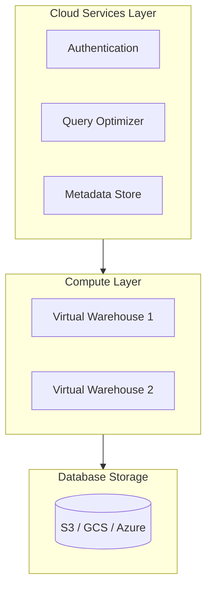

# Snowflake Fundamentals: A Deep Dive for Redshift Data Engineers

A comprehensive guide to Snowflake's architecture, internals, and data engineering capabilities—designed for Senior Data Engineers transitioning from Amazon Redshift.

---

## Table of Contents

1. [Introduction and Audience](#1-introduction-and-audience)
2. [Architecture Deep Dive](#2-architecture-deep-dive)
3. [Storage and Micro-Partitions](#3-storage-and-micro-partitions)
4. [Virtual Warehouses (Compute)](#4-virtual-warehouses-compute)
5. [Data Loading](#5-data-loading)
6. [Clustering Keys and Automatic Clustering](#6-clustering-keys-and-automatic-clustering)
7. [Streams and Tasks (CDC Pipelines)](#7-streams-and-tasks-cdc-pipelines)
8. [Dynamic Tables](#8-dynamic-tables)
9. [Time Travel, Fail-safe, and Zero-Copy Clone](#9-time-travel-fail-safe-and-zero-copy-clone)
10. [Data Type Mappings (Redshift to Snowflake)](#10-data-type-mappings-redshift-to-snowflake)
11. [SQL and Function Differences](#11-sql-and-function-differences)
12. [Cost and FinOps](#12-cost-and-finops)
13. [Best Practices Summary](#13-best-practices-summary)
14. [References](#14-references)

---

## 1. Introduction and Audience

### Purpose

This guide helps Senior Data Engineers from Amazon Redshift understand how Snowflake works at a fundamental level. Snowflake is not "Redshift with a different UI"—it is a ground-up redesign with a completely different architecture. Understanding these differences is essential for effective migration, design, and optimization.

### Key Mindset Shifts

| Redshift Concept | Snowflake Equivalent | Notes |
|------------------|----------------------|-------|
| **DISTKEY** (distribution key) | None / Optional clustering | Snowflake does not pre-distribute data. All compute nodes read from shared storage. Clustering keys optimize pruning, not distribution. |
| **SORTKEY** (sort key) | Micro-partition ordering + optional clustering | Data is automatically micro-partitioned. Clustering keys are optional and maintained by a serverless service. |
| **VACUUM** / **ANALYZE** | None | Snowflake handles maintenance automatically. No manual vacuum or statistics updates. |
| **Fixed cluster** | Virtual warehouses | Warehouses are stateless, elastic, and can be created/destroyed/resized in seconds. |
| **UNLOAD → S3** | COPY INTO location | Similar concept; syntax differs. |

### High-Level Architecture Comparison

From the [Snowflake Redshift Migration Guide](https://docs.snowflake.com/en/migrations/guides/redshift):

| Feature | Amazon Redshift | Snowflake |
|---------|-----------------|-----------|
| **Architecture** | Tightly coupled compute and storage (MPP) | Decoupled compute, storage, and cloud services (multi-cluster, shared data) |
| **Storage** | Managed columnar storage on local SSDs attached to nodes | Centralized object storage (e.g., S3) with automatic micro-partitioning |
| **Compute** | Fixed-size cluster of nodes (Leader + Compute Nodes) | Elastic, on-demand virtual warehouses (compute clusters) |
| **Concurrency** | Limited by cluster size; queries can queue | High concurrency via multi-cluster warehouses that spin up automatically |
| **Scaling** | Scale by adding nodes (minutes to hours, involves data redistribution) | Instantly scale compute up/down/out (seconds); storage scales automatically |
| **Maintenance** | Requires manual VACUUM and ANALYZE commands | Fully managed; maintenance tasks are automated and run in the background |

---

## 2. Architecture Deep Dive

Snowflake uses a **hybrid architecture** that combines shared-disk and shared-nothing designs. It offers the data management simplicity of shared-disk (centralized storage) with the performance benefits of shared-nothing (MPP query execution). This architecture is documented in the [Snowflake Key Concepts](https://docs.snowflake.com/en/user-guide/intro-key-concepts) and the seminal [SIGMOD 2016 Paper](https://www.snowflake.com/wp-content/uploads/2019/06/Snowflake_SIGMOD.pdf).

### Three-Layer Architecture



### Layer 1: Database Storage

- **Location**: Centralized cloud object storage (Amazon S3, Google Cloud Storage, or Microsoft Azure Blob).
- **Format**: Table data is stored in large, immutable files. Each file is horizontally partitioned and uses a **PAX (Partition Attributes Across)** or hybrid columnar layout: column values are grouped and heavily compressed within each file.
- **Immutability**: S3 and similar blob stores do not support in-place updates or appends. Snowflake's design reflects this—tables are composed of immutable file segments; DML creates new files rather than modifying existing ones.
- **Metadata**: Catalog objects, file-to-table mappings, statistics, transaction logs, and locks are stored in a scalable transactional key-value store within the Cloud Services layer.

**Key difference from Redshift**: Redshift stores data on local SSDs attached to each compute node. Data is distributed across nodes by a user-defined DISTKEY. Snowflake stores all data in a central blob store; no data lives on compute nodes (except caches).

### Layer 2: Virtual Warehouses (Compute)

- **Role**: The "muscle" of the system. Handles query execution within elastic clusters of virtual machines.
- **Stateless**: Warehouses are pure compute. Creating, destroying, or resizing a warehouse has no effect on data.
- **One query, one warehouse**: Each SQL statement executes on exactly one virtual warehouse.
- **Isolation**: Each warehouse is an independent cluster. No resource sharing between warehouses, so workloads do not interfere.

### Layer 3: Cloud Services

- **Role**: The "brain" of the system. Manages virtual warehouses, queries, transactions, and metadata.
- **Components**: Authentication and access control, query parsing and optimization, transaction management, metadata storage, infrastructure management.
- **Billing**: Cloud Services run on Snowflake-managed compute and are included in the service (not separately billed for typical use).

### Why Storage-Compute Separation?

The SIGMOD paper explains the motivations:

1. **Heterogeneous workloads**: Bulk loading needs high I/O; complex analytics needs heavy compute. Fixed node configurations force trade-offs. Separation allows right-sizing each independently.
2. **Membership changes**: In Redshift, adding/removing nodes triggers data redistribution and can cause significant disruption. In Snowflake, compute can scale without moving data.
3. **Online upgrades**: Software and hardware upgrades are simpler when compute is stateless and can be swapped without touching storage.

---

## 3. Storage and Micro-Partitions

### What Are Micro-Partitions?

All data in Snowflake tables is automatically divided into **micro-partitions**. Each micro-partition is a contiguous storage unit containing approximately **50–500 MB of uncompressed data** (smaller when compressed). Rows are mapped into micro-partitions and stored in **columnar format** within each partition.

This is documented in [Micro-partitions & Data Clustering](https://docs.snowflake.com/en/user-guide/tables-clustering-micropartitions) and explored in depth in [Snowflake Micro-Partition 101 (ChaosGenius)](https://www.chaosgenius.io/blog/snowflake-micro-partitions).

### Metadata and Pruning

Snowflake stores metadata for each micro-partition, including:

- **Value range** for each column (min/max)
- **Distinct value count**
- **Additional optimization properties**

At query time, the optimizer uses this metadata to **prune** micro-partitions. A predicate like `WHERE event_date = '2024-01-15'` allows Snowflake to skip entire micro-partitions that cannot contain that date. Only the columns referenced by the query are scanned within the remaining partitions.

### Benefits

| Benefit | Description |
|---------|-------------|
| **Automatic** | No `DISTRIBUTE BY` or `PARTITION BY` required. Micro-partitions are created as data is inserted. |
| **Fine-grained pruning** | Small partition size (50–500 MB) enables very selective scanning. For a table with one year of hourly data, a query filtering to one hour could theoretically scan ~1/8760 of micro-partitions. |
| **Overlapping ranges** | Micro-partitions can overlap in value ranges, which reduces skew compared to strict range partitioning. |
| **Columnar** | Only referenced columns are read. Queries selecting few columns benefit significantly. |
| **Per-column compression** | Snowflake automatically chooses compression algorithms per column within each micro-partition. |

### DML and Micro-Partitions

- **DELETE**: Can be metadata-only when dropping entire micro-partitions (e.g., `DELETE FROM t WHERE date < '2020-01-01'`).
- **UPDATE / MERGE**: Implemented as delete + insert at the micro-partition level; metadata enables efficient identification of affected partitions.

### Redshift Comparison

| Aspect | Redshift | Snowflake |
|--------|----------|-----------|
| Block/partition size | 1 MB blocks | 50–500 MB micro-partitions |
| Distribution | Manual (DISTKEY) | Automatic; all data in shared storage |
| Sorting | Manual (SORTKEY) | Insert order + optional clustering keys |
| Maintenance | VACUUM, ANALYZE | Fully automatic |

---

## 4. Virtual Warehouses (Compute)

Virtual warehouses are the primary compute primitive in Snowflake. They are **MPP (Massively Parallel Processing) clusters** composed of multiple virtual machines. Each warehouse provides CPU, memory, and temporary storage for SQL execution and DML.

Detailed treatment: [Virtual Warehouses](https://docs.snowflake.com/en/user-guide/warehouses) and [Deep Dive into the Internals of Snowflake Virtual Warehouses (Medium)](https://medium.com/snowflake/deep-dive-into-the-internals-of-snowflake-virtual-warehouses-d6d9676127d2).

### Warehouse Sizes and Types

| Size | Nodes (approx) | Relative Compute |
|------|----------------|------------------|
| X-Small | 1 | Baseline |
| Small | 2 | 2x |
| Medium | 4 | 4x |
| Large | 8 | 8x |
| X-Large | 16 | 16x |
| 2X-Large → 6X-Large | 32–128 | 32x–128x |

**Types**:

- **Standard**: General-purpose; balanced CPU and memory.
- **Snowpark-optimized**: 16x more memory and 10x more local SSD cache per VM. Suited for ML training and memory-intensive analytics.

### Scale Up vs Scale Out

- **Scale up** (larger warehouse size): Improves single-query performance. Same work, more compute per query.
- **Scale out** (multi-cluster): Improves concurrency. Multiple clusters run in parallel; each handles a subset of queries.

### Multi-Cluster Warehouses

Configure min and max clusters:

- **Different min/max**: Snowflake starts and stops clusters based on load (auto-scaling).
- **Same min/max**: Fixed cluster count; no dynamic scaling.

**Scaling policies**:

- **Standard**: Favors low queuing; starts clusters quickly when queries queue.
- **Economy**: Favors credit savings; keeps clusters busier, may queue more.

### Elasticity and Lifecycle

- **Stateless**: Warehouses can be created, destroyed, or resized at any time. No data movement.
- **Auto-suspend**: Warehouse suspends after a period of inactivity (e.g., 60 seconds). No credits consumed when suspended.
- **Auto-resume**: Warehouse resumes when a new query arrives.
- **Instant-on**: Snowflake uses "warm pools" of pre-started VMs to avoid slow cold starts.

### Caching

- Each warehouse node has **local SSD cache** for frequently accessed table data.
- `QUERY_HISTORY` includes `PERCENTAGE_SCANNED_FROM_CACHE` to measure cache hit rates.
- Recommendation: Longer auto-suspend for BI workloads (e.g., 10 minutes) to keep caches warm; shorter for ETL (e.g., 60 seconds).

### Memory Spilling

When a query exceeds available memory, intermediate data spills to local disk, then to remote storage (e.g., S3). Spilling degrades performance.

Monitor with:

```sql
SELECT query_id, warehouse_name, bytes_spilled_to_local_storage, bytes_spilled_to_remote_storage
FROM snowflake.account_usage.query_history
WHERE bytes_spilled_to_remote_storage > 0
  AND start_time::date > DATEADD('days', -45, CURRENT_DATE)
ORDER BY bytes_spilled_to_remote_storage DESC
LIMIT 10;
```

If queries spill heavily, consider larger warehouses or Snowpark-optimized warehouses.

### Query Acceleration Service (QAS)

QAS adds serverless compute for eligible queries (e.g., large table scans). It offloads work from the warehouse, improving throughput for mixed workloads. Use `SYSTEM$ESTIMATE_QUERY_ACCELERATION` and `QUERY_ACCELERATION_ELIGIBLE` to identify candidates.

### Redshift Equivalent

Redshift clusters are fixed; resizing requires data redistribution and can take minutes to hours. Snowflake warehouses resume in seconds because data stays in shared storage and compute is stateless.

---

## 5. Data Loading

Snowflake offers multiple loading options depending on volume, frequency, and latency requirements. See [Overview of Data Loading](https://docs.snowflake.com/en/user-guide/data-load-overview).

### Loading Methods Compared

| Method | Use Case | Compute | Latency |
|--------|----------|---------|---------|
| **COPY INTO** | Bulk batch loads | User-provided warehouse | Minutes |
| **Snowpipe** | Continuous file loads | Serverless | Minutes |
| **Snowpipe Streaming** | Row-level streaming | Serverless | Sub-second |

### COPY INTO (Bulk Loading)

- Loads from files in a **stage** (internal or external).
- Requires a running virtual warehouse.
- Supports transformations during load (column reordering, casts, etc.).

**Best practices** ([Data Load Considerations](https://docs.snowflake.com/en/user-guide/data-load-considerations-plan)):

- Target **100–250 MB compressed** per file for good parallelism.
- Each node can process ~8 files in parallel. Total parallelism ≈ number of files (capped by node count × 8).
- Split very large files; aggregate very small files to reduce overhead.
- Use a **dedicated load warehouse**; avoid oversized warehouses for typical loads.

Example:

```sql
COPY INTO my_table
FROM @my_stage/data/
FILE_FORMAT = (TYPE = PARQUET)
ON_ERROR = CONTINUE;
```

### Snowpipe

- Loads data **as soon as files arrive** in a stage.
- Event-driven: uses cloud notifications (S3 Event Notifications, Azure Event Grid, GCP Pub/Sub) or REST API.
- **Serverless**: Uses Snowflake-managed compute; billed per second of actual usage.
- Define a **pipe** object with a COPY statement; Snowpipe executes it when new files are detected.

From [Snowpipe Intro](https://docs.snowflake.com/en/user-guide/data-load-snowpipe-intro):

```sql
CREATE PIPE my_pipe
  AUTO_INGEST = TRUE
AS
COPY INTO my_table FROM @my_stage
FILE_FORMAT = (TYPE = PARQUET);
```

### Snowpipe Streaming

- Writes **row-level data** directly to tables without staging files.
- Sub-second latency.
- Uses Snowflake SDKs or REST API. Also available via Kafka connector.

### Stages

- **Internal stages**: User, table, or named. Data stored in Snowflake.
- **External stages**: Point to S3, GCS, or Azure. Data remains in your cloud account.

### Redshift Comparison

Redshift COPY from S3 is similar in concept to Snowflake COPY. Redshift has no built-in continuous loading; teams typically use Lambda, EventBridge, or custom scheduling. Snowpipe replaces those patterns with a native, serverless service.

---

## 6. Clustering Keys and Automatic Clustering

Snowflake automatically maintains clustering metadata for micro-partitions. For most tables, the natural clustering from insert order is sufficient. For very large tables with selective filters on specific columns, **clustering keys** can improve pruning.

References: [Clustering Keys](https://docs.snowflake.com/en/user-guide/tables-clustering-keys), [Automatic Clustering](https://docs.snowflake.com/en/user-guide/tables-auto-reclustering), [Automatic Clustering Cost Estimation (Medium)](https://medium.com/snowflake/snowflake-automatic-clustering-cost-estimation-d6b0eca47fc4).

### When to Use Clustering Keys

- **Do use**: Multi-TB tables with highly selective filters on one or a few columns.
- **Do not use**: Small tables, tables with heavy DML churn, or tables where natural clustering is already good.
- **First check**: Use `SYSTEM$CLUSTERING_DEPTH` and `SYSTEM$CLUSTERING_INFORMATION` to assess current clustering before adding keys.

### Clustering Depth

- **Clustering depth**: Average number of overlapping micro-partitions for specified columns. Lower = better clustering.
- Depth of 1 = no overlap (ideal for pruning).
- Use depth to decide whether a table would benefit from a clustering key.

```sql
SELECT SYSTEM$CLUSTERING_DEPTH('my_table', '(event_date, customer_id)');
```

### Automatic Clustering

- Snowflake **automatically reclusters** tables with clustering keys.
- **Serverless**: No warehouse required; Snowflake manages compute.
- **Non-blocking**: DML continues while reclustering runs.
- **Cost**: Credits are consumed. Estimate first:

```sql
SELECT SYSTEM$ESTIMATE_AUTOMATIC_CLUSTERING_COSTS('my_table', '(event_date)');
```

### Managing Clustering

```sql
-- Add clustering key
ALTER TABLE my_table CLUSTER BY (event_date, region_id);

-- Suspend (stops credit usage)
ALTER TABLE my_table SUSPEND RECLUSTER;

-- Resume
ALTER TABLE my_table RESUME RECLUSTER;

-- Remove clustering key
ALTER TABLE my_table DROP CLUSTERING KEY;
```

### Strategies for Selecting Keys

- Choose columns that appear frequently in filter predicates.
- Order matters: put highest-cardinality, most selective columns first.
- Avoid too many columns; 1–3 often suffice.
- Monitor costs via `AUTOMATIC_CLUSTERING_HISTORY` in `ACCOUNT_USAGE`.

### Redshift Comparison

Redshift SORTKEY is manual; VACUUM rewrites and reclaims space. Snowflake handles reclustering automatically in the background without blocking DML.

---

## 7. Streams and Tasks (CDC Pipelines)

Streams and tasks enable continuous data pipelines for change data capture (CDC) and incremental processing. See [Introduction to Streams and Tasks](https://docs.snowflake.com/en/user-guide/data-pipelines-intro).

### Streams

A **stream** records the delta (CDC) of changes to a table between two transactional points in time.

- **Standard stream**: Tracks INSERT, UPDATE, DELETE.
- **Append-only stream**: Only INSERTs.
- **Insert-only stream**: Only INSERTs from external sources (e.g., Snowpipe).

```sql
CREATE STREAM my_stream ON TABLE my_staging_table;
```

Consume changes:

```sql
SELECT * FROM my_stream;
-- After processing, the stream advances
INSERT INTO target_table SELECT * FROM my_stream;
```

Use `SYSTEM$STREAM_HAS_DATA` to check if a stream has data (useful for task triggers).

### Tasks

A **task** runs a SQL statement on a schedule or when triggered (e.g., by a stream).

```sql
CREATE TASK my_task
  WAREHOUSE = my_wh
  SCHEDULE = '5 MINUTE'
  WHEN SYSTEM$STREAM_HAS_DATA('my_stream')
AS
  MERGE INTO target t USING my_stream s ON t.id = s.id
  WHEN MATCHED AND s.METADATA$ACTION = 'DELETE' THEN DELETE
  WHEN MATCHED AND s.METADATA$ACTION = 'INSERT' THEN UPDATE SET ...
  WHEN NOT MATCHED AND s.METADATA$ACTION = 'INSERT' THEN INSERT ...;
```

### Task Graphs (DAGs)

Tasks can depend on other tasks, forming directed acyclic graphs for multi-step pipelines.

### Pattern: Snowpipe + Stream + Task

1. Land files in a stage.
2. Snowpipe loads into a staging table.
3. A stream on the staging table captures new rows.
4. A task, triggered when the stream has data, merges into the target table.

---

## 8. Dynamic Tables

**Dynamic tables** are a declarative alternative to stream+task pipelines. You define a query and a **target lag**; Snowflake automatically refreshes the table to keep data within that lag.

Reference: [Dynamic Tables](https://docs.snowflake.com/en/user-guide/dynamic-tables-about).

### How They Work

- You specify a SELECT query and a target freshness (e.g., 5 minutes).
- Snowflake refreshes the table as needed so data is no more than 5 minutes behind the source.
- **Incremental refresh** is used when possible to process only changes.

### Example

```sql
CREATE DYNAMIC TABLE daily_aggregates
  TARGET_LAG = '1 hour'
  WAREHOUSE = my_wh
AS
SELECT
  event_date,
  region,
  COUNT(*) AS event_count,
  SUM(revenue) AS total_revenue
FROM raw_events
GROUP BY 1, 2;
```

### Use Cases

- Slowly changing dimensions (Type 1 and Type 2 SCDs)
- Pre-computed joins and aggregations
- Batch-to-streaming transitions with a single `ALTER DYNAMIC TABLE` to change target lag

---

## 9. Time Travel, Fail-safe, and Zero-Copy Clone

### Time Travel

**Time Travel** lets you query historical data, clone objects at a point in time, and restore dropped objects within a retention period.

Reference: [Understanding & Using Time Travel](https://docs.snowflake.com/en/user-guide/data-time-travel).

- **Default retention**: 1 day (Standard Edition).
- **Enterprise Edition**: Up to 90 days configurable.
- **Parameters**: `DATA_RETENTION_TIME_IN_DAYS` (object-level), `MIN_DATA_RETENTION_TIME_IN_DAYS` (account-level).

**Query historical data**:

```sql
SELECT * FROM my_table AT(TIMESTAMP => '2024-01-15 10:00:00');
SELECT * FROM my_table AT(OFFSET => -3600);  -- 1 hour ago
SELECT * FROM my_table BEFORE(STATEMENT => '01b010b2-0000-0000-0000-000000000001');
```

**Restore dropped object**:

```sql
UNDROP TABLE my_table;
```

### Fail-safe

**Fail-safe** is a 7-day, non-configurable period after Time Travel retention ends. Data is recoverable only by Snowflake for disaster recovery—not user-accessible. See [Understanding Fail-safe](https://docs.snowflake.com/en/user-guide/data-failsafe).

### Zero-Copy Clone

**Cloning** creates a logical copy of a table, schema, or database without duplicating underlying storage. Storage is shared until the clone diverges (e.g., after DML on the clone).

Reference: [Cloning Considerations](https://docs.snowflake.com/en/user-guide/object-clone).

```sql
CREATE TABLE my_table_dev CLONE my_table_prod;
CREATE SCHEMA analytics_dev CLONE analytics_prod AT(TIMESTAMP => '2024-01-01 00:00:00');
```

Use cases: dev/test environments, backups, branch-based development.

### Redshift Comparison

Redshift has no built-in time travel. Cloning typically requires UNLOAD to S3 and COPY into a new table. Snowflake zero-copy clone is metadata-only and instantaneous.

---

## 10. Data Type Mappings (Redshift to Snowflake)

From the [Redshift Migration Guide](https://docs.snowflake.com/en/migrations/guides/redshift):

| Amazon Redshift | Snowflake | Notes |
|-----------------|-----------|-------|
| SMALLINT | SMALLINT / NUMBER(5,0) | |
| INTEGER | INTEGER / NUMBER(10,0) | |
| BIGINT | BIGINT / NUMBER(19,0) | |
| DECIMAL(p,s) / NUMERIC(p,s) | NUMBER(p,s) | |
| REAL / FLOAT4 | FLOAT | |
| DOUBLE PRECISION / FLOAT8 | FLOAT | |
| BOOLEAN | BOOLEAN | |
| CHAR(n) | CHAR(n) / VARCHAR(n) | Snowflake pads CHAR with spaces; VARCHAR often preferred. |
| VARCHAR(n) | VARCHAR(n) | Snowflake max 16 MB. |
| DATE | DATE | |
| TIMESTAMP | TIMESTAMP_NTZ | Snowflake separates NTZ and TZ. |
| TIMESTAMPTZ | TIMESTAMP_TZ | |
| GEOMETRY | GEOGRAPHY / GEOMETRY | Native geospatial support. |
| SUPER | VARIANT | Semi-structured (JSON, etc.). |

---

## 11. SQL and Function Differences

From the [Redshift Migration Guide](https://docs.snowflake.com/en/migrations/guides/redshift):

| Redshift | Snowflake |
|----------|-----------|
| GETDATE() | CURRENT_TIMESTAMP() |
| SYSDATE | CURRENT_TIMESTAMP() |
| NVL(expr1, expr2) | NVL(expr1, expr2) / IFNULL(expr1, expr2) |
| Stored procedures | Snowflake Scripting (SQL), JavaScript, Python, Java |
| DISTKEY, SORTKEY, ENCODE | None; use clustering keys if needed |
| VACUUM, ANALYZE | None; automated |
| UNLOAD, COPY | COPY INTO (for load); COPY INTO location (for unload) |

---

## 12. Cost and FinOps

### Credit Model

- **1 credit** ≈ 1 VM-hour for an X-Small warehouse.
- Larger warehouses consume proportionally more credits per hour.
- Billing is per-second when a warehouse is running; no charge when suspended.

### Storage Costs

- Storage is billed separately from compute.
- **Time Travel** and **Fail-safe** retention increase storage (historical versions).

### Cost Optimization

| Practice | Benefit |
|----------|---------|
| Auto-suspend 60 seconds (ETL) | Minimize idle compute |
| Auto-suspend 5–10 min (BI) | Balance cost with cache warmth |
| Separate warehouses (load, transform, BI) | Right-size per workload |
| Multi-cluster for concurrency | Avoid over-provisioning single large warehouses |
| Resource monitors | Cap credit usage |
| `SYSTEM$ESTIMATE_AUTOMATIC_CLUSTERING_COSTS` | Avoid unexpected clustering costs |

### Monitoring

Query `ACCOUNT_USAGE` views:

- `WAREHOUSE_METERING_HISTORY`: Credit consumption by warehouse
- `QUERY_HISTORY`: Query-level metrics (bytes scanned, spill, cache)
- `AUTOMATIC_CLUSTERING_HISTORY`: Clustering costs
- `STORAGE_USAGE`: Storage by database/table

---

## 13. Best Practices Summary

| Area | Recommendation |
|------|----------------|
| **Warehouses** | Separate load, transform, and BI warehouses; right-size and use multi-cluster for concurrency |
| **Data loading** | File size 100–250 MB for COPY; use Snowpipe for continuous file loads |
| **Clustering** | Only for large, filter-heavy tables; estimate cost first |
| **Spilling** | Monitor `BYTES_SPILLED_TO_REMOTE_STORAGE`; use Snowpark-optimized warehouses for memory-heavy workloads |
| **Dev/test** | Use zero-copy clone instead of full copies |
| **Maintenance** | No VACUUM/ANALYZE; Snowflake handles it |
| **Time Travel** | Keep at least 1 day retention for recovery; extend for compliance if needed |

---

## 14. References

### Official Documentation

- [Snowflake Key Concepts and Architecture](https://docs.snowflake.com/en/user-guide/intro-key-concepts)
- [Micro-partitions & Data Clustering](https://docs.snowflake.com/en/user-guide/tables-clustering-micropartitions)
- [Virtual Warehouses](https://docs.snowflake.com/en/user-guide/warehouses)
- [Overview of Data Loading](https://docs.snowflake.com/en/user-guide/data-load-overview)
- [Introduction to Streams and Tasks](https://docs.snowflake.com/en/user-guide/data-pipelines-intro)
- [Dynamic Tables](https://docs.snowflake.com/en/user-guide/dynamic-tables-about)
- [Understanding & Using Time Travel](https://docs.snowflake.com/en/user-guide/data-time-travel)
- [Understanding Fail-safe](https://docs.snowflake.com/en/user-guide/data-failsafe)
- [Cloning Considerations](https://docs.snowflake.com/en/user-guide/object-clone)
- [Amazon Redshift to Snowflake Migration Guide](https://docs.snowflake.com/en/migrations/guides/redshift)

### External Articles

- [Snowflake: A Novel Multi-Cluster, Shared-Data Architecture (SIGMOD 2016)](https://www.snowflake.com/wp-content/uploads/2019/06/Snowflake_SIGMOD.pdf)
- [Deep Dive into the Internals of Snowflake Virtual Warehouses (Medium)](https://medium.com/snowflake/deep-dive-into-the-internals-of-snowflake-virtual-warehouses-d6d9676127d2)
- [Snowflake Micro-Partition 101: A Technical Deep Dive (ChaosGenius)](https://www.chaosgenius.io/blog/snowflake-micro-partitions)
- [Snowflake Automatic Clustering Cost Estimation (Medium)](https://medium.com/snowflake/snowflake-automatic-clustering-cost-estimation-d6b0eca47fc4)
