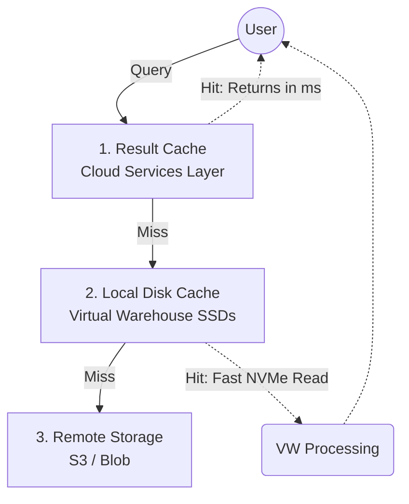

# Snowflake for Redshift Engineers: A Deep Dive into Internals and Architecture

Welcome. If you are a Senior Data Engineer coming from Amazon Redshift, you are already deeply familiar with Massively Parallel Processing (MPP) databases, columnar storage, and distributed query execution. This guide is designed to translate your existing Redshift knowledge into Snowflake paradigms, going beyond the surface to explain *how* and *why* Snowflake works the way it does under the hood.

---

## 1. The Paradigm Shift: Architecture

### Redshift: Shared-Nothing (Tightly Coupled)
Historically, Redshift is built on a **shared-nothing architecture** (derived from ParAccel). Compute and storage are physically coupled on the same EC2 instances (nodes). If you need more storage, you often have to add more compute, and vice versa. Even with the introduction of RA3 nodes (managed storage), the execution model relies heavily on data distribution across slices and nodes.

### Snowflake: Multi-Cluster, Shared Data (Decoupled)
Snowflake pioneered the **decoupled storage and compute** architecture in the cloud data warehouse space. It uses a centralized storage repository accessible from all compute nodes in the data warehouse.

Snowflake's architecture consists of three distinct, independently scalable layers:


1.  **Database Storage Layer:** The centralized data repository. All data resides here (e.g., AWS S3).
2.  **Query Processing Layer (Compute):** "Virtual Warehouses." These are independent MPP compute clusters that process queries. They read data from the storage layer.
3.  **Cloud Services Layer:** The "brain." It manages metadata, security, query parsing/optimization, and transaction management.

**The Redshift Engineer's Takeaway:** In Redshift, you design for *data locality* (Distribution Keys) to avoid network broadcasting during joins. In Snowflake, *all* compute nodes read from the same central storage over the network. You don't manage distribution keys because data locality across nodes is handled dynamically at runtime by the Cloud Services layer based on metadata.

---

## 2. Storage Layer Internals

In Redshift, you think in terms of 1MB immutable blocks, Sort Keys, and Distribution Keys (Even, Key, All). Snowflake handles this entirely differently.

### Micro-partitions: The Building Blocks
All data in Snowflake is automatically divided into **micro-partitions**.
*   **Size:** 50 MB to 500 MB of *uncompressed* data (typically compresses to much less).
*   **Structure:** Columnar, immutable files.
*   **Generation:** They are generated automatically and transparently during data ingestion (DML operations).

When you run a `COPY INTO` command or an `INSERT`, Snowflake processes the rows, converts them to columnar format, compresses each column independently, and writes a new micro-partition to blob storage. Since they are immutable, `UPDATE` and `DELETE` operations do not modify existing micro-partitions; they create new ones and mark the old ones as obsolete (which ties into Time Travel).

### Metadata Pruning vs. Redshift Zone Maps
In Redshift, Zone Maps store the MIN/MAX values of a block to skip unnecessary disk reads. Snowflake's Cloud Services layer does something similar but at the micro-partition level, and stores this metadata *outside* the compute layer.

For every micro-partition created, Snowflake's Cloud Services layer stores:
*   The range of values (MIN/MAX) for each column.
*   The number of distinct values.
*   The number of NULL values.

When a query is submitted, the Cloud Services layer compiles it and uses this metadata to determine exactly which micro-partitions need to be read. This is called **Pruning**.

### Clustering vs. Sort & Distribution Keys
*   **Redshift:** You manually define a `SORTKEY` to physically order data on disk, and a `DISTKEY` to place data on specific nodes. To maintain the sort order over time, you must run `VACUUM`.
*   **Snowflake:** Snowflake naturally orders data within micro-partitions based on the order it was ingested (natural clustering).

If your table is very large (terabytes) and natural ingestion order doesn't align with your query patterns (e.g., you load by timestamp but query by `customer_id`), you can define a **Clustering Key**.

```sql
-- Snowflake Clustering Example
ALTER TABLE fact_sales CLUSTER BY (customer_id, DATE_TRUNC('month', order_date));
```

**How it works:**
Unlike Redshift's `VACUUM` which requires dedicated cluster resources and maintenance windows, Snowflake uses **Automatic Clustering**. The Cloud Services layer monitors the "clustering depth" (how overlapping the micro-partitions are). If the table becomes unclustered, Snowflake automatically spins up serverless compute in the background to rewrite micro-partitions into better-clustered files. *Note: You are billed for this background compute.*

---

## 3. Compute Layer and the 3-Tier Caching System

Compute in Snowflake is provided by **Virtual Warehouses**. These are essentially EC2 clusters provisioned under the hood, sized as T-shirts (X-Small, Small, Medium, Large, X-Large, etc.).

*   **X-Small:** 1 Node
*   **Small:** 2 Nodes
*   **Medium:** 4 Nodes
*   ...and so on. Each size up doubles the compute power and the credit consumption per hour.

Virtual Warehouses can be set to **Auto-Suspend** and **Auto-Resume**. Unlike pausing a Redshift cluster (which takes minutes), a Snowflake Virtual Warehouse resumes in milliseconds to seconds because the storage is already there—it just needs to attach the compute.

### The 3-Tier Caching System
Snowflake's performance heavily relies on a sophisticated caching architecture.



1.  **Result Cache (Cloud Services Layer):**
    Holds the results of every query executed in the past 24 hours. If the exact same query is run, and the underlying data hasn't changed, Snowflake returns the result from this cache *without turning on a Virtual Warehouse*.
2.  **Local Disk Cache (Virtual Warehouse Layer):**
    Often called the "data cache." When a Virtual Warehouse reads data from S3, it caches the micro-partitions on the local NVMe SSDs of the compute nodes. If subsequent queries (even different ones) need the same micro-partitions, they are read from the fast SSDs instead of S3. *Warning: If a Virtual Warehouse auto-suspends, this cache is dropped.*
3.  **Remote Storage (Storage Layer):**
    The source of truth. If data isn't in the Result Cache or Local Disk Cache, it's pulled from here.

---

## 4. Data Engineering: Ingestion & Transformations

### Continuous Ingestion: Snowpipe vs. Redshift COPY
In Redshift, to load data frequently, you typically orchestrate a scheduled `COPY` command via Airflow or AWS Step Functions.

Snowflake offers **Snowpipe**, a serverless continuous ingestion service.
When a file lands in S3, an SQS event (or EventBridge) triggers Snowpipe. Snowpipe spins up Snowflake-managed compute resources (you don't use your own Virtual Warehouse) to run the `COPY INTO` command, loading data within seconds.

```sql
-- Create an external stage pointing to S3
CREATE STAGE my_s3_stage
  URL = 's3://my-bucket/data/'
  STORAGE_INTEGRATION = s3_int;

-- Create a pipe for continuous ingestion
CREATE PIPE my_snowpipe AUTO_INGEST = TRUE AS
  COPY INTO my_target_table
  FROM @my_s3_stage
  FILE_FORMAT = (TYPE = 'JSON');
```

### CDC and Pipelines: Streams and Tasks
Instead of relying entirely on external orchestrators like Airflow for in-database transformations (ELT), Snowflake provides native primitives: **Streams** and **Tasks**.

*   **Streams:** Provide Change Data Capture (CDC) semantics on a table. A stream acts as a bookmark, tracking `INSERT`, `UPDATE`, and `DELETE` operations on a table since the stream was last consumed.
*   **Tasks:** Scheduled SQL statements. They can be chained together as Directed Acyclic Graphs (DAGs) and can conditionally run only if a Stream has data (`SYSTEM$STREAM_HAS_DATA`).

```sql
-- 1. Create a stream on the raw table
CREATE STREAM raw_orders_stream ON TABLE raw_orders;

-- 2. Create a task that runs every 5 minutes, but only if the stream has data
CREATE TASK transform_orders_task
  WAREHOUSE = 'ETL_WH'
  SCHEDULE = '5 MINUTE'
  WHEN SYSTEM$STREAM_HAS_DATA('raw_orders_stream')
AS
  INSERT INTO dim_orders
  SELECT id, status, amount
  FROM raw_orders_stream
  WHERE METADATA$ACTION = 'INSERT'; -- Consume only new inserts
```

---

## 5. Unique Snowflake Capabilities

### Time Travel and Fail-Safe
Because micro-partitions are immutable, when data is updated or deleted, the old micro-partitions are simply marked as logically deleted in the metadata. Snowflake allows you to query these old micro-partitions seamlessly.

*   **Time Travel:** Query data as it looked at a specific timestamp, before a specific statement ID, or offset by time. Configurable up to 90 days (Enterprise edition).

```sql
-- Querying a table as it existed 5 minutes ago
SELECT * FROM my_table AT(OFFSET => -60 * 5);

-- Restoring an accidentally dropped table (No snapshot restore needed!)
UNDROP TABLE my_table;
```

*   **Fail-safe:** A non-configurable 7-day period following the Time Travel retention period. During Fail-safe, data cannot be queried by users, but Snowflake Support can recover it in case of catastrophic failure.

### Zero-Copy Cloning
In Redshift, to create a development environment with production data, you have to run a `CREATE TABLE AS SELECT` (CTAS) or restore from a snapshot, physically copying the data and incurring storage costs.

Snowflake allows **Zero-Copy Cloning**. Because storage is decoupled and immutable, a clone operation simply duplicates the *metadata* pointing to the existing micro-partitions.

```sql
-- Instantly creates a dev environment with production data
CREATE DATABASE dev_db CLONE prod_db;
```
*   **Cost:** 0 additional storage bytes until you modify the data in the clone.
*   **Speed:** Instantaneous, regardless of data size.

---

## 6. Concurrency & Scaling (Scale-Up vs. Scale-Out)

In Redshift, handling concurrency spikes often involves Workload Management (WLM) queues or Concurrency Scaling features.

Snowflake handles concurrency elegantly via **Multi-Cluster Warehouses**.
If a Virtual Warehouse (e.g., your `BI_WH`) receives more queries than it can process simultaneously, queries start queuing. In a Multi-Cluster setup, Snowflake detects this queue and automatically spins up a *replica* of the Virtual Warehouse (an identical cluster of nodes).

*   **Scale Up (Resize):** Increase the T-shirt size (e.g., Small to Large) to make *complex queries faster*.
*   **Scale Out (Multi-Cluster):** Increase the maximum clusters (e.g., 1 to 5) to handle *more concurrent users*.

```sql
-- Create a multi-cluster warehouse that scales out dynamically
CREATE WAREHOUSE bi_reporting_wh
  WAREHOUSE_SIZE = 'MEDIUM'
  MIN_CLUSTER_COUNT = 1
  MAX_CLUSTER_COUNT = 5 -- Automatically adds up to 4 more clusters if queued
  SCALING_POLICY = 'STANDARD'
  AUTO_SUSPEND = 60;
```

---

## Summary
Moving from Redshift to Snowflake requires a mental shift from managing physical hardware distributions and vacuuming maintenance, to a model where compute and storage are fluid. Your primary focus shifts toward optimizing warehouse sizing, leveraging caching, designing efficient ELT DAGs with Tasks/Streams, and taking advantage of metadata-driven capabilities like Time Travel and Cloning.

**Citations & Further Reading:**
1. [Snowflake Architecture Documentation](https://docs.snowflake.com/en/user-guide/intro-key-concepts)
2. [Micro-partitions & Data Clustering](https://docs.snowflake.com/en/user-guide/tables-clustering-micropartitions)
3. [Snowflake in 20 Minutes (Tutorial)](https://docs.snowflake.com/en/user-guide/tutorials/snowflake-in-20minutes)
4. [Automatic Clustering at Snowflake](https://snowflake.com/en/engineering-blog/automatic-clustering-at-snowflake)
