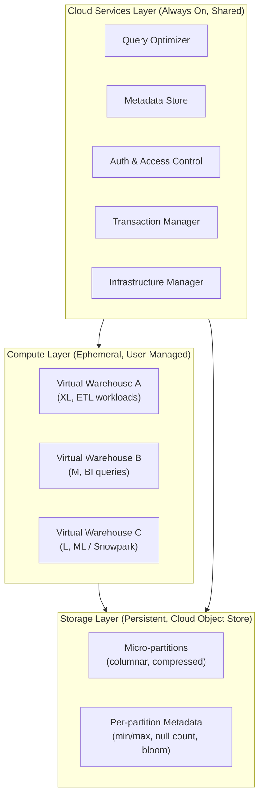
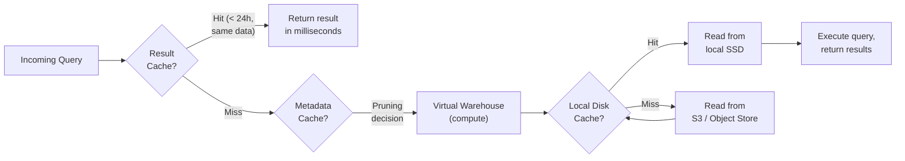

# Snowflake: A Deep Technical Guide for Data Engineers

> **Audience:** Senior Data Engineers migrating from Amazon Redshift who want to understand not just *what* Snowflake does, but *how* it does it — at the architectural level.
>
> **Approach:** Every abstraction is explained from the inside out. Redshift comparisons are included throughout to ground concepts in familiar mental models.

---

## Table of Contents

1. [Architecture Overview](#1-architecture-overview)
2. [Storage Layer Internals](#2-storage-layer-internals)
3. [Compute Layer — Virtual Warehouses](#3-compute-layer--virtual-warehouses)
4. [Cloud Services Layer](#4-cloud-services-layer)
5. [Query Processing & Caching](#5-query-processing--caching)
6. [Data Loading & Ingestion](#6-data-loading--ingestion)
7. [Semi-structured Data: VARIANT, OBJECT, ARRAY](#7-semi-structured-data-variant-object-array)
8. [Streams & Tasks — Imperative Pipelines](#8-streams--tasks--imperative-pipelines)
9. [Dynamic Tables — Declarative Pipelines](#9-dynamic-tables--declarative-pipelines)
10. [Time Travel, Fail-safe & Zero-Copy Cloning](#10-time-travel-fail-safe--zero-copy-cloning)
11. [Clustering & Performance Optimization](#11-clustering--performance-optimization)
12. [Transactions & Concurrency](#12-transactions--concurrency)
13. [Security & RBAC](#13-security--rbac)
14. [Secure Data Sharing & Snowflake Marketplace](#14-secure-data-sharing--snowflake-marketplace)
15. [Redshift → Snowflake Cheat Sheet](#15-redshift--snowflake-cheat-sheet)

---

## 1. Architecture Overview

### The Fundamental Insight

Snowflake's entire design follows a single thesis: **separate storage from compute completely**, and manage both through a shared intelligent services layer. This sounds similar to Amazon Redshift RA3, but the implementation and implications are profoundly different.

In Redshift (classic), a cluster owns both compute nodes and the storage attached to those nodes. When you run out of storage, you add nodes. When you need more compute, you add nodes. The two resources are inseparable. RA3 decoupled storage from compute by offloading to S3, but Redshift nodes still manage their own managed storage (RMS) caches locally — the query engine and storage coordination still happen within the cluster boundary.

Snowflake's separation is total. There is no cluster you own. There is no "cluster" concept at all from the user's perspective. You have:

1. **Storage**: a shared, persistent, cloud-provider-agnostic object store (S3 on AWS)
2. **Compute**: stateless, ephemeral MPP clusters (Virtual Warehouses) that read from storage but never own it
3. **Cloud Services**: a globally shared, always-running brain that coordinates everything



### What "Hybrid Shared-Disk / Shared-Nothing" Actually Means

The Snowflake engineering paper (SIGMOD 2016, "The Snowflake Elastic Data Warehouse") describes the architecture as a **hybrid of shared-disk and shared-nothing**:

- **Shared-disk**: All Virtual Warehouses read from the same central storage layer. There is one authoritative copy of each table. Any VW can read any table. No data locality concerns, no data redistribution when scaling.
- **Shared-nothing (within a VW)**: Inside a running Virtual Warehouse, the MPP cluster divides work across nodes. Each node caches a portion of the data it is reading on its local SSD and processes its assigned partition range independently.

This gives you the **operational simplicity** of shared-disk (no data skew from distribution choices, no rebalancing) with the **query performance** of shared-nothing (parallel execution across many nodes).

> **Redshift contrast:** Redshift's classic architecture is pure shared-nothing. Each node owns its slice of data (determined by your `DISTKEY`). Queries coordinate across nodes using a redistribution layer called the network. If your `DISTKEY` is wrong, you get data skew and poor performance — and fixing it requires a full table rebuild (`CREATE TABLE AS SELECT`). Snowflake has no distribution keys because the shared storage layer eliminates the need for them entirely.

---

## 2. Storage Layer Internals

### Micro-partitions: The Core Storage Primitive

Every Snowflake table is automatically divided into **micro-partitions** — contiguous, immutable chunks of storage. Understanding micro-partitions is the foundation for understanding everything else in Snowflake: pruning, clustering, Time Travel, DML, and MVCC all hinge on how micro-partitions work.

**Key properties of micro-partitions** ([Snowflake Docs: Micro-partitions & Data Clustering](https://docs.snowflake.com/en/user-guide/tables-clustering-micropartitions)):

| Property | Value |
|---|---|
| Uncompressed size | 50 MB – 500 MB per partition |
| Physical format | **Columnar** — each column stored contiguously within the partition |
| Creation | **Automatic** — Snowflake creates them as data is loaded |
| Mutability | **Immutable** — once written, a micro-partition is never modified |
| Compression | **Per-column**, automatically chosen by Snowflake |
| Storage location | Cloud object store (S3 on AWS) |

#### How Data Is Laid Out Within a Micro-partition

Within each micro-partition, data is stored in **columnar format** — all values for column A are stored together, then all values for column B, and so on. This is the same physical layout as Redshift (and most modern analytical stores). It enables:

- **Column skipping**: queries that only access 3 of 50 columns read only 3 column segments
- **Per-column compression**: an INTEGER column gets compressed differently than a VARCHAR column
- **Vectorized execution**: CPU SIMD instructions operate on contiguous data of the same type

#### Metadata Stored Per Micro-partition

This is where Snowflake's pruning power comes from. For **every column in every micro-partition**, Snowflake stores:

- **Minimum value** of the column in that partition
- **Maximum value** of the column in that partition
- **Distinct value count**
- **Null value count**
- **Bloom filter** (for some data types, enabling fast membership testing)

This metadata is stored in the **Cloud Services metadata store** — not in the micro-partition files themselves. This means the query optimizer can determine which partitions to skip **before any compute resources are activated**, using only metadata lookups.

```sql
-- You can inspect partition-level metadata using SYSTEM$CLUSTERING_INFORMATION
SELECT SYSTEM$CLUSTERING_INFORMATION('my_schema.my_table', '(event_date)');
```

Sample output:
```json
{
  "status": "complete",
  "cluster_by": ["LINEAR(EVENT_DATE)"],
  "total_partition_count": 1000,
  "total_constant_partition_count": 0,
  "average_overlaps": 2.3,
  "average_depth": 3.1,
  "partition_depth_histogram": {
    "00000": 0,
    "00001": 312,
    "00002": 421,
    "00003": 201,
    "00004": 66
  }
}
```

The `average_depth` tells you how many partitions on average contain any given value. A depth of 1 means perfect clustering (each value lives in exactly 1 partition). Higher depth means more partition overlap, which means more partitions must be scanned for a given filter.

### Immutability and DML: Copy-on-Write

This is the most important thing to internalize coming from Redshift. **Snowflake never modifies a micro-partition in place.** Instead, all DML is implemented as **copy-on-write**:

```
UPDATE orders SET status = 'shipped' WHERE order_id = 12345;
```

What Snowflake actually does:
1. Identify which micro-partitions contain `order_id = 12345` (using min/max metadata — no full scan)
2. Read those micro-partitions
3. Write **new** micro-partitions with the updated row(s)
4. Mark the **old** micro-partitions as logically deleted (they are retained for Time Travel)
5. Update the metadata store to point to the new partitions

The old partitions remain physically on disk until they age out of the Time Travel retention window (then move to Fail-safe, then are permanently deleted).

**Implications of immutability:**

- There is no concept of `VACUUM` or `ANALYZE` in Snowflake — the system handles all of this automatically
- DML on large tables that update many partitions is expensive (rewriting micro-partitions has a cost)
- Time Travel is essentially free — the "old" data is already there; you're just pointing to previous partition versions
- MVCC is a natural consequence: any in-flight query sees a consistent snapshot (the set of partitions that were active when the query started)

> **Redshift contrast:** In Redshift, `UPDATE` and `DELETE` mark rows as "ghost rows" (logically deleted) and leave them on disk. Over time this creates bloat that degrades scan performance. The solution is `VACUUM DELETE ONLY` or `VACUUM FULL` — blocking, expensive operations. In Snowflake, this concept doesn't exist.

### Compression

Snowflake applies **automatic, per-column compression**. You never specify compression encodings (unlike Redshift's `ENCODE` clause). The compression algorithm is chosen per column based on data type and cardinality:

- **Low-cardinality columns** (e.g., `status` with 5 possible values): Run-length encoding or dictionary encoding
- **Numeric columns**: Delta encoding or frame-of-reference encoding
- **High-entropy columns** (e.g., UUIDs): Zstandard
- **Timestamps**: Delta encoding (exploits temporal locality)

Typical compression ratios are 3:1 to 7:1 compared to raw data, but this varies heavily. Snowflake bills you for compressed storage.

### Table Types

Snowflake supports three fundamentally different table types, each with different storage and access characteristics:

#### 1. Standard Snowflake Tables
The default. Fully managed columnar storage, micro-partitioned, Time Travel enabled, MVCC via partition immutability. This is what you use for 99% of data warehousing workloads.

```sql
CREATE TABLE orders (
    order_id        BIGINT,
    customer_id     BIGINT,
    order_date      DATE,
    status          VARCHAR(20),
    total_amount    DECIMAL(18, 2)
)
DATA_RETENTION_TIME_IN_DAYS = 7;
```

#### 2. Apache Iceberg Tables
Iceberg tables use **external cloud storage you manage** (your own S3 bucket) combined with the Iceberg open table format. Snowflake acts as the catalog (or you can use an external catalog like AWS Glue).

The key use cases:
- You have an existing data lake you can't move into Snowflake's storage
- You need interoperability with other engines (Spark, Trino, Flink) that also read the same tables
- You want to avoid Snowflake's managed storage costs and manage your own S3

```sql
-- First, create an external volume pointing to your S3 bucket
CREATE EXTERNAL VOLUME my_iceberg_vol
  STORAGE_LOCATIONS = (
    (
      NAME = 'my-s3-us-east-1'
      STORAGE_PROVIDER = 'S3'
      STORAGE_BASE_URL = 's3://my-data-lake/iceberg/'
      STORAGE_AWS_ROLE_ARN = 'arn:aws:iam::123456789:role/SnowflakeIcebergRole'
    )
  );

-- Then create the Iceberg table
CREATE ICEBERG TABLE orders_iceberg (
    order_id     BIGINT,
    order_date   DATE,
    status       STRING
)
CATALOG = 'SNOWFLAKE'
EXTERNAL_VOLUME = 'my_iceberg_vol'
BASE_LOCATION = 'orders/';
```

Iceberg tables support the same SQL semantics as standard Snowflake tables (DML, Time Travel via Iceberg's own versioning, streams). The difference is the physical data lives outside Snowflake's managed storage.

#### 3. Hybrid Tables
Hybrid tables are for **transactional / OLTP-style workloads** within Snowflake. They use row-based storage (not columnar), support **row-level locking**, and enforce **primary key and foreign key constraints**. They are part of Snowflake's "Unistore" vision — serving transactional and analytical workloads from a single platform.

```sql
CREATE HYBRID TABLE user_sessions (
    session_id   VARCHAR(64) PRIMARY KEY,
    user_id      BIGINT NOT NULL,
    created_at   TIMESTAMP_NTZ DEFAULT CURRENT_TIMESTAMP(),
    last_seen    TIMESTAMP_NTZ,
    status       VARCHAR(20)
);

-- Hybrid tables support indexes for point lookups
CREATE INDEX ON user_sessions (user_id);
```

Hybrid tables are not a replacement for standard Snowflake tables for analytics. They sacrifice columnar compression and partition-level pruning for low-latency single-row reads and writes.

---

## 3. Compute Layer — Virtual Warehouses

### What a Virtual Warehouse Actually Is

A **Virtual Warehouse (VW)** is an on-demand MPP cluster that Snowflake provisions for you. When you create a VW and issue a query, Snowflake:

1. Allocates a set of cloud compute instances (EC2 on AWS)
2. Each instance has CPUs, RAM, and **local SSD storage for caching**
3. The cluster divides the query work across all nodes
4. Each node reads its assigned micro-partitions from the shared object store (S3), caches them on local SSD for future queries, and executes its portion of the query plan

Crucially: **the VW has no persistent state**. The data it caches on SSD disappears when the warehouse suspends. The warehouse itself (as a configuration object) persists, but the compute resources are released immediately on suspension.

> This is fundamentally different from Redshift. A Redshift cluster is always running (you pay by the hour regardless of whether queries are executing) and maintains state on its nodes.

### Warehouse Sizes and Credit Consumption

| Size | Credits/Hour | Approx. Nodes | Use Case |
|------|-------------|---------------|----------|
| X-Small (XS) | 1 | 1 server | Development, small queries |
| Small (S) | 2 | 2 servers | Light ETL, small BI |
| Medium (M) | 4 | 4 servers | Standard ETL, BI |
| Large (L) | 8 | 8 servers | Heavy ETL, large joins |
| X-Large (XL) | 16 | 16 servers | Complex transformations |
| 2X-Large (2XL) | 32 | 32 servers | Very large batch jobs |
| 3X-Large (3XL) | 64 | 64 servers | Massive parallel loads |
| 4X-Large (4XL) | 128 | 128 servers | Extreme parallelism |
| 5X-Large (5XL) | 256 | 256 servers | Rare, specialized |
| 6X-Large (6XL) | 512 | 512 servers | Extraordinary scale |

Each size doubles the server count and doubles credit consumption. **Doubling the warehouse size does not guarantee 2x query speedup** — the benefit depends on whether the query is I/O-bound vs. compute-bound and whether it can be effectively parallelized.

Rules of thumb:
- **Scale up** (larger warehouse) for: complex queries with large intermediate result sets, memory-intensive operations (sorts, large joins), compilation bottlenecks
- **Scale out** (multi-cluster) for: high concurrency, many simultaneous users/queries, queuing problems

### Auto-suspend and Auto-resume

```sql
CREATE WAREHOUSE etl_wh
  WAREHOUSE_SIZE = 'LARGE'
  AUTO_SUSPEND = 300          -- seconds of idle time before suspension (5 minutes)
  AUTO_RESUME = TRUE          -- automatically resume when a query arrives
  INITIALLY_SUSPENDED = TRUE; -- don't start running until first query
```

**Auto-suspend** is one of the most important cost controls in Snowflake. A suspended warehouse costs nothing. A warehouse that processes 1 hour of queries per day but is suspended the other 23 hours costs 1 hour of credits, not 24.

**Auto-resume** means there is no manual intervention needed — a query arriving at a suspended warehouse triggers resume automatically (typically adds 2–5 seconds of cold start latency).

**The cache trade-off:** Suspending a warehouse destroys its local SSD data cache. The first queries after a warehouse resumes will be slower (cold cache), reading everything fresh from S3. For workloads where cache warmth matters (frequent repetitive queries), consider a longer auto-suspend window or keeping the warehouse running.

### Multi-cluster Warehouses

Multi-cluster warehouses address **concurrency**, not individual query speed. When a warehouse is busy (all threads occupied), new queries queue. With a multi-cluster warehouse, Snowflake automatically provisions additional clusters to handle the overflow.

```sql
CREATE WAREHOUSE reporting_wh
  WAREHOUSE_SIZE = 'MEDIUM'
  MIN_CLUSTER_COUNT = 1
  MAX_CLUSTER_COUNT = 5
  SCALING_POLICY = 'STANDARD';  -- or 'ECONOMY'
```

**Scaling policies:**
- `STANDARD`: Starts additional clusters as soon as queuing is detected. Prioritizes responsiveness.
- `ECONOMY`: Waits to ensure clusters will be kept busy for at least 6 minutes before starting them. Prioritizes cost savings.

Each additional cluster incurs the same credit rate as the base cluster. A Medium (4 credits/hour) warehouse running 3 clusters costs 12 credits/hour.

**Important:** Multi-cluster warehouses only help with concurrency — parallel users running independent queries. A single complex query that saturates all threads in the warehouse will not be split across clusters; you need to scale up the warehouse size for that.

### Snowpark-Optimized Warehouses

Standard warehouse nodes have a fixed memory-to-CPU ratio optimized for SQL analytics. **Snowpark-optimized** warehouses have approximately **16x more memory per node**, designed for:

- Python UDFs and UDTFs running ML inference
- Snowpark DataFrames with large intermediate datasets
- Model training workloads using Snowflake ML

```sql
CREATE WAREHOUSE ml_wh
  WAREHOUSE_SIZE = 'MEDIUM'
  WAREHOUSE_TYPE = 'SNOWPARK-OPTIMIZED';
```

### Query Acceleration Service (QAS)

The **Query Acceleration Service** is a serverless offload mechanism for **outlier queries** — queries that are significantly more resource-intensive than the average query on a warehouse. Instead of sizing the entire warehouse for the worst-case query, you can let most queries run on a smaller warehouse and have outliers automatically offload portions of their work to serverless compute.

QAS works by identifying sub-operations within a query (typically large table scans and aggregations) that can be parallelized externally and offloading them to Snowflake's serverless pool. The warehouse coordinates, but the heavy lifting happens outside.

```sql
-- Enable QAS on a warehouse with a scale factor cap
ALTER WAREHOUSE etl_wh SET
  ENABLE_QUERY_ACCELERATION = TRUE
  QUERY_ACCELERATION_MAX_SCALE_FACTOR = 8;  -- up to 8x additional resources
```

QAS is billed separately (Snowflake credits for the serverless portion) and is most valuable when a warehouse has a bimodal query distribution — most queries are fast, but a few outliers are dramatically slower.

---

## 4. Cloud Services Layer

The Cloud Services layer is what makes Snowflake feel magical. It is a globally distributed, always-running service that runs on Snowflake's own infrastructure (not on your VWs). You never interact with it directly, but it is doing enormous amounts of work on your behalf.

### What Runs in Cloud Services

#### Query Parsing and Optimization
Every query you submit is parsed, validated, and optimized in Cloud Services before any compute resource is involved. The **cost-based query optimizer** uses the metadata store (partition statistics, table statistics, histograms) to build a query plan. Crucially, it decides which micro-partitions to read **before** the Virtual Warehouse starts pulling data from S3.

This means partition pruning is a metadata operation, not a scan operation. The optimizer says "I only need partitions 14, 17, and 23 — skip the rest" before any disk I/O occurs.

#### Metadata Store
The metadata store is the global registry of everything in Snowflake:
- Table definitions, schemas, databases
- For every micro-partition of every table: its location in S3, its size, and the column-level statistics (min, max, distinct count, null count)
- User and role definitions
- Transaction state
- Query history

This metadata store is what enables the Cloud Services layer to make intelligent decisions without touching actual data. It is also what makes operations like `CREATE TABLE AS SELECT ... AT (TIMESTAMP => ...)` (Time Travel) work — the historical partition pointers are just metadata.

#### Transaction Management
Snowflake's transaction manager runs in Cloud Services and uses the partition metadata to implement MVCC. Each transaction gets a snapshot of the world (a consistent set of partition pointers) at its start time. DML operations update partition pointers atomically within the metadata store. Commit or rollback is a metadata-only operation.

### Cloud Services Cost

Cloud Services runs 24/7 on Snowflake's infrastructure. **You are not directly billed for Cloud Services** unless your Cloud Services consumption exceeds **10% of your daily compute credits**.

In practice, this threshold is only exceeded when you are running heavy metadata operations (e.g., `SHOW TABLES` loops, `INFORMATION_SCHEMA` queries on large accounts, or frequent `LIST` operations on large external stages) without corresponding compute workloads. Most normal usage stays well under the 10% threshold.

---

## 5. Query Processing & Caching

### The Three-Layer Caching Architecture

Snowflake has three distinct caching layers. Understanding each layer — where it lives, how long it lasts, and when it is invalidated — is essential for reasoning about query performance.



#### Layer 1: Result Cache (Cloud Services)

The **Result Cache** stores the **complete output** of a query for **24 hours**. It is scoped to the account (not warehouse-specific) but respects user-level permissions — a user will only get a cached result if they have the same permissions as the user who generated it.

The Result Cache is **invalidated** if:
- The underlying data changes (DML to any contributing table)
- The query is altered even slightly
- 24 hours have elapsed
- The session parameters that could affect results have changed (e.g., `TIMEZONE`)

```sql
-- This query will hit Result Cache if run again within 24h with no data changes
SELECT region, SUM(revenue) FROM sales GROUP BY region;

-- Check whether the last query used Result Cache
SELECT query_id, query_text, execution_status, bytes_scanned,
       result_from_cache
FROM TABLE(INFORMATION_SCHEMA.QUERY_HISTORY())
WHERE result_from_cache = TRUE
ORDER BY start_time DESC
LIMIT 10;
```

Result Cache is powerful for BI dashboards that multiple users are refreshing — the first execution generates the result; subsequent executions (same query, same data) return it instantly at zero compute cost.

#### Layer 2: Metadata Cache (Cloud Services)

The Metadata Cache is the query optimizer's internal use of the partition statistics stored in the metadata store. It enables **partition pruning** decisions to be made without any I/O.

When the optimizer evaluates `WHERE event_date = '2024-01-15'`, it consults the metadata to identify which micro-partitions have `min_event_date <= '2024-01-15' AND max_event_date >= '2024-01-15'`. All other partitions are skipped — never read from S3, never pulled into the warehouse SSD.

This is **always active** — there is nothing to configure. The effectiveness of metadata pruning is entirely determined by how well your data is organized within micro-partitions (see Section 11: Clustering).

In well-clustered tables, this pruning can be extraordinarily effective. Production workloads at Snowflake have demonstrated **99%+ reduction in partitions scanned** through metadata pruning alone. ([Pruning in Snowflake](https://snowflakepruning.github.io/))

#### Layer 3: Local Disk Cache (Virtual Warehouse)

Each node in a Virtual Warehouse has local SSD storage. When micro-partitions are read from S3, they are **cached on the local SSD** for reuse. Subsequent queries that need the same micro-partitions find them on local SSD instead of reading from S3 — dramatically faster.

Key behaviors:
- **Warehouse-specific**: The local disk cache is local to a specific warehouse. Two warehouses working on the same table have separate caches.
- **Eviction**: LRU (Least Recently Used) eviction when the SSD fills up
- **Destroyed on suspend**: When a warehouse auto-suspends or is manually suspended, the local SSD cache is lost. The next query after resume is a cold start.
- **Consistent hashing**: Snowflake uses consistent hashing to determine which node in the warehouse handles which micro-partitions. This means the same partitions consistently end up on the same nodes across different queries — maximizing cache hit rate within a session.

> **Medium (Snowflake Engineering): ["Deep dive on caching in Snowflake"](https://medium.com/snowflake/deep-dive-on-caching-in-snowflake-201a9ce56b43)** — excellent reference for understanding all three layers in depth.

### The Four Pruning Techniques

Beyond basic filter pruning, Snowflake's optimizer applies progressively sophisticated techniques ([Pruning in Snowflake — Andi Zimmerer](https://snowflakepruning.github.io/)):

#### 1. Filter Pruning
The baseline: use min/max metadata to skip partitions that cannot satisfy a WHERE clause predicate.

```sql
-- Snowflake reads ONLY partitions where min(event_date) <= '2024-01-15' <= max(event_date)
SELECT * FROM events WHERE event_date = '2024-01-15';
```

**Critical gotcha:** Applying a function to the column defeats pruning:
```sql
-- BAD: Snowflake cannot prune — it doesn't know the output range of DATE_TRUNC
SELECT * FROM events WHERE DATE_TRUNC('day', event_timestamp) = '2024-01-15';

-- GOOD: Direct comparison enables pruning
SELECT * FROM events WHERE event_date = '2024-01-15';
```

#### 2. LIMIT Pruning
For queries like `SELECT * FROM t LIMIT 100`, Snowflake reads the minimum number of partitions needed to satisfy the LIMIT, in partition order.

#### 3. Join Pruning
When joining two tables, Snowflake can use the value range of the build side (smaller table) to prune micro-partitions from the probe side (larger table). If table A has `customer_id` values between 1000–2000, partitions of table B with `customer_id` max < 1000 or min > 2000 are skipped.

#### 4. Top-K Pruning
For `ORDER BY col LIMIT N` queries, Snowflake tracks the top-K values seen so far and uses this runtime information to prune partitions that cannot possibly contain values in the top-K range.

### Reading the Query Profile

The Query Profile in Snowsight is the primary tool for diagnosing slow queries. Access it via Snowsight → Query History → click a query → View Query Profile.

Key things to look for:

| Symptom | Metric to Check | Root Cause |
|---|---|---|
| Slow despite result cache miss | `Bytes Scanned` is enormous | Missing clustering / pruning not working |
| Spilling to local disk | `Bytes spilled to local storage` > 0 | Warehouse too small for sort/join memory |
| Spilling to remote disk | `Bytes spilled to remote storage` > 0 | Severely undersized warehouse |
| Uneven node utilization | `% of time node was active` varies wildly | Data skew in join key or aggregation key |
| High compilation time | `Compilation` node takes long | Complex query / many CTEs / UDFs |

```sql
-- Programmatic access to query execution details
SELECT
    query_id,
    query_text,
    warehouse_size,
    bytes_scanned,
    bytes_spilled_to_local_storage,
    bytes_spilled_to_remote_storage,
    partitions_scanned,
    partitions_total,
    ROUND(partitions_scanned / NULLIF(partitions_total, 0) * 100, 2) AS pct_partitions_scanned
FROM TABLE(INFORMATION_SCHEMA.QUERY_HISTORY())
WHERE start_time >= DATEADD('hour', -24, CURRENT_TIMESTAMP())
ORDER BY bytes_scanned DESC
LIMIT 20;
```

A `pct_partitions_scanned` of near 100% on a large table means pruning is not working — likely due to poor clustering, function application to filter columns, or lack of a relevant clustering key.

---

## 6. Data Loading & Ingestion

### Stages: The Universal Intermediary

In Snowflake, **all data loading goes through stages**. A stage is a named location — either cloud object storage external to Snowflake, or Snowflake-managed internal storage — where data files reside before being loaded into tables.

There are two broad categories:

#### Internal Stages
Managed by Snowflake, stored in Snowflake's own cloud infrastructure.

| Type | Scope | Creation | Use Case |
|---|---|---|---|
| **User stage** | Per-user, automatic | `@~` (no CREATE needed) | Personal uploads, testing |
| **Table stage** | Per-table, automatic | `@%table_name` (no CREATE needed) | Simplified loading for single table |
| **Named stage** | Shared, persistent | `CREATE STAGE` | Production ETL pipelines |

```sql
-- Create a named internal stage with a file format
CREATE STAGE my_internal_stage
  FILE_FORMAT = (TYPE = 'PARQUET', SNAPPY_COMPRESSION = TRUE)
  COMMENT = 'Landing zone for ETL job outputs';

-- Upload a local file to the internal stage
PUT file:///local/path/data.csv @my_internal_stage;
```

#### External Stages
Point to cloud storage you own and manage.

```sql
-- External stage on S3 with storage integration (preferred over access keys)
CREATE STORAGE INTEGRATION s3_int
  TYPE = EXTERNAL_STAGE
  STORAGE_PROVIDER = 'S3'
  ENABLED = TRUE
  STORAGE_ALLOWED_LOCATIONS = ('s3://my-data-bucket/snowflake/');

CREATE STAGE my_s3_stage
  STORAGE_INTEGRATION = s3_int
  URL = 's3://my-data-bucket/snowflake/landing/'
  FILE_FORMAT = (TYPE = 'CSV' FIELD_DELIMITER = ',' SKIP_HEADER = 1);
```

External stages allow data to remain in your own bucket (no Snowflake storage charges for that data) and enable the same data to be accessed by both Snowflake and other systems.

### COPY INTO: Batch Bulk Loading

`COPY INTO` is Snowflake's primary mechanism for loading large volumes of data. It runs on a user-managed Virtual Warehouse.

```sql
-- Load all new files from the stage (Snowflake tracks which files have been loaded)
COPY INTO orders
FROM @my_s3_stage/orders/
FILE_FORMAT = (TYPE = 'PARQUET')
MATCH_BY_COLUMN_NAME = CASE_INSENSITIVE
ON_ERROR = 'CONTINUE';  -- log bad rows, don't fail the entire load
```

#### COPY INTO Internals and Best Practices

**File sizing matters:** Snowflake reads files in parallel, with each thread handling one file. For optimal parallelism:
- Files should be **100 MB – 250 MB compressed** (roughly 500 MB – 1 GB uncompressed)
- Too small: many tiny files create overhead in the metadata layer
- Too large: large files limit parallelism (one thread per file)
- Use `SPLIT_SIZE` or upstream partitioning to control file sizes

```sql
-- If your source data is in a few large files, use COPY with multiple files
-- listed explicitly for fine-grained control
COPY INTO orders
FROM (
  SELECT $1, $2, $3, TRY_CAST($4 AS DATE)
  FROM @my_s3_stage/orders/2024/01/
)
PATTERN = '.*\.parquet'
ON_ERROR = 'ABORT_STATEMENT';
```

**Snowflake tracks loaded files:** `COPY INTO` maintains a load history per stage per table (via the `LOAD_HISTORY` table and `COPY_HISTORY` view). Files are not re-loaded unless you explicitly use `FORCE = TRUE`. This is load idempotency by default.

```sql
-- Check what has been loaded
SELECT *
FROM TABLE(INFORMATION_SCHEMA.COPY_HISTORY(
  TABLE_NAME => 'ORDERS',
  START_TIME => DATEADD('hours', -24, CURRENT_TIMESTAMP())
));
```

**Transformation during load:** `COPY INTO` supports SQL transformations inline, including column reordering, casting, and simple expressions:

```sql
COPY INTO orders (order_id, customer_id, amount, loaded_at)
FROM (
  SELECT
    $1::BIGINT,
    $2::BIGINT,
    $3::DECIMAL(18,2),
    CURRENT_TIMESTAMP()
  FROM @my_s3_stage/orders/
)
FILE_FORMAT = (TYPE = 'CSV');
```

### Snowpipe: Continuous Event-Driven Loading

**Snowpipe** is a serverless, event-driven ingestion service. Rather than running `COPY INTO` on a schedule, Snowpipe reacts to new file arrivals automatically.

**How it works:**
1. A new file lands in an S3 bucket
2. S3 emits an event notification to SQS (Simple Queue Service)
3. Snowpipe's internal service is subscribed to that SQS queue
4. Snowpipe reads the new file and loads it into the target table using `COPY INTO` semantics
5. Serverless — no warehouse required; Snowflake manages the compute

```sql
-- Create a pipe that defines the COPY INTO statement
CREATE PIPE orders_pipe
  AUTO_INGEST = TRUE  -- enable SQS-triggered ingestion
AS
COPY INTO orders
FROM @my_s3_stage/orders/
FILE_FORMAT = (TYPE = 'PARQUET')
MATCH_BY_COLUMN_NAME = CASE_INSENSITIVE;

-- After creating, note the SQS ARN for your S3 event notification
SHOW PIPES;
-- Set NOTIFICATION_CHANNEL value as the S3 event notification destination
```

**Snowpipe latency:** Typically 1–5 minutes from file landing to data availability in the table. This is near-real-time for most batch use cases.

**Monitoring Snowpipe:**
```sql
SELECT SYSTEM$PIPE_STATUS('orders_pipe');
-- Returns JSON with pendingFileCount, notEnoughMemory, executionState, etc.

SELECT *
FROM TABLE(INFORMATION_SCHEMA.COPY_HISTORY(
  TABLE_NAME => 'ORDERS',
  START_TIME => DATEADD('hours', -1, CURRENT_TIMESTAMP())
))
WHERE PIPE_NAME = 'ORDERS_PIPE';
```

### Snowpipe Streaming: Row-Level Near-Real-Time Ingestion

**Snowpipe Streaming** is fundamentally different from Snowpipe. Instead of file-based ingestion, it accepts **row-level data via SDK or REST API** with sub-minute latency.

**Architecture:** Snowpipe Streaming introduces the concept of **channels** — ordered, named streams of rows written to a specific table. Each channel maintains an offset pointer (like a Kafka consumer group offset).

```java
// Java SDK example
SnowflakeStreamingIngestClient client = SnowflakeStreamingIngestClientFactory
    .builder("my_client")
    .setProperties(props)
    .build();

// Open a channel (long-lived — create once, reuse across many insertRows calls)
OpenChannelRequest channelRequest = OpenChannelRequest.builder("ORDER_EVENTS_CH_0")
    .setDBName("PROD")
    .setSchemaName("RAW")
    .setTableName("ORDER_EVENTS")
    .setOnErrorOption(OpenChannelRequest.OnErrorOption.CONTINUE)
    .build();

SnowflakeStreamingIngestChannel channel = client.openChannel(channelRequest);

// Insert rows (recommended batch: 10–16 MB)
Map<String, Object> row = new HashMap<>();
row.put("ORDER_ID", 12345L);
row.put("EVENT_TYPE", "CREATED");
row.put("EVENT_TIME", System.currentTimeMillis());
channel.insertRows(List.of(row), "offset-12345");
```

**Key Snowpipe Streaming parameters** ([Snowflake Docs: Snowpipe Streaming High-Performance Architecture](https://docs.snowflake.com/en/user-guide/snowpipe-streaming/snowpipe-streaming-high-performance-overview)):

| Parameter | Default | Description |
|---|---|---|
| `MAX_CLIENT_LAG` | 1 second | Max time data waits before being flushed to table |
| Channel count | N/A | Scale throughput by opening more channels (multiple producers) |
| Batch size | 10–16 MB recommended | Larger batches = better throughput, higher latency |

**High-performance architecture:** Snowpipe Streaming's HPA can handle up to **10 GB/s** throughput with **5–10 second end-to-end latency** using multiple clients and channels.

**Best practices for Snowpipe Streaming** ([Snowflake Docs: Best Practices](https://docs.snowflake.com/en/user-guide/snowpipe-streaming/snowpipe-streaming-high-performance-best-practices)):
- Keep channels **long-lived** — channel creation has overhead; don't recreate per message
- Use **deterministic channel naming** (e.g., `table_partition_N`) for recovery and troubleshooting
- Add `CHANNEL_ID` and `STREAM_OFFSET` metadata columns to your target table for gap detection and recovery
- Compress REST API payloads (if using REST) to increase effective throughput

> **Redshift contrast:** Redshift does not have a native equivalent to Snowpipe Streaming. The closest is Amazon Kinesis Data Firehose → Redshift, which buffers data in S3 and runs `COPY INTO` in micro-batches (minimum 60-second intervals). Snowpipe Streaming's 1-second flush interval is a significant latency improvement.

---

## 7. Semi-structured Data: VARIANT, OBJECT, ARRAY

### The VARIANT Type

`VARIANT` is Snowflake's universal semi-structured data type. A `VARIANT` column can hold any value: a JSON object, a JSON array, a scalar value, or even nested combinations — up to **16 MB per value**.

```sql
CREATE TABLE raw_events (
    event_id    BIGINT AUTOINCREMENT,
    received_at TIMESTAMP_NTZ DEFAULT CURRENT_TIMESTAMP(),
    payload     VARIANT   -- can hold any JSON structure
);

-- Load JSON directly
INSERT INTO raw_events (payload)
SELECT PARSE_JSON('{
  "user_id": 42,
  "event": "purchase",
  "items": [
    {"sku": "ABC-123", "qty": 2, "price": 19.99},
    {"sku": "XYZ-789", "qty": 1, "price": 49.99}
  ],
  "metadata": {"source": "mobile_app", "version": "3.1.2"}
}');
```

### Querying VARIANT: Schema-on-Read

Snowflake uses **dot notation** and **bracket notation** for navigating nested structures:

```sql
-- Dot notation for object field access
SELECT
    payload:user_id::BIGINT            AS user_id,
    payload:event::VARCHAR             AS event_type,
    payload:metadata:source::VARCHAR   AS source,
    payload:items[0]:sku::VARCHAR      AS first_item_sku,
    payload:items[0]:price::DECIMAL(10,2) AS first_item_price
FROM raw_events;
```

The `::` operator **casts** the VARIANT value to a SQL type. Without the cast, the result is still VARIANT.

### FLATTEN: Exploding Arrays

The `FLATTEN` table function is how you unnest arrays into rows — the equivalent of `LATERAL VIEW EXPLODE` in Spark SQL or `json_array_elements` in Postgres:

```sql
-- Explode the items array into one row per item
SELECT
    e.event_id,
    e.payload:user_id::BIGINT     AS user_id,
    f.value:sku::VARCHAR          AS sku,
    f.value:qty::INT              AS qty,
    f.value:price::DECIMAL(10,2)  AS price
FROM raw_events e,
     LATERAL FLATTEN(INPUT => e.payload:items) f;
```

`FLATTEN` returns columns: `SEQ`, `KEY`, `PATH`, `INDEX`, `VALUE`, `THIS`. The `VALUE` column contains each array element as a VARIANT.

### Automatic Schema Detection and Schema Inference

For Parquet, ORC, Avro, and JSON files, Snowflake can infer the schema automatically:

```sql
-- Detect schema of Parquet files in a stage
SELECT *
FROM TABLE(INFER_SCHEMA(
    LOCATION => '@my_s3_stage/orders/',
    FILE_FORMAT => 'my_parquet_format'
));
-- Returns: COLUMN_NAME, TYPE, NULLABLE, EXPRESSION, FILENAMES

-- Use MATCH_BY_COLUMN_NAME to auto-map inferred schema to table columns
COPY INTO orders
FROM @my_s3_stage/orders/
FILE_FORMAT = (TYPE = 'PARQUET')
MATCH_BY_COLUMN_NAME = CASE_INSENSITIVE;
```

### Constructing Semi-structured Data

Snowflake also provides functions for **building** semi-structured values from relational data:

```sql
-- OBJECT_CONSTRUCT: build a JSON object from key-value pairs
SELECT OBJECT_CONSTRUCT(
    'order_id', order_id,
    'customer_id', customer_id,
    'total', total_amount
) AS order_json
FROM orders;

-- ARRAY_AGG: aggregate values into a JSON array
SELECT
    customer_id,
    ARRAY_AGG(OBJECT_CONSTRUCT('order_id', order_id, 'date', order_date)) AS orders
FROM orders
GROUP BY customer_id;
```

### Physical Storage of VARIANT: Virtual Columns

This is where Snowflake's storage engineering shows real sophistication. When you load VARIANT data, Snowflake's storage engine performs **automatic path extraction** during micro-partition creation.

For paths that appear frequently across rows (detected via statistical sampling), Snowflake extracts the values into **"virtual columns"** within the micro-partition's columnar storage. These virtual columns are:
- Stored separately per column, like regular columns
- Compressed independently
- Indexed in partition metadata (min/max values tracked)

This means that querying `payload:user_id::BIGINT` is not dramatically slower than querying a native `BIGINT` column — for high-frequency paths, the storage layout is similar. The pruning benefits also apply: if a query filters on `payload:event_date`, and Snowflake has extracted that path into a virtual column with min/max metadata, partition pruning works.

> **Redshift contrast:** Redshift's `SUPER` type has improved over the years, but it has historically lacked the same depth of query optimization. Redshift Spectrum can query JSON data in S3, but it requires an AWS Glue Data Catalog schema definition. Snowflake's schema-on-read approach with automatic virtual column extraction is significantly more flexible.

---

## 8. Streams & Tasks — Imperative Pipelines

### Streams: Change Data Capture (CDC) at the Table Level

A **Stream** is an object that records **change data capture (CDC)** information for a table. It maintains an **offset pointer** into the table's change history. When you consume a stream (query it in a DML transaction), the offset advances.

#### Stream Types

| Type | Captures | Use Case |
|---|---|---|
| **Standard** | INSERT, UPDATE, DELETE | Full CDC on any Snowflake table |
| **Append-only** | INSERT only (ignores UPDATE/DELETE) | Append-heavy tables; more efficient |
| **Insert-only** | INSERT only | External tables (which only append) |

```sql
-- Create a standard stream on the orders table
CREATE STREAM orders_stream
  ON TABLE orders
  COMMENT = 'CDC stream for order processing pipeline';
```

#### Stream Metadata Columns

Every stream query returns the regular table columns plus these special columns:

| Column | Type | Description |
|---|---|---|
| `METADATA$ACTION` | `VARCHAR` | `'INSERT'` or `'DELETE'` |
| `METADATA$ISUPDATE` | `BOOLEAN` | TRUE if this row is part of an UPDATE (paired DELETE + INSERT) |
| `METADATA$ROW_ID` | `VARCHAR` | Unique immutable row identifier (survives UPDATEs) |

An UPDATE to a row produces **two records** in the stream:
1. A `DELETE` record with `METADATA$ISUPDATE = TRUE` (the before-image)
2. An `INSERT` record with `METADATA$ISUPDATE = TRUE` (the after-image)

```sql
-- Consume the stream: separate inserts, updates, deletes
SELECT
    order_id,
    status,
    METADATA$ACTION,
    METADATA$ISUPDATE,
    METADATA$ROW_ID
FROM orders_stream
WHERE METADATA$ACTION = 'INSERT' AND NOT METADATA$ISUPDATE;  -- new inserts only
```

#### The Stale Stream Problem

Streams become **stale** if they are not consumed within the table's Time Travel retention period. Once stale, the stream can no longer advance because the historical change data it references has been deleted. Stale streams must be dropped and recreated.

```sql
-- Check if a stream is stale
SELECT SYSTEM$STREAM_BACKLOG_SIZE('orders_stream');  -- returns bytes of unconsumed changes
SHOW STREAMS LIKE 'orders_stream';  -- check STALE column
```

### Tasks: Scheduled and Triggered Execution

A **Task** is a named object that executes a single SQL statement (which can call a stored procedure) on a defined schedule or when triggered by another task.

```sql
-- Simple scheduled task
CREATE TASK process_new_orders
  WAREHOUSE = 'ETL_WH'
  SCHEDULE = '5 MINUTE'          -- every 5 minutes
  WHEN SYSTEM$STREAM_HAS_DATA('orders_stream')  -- only run if stream has data
AS
  CALL process_orders_sp();
```

The `WHEN` clause is critical for efficiency — without it, the task runs on its schedule regardless of whether there is any data to process, consuming unnecessary compute.

#### Serverless Tasks

You can run tasks without a user-managed warehouse using **serverless compute**:

```sql
CREATE TASK process_new_orders
  USER_TASK_MANAGED_INITIAL_WAREHOUSE_SIZE = 'SMALL'
  SCHEDULE = '5 MINUTE'
  WHEN SYSTEM$STREAM_HAS_DATA('orders_stream')
AS
  CALL process_orders_sp();
```

Serverless tasks automatically scale up/down and only bill for actual execution time. This is often more cost-effective than keeping a warehouse running.

#### Task DAGs (Directed Acyclic Graphs)

Tasks can be chained into pipelines where child tasks are triggered on parent task completion:

```sql
-- Root task (scheduled)
CREATE TASK root_etl_task
  WAREHOUSE = 'ETL_WH'
  SCHEDULE = '1 HOUR'
AS INSERT INTO staging_raw SELECT * FROM @landing_stage;

-- Child tasks (triggered by parent)
CREATE TASK transform_task
  WAREHOUSE = 'ETL_WH'
  AFTER root_etl_task
AS CALL transform_staging_data();

CREATE TASK load_task
  WAREHOUSE = 'ETL_WH'
  AFTER transform_task
AS CALL load_to_presentation();

-- Tasks start suspended; you must resume them
ALTER TASK load_task RESUME;
ALTER TASK transform_task RESUME;
ALTER TASK root_etl_task RESUME;  -- resume root last
```

**Important:** Tasks must be resumed from leaves to root. The root task starts suspended by default and must be explicitly resumed after all child tasks are configured and resumed.

### End-to-End ELT Pipeline with Streams + Tasks

```sql
-- 1. Source table (orders arrive here via Snowpipe)
CREATE TABLE raw_orders (
    order_id     BIGINT,
    customer_id  BIGINT,
    order_date   DATE,
    status       VARCHAR(20),
    amount       DECIMAL(18,2),
    loaded_at    TIMESTAMP_NTZ DEFAULT CURRENT_TIMESTAMP()
);

-- 2. Stream to capture changes
CREATE STREAM raw_orders_stream ON TABLE raw_orders APPEND_ONLY = TRUE;

-- 3. Curated table (SCD Type 1 upsert target)
CREATE TABLE orders_curated (
    order_id      BIGINT PRIMARY KEY,
    customer_id   BIGINT,
    order_date    DATE,
    status        VARCHAR(20),
    amount        DECIMAL(18,2),
    updated_at    TIMESTAMP_NTZ
);

-- 4. Task to merge new/changed orders into curated layer
CREATE TASK merge_orders_task
  USER_TASK_MANAGED_INITIAL_WAREHOUSE_SIZE = 'SMALL'
  SCHEDULE = '5 MINUTE'
  WHEN SYSTEM$STREAM_HAS_DATA('raw_orders_stream')
AS
MERGE INTO orders_curated tgt
USING (
    SELECT DISTINCT order_id, customer_id, order_date, status, amount, loaded_at
    FROM raw_orders_stream
    WHERE METADATA$ACTION = 'INSERT'
) src ON tgt.order_id = src.order_id
WHEN MATCHED THEN
    UPDATE SET
        status     = src.status,
        amount     = src.amount,
        updated_at = src.loaded_at
WHEN NOT MATCHED THEN
    INSERT (order_id, customer_id, order_date, status, amount, updated_at)
    VALUES (src.order_id, src.customer_id, src.order_date, src.status, src.amount, src.loaded_at);

ALTER TASK merge_orders_task RESUME;
```

---

## 9. Dynamic Tables — Declarative Pipelines

### What Dynamic Tables Are

**Dynamic Tables** are Snowflake's declarative approach to data transformation pipelines. Instead of writing imperative code (streams + tasks), you write a SQL query that defines what the result should look like, and Snowflake automatically maintains the result as the source data changes.

Think of them as **materialized views with intelligent, incremental refresh** and explicit freshness guarantees.

```sql
CREATE DYNAMIC TABLE orders_summary
  TARGET_LAG = '10 minutes'   -- keep data no more than 10 minutes stale
  WAREHOUSE = 'ETL_WH'
AS
SELECT
    DATE_TRUNC('day', order_date)  AS order_day,
    status,
    COUNT(*)                        AS order_count,
    SUM(amount)                     AS total_revenue
FROM raw_orders
GROUP BY 1, 2;
```

After this statement, Snowflake automatically:
1. Does an initial full refresh
2. Monitors the `raw_orders` table for changes
3. Refreshes `orders_summary` on a schedule that guarantees data is no more than 10 minutes stale

### Target Lag Internals

`TARGET_LAG` defines the **maximum acceptable staleness** of the dynamic table relative to its sources. It is not a fixed schedule — Snowflake determines the optimal refresh interval to meet the lag guarantee.

If `TARGET_LAG = '10 minutes'`, Snowflake will refresh more frequently if source data is changing rapidly, and less frequently if there are no changes (to save compute).

**Special value:** `TARGET_LAG = 'DOWNSTREAM'` means: "refresh only when a downstream dynamic table needs fresh data." This is useful for intermediate transformation steps in a pipeline — they don't need to refresh independently, only when their outputs are needed.

### Refresh Modes: FULL vs. INCREMENTAL

```sql
-- Check the refresh mode Snowflake chose for your dynamic table
SHOW DYNAMIC TABLES LIKE 'orders_summary';
-- Look at the REFRESH_MODE column: FULL, INCREMENTAL, or AUTO
```

**FULL refresh:** The entire result is recomputed from scratch every refresh. Simpler but more expensive for large tables.

**INCREMENTAL refresh:** Snowflake uses CDC internally to process only the rows that changed since the last refresh and merges the delta into the result. This is dramatically more efficient for tables where only a small fraction of data changes per refresh cycle.

Incremental refresh is automatically chosen when:
- The defining query is compatible with incremental processing (simple aggregations, joins, filters — no window functions over unbounded partitions, no non-deterministic functions)
- The source tables are standard Snowflake tables (not external tables)

You can inspect whether a refresh was full or incremental:
```sql
SELECT *
FROM TABLE(INFORMATION_SCHEMA.DYNAMIC_TABLE_REFRESH_HISTORY(
  NAME => 'ORDERS_SUMMARY'
))
ORDER BY REFRESH_START_TIME DESC
LIMIT 10;
```

### Chaining Dynamic Tables: Multi-hop Pipelines

Dynamic tables can reference other dynamic tables, forming dependency chains. Snowflake understands the full dependency graph and schedules refreshes accordingly.

```sql
-- Layer 1: Raw → Cleaned
CREATE DYNAMIC TABLE orders_clean
  TARGET_LAG = 'DOWNSTREAM'  -- refresh only when downstream needs it
  WAREHOUSE = 'ETL_WH'
AS
SELECT
    order_id,
    customer_id,
    TRY_CAST(order_date AS DATE)  AS order_date,
    UPPER(TRIM(status))           AS status,
    amount
FROM raw_orders
WHERE order_id IS NOT NULL AND amount > 0;

-- Layer 2: Cleaned → Aggregated (10-minute SLA on this layer drives the whole chain)
CREATE DYNAMIC TABLE orders_daily
  TARGET_LAG = '10 minutes'
  WAREHOUSE = 'ETL_WH'
AS
SELECT
    order_date,
    status,
    COUNT(*)       AS count,
    SUM(amount)    AS revenue
FROM orders_clean
GROUP BY 1, 2;
```

### Dynamic Tables vs. Streams+Tasks vs. Materialized Views

| Dimension | Dynamic Tables | Streams + Tasks | Materialized Views |
|---|---|---|---|
| **Approach** | Declarative (what) | Imperative (how) | Declarative |
| **Complexity** | Low | High | Low |
| **Flexibility** | Medium | High (full procedural control) | Low (SELECT only) |
| **Stored procedures** | No | Yes | No |
| **Incremental processing** | Yes (automatic) | Manual with streams | Yes (limited) |
| **Cross-table pipelines** | Yes (chains) | Yes (task DAGs) | No (single source) |
| **Manual refresh** | Yes (`ALTER DYNAMIC TABLE ... REFRESH`) | Yes (manual task run) | Yes (`ALTER MATERIALIZED VIEW ... REFRESH`) |
| **Best for** | Standard ELT transformations | Complex, conditional logic | Simple denormalization |

---

## 10. Time Travel, Fail-safe & Zero-Copy Cloning

### Time Travel: Querying the Past

Time Travel allows you to access historical data — data that was changed or deleted — up to the configured retention period. This is not a backup; it is a first-class SQL feature.

```sql
-- Query a table as it existed at a specific timestamp
SELECT * FROM orders
AT (TIMESTAMP => '2024-01-15 09:00:00'::TIMESTAMP_NTZ);

-- Query relative to now (90 seconds ago)
SELECT * FROM orders
AT (OFFSET => -90);

-- Query using a Query ID (before a specific statement's effects)
SELECT * FROM orders
BEFORE (STATEMENT => '01a23bc4-0000-....');

-- Restore a dropped table
DROP TABLE orders;
UNDROP TABLE orders;

-- Restore a specific row that was deleted
INSERT INTO orders
SELECT * FROM orders
AT (TIMESTAMP => '2024-01-15 09:00:00'::TIMESTAMP_NTZ)
WHERE order_id = 99999;
```

#### Retention Period Configuration

```sql
-- Default is 1 day; Enterprise Edition supports up to 90 days
ALTER TABLE orders SET DATA_RETENTION_TIME_IN_DAYS = 7;

-- Set at schema or database level (applies to all contained objects)
ALTER DATABASE production SET DATA_RETENTION_TIME_IN_DAYS = 7;

-- Transient tables have max 1-day retention (no Fail-safe)
CREATE TRANSIENT TABLE temp_staging (...)
DATA_RETENTION_TIME_IN_DAYS = 1;

-- Setting to 0 disables Time Travel entirely (saves storage cost)
CREATE TABLE staging_scratch (...)
DATA_RETENTION_TIME_IN_DAYS = 0;
```

**How Time Travel works internally:** Because Snowflake's storage is immutable (copy-on-write), the "old" micro-partitions that were replaced by DML operations are automatically retained for the duration of the Time Travel window. Time Travel is simply a matter of pointing queries at the set of partition pointers that were active at the requested historical moment. There is no separate backup process; the historical data is a natural byproduct of the immutable storage model.

### Fail-safe: The Safety Net

**Fail-safe** is a 7-day period **after** Time Travel expires during which Snowflake (not you) can recover data. You cannot access Fail-safe data directly through SQL — it requires a support ticket to Snowflake's engineering team.

The Continuous Data Protection (CDP) lifecycle:

```
Data Created → Active State → [Time Travel window] → Fail-safe → Permanent Deletion
                              (1–90 days)             (7 days)
```

- **Permanent tables**: Full Time Travel (configured retention) + 7 days Fail-safe
- **Transient tables**: Max 1 day Time Travel + **no Fail-safe**
- **Temporary tables**: 0 days Time Travel + no Fail-safe

Storage charges accumulate for data in all three states (active, Time Travel, Fail-safe). For large tables with long retention periods, this can be significant:

```sql
-- Estimate Time Travel storage usage
SELECT
    table_schema,
    table_name,
    ROUND(time_travel_bytes / POWER(1024, 3), 2) AS time_travel_gb,
    ROUND(failsafe_bytes / POWER(1024, 3), 2)    AS failsafe_gb
FROM INFORMATION_SCHEMA.TABLE_STORAGE_METRICS
ORDER BY time_travel_bytes DESC
LIMIT 20;
```

### Zero-Copy Cloning

**Zero-copy cloning** creates an independent copy of a table (or schema, or database) that initially **shares all underlying storage** with the source — only diverging as data changes are made to either copy.

```sql
-- Clone a table instantly (metadata operation only, no data copied)
CREATE TABLE orders_backup CLONE orders;

-- Clone at a point in time (requires Time Travel)
CREATE TABLE orders_jan_15 CLONE orders
AT (TIMESTAMP => '2024-01-15 00:00:00'::TIMESTAMP_NTZ);

-- Clone an entire schema (all tables, views, streams, tasks — not pipes)
CREATE SCHEMA production_clone CLONE production;

-- Clone an entire database
CREATE DATABASE prod_snapshot CLONE production;
```

#### How Copy-on-Write Works

```
Initial state after clone:
  Source:       [P1][P2][P3][P4] (micro-partitions)
  Clone:        [P1][P2][P3][P4] (same pointers, no data copied)

After UPDATE to 100 rows in Source:
  Source:       [P1'][P2][P3][P4] (P1' is new partition with updates)
  Clone:        [P1][P2][P3][P4]  (unchanged; still references original P1)

Storage cost: Only P1' is new storage. P1 is shared.
```

Both the source and clone get independent copies of modified partitions. Data shared between them is only counted once in storage billing.

#### What Gets Cloned (and What Doesn't)

| Object | Cloned? |
|---|---|
| Tables and their data | Yes (zero-copy) |
| Views | Yes |
| Sequences | Yes (current value cloned) |
| Streams | Yes (but offset position is reset) |
| Tasks | Yes (but tasks are **suspended** in clone) |
| Pipes | No |
| Stages | No |
| File format objects | Yes |

This means after cloning a schema for a dev environment, you need to manually configure stages, pipes, and resume any tasks you want running.

**Primary use cases:**

1. **Dev/test environments:** `CREATE DATABASE dev CLONE production` instantly gives developers a full copy of production data without storage cost or time overhead
2. **Pre-migration snapshots:** Clone before a risky migration or schema change; drop the clone if the migration succeeds, restore from it if it fails
3. **Data versioning:** Clone before running a major transformation to create a restore point
4. **Multi-tenant isolation:** Clone a shared dataset per tenant for independent processing

> **Redshift contrast:** Redshift snapshots are full physical copies stored in S3. Creating a snapshot of a large cluster can take hours. Restoring from a snapshot requires provisioning a new cluster and copying all data — also hours. A Snowflake zero-copy clone of a multi-TB database is a metadata operation that completes in seconds.

---

## 11. Clustering & Performance Optimization

### Natural Clustering

When data is inserted into a Snowflake table, micro-partitions are created in **insertion order**. If your ETL job loads data ordered by `event_date`, the micro-partitions will naturally be clustered by date — the min/max metadata for `event_date` in each partition will have narrow ranges with little overlap between partitions. This enables excellent pruning for date-range queries.

However, if data arrives in random order, or if a table grows over time with data from many different time ranges interleaved, micro-partitions will have wide value ranges with high overlap — and pruning will be ineffective.

```sql
-- Measure current clustering health
SELECT SYSTEM$CLUSTERING_INFORMATION('orders', '(order_date)');

-- Key metrics to interpret:
-- "average_overlaps": avg number of other partitions that overlap in value range (lower is better)
-- "average_depth": avg number of partitions a single value falls into (1 = perfect, higher = worse)
```

### Clustering Keys

A **clustering key** instructs Snowflake on how to reorganize data within micro-partitions to minimize value range overlap. It defines which column(s) should be co-located.

```sql
-- Single-column clustering key
ALTER TABLE orders CLUSTER BY (order_date);

-- Multi-column clustering key (order matters — like a composite index)
ALTER TABLE orders CLUSTER BY (order_date, status);

-- Expression-based clustering key
ALTER TABLE events CLUSTER BY (DATE_TRUNC('day', event_timestamp));

-- Check clustering depth after applying
SELECT SYSTEM$CLUSTERING_INFORMATION('orders', '(order_date)');
```

**Choosing the right clustering key:**

1. **Filter columns**: What column(s) appear most often in WHERE clauses? These are candidates.
2. **Cardinality balance**: Too low cardinality (e.g., `status` with 3 values) → little pruning benefit. Too high cardinality (e.g., `user_id` with 100M distinct values) → each partition's range is tiny, good pruning but reclustering is expensive.
3. **Date columns are almost always good candidates** for fact tables — time-based filtering is ubiquitous in analytics.
4. **Leading column matters most** for multi-column keys: `(order_date, region)` prunes well on `order_date` filters, less so on `region`-only filters.

> Medium/Snowflake Engineering: ["A Data-Driven Approach to Choosing a Clustering Key in Snowflake"](https://medium.com/snowflake/a-data-driven-approach-to-choosing-a-clustering-key-in-snowflake-4b3400704778)

### Automatic Clustering

**Automatic Clustering (AC)** maintains a clustering key on a table continuously in the background. As new data arrives (disrupting the clustering), AC detects the degradation and reclusters the affected partitions.

```sql
-- Enable Automatic Clustering (after defining the clustering key)
ALTER TABLE orders CLUSTER BY (order_date);
-- AC is enabled by default once a clustering key is defined

-- Suspend AC to stop incurring reclustering credits
ALTER TABLE orders SUSPEND RECLUSTER;

-- Resume AC
ALTER TABLE orders RESUME RECLUSTER;
```

**AC internals** ([Snowflake Docs: Automatic Clustering](https://docs.snowflake.com/en/user-guide/tables-auto-reclustering)):
- AC runs on Snowflake-managed serverless compute (not your warehouses)
- Reclustering is **non-blocking**: ongoing DML and queries are not affected
- AC only reclusters when it will benefit the table (measured by clustering depth degradation)
- Billing: AC credits are separate from your warehouse credits; charged per TB reclustered

```sql
-- Estimate AC costs before committing
SELECT SYSTEM$ESTIMATE_AUTOMATIC_CLUSTERING_COSTS('orders', '(order_date)');
-- Returns estimated initial clustering cost and daily maintenance cost
```

**When NOT to use clustering keys + AC:**
- Tables under ~1 TB (pruning benefits are minimal; the reclustering overhead isn't worth it)
- Tables where queries already run in under 1 second (AC won't meaningfully help)
- Highly write-intensive tables with frequent, random inserts (reclustering cost may exceed query savings)
- Tables with no consistent filter patterns (no single column dominates WHERE clauses)

> **Redshift contrast:** Redshift uses **sort keys** to physically order data on disk, enabling zone map pruning. Once data is loaded out-of-order, you must run `VACUUM SORT ONLY` (or `VACUUM FULL`) to re-sort the table — a blocking, resource-intensive operation that cannot run during peak load. Snowflake's Automatic Clustering is entirely managed, non-blocking, and handles ongoing data changes automatically.

### Search Optimization Service

The **Search Optimization Service (SOS)** is a separate optimization mechanism for **equality and range predicate point lookups** on high-cardinality columns. It is complementary to, not a replacement for, clustering.

Clustering helps range queries (date ranges, category filters). SOS helps queries like:
```sql
-- Point lookup by user ID — no clustering key would help (too many distinct values)
SELECT * FROM events WHERE user_id = 123456789;

-- Substring search in a text column
SELECT * FROM logs WHERE log_message LIKE '%error code 404%';

-- Geospatial point-in-polygon
SELECT * FROM locations WHERE ST_WITHIN(coordinates, @region_polygon);
```

SOS works by building **search access paths** — secondary index-like structures stored alongside the table — that let Snowflake identify which micro-partitions contain a specific value without scanning all partitions.

```sql
-- Enable SOS for specific columns
ALTER TABLE events
ADD SEARCH OPTIMIZATION ON EQUALITY(user_id, session_id);

ALTER TABLE logs
ADD SEARCH OPTIMIZATION ON SUBSTRING(log_message);

-- Check SOS status and cost
SHOW PARAMETERS LIKE 'search_optimization' IN TABLE events;
```

SOS has a one-time build cost (proportional to table size) and ongoing maintenance costs as data changes. Like AC, it runs on Snowflake-managed compute and is billed separately.

---

## 12. Transactions & Concurrency

### ACID Guarantees

Snowflake transactions are fully ACID ([Snowflake Docs: Transactions](https://docs.snowflake.com/en/sql-reference/transactions)):

- **Atomicity**: All statements in a transaction commit or all roll back
- **Consistency**: Constraints are enforced at commit time
- **Isolation**: Read Committed isolation by default
- **Durability**: Committed data is persistent in the object store

```sql
BEGIN;
    UPDATE orders SET status = 'shipped' WHERE order_id = 1001;
    INSERT INTO shipment_log (order_id, shipped_at) VALUES (1001, CURRENT_TIMESTAMP());
    -- If the INSERT fails, the UPDATE is also rolled back
COMMIT;
```

### Isolation Level: Read Committed

Snowflake uses **Read Committed** isolation. This means:
- A transaction sees data as committed at the **time each statement starts**, not at the time the transaction started
- If another transaction commits data between two statements in your transaction, the second statement sees the new data

```sql
-- Transaction T1
BEGIN;
SELECT COUNT(*) FROM orders WHERE status = 'pending';  -- returns 100

-- Transaction T2 (concurrent)
UPDATE orders SET status = 'shipped' WHERE order_id = 1001;
COMMIT;

-- Back in T1:
SELECT COUNT(*) FROM orders WHERE status = 'pending';  -- now returns 99!
-- T1 sees T2's committed changes in the second statement
COMMIT;
```

This is weaker than Snapshot Isolation (which would have both SELECTs in T1 see 100). If your pipeline requires fully consistent reads across multiple statements, you need to read data once and store it (e.g., in a temp table or CTE).

### MVCC via Micro-partition Immutability

Snowflake's MVCC implementation is elegantly simple because of micro-partition immutability. When a transaction starts, it receives a **snapshot ID** (a point-in-time view of the micro-partition pointer table). For the duration of the transaction's statement, all reads reference that snapshot — pointing at the specific partition versions that were committed at statement start time.

A concurrent DML statement writes new partition versions and commits new partition pointers atomically via the metadata store. The reading transaction's snapshot still points to the old partition pointers and is unaffected.

Because old micro-partitions are never deleted immediately (they are retained for Time Travel), this MVCC implementation has essentially no overhead — there is no version chain to traverse; each snapshot simply has a consistent set of partition pointers.

> **Redshift contrast:** Redshift also implements MVCC, but via a different mechanism (transaction ID watermarks and visibility flags per row). Redshift's vacuum process must periodically clean up "dead" row versions to prevent bloat and performance degradation. Snowflake's copy-on-write model means old partition versions are retired cleanly through the Time Travel / Fail-safe lifecycle without any manual intervention.

### DDL and Transactions

An important behavioral difference from most databases: **DDL statements in Snowflake auto-commit any active transaction**:

```sql
BEGIN;
INSERT INTO orders ...;
-- If you run a DDL here, the INSERT is committed first
CREATE TABLE temp_orders ...;  -- auto-commits the INSERT above
ROLLBACK;  -- has no effect on the INSERT (already committed)
```

This can cause surprising behavior. Always ensure explicit transaction boundaries and avoid mixing DDL into DML transactions.

### Hybrid Tables: Serializable Isolation and Row Locking

For workloads requiring stronger isolation, Hybrid Tables provide:
- **Serializable isolation**: Full snapshot isolation; a transaction sees a consistent view of the database as of its start time
- **Row-level locking**: Concurrent writes to different rows proceed without blocking each other
- **Referential integrity enforcement**: Foreign keys are enforced at write time

These features come at the cost of the columnar storage and MPP query performance that standard Snowflake tables provide. Hybrid tables are best for operational applications, not large analytical queries.

---

## 13. Security & RBAC

### The Access Control Model

Snowflake combines three complementary access control models ([Snowflake Docs: Overview of Access Control](https://docs.snowflake.com/en/user-guide/security-access-control-overview)):

- **RBAC (Role-Based Access Control)**: Privileges are granted to roles; roles are granted to users. The fundamental model.
- **DAC (Discretionary Access Control)**: Every object has an owner (the role that created it), and the owner can grant privileges on the object to other roles.
- **UBAC (User-Based Access Control)**: Certain privileges (like `CREATE USER`) can be granted directly to a user.

### System Role Hierarchy

```
ACCOUNTADMIN
├── SECURITYADMIN
│   └── USERADMIN
└── SYSADMIN
    ├── Custom role: DATA_ENGINEER
    ├── Custom role: ANALYST
    └── Custom role: REPORTER
```

| Role | Capabilities |
|---|---|
| `ACCOUNTADMIN` | Full account control, billing, account parameters |
| `SECURITYADMIN` | Manage grants globally (`MANAGE GRANTS` privilege) |
| `USERADMIN` | Create and manage users and roles |
| `SYSADMIN` | Create warehouses, databases, schemas, tables |
| `PUBLIC` | Default role every user is granted; minimal privileges |

**Best practices:**
- **Never use ACCOUNTADMIN for routine operations** — use it only for account-level tasks
- **Assign ACCOUNTADMIN to at least 2 users** to avoid lockout scenarios
- **Enforce MFA for ACCOUNTADMIN users**
- **Do not grant ACCOUNTADMIN to service accounts**

### Designing a Role Hierarchy for Data Engineering

A common pattern for data engineering teams:

```sql
-- Infrastructure roles
CREATE ROLE data_engineer;
CREATE ROLE data_analyst;
CREATE ROLE reporter;

-- Role hierarchy: SYSADMIN owns data_engineer
GRANT ROLE data_engineer TO ROLE sysadmin;
GRANT ROLE data_analyst TO ROLE data_engineer;  -- DE can act as analyst
GRANT ROLE reporter TO ROLE data_analyst;

-- Warehouse privileges
GRANT USAGE ON WAREHOUSE etl_wh TO ROLE data_engineer;
GRANT USAGE ON WAREHOUSE reporting_wh TO ROLE data_analyst;
GRANT USAGE ON WAREHOUSE reporting_wh TO ROLE reporter;

-- Database privileges
GRANT USAGE ON DATABASE production TO ROLE data_engineer;
GRANT USAGE ON ALL SCHEMAS IN DATABASE production TO ROLE data_engineer;
GRANT ALL ON ALL TABLES IN DATABASE production TO ROLE data_engineer;

-- Analysts: read-only on presentation layer
GRANT USAGE ON DATABASE production TO ROLE data_analyst;
GRANT USAGE ON SCHEMA production.presentation TO ROLE data_analyst;
GRANT SELECT ON ALL TABLES IN SCHEMA production.presentation TO ROLE data_analyst;

-- Future grants: apply to objects not yet created
GRANT SELECT ON FUTURE TABLES IN SCHEMA production.presentation TO ROLE data_analyst;

-- Assign roles to users
GRANT ROLE data_engineer TO USER john_doe;
```

### Column-Level Security: Dynamic Data Masking

**Dynamic Data Masking** allows you to define policies that obscure sensitive column values for unauthorized roles while showing the real data to authorized roles — without changing the underlying data.

```sql
-- Create a masking policy for PII (email address)
CREATE MASKING POLICY email_mask AS (val STRING) RETURNS STRING ->
  CASE
    WHEN CURRENT_ROLE() IN ('DATA_ENGINEER', 'SYSADMIN') THEN val
    ELSE REGEXP_REPLACE(val, '.+\@', '****@')  -- mask username part
  END;

-- Apply the masking policy to a column
ALTER TABLE customers
  MODIFY COLUMN email
  SET MASKING POLICY email_mask;

-- Analyst queries the table:
SELECT customer_id, email FROM customers;
-- Returns: 12345 | ****@gmail.com
```

The masking happens transparently at query time. The underlying data is unchanged. The same column can have different masking policies for different roles.

### Row-Level Security: Row Access Policies

**Row Access Policies** restrict which rows a given role can see in a table:

```sql
-- Users can only see orders from their own region
CREATE ROW ACCESS POLICY region_filter AS (order_region VARCHAR) RETURNS BOOLEAN ->
  CURRENT_ROLE() = 'SYSADMIN'    -- admins see everything
  OR order_region = (
      SELECT region
      FROM user_regions
      WHERE user_name = CURRENT_USER()
  );

ALTER TABLE orders
ADD ROW ACCESS POLICY region_filter ON (region);
```

### Network Policies and Private Connectivity

```sql
-- Restrict access to specific IP ranges
CREATE NETWORK POLICY office_only
  ALLOWED_IP_LIST = ('10.0.0.0/8', '192.168.1.0/24')
  COMMENT = 'Allow only corporate network';

-- Apply to entire account or specific users
ALTER ACCOUNT SET NETWORK_POLICY = office_only;
ALTER USER svc_account SET NETWORK_POLICY = office_only;
```

For production environments, **AWS PrivateLink** (Azure Private Link / GCP Private Service Connect on other clouds) routes all Snowflake traffic through your VPC, bypassing the public internet entirely — a common requirement for financial services and healthcare data platforms.

**Tri-Secret Secure** is Snowflake's highest security tier: a joint encryption key model where data is encrypted with a key derived from both Snowflake's key and your own KMS-managed key. Even Snowflake cannot decrypt your data without your key — meeting the most stringent data sovereignty requirements.

---

## 14. Secure Data Sharing & Snowflake Marketplace

### How Secure Data Sharing Works (Zero-Copy)

Snowflake's data sharing is a **metadata operation**, not a data movement operation. No data is copied; no ETL pipeline is needed. The provider shares a set of database object pointers; the consumer mounts those objects as a read-only database in their own account.

([Snowflake Docs: About Secure Data Sharing](https://docs.snowflake.com/en/user-guide/data-sharing-intro))

```
Provider Account                     Consumer Account
─────────────────                    ────────────────
[orders table]      ←── share ────→  [read-only mounted database]
[customers table]         (metadata      [orders view]
                           pointer)      [customers view]
```

The consumer's queries run against the provider's actual micro-partitions (stored in the provider's S3 bucket). The consumer pays for their own compute (Virtual Warehouse) but not for storage. The provider's data is never copied.

```sql
-- PROVIDER SIDE: Create a share
CREATE SHARE analytics_share;

-- Grant access to specific objects
GRANT USAGE ON DATABASE production TO SHARE analytics_share;
GRANT USAGE ON SCHEMA production.presentation TO SHARE analytics_share;
GRANT SELECT ON TABLE production.presentation.orders_summary TO SHARE analytics_share;
GRANT SELECT ON VIEW production.presentation.customer_lifetime_value TO SHARE analytics_share;

-- Add a consumer account
ALTER SHARE analytics_share ADD ACCOUNTS = 'partner_account_name';

-- CONSUMER SIDE: Mount the shared database
CREATE DATABASE from_partner FROM SHARE provider_account.analytics_share;

-- Query as normal
SELECT * FROM from_partner.presentation.orders_summary;
```

Key properties of sharing:
- **Real-time**: Consumers see data as it is updated in the provider's account — no sync delay
- **Read-only**: Consumers cannot modify shared data
- **Zero cost for provider's storage**: The consumer's queries use provider's micro-partitions but don't incur provider storage charges (those are already being paid)
- **Governed**: Provider can revoke access at any time; can apply Row Access Policies and Masking Policies to shared objects

### Reader Accounts

If your data consumer is not a Snowflake customer, you can create a **Reader Account** — a Snowflake account you create and manage on their behalf:

```sql
-- Create a reader account for a partner without a Snowflake subscription
CREATE MANAGED ACCOUNT partner_reader
  ADMIN_NAME = 'partner_admin'
  ADMIN_PASSWORD = '<secure_password>'
  TYPE = READER;

-- Share data to the reader account
ALTER SHARE analytics_share ADD ACCOUNTS = partner_reader;
```

The provider pays for all compute the reader account uses (no cost for the reader). Reader accounts are restricted: they can only query data from their creator's share, cannot upload data, and cannot create shares themselves.

### Snowflake Marketplace

The **Snowflake Marketplace** is a data exchange built on the same sharing infrastructure. Data providers list datasets (free or paid); consumers discover and mount them directly in their own Snowflake account, with zero data movement.

Common use cases:
- **Third-party enrichment**: Weather data, geolocation, firmographic data, financial market data
- **Partner data exchange**: Cross-company data collaboration without data movement
- **Public datasets**: Census data, COVID data, economic indicators

### Data Clean Rooms

**Data Clean Rooms** are a privacy-preserving collaboration mechanism. A provider shares data but restricts what queries can be run against it — the consumer can derive aggregate insights without seeing individual records.

Built on Snowflake's sharing infrastructure plus differential privacy mechanisms, clean rooms are used for:
- Advertising measurement (audience overlap analysis)
- Financial fraud detection across institutions
- Healthcare research with patient data

---

## 15. Redshift → Snowflake Cheat Sheet

### Concept Mapping

| Concept | Amazon Redshift | Snowflake |
|---|---|---|
| Cluster | Leader node + compute nodes (always running) | Virtual Warehouse (ephemeral, suspendable) |
| Storage | Node-attached (classic) / S3 RMS (RA3) | S3 (fully managed by Snowflake) |
| Table organization | Sort key + distribution key | Micro-partitions (automatic) |
| Distribution | `DISTKEY`, `DISTSTYLE` (EVEN / KEY / ALL) | Not required (shared storage) |
| Sort order | `SORTKEY` (compound / interleaved) | Clustering key (optional) |
| Sort maintenance | `VACUUM SORT ONLY` (manual) | Automatic Clustering (managed) |
| Dead tuple cleanup | `VACUUM DELETE ONLY` / `VACUUM FULL` | Automatic (micro-partition lifecycle) |
| Statistics | `ANALYZE` (manual) | Automatic (metadata store) |
| Concurrency | Concurrency Scaling (add-on) | Multi-cluster Warehouses |
| CDC | None native (use DMS/Debezium) | Streams |
| Task scheduling | None native (use Lambda / MWAA) | Tasks |
| Incremental pipelines | Manual + stored procs | Dynamic Tables |
| Semi-structured data | `SUPER` type (limited) | `VARIANT` (full, with virtual columns) |
| Time Travel | Snapshots (full copy, slow) | Time Travel (metadata, instant) |
| Zero-copy clone | Not available | `CREATE TABLE ... CLONE` |
| Data sharing | JDBC to JDBC | Secure Data Sharing (zero-copy) |
| Backup | Automated snapshots to S3 | Time Travel + Fail-safe (automatic) |
| Compute cost model | Hourly per node (always-on) | Per-second while active |
| Editions | RA3, DC2, DS2 node types | Standard, Enterprise, Business Critical, VPS |

### DDL Differences

#### Redshift → Snowflake Table DDL

```sql
-- Redshift DDL
CREATE TABLE orders (
    order_id     BIGINT        NOT NULL,
    customer_id  BIGINT        NOT NULL,
    order_date   DATE          NOT NULL,
    status       VARCHAR(20)   ENCODE ZSTD,
    amount       DECIMAL(18,2)
)
DISTKEY (customer_id)
SORTKEY (order_date)
;

-- Equivalent Snowflake DDL (simpler)
CREATE TABLE orders (
    order_id     BIGINT        NOT NULL,
    customer_id  BIGINT        NOT NULL,
    order_date   DATE          NOT NULL,
    status       VARCHAR(20),  -- compression chosen automatically
    amount       DECIMAL(18,2)
)
DATA_RETENTION_TIME_IN_DAYS = 7
COMMENT = 'Core orders fact table'
;
-- Add clustering key if needed after analyzing query patterns:
-- ALTER TABLE orders CLUSTER BY (order_date);
```

### SQL Dialect Differences

| Feature | Redshift SQL | Snowflake SQL |
|---|---|---|
| Case-insensitive LIKE | No direct equivalent | `ILIKE` |
| Filter after window | `WHERE` in subquery | `QUALIFY` (inline window filter) |
| Random sampling | `TABLESAMPLE BERNOULLI(5)` | `SAMPLE (5 PERCENT)` or `TABLESAMPLE` |
| String concatenation | `\|\|` or `+` | `\|\|` or `CONCAT()` |
| NVL | `NVL(a, b)` | `NVL(a, b)` or `COALESCE(a, b)` |
| String to date | `TO_DATE('2024-01-15', 'YYYY-MM-DD')` | `TO_DATE('2024-01-15', 'YYYY-MM-DD')` |
| Auto-increment | `IDENTITY(1,1)` | `AUTOINCREMENT` or `IDENTITY` |
| Recursive CTE | Supported | Supported |
| `PIVOT` / `UNPIVOT` | Via `CASE WHEN` | Native `PIVOT` / `UNPIVOT` |
| `LISTAGG` | `LISTAGG(col, ',')` | `LISTAGG(col, ',')` (same) |
| Array aggregation | No native equivalent | `ARRAY_AGG(col)` |

```sql
-- Snowflake-specific: QUALIFY (filter on window function result inline)
SELECT user_id, amount, order_date,
       ROW_NUMBER() OVER (PARTITION BY user_id ORDER BY order_date DESC) AS rn
FROM orders
QUALIFY rn = 1;  -- No subquery needed!

-- Redshift equivalent (requires subquery)
SELECT user_id, amount, order_date FROM (
    SELECT user_id, amount, order_date,
           ROW_NUMBER() OVER (PARTITION BY user_id ORDER BY order_date DESC) AS rn
    FROM orders
) WHERE rn = 1;
```

```sql
-- Snowflake: ILIKE for case-insensitive pattern matching
SELECT * FROM customers WHERE email ILIKE '%@GMAIL.COM';

-- Redshift: must use LOWER()
SELECT * FROM customers WHERE LOWER(email) LIKE '%@gmail.com';
```

### Operational Differences

| Operation | Redshift | Snowflake |
|---|---|---|
| **Maintenance window** | Manual VACUUM required; schedule it | No maintenance needed |
| **Scaling** | Resize cluster (elastic resize or classic resize with downtime) | Create new warehouse or change size instantly |
| **Cost when idle** | Full cluster cost 24/7 | Zero compute cost when warehouse suspended |
| **Query queue** | WLM queues + concurrency scaling | Multi-cluster warehouse auto-scaling |
| **Access to sys tables** | `STL_*`, `SVL_*`, `SVV_*` | `INFORMATION_SCHEMA.*`, `QUERY_HISTORY()`, `ACCOUNT_USAGE.*` |
| **Plan explain** | `EXPLAIN SELECT ...` → text output | `EXPLAIN SELECT ...` → text + Snowsight Query Profile |
| **Materialized views** | Supported, manual refresh | Supported; also Dynamic Tables for automated refresh |
| **Schema evolution** | `ALTER TABLE ADD COLUMN` (fast) | `ALTER TABLE ADD COLUMN` (fast) + `MATCH_BY_COLUMN_NAME` for loads |

### Key Mindset Shifts

1. **Stop thinking about distribution keys.** Snowflake's shared storage eliminates data skew from poor distribution choices. There is no equivalent to DISTKEY-induced skew.

2. **Stop running VACUUM and ANALYZE.** They don't exist. Snowflake handles compaction, statistics, and sort order automatically.

3. **Think in credits, not node-hours.** Snowflake's pricing is per-second credit consumption on active warehouses. An idle warehouse costs nothing. Size your warehouses for query performance, not for storage.

4. **Embrace auto-suspend.** The fear of auto-suspend (losing local cache) is real but manageable. For most workloads, the cost savings far outweigh the occasional cold-cache penalty. Tune your auto-suspend window to match your query arrival patterns.

5. **Separation of concerns.** Different workloads get different warehouses. Your ETL pipeline doesn't share compute with your BI dashboards. Each team or workload type can have isolated, independently-sized compute.

6. **DML is not free.** Because DML rewrites micro-partitions, large UPDATE/DELETE operations on highly-clustered tables can be expensive (many partitions rewritten). Design your schema and pipelines to minimize in-place updates; prefer append-then-swap or MERGE patterns.

---

## References

### Snowflake Official Documentation
- [Key Concepts & Architecture](https://docs.snowflake.com/en/user-guide/intro-key-concepts)
- [Micro-partitions & Data Clustering](https://docs.snowflake.com/en/user-guide/tables-clustering-micropartitions)
- [Virtual Warehouses](https://docs.snowflake.com/en/user-guide/warehouses)
- [Automatic Clustering](https://docs.snowflake.com/en/user-guide/tables-auto-reclustering)
- [Clustering Keys & Clustered Tables](https://docs.snowflake.com/en/user-guide/tables-clustering-keys)
- [Data Loading: Considerations](https://docs.snowflake.com/en/user-guide/data-load-considerations-load)
- [Snowpipe Streaming Overview](https://docs.snowflake.com/en/user-guide/snowpipe-streaming/data-load-snowpipe-streaming-overview)
- [Snowpipe Streaming High-Performance Architecture](https://docs.snowflake.com/en/user-guide/snowpipe-streaming/snowpipe-streaming-high-performance-overview)
- [Snowpipe Streaming Best Practices](https://docs.snowflake.com/en/user-guide/snowpipe-streaming/snowpipe-streaming-high-performance-best-practices)
- [Dynamic Tables](https://docs.snowflake.com/en/user-guide/dynamic-tables-about)
- [Dynamic Tables vs Streams+Tasks vs Materialized Views](https://docs.snowflake.com/en/user-guide/dynamic-tables-comparison)
- [Understanding & Using Time Travel](https://docs.snowflake.com/en/user-guide/data-time-travel)
- [Data Storage Considerations](https://docs.snowflake.com/en/user-guide/tables-storage-considerations)
- [Transactions](https://docs.snowflake.com/en/sql-reference/transactions)
- [Overview of Access Control](https://docs.snowflake.com/en/user-guide/security-access-control-overview)
- [Access Control Best Practices](https://docs.snowflake.com/en/user-guide/security-access-control-considerations)
- [About Secure Data Sharing](https://docs.snowflake.com/en/user-guide/data-sharing-intro)
- [Analyzing Queries Using Query Profile](https://docs.snowflake.com/en/user-guide/ui-query-profile)
- [Redshift to Snowflake Migration Guide](https://docs.snowflake.com/en/migrations/guides/redshift)

### Research Papers
- Vuppalapati et al., "Building An Elastic Query Engine on Disaggregated Storage," *USENIX NSDI 2020*
- Dageville et al., "The Snowflake Elastic Data Warehouse," *ACM SIGMOD 2016*

### Community Articles
- [Deep dive into the internals of Snowflake Virtual Warehouses](https://medium.com/snowflake/deep-dive-into-the-internals-of-snowflake-virtual-warehouses-d6d9676127d2) — Snowflake Engineering Blog
- [Deep dive on caching in Snowflake](https://medium.com/snowflake/deep-dive-on-caching-in-snowflake-201a9ce56b43) — Snowflake Engineering Blog
- [A Data-Driven Approach to Choosing a Clustering Key in Snowflake](https://medium.com/snowflake/a-data-driven-approach-to-choosing-a-clustering-key-in-snowflake-4b3400704778) — Snowflake Engineering Blog
- [Pruning in Snowflake: Working Smarter, Not Harder](https://snowflakepruning.github.io/) — Andi Zimmerer
- [Zero-Copy Cloning & Time Travel: Boosting Development and Testing Efficiency in Snowflake](https://medium.com/@pascalpfffle/zero-copy-cloning-time-travel-boosting-development-and-testing-efficiency-in-snowflake-d44078daee5c) — Medium
- [Snowflake Partitioning, Caching & Performance Optimization Deep Dive](https://medium.com/@sivachandran.subramaniyan/snowflake-partitioning-caching-performance-optimization-deep-dive-4bfc10b524a0) — Medium

---

*Document last updated: February 2026. Snowflake evolves rapidly — always verify against the latest official documentation for version-specific behavior.*
