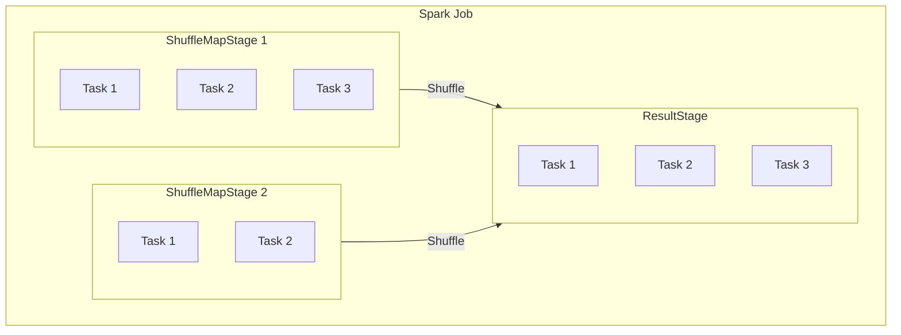
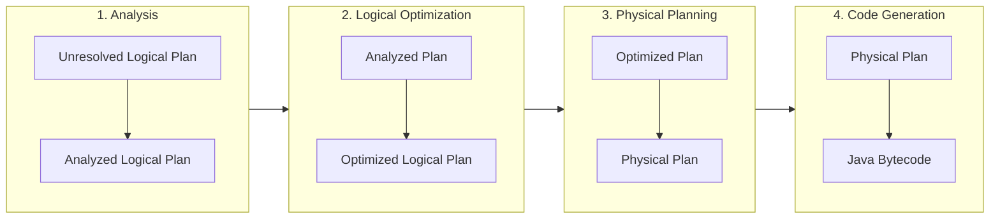

# Apache Spark: A Comprehensive Guide for Senior Data Engineers

> **Audience**: Senior Data Engineers migrating from Amazon Redshift. This guide explains Spark's internals, optimization strategies, and operational patterns—going beyond surface-level explanations into how Spark actually works under the hood.

---

## Table of Contents

1. [Introduction: Spark for the Redshift Engineer](#1-introduction-spark-for-the-redshift-engineer)
2. [Level 1: Spark Fundamentals](#2-level-1-spark-fundamentals)
3. [Level 2: Optimizing Spark Queries](#3-level-2-optimizing-spark-queries)
4. [Level 3: Spark Performance Tuning](#4-level-3-spark-performance-tuning)
5. [Level 4: Managing the Cluster](#5-level-4-managing-the-cluster)
6. [Additional Topics](#6-additional-topics)
7. [Redshift-to-Spark Quick Reference](#7-redshift-to-spark-quick-reference)

---

## 1. Introduction: Spark for the Redshift Engineer

### 1.1 Mental Model Shift

Coming from **Amazon Redshift**, you're used to a SQL-first, managed MPP data warehouse. You write queries; the optimizer chooses plans; you tune via sort keys, distribution keys, and workload management. Spark is different:

| Redshift | Spark |
|----------|-------|
| Table-centric; SQL is the primary interface | DataFrame-centric; code (Python/SQL) builds a *logical plan* |
| Query optimizer rewrites SQL at compile time | Catalyst optimizer transforms *logical plans* into *physical plans* |
| Data lives in the warehouse; compute is fixed | Data lives in object storage (S3, etc.); compute is elastic |
| Single engine: analytical SQL | Processing engine: SQL, batch, streaming, ML, graph |

In Spark, you define **transformations** (filter, join, groupBy) that build a lineage graph. Nothing executes until an **action** (count, show, write) is called. The optimizer then compiles the entire lineage into an execution plan. Think of it as building a query plan explicitly through code, then letting Spark optimize and run it.

**References**: [Integrate.io: Spark vs Redshift](https://www.integrate.io/blog/apache-spark-vs-amazon-redshift-which-is-better-for-big-data/), [HevoData: Spark vs Redshift](https://hevodata.com/learn/spark-vs-redshift/)

### 1.2 When to Use Spark vs Redshift

Spark and Redshift are **complementary**, not replacements:

- **Use Redshift** when: You need a managed data warehouse for BI, reporting, ad-hoc SQL, and workloads that fit the warehouse model. You want minimal ops and standard SQL.
- **Use Spark** when: You need batch ETL/ELT pipelines, streaming, ML pipelines, polyglot data lakes (Parquet, Delta, Iceberg), or cost-elastic compute (scale to zero). You're comfortable writing code and tuning execution.

Many architectures use both: Spark for ingestion and transformation into a lake, Redshift (or Snowflake, etc.) for analytics.

### 1.3 Spark Ecosystem Overview

```
┌─────────────────────────────────────────────────────────────────┐
│                     Spark Application                             │
├─────────────────────────────────────────────────────────────────┤
│  Spark SQL / DataFrame API  │  Structured Streaming  │  MLlib   │
├─────────────────────────────────────────────────────────────────┤
│                        Spark Core (RDD, Scheduler)               │
├─────────────────────────────────────────────────────────────────┤
│              Cluster Manager (YARN, K8s, Standalone)             │
└─────────────────────────────────────────────────────────────────┘
```

- **Spark Core**: RDDs, task scheduling, shuffle, memory management.
- **Spark SQL / DataFrame API**: Structured data, Catalyst optimizer, Tungsten execution.
- **Structured Streaming**: Micro-batch streaming with the same DataFrame API.
- **Cluster Manager**: Allocates resources (YARN, Kubernetes, Standalone, EMR, Databricks).

**Architecture**:
- **Driver**: Runs your application; builds the DAG; coordinates tasks.
- **Executors**: Run on worker nodes; execute tasks; store shuffle data and caches.
- **Cluster Manager**: Assigns executors to the application.

---

## 2. Level 1: Spark Fundamentals

### 2.1 The Three APIs: RDDs, DataFrames, and Datasets

#### RDDs (Resilient Distributed Datasets)

An RDD is an **immutable, partitioned collection** of records. Key properties:
- **Partitioned**: Data is split across partitions; each partition lives on one executor.
- **Lineage**: RDDs track their provenance (parent RDD + transformation). Used for fault tolerance.
- **Lazy**: Transformations are recorded, not executed, until an action triggers computation.

RDDs have **no schema**; they operate on opaque records. Operations are row-at-a-time (e.g., `map`, `filter`) unless you use `reduceByKey` or similar, which introduce shuffles.

```python
# RDD example (for comparison; prefer DataFrames in production)
from pyspark import SparkContext
sc = SparkContext.getOrCreate()
rdd = sc.parallelize([(1, "a"), (2, "b"), (3, "c")])
rdd.filter(lambda x: x[0] > 1).collect()  # [(2, 'b'), (3, 'c')]
```

**References**: [Spark RDD Programming Guide](https://spark.apache.org/docs/latest/rdd-programming-guide.html)

#### DataFrames

A **DataFrame** is a distributed collection with **named columns and types**. It's the primary API for data engineering. Under the hood, DataFrames are backed by RDDs, but they expose a relational abstraction and integrate with the **Catalyst optimizer** and **Tungsten** execution engine—neither of which apply to raw RDDs.

```python
from pyspark.sql import SparkSession

spark = SparkSession.builder.appName("Example").getOrCreate()

df = spark.read.parquet("s3://bucket/data/")
df.filter(df.amount > 100).groupBy("region").count().show()
```

**Redshift analogy**: A Redshift table is conceptually similar to a Spark DataFrame—both represent structured, columnar data. The difference is that Spark DataFrames are in-memory (or spill to disk) and are built from transformations; Redshift tables are persisted in the warehouse.

**References**: [PySpark DataFrames Guide](https://spark.apache.org/docs/latest/api/python/user_guide/dataframes.html)

#### Datasets

**Datasets** provide type-safe, object-oriented APIs in **Scala and Java** only. In PySpark, there is no Dataset type—Python's dynamic typing doesn't support the same compile-time guarantees. For PySpark users, DataFrames are the standard abstraction.

#### RDDs vs DataFrames for Production

**Use DataFrames** (or SQL) for almost everything:
- Catalyst optimizer applies predicate pushdown, join reordering, column pruning.
- Tungsten enables whole-stage code generation and vectorized execution.
- Columnar formats (Parquet, ORC) integrate natively.

**Use RDDs** only when:
- You need low-level control (custom partitioning, raw serialization).
- You're maintaining legacy RDD-based code.
- You have truly unstructured data (e.g., custom binary formats) where the DataFrame API doesn't fit.

**References**: [PySpark DataFrames Guide](https://spark.apache.org/docs/latest/api/python/user_guide/dataframes.html)

---

### 2.2 Narrow vs Wide Transformations and Dependencies

Spark classifies transformations by **dependency type**. This directly affects how stages are formed and how much data moves over the network.

#### Narrow Dependencies

Each partition of the child RDD/DataFrame depends on **at most one partition** of the parent.

- **No shuffle**: Data stays local to each partition.
- **Pipelining**: Multiple narrow transformations can run in a single stage.
- **Examples**: `map`, `filter`, `mapPartitions`, `mapValues`, `flatMap`.

```python
# All narrow: filter → select → filter can run in one stage
df.filter(df.status == "active").select("id", "amount").filter(df.amount > 0)
```

#### Wide Dependencies

Each partition of the child can depend on **multiple partitions** of the parent (or multiple parents).

- **Shuffle boundary**: Data must be redistributed across the cluster.
- **Stage boundary**: Wide dependencies force a new stage; previous stage must complete and materialize.
- **Examples**: `groupBy`, `groupByKey`, `reduceByKey`, `join` (in general), `distinct`, `repartition`.

```python
# groupBy introduces a wide dependency → new stage
df.groupBy("region").agg({"amount": "sum"})
```

**Redshift analogy**: Redshift redistributes data for joins and aggregations across nodes. Spark does the same via **shuffle** at wide dependency boundaries. Understanding narrow vs wide helps you predict stage count and identify expensive operations.

**References**: [Spark Fault Tolerance & Lineage](https://www.sparkcodehub.com/spark/fundamentals/understanding-fault-tolerance-lineage), [RDD Lineage Notes](https://nag-9-s.gitbook.io/spark-notes/resilient-distributed-dataset-rdd/rdd-lineage)

---

### 2.3 Transformations vs Actions

#### Transformations

Transformations **define** the computation but do not run it. They build the logical plan (lineage).

| Transformation | Description |
|----------------|-------------|
| `filter`, `where` | Select rows |
| `select`, `withColumn` | Select/derive columns |
| `groupBy`, `agg` | Aggregate |
| `join` | Join two DataFrames |
| `repartition`, `coalesce` | Change partition count |
| `orderBy` | Sort (triggers shuffle) |
| `distinct` | Deduplicate (triggers shuffle) |

#### Actions

Actions **trigger** execution. They force Spark to build the physical plan, schedule stages, and run tasks.

| Action | Description |
|--------|-------------|
| `count`, `collect`, `first` | Return data to driver |
| `show`, `take` | Display or sample |
| `write`, `writeStream` | Write to sink |
| `foreach`, `foreachPartition` | Side effects per partition |

#### Lazy Execution

Nothing runs until an action is called. At that moment:
1. Catalyst analyzes and optimizes the logical plan.
2. The physical planner generates the execution plan.
3. DAGScheduler creates stages and submits tasks.
4. Executors run tasks and return results.

```python
# No work done yet
df1 = spark.read.parquet("s3://bucket/orders/")
df2 = spark.read.parquet("s3://bucket/customers/")
joined = df1.join(df2, "customer_id").filter(df1.amount > 100)

# Execution starts here
joined.count()  # Triggers the full pipeline
```

**References**: [Spark Quick Start](https://spark.apache.org/docs/latest/quick-start.html), [PySpark DataFrame Quickstart](https://spark.apache.org/docs/latest/api/python/getting_started/quickstart_df.html)

---

### 2.4 The DAG and Stage-Oriented Execution

#### The DAG (Directed Acyclic Graph)

When you call an action, Spark constructs a **logical execution plan**—a DAG of operations. For DataFrames/SQL, Catalyst produces:
1. **Logical plan**: Relational operators (Filter, Join, Aggregate, etc.)
2. **Physical plan**: Spark operators (FileScan, Exchange, SortMergeJoin, etc.)

The DAG is then converted into **stages** and **tasks**.

#### DAGScheduler

The **DAGScheduler** (runs on the driver) performs:

1. **Stage division**: Groups operators into stages. A new stage begins at every **shuffle boundary** (Exchange node in the physical plan).
2. **Preferred task locations**: Uses cache and data locality to place tasks.
3. **Failure handling**: Re-submits stages if shuffle output is lost; delegates task retries to the TaskScheduler.

#### Shuffle Map Stages vs Result Stages

- **ShuffleMapStage**: Produces output that is written to shuffle files (`.data` + `.index`). Downstream stages will read this via shuffle.
- **ResultStage**: Produces the final output (e.g., for `count`, `collect`, or `write`).



#### Task Scheduling

- One **task** per partition per stage.
- Tasks are bundled into a **TaskSet** and sent to the TaskScheduler.
- Executors run tasks; each task processes one partition.
- ShuffleMapTasks write shuffle output; ResultTasks produce the final result.

**References**: [DAGScheduler Internals](https://books.japila.pl/apache-spark-internals/scheduler/DAGScheduler/), [Spark Internals Wiki](https://cwiki.apache.org/confluence/display/SPARK/Spark+Internals), [sparkcodehub DAG Guide](https://www.sparkcodehub.com/spark/fundamentals/how-dag-execution-plans-work)

---

## 3. Level 2: Optimizing Spark Queries

### 3.1 The Catalyst Optimizer (Deep Dive)

The **Catalyst** optimizer is Spark SQL's extensible query optimization framework. It transforms SQL and DataFrame operations into optimized execution plans through a **four-phase pipeline**. Catalyst is implemented in Scala using functional programming (pattern matching, immutable trees) but is fully transparent to PySpark users.

#### Four Phases of Catalyst



1. **Analysis**  
   - Input: Unresolved logical plan (SQL AST or DataFrame lineage).  
   - Resolves: Attribute names, types, table/column references against the catalog.  
   - Output: **Analyzed logical plan** with bound attributes and types.  
   - Errors (missing columns, type mismatches) surface here, not at runtime.

2. **Logical Optimization**  
   - Rule-based transformations applied until a fixed point.  
   - Common rules: predicate pushdown, constant folding, column pruning, join reordering, Boolean simplification, null propagation.  
   - Output: **Optimized logical plan**.

3. **Physical Planning**  
   - Converts logical plan to one or more **physical plans** (Spark operators: FileScan, Exchange, SortMergeJoin, etc.).  
   - Cost-based optimization: chooses join strategy (broadcast vs shuffle) based on size estimates.  
   - Output: **Selected physical plan**.

4. **Code Generation**  
   - Generates Java bytecode for expression evaluation (e.g., `col + 1`, `col > 0`).  
   - Uses Scala quasiquotes; compiles at runtime.  
   - Avoids row-at-a-time interpreter overhead; enables CPU optimizations.

#### Trees and Rules

Catalyst represents plans as **immutable trees** of nodes. Rules are functions that transform trees via pattern matching. Rules run in batches until no further changes occur (fixed point).

#### Predicate and Projection Pushdown

- **Predicate pushdown**: Filters (e.g., `WHERE date > '2024-01-01'`) are pushed to the data source when supported. Parquet, ORC, and JDBC can skip entire row groups or partitions.  
- **Projection pushdown**: Only columns referenced in the plan are read from columnar files.

**References**: [Databricks: Deep Dive into Spark SQL's Catalyst Optimizer](https://databricks.com/blog/2015/04/13/deep-dive-into-spark-sqls-catalyst-optimizer.html), [Unravel: Catalyst Analyst](https://www.unraveldata.com/resources/catalyst-analyst-a-deep-dive-into-sparks-optimizer/)

---

### 3.2 Columnar Storage and File Formats

#### Row vs Columnar

**Redshift** stores data in a columnar format; so do Parquet and ORC. Columnar storage enables:
- **Projection pushdown**: Read only needed columns.
- **Predicate pushdown**: Use min/max and other stats to skip row groups/stripes.
- **Better compression**: Similar values in a column compress well.

#### Parquet

- **Structure**: File → row groups → column chunks. Each column chunk has metadata (min, max, null count).
- **Predicate pushdown**: Spark reads footer metadata and skips row groups that cannot match the filter.
- **Default format** for Spark data lakes; widely supported.

```python
# Parquet supports predicate and projection pushdown automatically
df = spark.read.parquet("s3://bucket/events/")
df.filter(df.date >= "2024-01-01").select("id", "event_type").show()
# Only 'id' and 'event_type' columns and matching row groups are read
```

#### ORC

- **Structure**: Stripes with indexes; file-level, stripe-level, and row-level statistics.
- **Predicate pushdown**: Often more granular than Parquet; can skip stripes and row groups efficiently.
- **Use case**: Hive-originated data; workloads that benefit from ORC's indexing.

#### CSV and JSON

- **Row-oriented**: Must read full rows; no column-level stats.
- **No pushdown**: Filters and projections are applied after full read.
- **Use for**: Interchange, ingestion; avoid for large analytical workloads.

#### Projection vs Predicate Pushdown

| Optimization | What It Does |
|--------------|--------------|
| **Predicate pushdown** | Pushes `WHERE` conditions to the source; skips irrelevant row groups/stripes. |
| **Projection pushdown** | Reads only columns in `SELECT`; skips unused columns in columnar formats. |

**References**: [Parquet Data Source](https://spark.apache.org/docs/latest/sql-data-sources-parquet.html), [Cloudera: Predicate Pushdown](https://docs.cloudera.com/runtime/7.3.1/developing-spark-applications/topics/spark-predicate-push-down-optimization.html), [Stack Overflow: Predicate vs Projection](https://stackoverflow.com/questions/58235076/what-is-the-difference-between-predicate-pushdown-and-projection-pushdown)

---

### 3.3 Shuffle: What It Is and Why It Hurts

#### Definition

**Shuffle** is the process of redistributing data across partitions so that records with the same key end up in the same partition. It is required for:
- `groupBy`, `reduceByKey`, `agg`
- `join` (except broadcast join)
- `distinct`, `orderBy`, window functions

#### Hash Partitioning

Spark uses **hash partitioning** for shuffle:
```
partition_id = hash(key) % numPartitions
```
The same function and partition count are applied to both sides of a join, ensuring co-location.

#### Shuffle Write (Map Side)

Each **map task** (one per input partition) writes shuffle output:
1. Records are serialized and assigned to target partitions via the hash function.
2. Data is buffered in memory (`ShuffleExternalSorter`).
3. When memory is full, data **spills** to disk (`spill_*.data`, `spill_*.index`).
4. At task end, spills are **merged** into final files: `shuffle_<id>_<mapId>_<reduceId>.data` and `.index`.

The `.index` file stores byte offsets for each partition slice so reducers can fetch only their portion.

#### Shuffle Read (Reduce Side)

Each **reduce task**:
1. Requests its partition slice from all map tasks (via `MapOutputTracker`, `BlockManager`).
2. Fetches data over the network (or from local disk if same executor).
3. Deserializes and processes (e.g., sorts for SortMergeJoin).
4. May spill to disk if reduce-side data doesn't fit in memory.

#### Shuffle Files on Disk

On each executor, shuffle files live under `spark.local.dir` (e.g., `/tmp/spark-*/blockmgr-*/`):
```
shuffle_12_0_0.data    # Map task 0, shuffle 12, full partition data
shuffle_12_0_0.index   # Offsets for each reduce partition
```

#### Why Shuffle Is Expensive

- **Scan**: Full input is read.
- **Serialize**: Records are serialized for network transfer.
- **Network**: Data moves between executors.
- **Deserialize**: Records are deserialized on reducers.
- **Sort/merge**: SortMergeJoin requires sorting; large sorts may spill.

Shuffle is often the **dominant cost** in Spark jobs. Minimize it via broadcast joins, partitioning, and reducing data before shuffle.

**References**: [Spark Shuffle Internals (Wiki)](https://cwiki.apache.org/confluence/display/SPARK/Shuffle+Internals), [Medium: Demystifying Spark Shuffle](https://medium.com/@lokeshgupta2206/demystifying-spark-shuffle-internals-advanced-1bc3a4c99151), [BigDataInRealWorld: Sort Merge Join](https://bigdatainrealworld.com/how-does-shuffle-sort-merge-join-work-in-spark)

---

### 3.4 Partitioning: Design and Tuning

#### Input Partitioning (File-Based Sources)

For Parquet, ORC, JSON, CSV:

| Config | Default | Meaning |
|--------|---------|---------|
| `spark.sql.files.maxPartitionBytes` | 128 MB | Max bytes per partition when reading files |
| `spark.sql.files.openCostInBytes` | 4 MB | Cost to open a file; influences small-file coalescing |
| `spark.sql.files.minPartitionNum` | Default parallelism | Min number of partitions |
| `spark.sql.files.maxPartitionNum` | None | Max number of partitions (Spark 3.5+) |

#### Shuffle Partitions

| Config | Default | Meaning |
|--------|---------|---------|
| `spark.sql.shuffle.partitions` | 200 | Number of partitions after shuffle (joins, aggregates) |

- **Too high**: Many small tasks; scheduling and shuffle overhead.
- **Too low**: Few parallel tasks; underutilized cluster; possible skew.

**Rule of thumb**: 2–4× total executor cores. With AQE (Spark 3.2+), you can set a large initial value and let AQE coalesce.

#### Partition by Column

```python
# Repartition by column (triggers shuffle)
df.repartition(64, "region")

# Partition on write (for downstream reads)
df.write.partitionBy("date", "region").parquet("s3://bucket/output/")
```

Align partitioning with join keys when using **Storage Partition Join** (Spark 3.3+, Iceberg, Delta).

#### Ideal Partition Size

- **Target**: 128–512 MB per partition after compression.
- **Task duration**: 2–12 minutes (avoids tiny-task overhead and long-tail stragglers).

**References**: [Spark Performance Tuning](https://spark.apache.org/docs/latest/sql-performance-tuning.html), [sparkcodehub: coalesce vs repartition](https://www.sparkcodehub.com/spark/performance/coalesce-vs-repartition)

---

### 3.5 Coalesce vs Repartition

| Operation | Shuffle? | Use Case |
|-----------|----------|----------|
| **repartition(n)** | Yes (full shuffle) | Increase or decrease partitions; even distribution |
| **coalesce(n)** | No (when decreasing) | Decrease partitions; merges without full shuffle |

#### When to Use Each

- **coalesce**: Reducing partition count (e.g., before writing fewer files). Avoids shuffle; partitions are merged on the same executor. Can create **uneven** partition sizes.
- **repartition**: Increasing partitions for parallelism; partitioning by column for joins; when you need **even** distribution.

```python
# After heavy filter: 1000 small partitions
filtered = df.filter(df.status == "active")  # Maybe 1000 partitions

# Reduce to 10 output files without shuffle
filtered.coalesce(10).write.parquet("s3://bucket/output/")

# If you need even distribution (e.g., for downstream join)
filtered.repartition(64, "region")  # Full shuffle, even split
```

#### Performance Impact

`repartition` triggers a **full shuffle**; `coalesce` does not when reducing. In practice, coalesce can dramatically reduce job time when the goal is fewer output files (e.g., from hours to minutes).

**References**: [Stack Overflow: coalesce vs repartition](https://stackoverflow.com/questions/31610971/spark-repartition-vs-coalesce), [BigDataTLDR: repartition vs coalesce](https://www.bigdatatldr.com/microlessons/apache-spark/repartition-vs-coalesce)

---

### 3.6 UDFs: Why to Avoid Them

#### Scalar Python UDFs

- **Execution**: Row-at-a-time in a Python process; data is serialized via **pickle**.
- **Catalyst**: UDFs are **opaque**; Catalyst cannot push predicates or reorder around them.
- **Performance**: 10–100× slower than native Spark functions in many cases.

#### Pandas/Arrow UDFs

- **Execution**: Block-at-a-time; uses **Apache Arrow** for (de)serialization.
- **Performance**: Significantly faster than scalar UDFs (up to ~100× in some cases).
- **Catalyst**: Still a black box; filters on UDF output columns cannot push before the UDF.

#### Arrow Optimization for Scalar UDFs

```python
from pyspark.sql.functions import udf

@udf(returnType="int", useArrow=True)  # Use Arrow instead of pickle
def my_udf(x):
    return len(str(x))
```

Or globally: `spark.conf.set("spark.sql.execution.pythonUDF.arrow.enabled", True)`

#### Alternatives to UDFs

1. **Built-in functions**: `col`, `when`, `expr`, `regexp_extract`, etc.
2. **SQL expr**: `df.withColumn("parsed", expr("get_json_object(json_col, '$.field')"))`
3. **Pandas UDF** (vectorized) when you need custom logic: `@pandas_udf("double") def f(s: pd.Series) -> pd.Series: return s * 2`

**Use UDFs only when** built-in functions and SQL cannot express the logic.

**References**: [PySpark UDF Guide](https://spark.apache.org/docs/latest/api/python/user_guide/udfandudtf.html), [Medium: PySpark UDF Pitfalls](https://medium.com/@dataeng/the-ultimate-guide-to-pyspark-udfs-power-pitfalls-and-performance-b2f774801761), [Stack Overflow: UDF vs pandas UDF](https://stackoverflow.com/questions/73314095/why-is-udf-slower-than-pandas-udf-on-pyspark)

---

## 4. Level 3: Spark Performance Tuning

### 4.1 Join Strategies (Deep Dive)

Spark chooses a join strategy based on size estimates, join type, and key characteristics.

#### Broadcast Hash Join (BHJ)

- **When**: One side is small (default &lt; 10 MB via `spark.sql.autoBroadcastJoinThreshold`).
- **How**: Small table is sent to all executors; large table is scanned locally; join via in-memory hash lookup.
- **Shuffle**: None for the large table; broadcast for the small table.
- **Best for**: Dimension-fact joins (e.g., orders join customers).

#### Sort Merge Join (SMJ)

- **When**: Default for large-table equi-joins; keys must be sortable.
- **How**: Both sides shuffled by key; each partition sorted; merge of sorted streams.
- **Shuffle**: Full shuffle of both sides.
- **Best for**: Large-to-large joins; handles skew via disk spilling.

#### Shuffle Hash Join (SHJ)

- **When**: One side fits in memory per partition; equi-join; keys need not be sortable.
- **How**: Both sides shuffled; build side stored as hash table; probe side looked up.
- **Best for**: Medium-sized tables where partitions fit in memory.

#### Broadcast Nested Loop Join (BNLJ)

- **When**: Non-equi joins (`<`, `>`, `BETWEEN`, etc.).
- **How**: Cartesian-product style; very expensive.
- **Best for**: Fallback only; avoid if possible.

#### Join Strategy Selection and Hints

Override Catalyst's choice with hints:

```python
# DataFrame API
from pyspark.sql.functions import broadcast
large_df.join(broadcast(small_df), "key")

# SQL
spark.sql("""
  SELECT /*+ BROADCAST(s) */ *
  FROM large l
  JOIN small s ON l.key = s.key
""")
```

Hints: `BROADCAST`, `MERGE` (SMJ), `SHUFFLE_HASH`, `SHUFFLE_REPLICATE_NL`.

**References**: [PlainEnglish: Spark Join Strategies](https://plainenglish.io/blog/a-deep-dive-into-the-inner-workings-of-apache-spark-join-strategies), [Cazpian: Join Strategy Guide](https://cazpian.ai/blog/spark-sql-join-strategy-the-complete-optimization-guide), [AWS: Join Hints](https://docs.aws.amazon.com/prescriptive-guidance/latest/spark-tuning-glue-emr/using-join-hints-in-spark-sql.html)

---

### 4.2 Broadcast Join Threshold and Hints

| Config | Default | Meaning |
|--------|---------|---------|
| `spark.sql.autoBroadcastJoinThreshold` | 10 MB | Max size (bytes) for auto broadcast |
| `spark.sql.broadcastTimeout` | 300 s | Broadcast timeout |

- **Set to -1** to disable broadcast.
- **Increase** (e.g., 100 MB–1 GB) when dimension tables are larger but still fit in executor memory.
- Use **hints** when statistics are wrong or stale and Catalyst chooses SMJ instead of BHJ.

```python
# Force broadcast of 'dim' even if stats say it's large
spark.table("fact").join(broadcast(spark.table("dim")), "id")
```

---

### 4.3 Task Parallelism and shuffle.partitions

| Config | Default | Meaning |
|--------|---------|---------|
| `spark.sql.shuffle.partitions` | 200 | Partitions after shuffle |
| `spark.default.parallelism` | Cores on cluster | Default for RDD ops |

- **Too many partitions**: Small tasks; scheduling overhead; many small shuffle files.
- **Too few partitions**: Underutilized cluster; risk of skew and stragglers.
- **Tuning**: Aim for 2–4× total cores. With AQE, set a higher initial value (e.g., 400) and let AQE coalesce.

---

### 4.4 Adaptive Query Execution (AQE)

**AQE** (enabled by default in Spark 3.2+) re-optimizes the plan at **runtime** using actual statistics from shuffle stages.

#### Features

1. **Coalescing partitions**: Merges small post-shuffle partitions. Reduces task count and overhead.
2. **Skew join**: Splits skewed partitions; replicates build side as needed. Mitigates stragglers.
3. **SMJ → Broadcast**: Converts to broadcast if runtime stats show one side is small.
4. **SMJ → Shuffled Hash**: Switches to SHJ when partition sizes fit in memory.

#### Key Configs

| Config | Default | Meaning |
|--------|---------|---------|
| `spark.sql.adaptive.enabled` | true | Master switch for AQE |
| `spark.sql.adaptive.coalescePartitions.enabled` | true | Coalesce small partitions |
| `spark.sql.adaptive.skewJoin.enabled` | true | Handle skew in SMJ |
| `spark.sql.adaptive.advisoryPartitionSizeInBytes` | 64 MB | Target partition size |
| `spark.sql.adaptive.skewJoin.skewedPartitionFactor` | 5.0 | Skew threshold (vs median) |
| `spark.sql.adaptive.skewJoin.skewedPartitionThresholdInBytes` | 256 MB | Absolute skew threshold |

#### When AQE Helps

- Statistics are missing or stale.
- Data is skewed (e.g., one key has 80% of rows).
- Shuffle produces many tiny partitions.

**References**: [Spark Performance Tuning](https://spark.apache.org/docs/latest/sql-performance-tuning.html), [Databricks AQE](https://docs.databricks.com/aws/en/optimizations/aqe), [Databricks: Coalesce and Skew](https://community.databricks.com/t5/knowledge-sharing-hub/understanding-coalesce-skewed-joins-and-why-aqe-doesn-t-always/td-p/115586)

---

### 4.5 Reading Explain Plans

Use `explain()` to inspect the physical plan:

```python
df.explain()                    # Physical plan only
df.explain("extended")          # Logical + physical + parsed
df.explain("formatted")          # More readable
df.explain(mode="cost")         # Cost estimates (Spark 3.0+)
```

#### Key Operators

| Operator | Meaning |
|----------|---------|
| `Exchange` | Shuffle (data redistribution) |
| `hashpartitioning(...)` | Hash partition by key |
| `BroadcastHashJoin` | Broadcast join |
| `SortMergeJoin` | Sort-merge join |
| `HashAggregate` | Aggregation (groupBy, etc.) |
| `*` prefix (e.g., `*Filter`) | Whole-stage code generation |

#### Example Interpretation

```
*(5) SortMergeJoin [id#7], [id#31], Inner
:- *(2) Sort [id#7 ASC NULLS LAST], false, 0
:  +- Exchange hashpartitioning(id#7, 200)   ← Shuffle
:     +- *(1) Filter (amount#8 > 100)
:        +- FileScan parquet ...
+- *(4) Sort [id#31 ASC NULLS LAST], false, 0
   +- Exchange hashpartitioning(id#31, 200)  ← Shuffle
      +- *(3) FileScan parquet ...
```

- Two `Exchange` nodes → two shuffle stages.
- `SortMergeJoin` → default large-table join.
- `*` → whole-stage codegen is used.

**References**: [chashnikov: Physical Plans](https://chashnikov.dev/post/spark-understanding-physical-plans), [Jacek Laskowski: SortMergeJoin](https://jaceklaskowski.gitbooks.io/mastering-spark-sql/content/spark-sql-SparkPlan-SortMergeJoinExec.html), [Cazpian: Explain Deep Dive](https://cazpian.ai/blog/spark-execution-plan-deep-dive-reading-explain-like-a-pro)

---

### 4.6 Tungsten and Whole-Stage Code Generation

#### Volcano Model Limitation

Traditional execution uses the **Volcano iterator model**: each operator has `next()`; rows flow through the pipeline. This causes:
- Many virtual function calls
- Poor CPU cache utilization
- No loop unrolling or SIMD

#### Whole-Stage Code Generation

**Tungsten** fuses multiple operators into a **single generated function** (Java bytecode):
- Eliminates per-row virtual calls
- Keeps data in CPU registers
- Enables JIT and CPU optimizations

Operators with `*` in the plan use whole-stage codegen (e.g., `*Filter`, `*Project`).

#### Vectorized Execution

Spark also uses **vectorized columnar processing** for scans (Parquet, ORC), processing batches of values instead of row-by-row.

#### Configuration

- `spark.sql.codegen.wholeStage` (default: true) controls whole-stage codegen.
- Disable only for debugging; codegen typically gives significant speedups.

**References**: [spark-notes: Tungsten](https://spoddutur.github.io/spark-notes/second_generation_tungsten_engine.html), [Jacek Laskowski: Whole-Stage CodeGen](https://jaceklaskowski.gitbooks.io/mastering-spark-sql/content/spark-sql-whole-stage-codegen.html)

---

### 4.7 Caching and Persistence

```python
# Cache in memory (columnar format)
df.cache()
# or
df.persist(StorageLevel.MEMORY_AND_DISK)

# Unpersist when done
df.unpersist()
```

#### When to Cache

- Data is reused **multiple times** (e.g., iterative algorithms, ML).
- Data fits in memory (or MEMORY_AND_DISK with spill).
- Avoid caching one-off pipelines—it wastes memory.

#### Storage Levels

| Level | Memory | Disk | Off-Heap |
|-------|--------|------|----------|
| MEMORY_ONLY | Yes | No | No |
| MEMORY_AND_DISK | Yes | Spill | No |
| MEMORY_ONLY_SER | Yes (serialized) | No | No |
| MEMORY_AND_DISK_SER | Yes (serialized) | Spill | No |

#### Configuration

| Config | Default | Meaning |
|--------|---------|---------|
| `spark.sql.inMemoryColumnarStorage.compressed` | true | Compress cached data |
| `spark.sql.inMemoryColumnarStorage.batchSize` | 10000 | Batch size for columnar cache |

---

## 5. Level 4: Managing the Cluster

### 5.1 Cluster Managers and Environments

| Environment | Description | Use Case |
|-------------|-------------|----------|
| **Standalone** | Spark's built-in cluster manager | Dev, testing; single master |
| **YARN** | Hadoop resource manager | Production on-prem; Hadoop integration |
| **Kubernetes** | Native K8s scheduler | Cloud-native; dynamic scaling |
| **EMR** | AWS managed Spark | AWS workloads; YARN or custom |
| **Databricks** | Managed Spark + Delta + notebooks | Enterprise; optimized runtime |
| **Serverless** | EMR Serverless, Databricks Serverless | Pay per use; no cluster to manage |

#### Choosing an Environment

- **On-prem Hadoop**: YARN.
- **Cloud, container-native**: Kubernetes or managed (EMR, Databricks).
- **Minimal ops**: Managed (Databricks, EMR) or serverless.

---

### 5.2 Dynamic Allocation

**Dynamic allocation** scales the number of executors based on workload:

- **Scale up**: When there are pending tasks.
- **Scale down**: When executors are idle for `spark.dynamicAllocation.executorIdleTimeout` seconds.

#### Requirements

- `spark.dynamicAllocation.enabled=true`
- `spark.executor.instances=0` (do not set a fixed count)
- **External shuffle service** (YARN, standalone) — or Spark 3.0+ on Kubernetes can run without it

#### Key Configs

| Config | Meaning |
|--------|---------|
| `spark.dynamicAllocation.minExecutors` | Min executors to keep |
| `spark.dynamicAllocation.maxExecutors` | Max executors |
| `spark.dynamicAllocation.initialExecutors` | Initial executor count |
| `spark.dynamicAllocation.executorIdleTimeout` | Idle time before removing executor |

**References**: [mallikarjuna: Dynamic Allocation](https://mallikarjuna_g.gitbooks.io/spark/content/spark-dynamic-allocation.html), [ExecutorPodsAllocator (K8s)](https://jaceklaskowski.github.io/spark-kubernetes-book/ExecutorPodsAllocator/)

---

### 5.3 Storage Partition Join (Spark 3.3+)

**Storage Partition Join (SPJ)** avoids shuffle when tables share compatible partitioning (e.g., bucketed or partitioned by the same columns as the join keys).

#### Requirements

- V2 data sources (Iceberg, Delta) that report partitioning.
- `spark.sql.sources.v2.bucketing.enabled=true` (default in Spark 3.3+)
- Partitioning aligned with join keys

#### Effect

When SPJ applies, the physical plan has **no Exchange** before the join. Both sides are read with matching partition layout, so no shuffle is needed.

```python
# Example with Iceberg (partitioned by dep, bucket(8, id))
# Join on dep and id — no shuffle if both tables use same layout
spark.sql("""
  SELECT * FROM target t
  INNER JOIN source s ON t.dep = s.dep AND t.id = s.id
""")
```

---

## 6. Additional Topics

### 6.1 Statistics and the Optimizer

Spark uses statistics to choose plans. Sources:

| Source | How | When |
|--------|-----|------|
| **Runtime (AQE)** | Collected during execution | Re-optimization mid-query |
| **Catalog** | `ANALYZE TABLE ... COMPUTE STATISTICS` | Table/column stats in Hive Metastore |
| **Data source** | Parquet/ORC metadata | Row count, min/max per file |

#### Impact of Missing/Stale Stats

- Wrong join strategy (e.g., SMJ instead of broadcast).
- Suboptimal partition counts.
- Poor cost estimates in `EXPLAIN COST`.

#### Inspecting Statistics

```python
# Table stats
spark.sql("DESCRIBE EXTENDED my_table")

# Cost estimates in plan
df.explain(mode="cost")
```

---

### 6.2 PySpark Code Examples Reference

#### SparkSession Setup

```python
from pyspark.sql import SparkSession

spark = SparkSession.builder \
    .appName("MyApp") \
    .config("spark.sql.shuffle.partitions", "64") \
    .config("spark.sql.autoBroadcastJoinThreshold", "104857600")  # 100 MB \
    .getOrCreate()
```

#### Read, Filter, Join

```python
orders = spark.read.parquet("s3://bucket/orders/")
customers = spark.read.parquet("s3://bucket/customers/")

result = orders \
    .filter(orders.amount > 100) \
    .join(customers, orders.customer_id == customers.id, "inner") \
    .select(orders.order_id, customers.name, orders.amount)
```

#### Broadcast Hint

```python
from pyspark.sql.functions import broadcast
result = large_df.join(broadcast(small_df), "key")
```

#### Explain Plan

```python
df.explain("extended")
```

#### Coalesce / Repartition

```python
df.coalesce(10)                    # Reduce without shuffle
df.repartition(64, "region")       # Shuffle; partition by column
```

#### Cache

```python
df.cache()
# ... use df multiple times ...
df.unpersist()
```

---

## 7. Redshift-to-Spark Quick Reference

| Redshift Concept | Spark Equivalent |
|------------------|------------------|
| **Sort key** | Partitioning + `orderBy` within partition; or `sortWithinPartitions` |
| **Dist key** | Hash partitioning; `repartition(n, "col")` or `partitionBy` on write |
| **VACUUM / ANALYZE** | No direct equivalent; use `OPTIMIZE` (Delta/Iceberg) or `ANALYZE TABLE` |
| **Workload management** | Dynamic allocation; queue configuration in YARN/K8s |
| **Result caching** | `cache()` / `persist()` |
| **Materialized view** | Cached DataFrame or persisted table |
| **COPY** | `DataFrame.write.parquet(...)` or format of choice |
| **UNLOAD** | `DataFrame.write` to S3, etc. |
